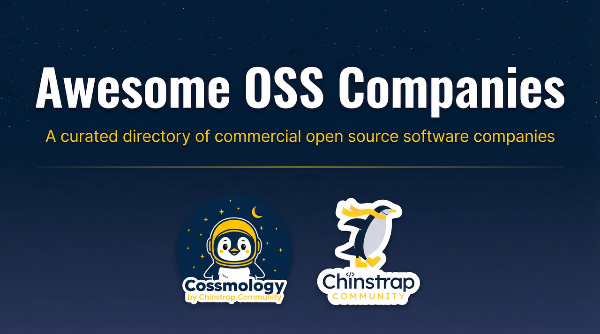

This repository serves as a directory of commercial open source software (COSS) companies. A COSS company is a for-profit organization that has built its core business around one or more open source software projects. We aim for this repository to be a valuable resource for developers, entrepreneurs, investors, and anyone interested in the COSS ecosystem.

The information in this repository is sourced from [Cossmology](https://cossmology.com), a platform provided by [Chinstrap Community](https://chinstrap.community) for tracking and analyzing the commercial open source software landscape. This repository is jointly maintained by [Chinstrap Community](https://chinstrap.community) and [Puter](https://puter.com).

## Companies

### Categories

<a href="#5g4g-ran">5G/4G RAN</a> &middot; <a href="#ab-testing">A/B Testing</a> &middot; <a href="#agi">AGI</a> &middot; <a href="#ai-agents">AI Agents</a> &middot; <a href="#ai-chat">AI Chat</a> &middot; <a href="#ai-coding-agents">AI Coding Agents</a> &middot; <a href="#ai-coding-assistant">AI Coding Assistant</a> &middot; <a href="#ai-development-platform">AI Development Platform</a> &middot; <a href="#ai-framework">AI Framework</a> &middot; <a href="#ai-infrastructure">AI Infrastructure</a> &middot; <a href="#ai-memory">AI Memory</a> &middot; <a href="#ai-orchestration">AI Orchestration</a> &middot; <a href="#ai-evaluation">AI evaluation</a> &middot; <a href="#api-gateway">API Gateway</a> &middot; <a href="#api-management">API Management</a> &middot; <a href="#api-platform">API Platform</a> &middot; <a href="#api-security">API Security</a> &middot; <a href="#accounting">Accounting</a> &middot; <a href="#advanced-materials">Advanced Materials</a> &middot; <a href="#agent-memory">Agent Memory</a> &middot; <a href="#alerting">Alerting</a> &middot; <a href="#algorithmic-trading">Algorithmic Trading</a> &middot; <a href="#analytics">Analytics</a> &middot; <a href="#animation">Animation</a> &middot; <a href="#app-deployment">App Deployment</a> &middot; <a href="#application-security">Application Security</a> &middot; <a href="#audio">Audio</a> &middot; <a href="#authentication">Authentication</a> &middot; <a href="#authorization">Authorization</a> &middot; <a href="#autonomous-vehicles">Autonomous Vehicles</a> &middot; <a href="#bpm">BPM</a> &middot; <a href="#backup">Backup</a> &middot; <a href="#batch-processing">Batch Processing</a> &middot; <a href="#billing">Billing</a> &middot; <a href="#bioinformatics">Bioinformatics</a> &middot; <a href="#biotech">Biotech</a> &middot; <a href="#block-storage">Block Storage</a> &middot; <a href="#blockchain">Blockchain</a> &middot; <a href="#browser-automation">Browser Automation</a> &middot; <a href="#business-intelligence">Business Intelligence</a> &middot; <a href="#business-process-automation">Business Process Automation</a> &middot; <a href="#cicd">CI/CD</a> &middot; <a href="#cms">CMS</a> &middot; <a href="#cpaas">CPaaS</a> &middot; <a href="#crm">CRM</a> &middot; <a href="#caching">Caching</a> &middot; <a href="#calendar">Calendar</a> &middot; <a href="#charging">Charging</a> &middot; <a href="#chatbot">Chatbot</a> &middot; <a href="#chrome-extension">Chrome Extension</a> &middot; <a href="#cloud-cost-management">Cloud Cost Management</a> &middot; <a href="#cloud-data-warehouse">Cloud Data Warehouse</a> &middot; <a href="#cloud-infrastructure">Cloud Infrastructure</a> &middot; <a href="#cloud-platform">Cloud Platform</a> &middot; <a href="#cloud-security">Cloud Security</a> &middot; <a href="#code-analysis">Code Analysis</a> &middot; <a href="#code-editor">Code Editor</a> &middot; <a href="#code-generation">Code Generation</a> &middot; <a href="#code-quality">Code Quality</a> &middot; <a href="#code-search">Code Search</a> &middot; <a href="#collaboration">Collaboration</a> &middot; <a href="#community-platform">Community Platform</a> &middot; <a href="#compilers">Compilers</a> &middot; <a href="#compliance">Compliance</a> &middot; <a href="#computer-vision">Computer Vision</a> &middot; <a href="#container-orchestration">Container Orchestration</a> &middot; <a href="#containerization">Containerization</a> &middot; <a href="#content-aggregation">Content Aggregation</a> &middot; <a href="#content-management">Content Management</a> &middot; <a href="#continuous-profiling">Continuous Profiling</a> &middot; <a href="#conversational-ai">Conversational AI</a> &middot; <a href="#cost-management">Cost Management</a> &middot; <a href="#crash-reporting">Crash Reporting</a> &middot; <a href="#cross-platform">Cross-Platform</a> &middot; <a href="#crypto-wallet">Crypto Wallet</a> &middot; <a href="#cryptography">Cryptography</a> &middot; <a href="#customer-data-platform">Customer Data Platform</a> &middot; <a href="#cybersecurity">Cybersecurity</a> &middot; <a href="#dashboard">Dashboard</a> &middot; <a href="#data-analytics">Data Analytics</a> &middot; <a href="#data-backup">Data Backup</a> &middot; <a href="#data-engineering">Data Engineering</a> &middot; <a href="#data-integration">Data Integration</a> &middot; <a href="#data-labeling">Data Labeling</a> &middot; <a href="#data-lake">Data Lake</a> &middot; <a href="#data-lakehouse">Data Lakehouse</a> &middot; <a href="#data-lineage">Data Lineage</a> &middot; <a href="#data-management">Data Management</a> &middot; <a href="#data-observability">Data Observability</a> &middot; <a href="#data-orchestration">Data Orchestration</a> &middot; <a href="#data-pipelines">Data Pipelines</a> &middot; <a href="#data-quality">Data Quality</a> &middot; <a href="#data-room">Data Room</a> &middot; <a href="#data-science">Data Science</a> &middot; <a href="#data-security">Data Security</a> &middot; <a href="#data-streaming">Data Streaming</a> &middot; <a href="#data-transformation">Data Transformation</a> &middot; <a href="#data-visualization">Data Visualization</a> &middot; <a href="#database">Database</a> &middot; <a href="#decentralized">Decentralized</a> &middot; <a href="#decentralized-identity">Decentralized Identity</a> &middot; <a href="#deepfake-detection">Deepfake Detection</a> &middot; <a href="#deployment">Deployment</a> &middot; <a href="#design-tools">Design Tools</a> &middot; <a href="#desktop">Desktop</a> &middot; <a href="#devops">DevOps</a> &middot; <a href="#devsecops">DevSecOps</a> &middot; <a href="#developer-portal">Developer Portal</a> &middot; <a href="#developer-tools">Developer Tools</a> &middot; <a href="#diagramming">Diagramming</a> &middot; <a href="#differential-privacy">Differential Privacy</a> &middot; <a href="#digital-payments">Digital Payments</a> &middot; <a href="#distributed-computing">Distributed Computing</a> &middot; <a href="#distributed-systems">Distributed Systems</a> &middot; <a href="#document-processing">Document Processing</a> &middot; <a href="#documentation">Documentation</a> &middot; <a href="#e-commerce-platform">E-commerce Platform</a> &middot; <a href="#e-learning">E-learning</a> &middot; <a href="#e-signature">E-signature</a> &middot; <a href="#ehr">EHR</a> &middot; <a href="#erp">ERP</a> &middot; <a href="#etl">ETL</a> &middot; <a href="#ecommerce">Ecommerce</a> &middot; <a href="#edge-ai">Edge AI</a> &middot; <a href="#edge-computing">Edge Computing</a> &middot; <a href="#email-marketing">Email Marketing</a> &middot; <a href="#embedded-systems">Embedded Systems</a> &middot; <a href="#embeddings">Embeddings</a> &middot; <a href="#enterprise-search">Enterprise Search</a> &middot; <a href="#file-sharing">File Sharing</a> &middot; <a href="#file-storage">File Storage</a> &middot; <a href="#fintech">Fintech</a> &middot; <a href="#form-builder">Form Builder</a> &middot; <a href="#gpu-computing">GPU Computing</a> &middot; <a href="#gaming">Gaming</a> &middot; <a href="#generative-ai">Generative AI</a> &middot; <a href="#geospatial">Geospatial</a> &middot; <a href="#git-hosting">Git Hosting</a> &middot; <a href="#gitops">GitOps</a> &middot; <a href="#graph-database">Graph Database</a> &middot; <a href="#graphql">GraphQL</a> &middot; <a href="#hpc">HPC</a> &middot; <a href="#headless-cms">Headless CMS</a> &middot; <a href="#healthtech">HealthTech</a> &middot; <a href="#ide">IDE</a> &middot; <a href="#identity-management">Identity Management</a> &middot; <a href="#image-generation">Image Generation</a> &middot; <a href="#image-recognition">Image Recognition</a> &middot; <a href="#in-memory-database">In-Memory Database</a> &middot; <a href="#inference">Inference</a> &middot; <a href="#infrastructure-as-code">Infrastructure as Code</a> &middot; <a href="#integration-frameworks">Integration Frameworks</a> &middot; <a href="#intrusion-detection-system-ids">Intrusion Detection System (IDS)</a> &middot; <a href="#iot">IoT</a> &middot; <a href="#knowledge-management">Knowledge Management</a> &middot; <a href="#kubernetes">Kubernetes</a> &middot; <a href="#llmops">LLMOps</a> &middot; <a href="#large-language-models">Large Language Models</a> &middot; <a href="#large-language-models-llms">Large Language Models (LLMs)</a> &middot; <a href="#link-shortening">Link Shortening</a> &middot; <a href="#linux">Linux</a> &middot; <a href="#localization">Localization</a> &middot; <a href="#log-management">Log Management</a> &middot; <a href="#low-code">Low-Code</a> &middot; <a href="#mcp">MCP</a> &middot; <a href="#mlops">MLOps</a> &middot; <a href="#machine-learning">Machine Learning</a> &middot; <a href="#messaging">Messaging</a> &middot; <a href="#mobile-apps">Mobile Apps</a> &middot; <a href="#mobile-development">Mobile Development</a> &middot; <a href="#model-monitoring">Model Monitoring</a> &middot; <a href="#monitoring">Monitoring</a> &middot; <a href="#multi-agent-systems">Multi-Agent Systems</a> &middot; <a href="#natural-language-processing">Natural Language Processing</a> &middot; <a href="#network-management">Network Management</a> &middot; <a href="#network-monitoring">Network Monitoring</a> &middot; <a href="#network-security">Network Security</a> &middot; <a href="#networking">Networking</a> &middot; <a href="#no-code">No-Code</a> &middot; <a href="#note-taking">Note-Taking</a> &middot; <a href="#object-storage">Object Storage</a> &middot; <a href="#observability">Observability</a> &middot; <a href="#plm">PLM</a> &middot; <a href="#paas">PaaS</a> &middot; <a href="#package-management">Package Management</a> &middot; <a href="#payments">Payments</a> &middot; <a href="#performance-monitoring">Performance Monitoring</a> &middot; <a href="#performance-testing">Performance Testing</a> &middot; <a href="#platform-engineering">Platform Engineering</a> &middot; <a href="#privacy">Privacy</a> &middot; <a href="#productivity">Productivity</a> &middot; <a href="#project-management">Project Management</a> &middot; <a href="#quantum-computing">Quantum Computing</a> &middot; <a href="#rag">RAG</a> &middot; <a href="#real-time-collaboration">Real-time collaboration</a> &middot; <a href="#red-teaming">Red Teaming</a> &middot; <a href="#remote-desktop">Remote Desktop</a> &middot; <a href="#reporting">Reporting</a> &middot; <a href="#research">Research</a> &middot; <a href="#retrieval-augmented-generation">Retrieval-Augmented Generation</a> &middot; <a href="#reverse-proxy">Reverse Proxy</a> &middot; <a href="#rich-text-editor">Rich Text Editor</a> &middot; <a href="#robotics">Robotics</a> &middot; <a href="#sandboxing">Sandboxing</a> &middot; <a href="#scheduling">Scheduling</a> &middot; <a href="#search">Search</a> &middot; <a href="#search-engine">Search Engine</a> &middot; <a href="#secrets-management">Secrets Management</a> &middot; <a href="#security">Security</a> &middot; <a href="#simulation">Simulation</a> &middot; <a href="#social-media">Social Media</a> &middot; <a href="#speech-recognition">Speech Recognition</a> &middot; <a href="#storage">Storage</a> &middot; <a href="#supply-chain-security">Supply Chain Security</a> &middot; <a href="#survey">Survey</a> &middot; <a href="#synthetic-data">Synthetic Data</a> &middot; <a href="#test-automation">Test Automation</a> &middot; <a href="#testing">Testing</a> &middot; <a href="#text-to-speech">Text-to-Speech</a> &middot; <a href="#time-series">Time Series</a> &middot; <a href="#transactional-email">Transactional Email</a> &middot; <a href="#transcription">Transcription</a> &middot; <a href="#translation">Translation</a> &middot; <a href="#ui-framework">UI Framework</a> &middot; <a href="#ui-library">UI Library</a> &middot; <a href="#vector-database">Vector Database</a> &middot; <a href="#version-control">Version Control</a> &middot; <a href="#video">Video</a> &middot; <a href="#video-conferencing">Video Conferencing</a> &middot; <a href="#video-generation">Video Generation</a> &middot; <a href="#virtual-machines">Virtual Machines</a> &middot; <a href="#virtualization">Virtualization</a> &middot; <a href="#voip">VoIP</a> &middot; <a href="#voice-recognition">Voice Recognition</a> &middot; <a href="#web-analytics">Web Analytics</a> &middot; <a href="#web-automation">Web Automation</a> &middot; <a href="#web-development">Web Development</a> &middot; <a href="#web-framework">Web Framework</a> &middot; <a href="#web-publishing">Web Publishing</a> &middot; <a href="#web-scraping">Web Scraping</a> &middot; <a href="#webassembly">WebAssembly</a> &middot; <a href="#wiki">Wiki</a> &middot; <a href="#workflow-automation">Workflow Automation</a> &middot; <a href="#workflow-orchestration">Workflow Orchestration</a> &middot; <a href="#zero-trust">Zero Trust</a>

<strong>5G/4G RAN</strong> (1 company)

 

<table style="table-layout:fixed; width:900px">
<colgroup>
<col style="width:130px; min-width:130px; max-width:130px">
<col style="width:180px; min-width:180px; max-width:180px">
<col style="width:120px; min-width:120px; max-width:120px">
<col style="width:100px; min-width:100px; max-width:100px">
<col style="width:80px; min-width:80px; max-width:80px">
<col style="width:290px; min-width:290px; max-width:290px">
</colgroup>
<thead><tr>
<th style="width:130px; min-width:130px; max-width:130px; overflow:hidden; text-overflow:ellipsis">Company</th>
<th style="width:180px; min-width:180px; max-width:180px; overflow:hidden; text-overflow:ellipsis">Description</th>
<th style="width:120px; min-width:120px; max-width:120px; overflow:hidden; text-overflow:ellipsis">Core OSS Repo</th>
<th style="width:100px; min-width:100px; max-width:100px; overflow:hidden; text-overflow:ellipsis">Website</th>
<th style="width:80px; min-width:80px; max-width:80px; overflow:hidden; text-overflow:ellipsis">Headlines</th>
<th style="width:290px; min-width:290px; max-width:290px; overflow:hidden; text-overflow:ellipsis">Technologies</th>
</tr></thead>
<tbody>
<tr><td><strong><a href="https://cossmology.com/organizations/pantacor">Pantacor</a></strong></td><td>Embedded Linux and IoT device management platform.</td><td></td><td><a href="https://pantacor.com/">Pantacor</a></td><td></td><td><code>5G/4G RAN</code>, <code>Cloud Native</code>, <code>Containerization</code>, <code>C Programming</code>, <code>DevOps</code></td></tr>
</tbody>
</table>

 

<strong>A/B Testing</strong> (1 company)

 

<table style="table-layout:fixed; width:900px">
<colgroup>
<col style="width:130px; min-width:130px; max-width:130px">
<col style="width:180px; min-width:180px; max-width:180px">
<col style="width:120px; min-width:120px; max-width:120px">
<col style="width:100px; min-width:100px; max-width:100px">
<col style="width:80px; min-width:80px; max-width:80px">
<col style="width:290px; min-width:290px; max-width:290px">
</colgroup>
<thead><tr>
<th style="width:130px; min-width:130px; max-width:130px; overflow:hidden; text-overflow:ellipsis">Company</th>
<th style="width:180px; min-width:180px; max-width:180px; overflow:hidden; text-overflow:ellipsis">Description</th>
<th style="width:120px; min-width:120px; max-width:120px; overflow:hidden; text-overflow:ellipsis">Core OSS Repo</th>
<th style="width:100px; min-width:100px; max-width:100px; overflow:hidden; text-overflow:ellipsis">Website</th>
<th style="width:80px; min-width:80px; max-width:80px; overflow:hidden; text-overflow:ellipsis">Headlines</th>
<th style="width:290px; min-width:290px; max-width:290px; overflow:hidden; text-overflow:ellipsis">Technologies</th>
</tr></thead>
<tbody>
<tr><td><strong><a href="https://cossmology.com/organizations/growthbook">GrowthBook</a></strong></td><td>Open-source feature flags and A/B testing platform</td><td><a href="https://github.com/growthbook/growthbook">growthbook</a></td><td><a href="https://www.growthbook.io/">GrowthBook</a></td><td></td><td><code>A/B Testing</code>, <code>Experimentation</code>, <code>Feature Flags</code></td></tr>
</tbody>
</table>

 

<strong>AGI</strong> (1 company)

 

<table style="table-layout:fixed; width:900px">
<colgroup>
<col style="width:130px; min-width:130px; max-width:130px">
<col style="width:180px; min-width:180px; max-width:180px">
<col style="width:120px; min-width:120px; max-width:120px">
<col style="width:100px; min-width:100px; max-width:100px">
<col style="width:80px; min-width:80px; max-width:80px">
<col style="width:290px; min-width:290px; max-width:290px">
</colgroup>
<thead><tr>
<th style="width:130px; min-width:130px; max-width:130px; overflow:hidden; text-overflow:ellipsis">Company</th>
<th style="width:180px; min-width:180px; max-width:180px; overflow:hidden; text-overflow:ellipsis">Description</th>
<th style="width:120px; min-width:120px; max-width:120px; overflow:hidden; text-overflow:ellipsis">Core OSS Repo</th>
<th style="width:100px; min-width:100px; max-width:100px; overflow:hidden; text-overflow:ellipsis">Website</th>
<th style="width:80px; min-width:80px; max-width:80px; overflow:hidden; text-overflow:ellipsis">Headlines</th>
<th style="width:290px; min-width:290px; max-width:290px; overflow:hidden; text-overflow:ellipsis">Technologies</th>
</tr></thead>
<tbody>
<tr><td><strong><a href="https://cossmology.com/organizations/sentient-foundation">Sentient Foundation</a></strong></td><td>Non-profit advancing open-source AI technologies</td><td><a href="https://github.com/sentient-agi/OML-1.0-Fingerprinting">OML 1.0</a></td><td><a href="https://sentient.foundation/">Sentient Foundation</a></td><td></td><td><code>AGI</code>, <code>AI/ML</code>, <code>Developer Tools</code></td></tr>
</tbody>
</table>

 

<strong>AI Agents</strong> (51 companies)

 

<table style="table-layout:fixed; width:900px">
<colgroup>
<col style="width:130px; min-width:130px; max-width:130px">
<col style="width:180px; min-width:180px; max-width:180px">
<col style="width:120px; min-width:120px; max-width:120px">
<col style="width:100px; min-width:100px; max-width:100px">
<col style="width:80px; min-width:80px; max-width:80px">
<col style="width:290px; min-width:290px; max-width:290px">
</colgroup>
<thead><tr>
<th style="width:130px; min-width:130px; max-width:130px; overflow:hidden; text-overflow:ellipsis">Company</th>
<th style="width:180px; min-width:180px; max-width:180px; overflow:hidden; text-overflow:ellipsis">Description</th>
<th style="width:120px; min-width:120px; max-width:120px; overflow:hidden; text-overflow:ellipsis">Core OSS Repo</th>
<th style="width:100px; min-width:100px; max-width:100px; overflow:hidden; text-overflow:ellipsis">Website</th>
<th style="width:80px; min-width:80px; max-width:80px; overflow:hidden; text-overflow:ellipsis">Headlines</th>
<th style="width:290px; min-width:290px; max-width:290px; overflow:hidden; text-overflow:ellipsis">Technologies</th>
</tr></thead>
<tbody>
<tr><td><strong><a href="https://cossmology.com/organizations/21stdev">21st.dev</a></strong></td><td>UI components and AI agent infrastructure</td><td><a href="https://github.com/21st-dev/1code">1code</a></td><td><a href="https://21st.dev">21st.dev</a></td><td></td><td><code>AI Agents</code>, <code>Coding Agent</code>, <code>Developer Tools</code>, <code>MCP</code>, <code>React</code></td></tr>
<tr><td><strong><a href="https://cossmology.com/organizations/agentscope">AgentScope</a></strong></td><td>Open-source multi-agent AI framework</td><td><a href="https://github.com/agentscope-ai/agentscope">AgentScope</a></td><td><a href="https://agentscope.io/">AgentScope</a></td><td></td><td><code>AI Agents</code>, <code>Multi-Agent Systems</code>, <code>Python</code></td></tr>
<tr><td><strong><a href="https://cossmology.com/organizations/aitomatic">Aitomatic</a></strong></td><td>AI agents for industrial automation</td><td><a href="https://github.com/aitomatic/semikong">SemiKong</a></td><td><a href="https://www.aitomatic.com/">Aitomatic</a></td><td></td><td><code>AI Agents</code>, <code>AI/ML</code>, <code>IoT</code></td></tr>
<tr><td><strong><a href="https://cossmology.com/organizations/autogpt">AutoGPT</a></strong></td><td>Platform for creating intelligent AI assistants.</td><td><a href="https://github.com/Significant-Gravitas/AutoGPT">AutoGPT</a></td><td><a href="https://agpt.co/">AutoGPT</a></td><td></td><td><code>AI Agents</code>, <code>Python</code>, <code>Workflow Orchestration</code></td></tr>
<tr><td><strong><a href="https://cossmology.com/organizations/browseros">BrowserOS</a></strong></td><td>Open-source agentic browser with local AI agents.</td><td><a href="https://github.com/browseros-ai/BrowserOS">BrowserOS</a></td><td><a href="https://www.browseros.com/">BrowserOS</a></td><td></td><td><code>AI</code>, <code>AI Agents</code>, <code>Agentic AI</code>, <code>Browser</code>, <code>Ollama</code></td></tr>
<tr><td><strong><a href="https://cossmology.com/organizations/browseruse">BrowserUse</a></strong></td><td>Automates online tasks and data extraction</td><td><a href="https://github.com/browser-use/browser-use">browser-use</a></td><td><a href="https://browser-use.com/">BrowserUse</a></td><td></td><td><code>AI Agents</code>, <code>Browser</code>, <code>Data Extraction</code></td></tr>
<tr><td><strong><a href="https://cossmology.com/organizations/cline">Cline</a></strong></td><td>Open-source AI coding agent for developers.</td><td><a href="https://github.com/cline/cline">Cline</a></td><td><a href="https://cline.bot/">Cline</a></td><td></td><td><code>AI Agents</code>, <code>Autonomous Agent</code>, <code>IDE</code>, <code>Vibe Coding</code></td></tr>
<tr><td><strong><a href="https://cossmology.com/organizations/composio">Composio</a></strong></td><td>AI skill layer for building and automating agents.</td><td><a href="https://github.com/composiohq/composio/">composio</a></td><td><a href="https://composio.dev/">Composio</a></td><td></td><td><code>AI Agents</code>, <code>Integration Frameworks</code>, <code>Workflow Automation</code></td></tr>
<tr><td><strong><a href="https://cossmology.com/organizations/continue">Continue</a></strong></td><td>Open-source AI code agent development platform.</td><td><a href="https://github.com/continuedev/continue">Continue - AI coding assistant</a></td><td><a href="https://www.continue.dev/">Continue</a></td><td></td><td><code>AI Agents</code>, <code>AI/ML</code>, <code>Developer Tools</code>, <code>Vibe Coding</code></td></tr>
<tr><td><strong><a href="https://cossmology.com/organizations/corsair">Corsair</a></strong></td><td>Open-source integration layer for AI agents</td><td><a href="https://github.com/corsairdev/corsair">corsair</a></td><td><a href="https://corsair.dev">Corsair</a></td><td></td><td><code>Agentic AI</code>, <code>AI Agents</code>, <code>API</code>, <code>Developer Tools</code>, <code>Workflow Automation</code></td></tr>
<tr><td><strong><a href="https://cossmology.com/organizations/coze">Coze</a></strong></td><td>No-code AI agent development platform</td><td><a href="https://github.com/coze-dev/coze-loop">Coze Loop</a></td><td><a href="https://www.coze.com">Coze</a></td><td></td><td><code>AI Agents</code>, <code>Agent Development Platform</code>, <code>LLM</code>, <code>Low-Code</code>, <code>No-Code</code></td></tr>
<tr><td><strong><a href="https://cossmology.com/organizations/crewai">CrewAI</a></strong></td><td>Platform for building AI agent workflows</td><td><a href="https://github.com/crewAIInc/crewAI">CrewAI</a></td><td><a href="https://www.crewai.com/">CrewAI</a></td><td></td><td><code>AI Agents</code>, <code>LLMs</code>, <code>Python</code></td></tr>
<tr><td><strong><a href="https://cossmology.com/organizations/cua">Cua</a></strong></td><td>Open-source computer-use agent platform</td><td><a href="https://github.com/trycua/cua">cua</a></td><td><a href="https://cua.ai">Cua</a></td><td></td><td><code>AI Agents</code>, <code>AI Infrastructure</code>, <code>Desktop Agents</code>, <code>Sandboxing</code>, <code>Virtualization</code></td></tr>
<tr><td><strong><a href="https://cossmology.com/organizations/dust">Dust</a></strong></td><td>Platform for building custom AI agents</td><td><a href="https://github.com/dust-tt/dust">dust</a></td><td><a href="https://dust.tt/">Dust</a></td><td></td><td><code>Agent Development Platform</code>, <code>AI</code>, <code>AI Agents</code>, <code>Machine Learning</code></td></tr>
<tr><td><strong><a href="https://cossmology.com/organizations/e2b">E2B</a></strong></td><td>AI sandboxes for enterprise-grade agents</td><td><a href="https://github.com/e2b-dev/code-interpreter">code-interpreter</a></td><td><a href="https://e2b.dev/">E2B</a></td><td></td><td><code>AI Agents</code>, <code>AI Infrastructure</code>, <code>Sandboxing</code></td></tr>
<tr><td><strong><a href="https://cossmology.com/organizations/eidolon-ai">Eidolon AI</a></strong></td><td>Open-source AI agent server for enterprise</td><td><a href="https://github.com/eidolon-ai/eidolon">eidolon</a></td><td><a href="https://www.eidolonai.com">Eidolon AI</a></td><td></td><td><code>AI Agents</code>, <code>Agent Development Platform</code>, <code>Kubernetes</code>, <code>LLM</code>, <code>RAG</code></td></tr>
<tr><td><strong><a href="https://cossmology.com/organizations/eliza-labs">Eliza Labs</a></strong></td><td>Open-source AI agent operating system</td><td><a href="https://github.com/elizaOS/eliza">eliza</a></td><td><a href="https://elizaos.ai">Eliza Labs</a></td><td></td><td><code>AI Agents</code>, <code>AI Framework</code>, <code>Multi-Agent Systems</code></td></tr>
<tr><td><strong><a href="https://cossmology.com/organizations/gitpod">Gitpod</a></strong></td><td>Privacy-first AI development platform.</td><td><a href="https://github.com/gitpod-io/browser-extension">browser-extension</a></td><td><a href="https://www.gitpod.io/">Gitpod</a></td><td></td><td><code>AI Agents</code>, <code>AI Development Platform</code>, <code>Cloud Development Environment</code>, <code>IDE</code>, <code>Vibe Coding</code></td></tr>
<tr><td><strong><a href="https://cossmology.com/organizations/humanlayer">HumanLayer</a></strong></td><td>API for building human-in-the-loop AI agents</td><td><a href="https://github.com/humanlayer/humanlayer">humanlayer-core</a></td><td><a href="https://www.humanlayer.dev/">HumanLayer</a></td><td></td><td><code>AI Agents</code>, <code>AI/ML</code>, <code>Human-in-the-loop</code></td></tr>
<tr><td><strong><a href="https://cossmology.com/organizations/integuru">Integuru</a></strong></td><td>AI agent for third-party integrations</td><td><a href="https://github.com/Integuru-AI/Integuru">Integuru</a></td><td><a href="https://integuru.ai/">Integuru</a></td><td></td><td><code>AI Agents</code>, <code>API Integration</code>, <code>Automation</code></td></tr>
<tr><td><strong><a href="https://cossmology.com/organizations/jaaz">Jaaz</a></strong></td><td>Open-source multimodal AI creative agent</td><td><a href="https://github.com/11cafe/jaaz">jaaz</a></td><td><a href="https://jaaz.app">Jaaz</a></td><td></td><td><code>AI Agents</code>, <code>Generative AI</code>, <code>Image Generation</code>, <code>Multimodal</code>, <code>Video Generation</code></td></tr>
<tr><td><strong><a href="https://cossmology.com/organizations/khoj">Khoj</a></strong></td><td>Open-source AI personal assistant platform</td><td><a href="https://github.com/khoj-ai/khoj">Khoj</a></td><td><a href="https://khoj.dev/">Khoj</a></td><td></td><td><code>AI Agents</code>, <code>Large Language Models</code>, <code>Search</code></td></tr>
<tr><td><strong><a href="https://cossmology.com/organizations/kortix">Kortix</a></strong></td><td>Open-source autonomous AI agent platform</td><td><a href="https://github.com/kortix-ai/suna">Suna</a></td><td><a href="https://kortix.com">Kortix</a></td><td></td><td><code>Agentic AI</code>, <code>AI Agents</code>, <code>AI Platform</code>, <code>Automation</code>, <code>Browser Automation</code></td></tr>
<tr><td><strong><a href="https://cossmology.com/organizations/lastmile-ai">LastMile AI</a></strong></td><td>Open-source AI agent framework via MCP</td><td><a href="https://github.com/lastmile-ai/mcp-agent">mcp-agent</a></td><td><a href="https://lastmileai.dev">LastMile AI</a></td><td></td><td><code>AI Agents</code>, <code>AI Framework</code>, <code>MCP</code></td></tr>
<tr><td><strong><a href="https://cossmology.com/organizations/letta">Letta</a></strong></td><td>Framework for building stateful AI agents</td><td><a href="https://github.com/letta-ai/letta">Letta (formerly MemGPT)</a></td><td><a href="https://www.letta.com/">Letta</a></td><td></td><td><code>AI Agents</code>, <code>AI Memory</code>, <code>AI/ML</code>, <code>Large Language Models</code>, <code>Operating Systems</code></td></tr>
<tr><td><strong><a href="https://cossmology.com/organizations/lightpanda">Lightpanda</a></strong></td><td>Open-source headless browser for AI agents</td><td><a href="https://github.com/lightpanda-io/browser">Lightpanda Browser</a></td><td><a href="https://lightpanda.io">Lightpanda</a></td><td></td><td><code>AI Agents</code>, <code>Browser</code>, <code>Web Automation</code></td></tr>
<tr><td><strong><a href="https://cossmology.com/organizations/lobehub">Lobehub</a></strong></td><td>Open-source AI agent and chat platform</td><td><a href="https://github.com/lobehub/lobe-chat">Lobe Chat</a></td><td><a href="https://lobehub.com/">Lobehub</a></td><td></td><td><code>AI Agents</code>, <code>Generative AI</code>, <code>Large Language Models</code></td></tr>
<tr><td><strong><a href="https://cossmology.com/organizations/mastra">Mastra</a></strong></td><td>A typescript framework for building AI agents</td><td><a href="https://github.com/mastra-ai/mastra">Mastra</a></td><td><a href="https://mastra.ai">Mastra</a></td><td></td><td><code>AI Agents</code>, <code>AI/ML</code>, <code>TypeScript</code></td></tr>
<tr><td><strong><a href="https://cossmology.com/organizations/mcp-use">mcp-use</a></strong></td><td>Open-source dev tools and infra for MCP.</td><td></td><td><a href="https://mcp-use.com/">mcp-use</a></td><td></td><td><code>AI Agents</code>, <code>LLM</code>, <code>Model Context Protocol</code>, <code>Open Source</code>, <code>Python</code></td></tr>
<tr><td><strong><a href="https://cossmology.com/organizations/mem0">Mem0</a></strong></td><td>Memory layer for LLM and AI applications</td><td><a href="https://github.com/mem0ai/mem0">Mem0</a></td><td><a href="https://mem0.ai/">Mem0</a></td><td></td><td><code>AI Agents</code>, <code>AI/ML</code>, <code>LLM</code></td></tr>
<tr><td><strong><a href="https://cossmology.com/organizations/memori-labs">Memori Labs</a></strong></td><td>SQL-native memory layer for AI agents</td><td><a href="https://github.com/memorilabs/Memori">Memori</a></td><td><a href="https://memorilabs.ai">Memori Labs</a></td><td></td><td><code>Agent Memory</code>, <code>AI Agents</code>, <code>AI Memory</code>, <code>Memory Layer</code></td></tr>
<tr><td><strong><a href="https://cossmology.com/organizations/metamcp">MetaMCP</a></strong></td><td>Unified MCP server management platform</td><td><a href="https://github.com/metatool-ai/metatool-app">metatool-app</a></td><td><a href="https://metamcp.com/">MetaMCP</a></td><td></td><td><code>AI Agents</code>, <code>API Integration</code>, <code>MCP</code>, <code>Model Context Protocol</code></td></tr>
<tr><td><strong><a href="https://cossmology.com/organizations/mindverse">Mindverse</a></strong></td><td>Open-source personal AI identity system</td><td><a href="https://github.com/mindverse/Second-Me">Second-Me</a></td><td><a href="https://www.secondme.io">Mindverse</a></td><td></td><td><code>AI Agents</code>, <code>AI Memory</code>, <code>Decentralized</code>, <code>Local-First</code></td></tr>
<tr><td><strong><a href="https://cossmology.com/organizations/myshell-ai">MyShell.ai</a></strong></td><td>Consumer layer for building & sharing AI agents</td><td><a href="https://github.com/myshell-ai/AIlice">AIlice</a></td><td><a href="https://myshell.ai/">MyShell.ai</a></td><td></td><td><code>Agent Development Platform</code>, <code>AI Agents</code>, <code>Ecosystem</code>, <code>Voice</code></td></tr>
<tr><td><strong><a href="https://cossmology.com/organizations/nao-labs">nao Labs</a></strong></td><td>Open-source analytics agent builder</td><td><a href="https://github.com/getnao/nao">nao</a></td><td><a href="https://getnao.io">nao Labs</a></td><td></td><td><code>Agentic AI</code>, <code>AI Agents</code>, <code>Analytics</code>, <code>Data Analytics</code>, <code>Data Engineering</code></td></tr>
<tr><td><strong><a href="https://cossmology.com/organizations/nimbleedge">NimbleEdge</a></strong></td><td>On-device AI agent deployment platform</td><td><a href="https://github.com/NimbleEdge/deliteAI">DeliteAI</a></td><td><a href="https://www.nimbleedge.com/">NimbleEdge</a></td><td></td><td><code>AI Agents</code>, <code>AI/ML</code>, <code>Ecommerce</code>, <code>Edge Computing</code></td></tr>
<tr><td><strong><a href="https://cossmology.com/organizations/openclaw">OpenClaw</a></strong></td><td>Open-source personal AI agent platform</td><td><a href="https://github.com/openclaw/openclaw">openclaw</a></td><td><a href="https://openclaw.ai">OpenClaw</a></td><td></td><td><code>Agentic AI</code>, <code>AI Agents</code>, <code>Workflow Automation</code></td></tr>
<tr><td><strong><a href="https://cossmology.com/organizations/openclix">OpenClix</a></strong></td><td>Open-source mobile retention automation</td><td><a href="https://github.com/openclix/openclix">openclix</a></td><td><a href="https://openclix.ai">OpenClix</a></td><td></td><td><code>AI Agents</code>, <code>Developer Tools</code>, <code>Mobile Apps</code>, <code>Mobile Automation</code>, <code>Notifications</code></td></tr>
<tr><td><strong><a href="https://cossmology.com/organizations/orkes">Orkes</a></strong></td><td>Enterprise platform for reliable apps & AI agents.</td><td><a href="https://github.com/conductor-oss/conductor">Conductor</a></td><td><a href="https://www.orkes.io/">Orkes</a></td><td></td><td><code>AI Agents</code>, <code>Microservices</code>, <code>Workflow Orchestration</code></td></tr>
<tr><td><strong><a href="https://cossmology.com/organizations/pydantic">Pydantic</a></strong></td><td>Data validation and observability tools</td><td><a href="https://github.com/pydantic/logfire">logfire</a></td><td><a href="https://pydantic.dev">Pydantic</a></td><td></td><td><code>AI Agents</code>, <code>Data Validation</code>, <code>OpenTelemetry</code>, <code>Python</code></td></tr>
<tr><td><strong><a href="https://cossmology.com/organizations/rowboat-labs">Rowboat Labs</a></strong></td><td>Platform for building and managing AI agents.</td><td><a href="https://github.com/rowboatlabs/rowboat">rowboat</a></td><td><a href="https://www.rowboatlabs.com/">Rowboat Labs</a></td><td></td><td><code>AI</code>, <code>AI Agents</code>, <code>Developer Tools</code></td></tr>
<tr><td><strong><a href="https://cossmology.com/organizations/smythos">SmythOS</a></strong></td><td>Open-source OS for AI agents.</td><td><a href="https://github.com/SmythOS/sre">SmythOS</a></td><td><a href="https://smythos.com/">SmythOS</a></td><td></td><td><code>Agentic AI</code>, <code>AI Agents</code>, <code>Operating Systems</code></td></tr>
<tr><td><strong><a href="https://cossmology.com/organizations/solo-io">Solo.io</a></strong></td><td>Cloud-native API management & connectivity</td><td><a href="https://github.com/kagent-dev/kagent">kagent</a></td><td><a href="https://kagent.dev">Solo.io</a></td><td></td><td><code>AI Agents</code>, <code>API Gateway</code>, <code>Envoy Proxy</code>, <code>Service Mesh</code></td></tr>
<tr><td><strong><a href="https://cossmology.com/organizations/stackone">StackOne</a></strong></td><td>Universal integration layer for SaaS products.</td><td><a href="https://github.com/StackOneHQ/stackone-ai-node">StackOne AI SDK</a></td><td><a href="https://www.stackone.com/">StackOne</a></td><td></td><td><code>AI Agents</code>, <code>API</code>, <code>Developer Tools</code>, <code>Webhooks</code></td></tr>
<tr><td><strong><a href="https://cossmology.com/organizations/strix">Strix</a></strong></td><td>AI agents for pentesting</td><td><a href="https://github.com/usestrix/strix">strix</a></td><td><a href="https://strix.ai">Strix</a></td><td></td><td><code>AI Agents</code>, <code>Application Security</code>, <code>Cybersecurity</code>, <code>DevSecOps</code>, <code>Open-source</code></td></tr>
<tr><td><strong><a href="https://cossmology.com/organizations/superagent">Superagent</a></strong></td><td>Red team testing for AI agents</td><td><a href="https://github.com/superagent-ai/superagent">superagent</a></td><td><a href="https://superagent.sh">Superagent</a></td><td></td><td><code>Agentic AI</code>, <code>AI Agents</code>, <code>AI Security</code>, <code>Developer Tools</code></td></tr>
<tr><td><strong><a href="https://cossmology.com/organizations/ubos">ubos</a></strong></td><td>AI agent orchestration platform for businesses.</td><td><a href="https://github.com/UBOS-tech/AI-Chatbot-Starter-Kit">AI Chatbot Starter Kit</a></td><td><a href="https://ubos.tech/">ubos</a></td><td></td><td><code>AI Agents</code>, <code>Linux</code>, <code>self-hosting</code></td></tr>
<tr><td><strong><a href="https://cossmology.com/organizations/upsonic">Upsonic</a></strong></td><td>Open-source AI agent framework for fintech</td><td><a href="https://github.com/Upsonic/Upsonic">Upsonic</a></td><td><a href="https://upsonic.ai">Upsonic</a></td><td></td><td><code>Agentic AI</code>, <code>Agent Workflows</code>, <code>AI Agents</code>, <code>AI Framework</code>, <code>Multi-Agent Systems</code></td></tr>
<tr><td><strong><a href="https://cossmology.com/organizations/vibekit">VibeKit</a></strong></td><td>Safety layer for AI coding agents</td><td><a href="https://github.com/superagent-ai/vibekit">VibeKit Proxy</a></td><td><a href="https://vibekit.sh">VibeKit</a></td><td></td><td><code>AI Agents</code>, <code>AI Infrastructure</code>, <code>CLI Tools</code>, <code>Docker</code>, <code>Observability</code></td></tr>
<tr><td><strong><a href="https://cossmology.com/organizations/voltagent">Voltagent</a></strong></td><td>Open source TypeScript framework for AI agents</td><td><a href="https://github.com/VoltAgent/voltagent">voltagent</a></td><td><a href="https://voltagent.dev/">Voltagent</a></td><td></td><td><code>AI Agents</code>, <code>Developer Tools</code>, <code>TypeScript</code></td></tr>
<tr><td><strong><a href="https://cossmology.com/organizations/zep">Zep</a></strong></td><td>Context engineering platform for AI agents.</td><td><a href="https://github.com/getzep/graphiti">Graphiti</a></td><td><a href="https://www.getzep.com/">Zep</a></td><td></td><td><code>Agent Memory</code>, <code>AI Agents</code>, <code>AI Development Platform</code>, <code>Context Engineering</code>, <code>DevOps</code></td></tr>
</tbody>
</table>

 

<strong>AI Chat</strong> (1 company)

 

<table style="table-layout:fixed; width:900px">
<colgroup>
<col style="width:130px; min-width:130px; max-width:130px">
<col style="width:180px; min-width:180px; max-width:180px">
<col style="width:120px; min-width:120px; max-width:120px">
<col style="width:100px; min-width:100px; max-width:100px">
<col style="width:80px; min-width:80px; max-width:80px">
<col style="width:290px; min-width:290px; max-width:290px">
</colgroup>
<thead><tr>
<th style="width:130px; min-width:130px; max-width:130px; overflow:hidden; text-overflow:ellipsis">Company</th>
<th style="width:180px; min-width:180px; max-width:180px; overflow:hidden; text-overflow:ellipsis">Description</th>
<th style="width:120px; min-width:120px; max-width:120px; overflow:hidden; text-overflow:ellipsis">Core OSS Repo</th>
<th style="width:100px; min-width:100px; max-width:100px; overflow:hidden; text-overflow:ellipsis">Website</th>
<th style="width:80px; min-width:80px; max-width:80px; overflow:hidden; text-overflow:ellipsis">Headlines</th>
<th style="width:290px; min-width:290px; max-width:290px; overflow:hidden; text-overflow:ellipsis">Technologies</th>
</tr></thead>
<tbody>
<tr><td><strong><a href="https://cossmology.com/organizations/chorus">Chorus</a></strong></td><td>Open-source multi-model AI chat for Mac</td><td><a href="https://github.com/meltylabs/chorus">Chorus</a></td><td><a href="https://chorus.sh">Chorus</a></td><td></td><td><code>AI Chat</code>, <code>Desktop</code>, <code>Large Language Models (LLMs)</code>, <code>Rust</code>, <code>Tauri</code></td></tr>
</tbody>
</table>

 

<strong>AI Coding Agents</strong> (6 companies)

 

<table style="table-layout:fixed; width:900px">
<colgroup>
<col style="width:130px; min-width:130px; max-width:130px">
<col style="width:180px; min-width:180px; max-width:180px">
<col style="width:120px; min-width:120px; max-width:120px">
<col style="width:100px; min-width:100px; max-width:100px">
<col style="width:80px; min-width:80px; max-width:80px">
<col style="width:290px; min-width:290px; max-width:290px">
</colgroup>
<thead><tr>
<th style="width:130px; min-width:130px; max-width:130px; overflow:hidden; text-overflow:ellipsis">Company</th>
<th style="width:180px; min-width:180px; max-width:180px; overflow:hidden; text-overflow:ellipsis">Description</th>
<th style="width:120px; min-width:120px; max-width:120px; overflow:hidden; text-overflow:ellipsis">Core OSS Repo</th>
<th style="width:100px; min-width:100px; max-width:100px; overflow:hidden; text-overflow:ellipsis">Website</th>
<th style="width:80px; min-width:80px; max-width:80px; overflow:hidden; text-overflow:ellipsis">Headlines</th>
<th style="width:290px; min-width:290px; max-width:290px; overflow:hidden; text-overflow:ellipsis">Technologies</th>
</tr></thead>
<tbody>
<tr><td><strong><a href="https://cossmology.com/organizations/bloop">Bloop</a></strong></td><td>Tools for orchestrating AI coding agents</td><td><a href="https://github.com/BloopAI/vibe-kanban">vibe-kanban</a></td><td><a href="https://bloop.ai">Bloop</a></td><td></td><td><code>AI Coding Agents</code>, <code>Developer Tools</code>, <code>Kanban</code>, <code>Vibe Coding</code></td></tr>
<tr><td><strong><a href="https://cossmology.com/organizations/byterover">ByteRover</a></strong></td><td>Memory layer for coding agents</td><td><a href="https://github.com/campfirein/cipher">Cipher</a></td><td><a href="https://byterover.dev/">ByteRover</a></td><td></td><td><code>AI Coding Agents</code>, <code>Developer Tools</code>, <code>Memory Layer</code></td></tr>
<tr><td><strong><a href="https://cossmology.com/organizations/emdash">Emdash</a></strong></td><td>Open-source agentic dev environment</td><td><a href="https://github.com/generalaction/emdash">emdash</a></td><td><a href="https://emdash.sh">Emdash</a></td><td></td><td><code>Agentic AI</code>, <code>AI Coding Agents</code>, <code>Developer Tools</code>, <code>Development Environment</code>, <code>Git</code></td></tr>
<tr><td><strong><a href="https://cossmology.com/organizations/hamster">Hamster</a></strong></td><td>AI-native delivery for product teams</td><td><a href="https://github.com/eyaltoledano/claude-task-master">Taskmaster</a></td><td><a href="https://tryhamster.com">Hamster</a></td><td></td><td><code>AI Coding Agents</code>, <code>AI Development Tools</code>, <code>CLI Tools</code>, <code>Developer Tools</code>, <code>Project Management</code></td></tr>
<tr><td><strong><a href="https://cossmology.com/organizations/manaflow">Manaflow</a></strong></td><td>Open-source AI coding agent manager</td><td><a href="https://github.com/manaflow-ai/cmux">cmux</a></td><td><a href="https://manaflow.com">Manaflow</a></td><td></td><td><code>AI Coding Agents</code>, <code>Agent Workflows</code>, <code>AI Agents</code>, <code>AI Development Tools</code>, <code>Developer Tools</code></td></tr>
<tr><td><strong><a href="https://cossmology.com/organizations/potpie-ai">Potpie AI</a></strong></td><td>Codebase-aware AI agents for engineering</td><td><a href="https://github.com/potpie-ai/potpie">potpie</a></td><td><a href="https://potpie.ai">Potpie AI</a></td><td></td><td><code>Agentic AI</code>, <code>AI Coding Agents</code>, <code>Code Intelligence</code></td></tr>
</tbody>
</table>

 

<strong>AI Coding Assistant</strong> (6 companies)

 

<table style="table-layout:fixed; width:900px">
<colgroup>
<col style="width:130px; min-width:130px; max-width:130px">
<col style="width:180px; min-width:180px; max-width:180px">
<col style="width:120px; min-width:120px; max-width:120px">
<col style="width:100px; min-width:100px; max-width:100px">
<col style="width:80px; min-width:80px; max-width:80px">
<col style="width:290px; min-width:290px; max-width:290px">
</colgroup>
<thead><tr>
<th style="width:130px; min-width:130px; max-width:130px; overflow:hidden; text-overflow:ellipsis">Company</th>
<th style="width:180px; min-width:180px; max-width:180px; overflow:hidden; text-overflow:ellipsis">Description</th>
<th style="width:120px; min-width:120px; max-width:120px; overflow:hidden; text-overflow:ellipsis">Core OSS Repo</th>
<th style="width:100px; min-width:100px; max-width:100px; overflow:hidden; text-overflow:ellipsis">Website</th>
<th style="width:80px; min-width:80px; max-width:80px; overflow:hidden; text-overflow:ellipsis">Headlines</th>
<th style="width:290px; min-width:290px; max-width:290px; overflow:hidden; text-overflow:ellipsis">Technologies</th>
</tr></thead>
<tbody>
<tr><td><strong><a href="https://cossmology.com/organizations/copilotkit">CopilotKit</a></strong></td><td>Framework for building in-app AI copilots</td><td><a href="https://github.com/CopilotKit/CopilotKit">CopilotKit</a></td><td><a href="https://www.copilotkit.ai/">CopilotKit</a></td><td></td><td><code>AI Coding Assistant</code>, <code>AI/ML</code>, <code>Automation</code>, <code>Co-Pilot</code></td></tr>
<tr><td><strong><a href="https://cossmology.com/organizations/ncompass-technologies">nCompass Technologies</a></strong></td><td>AI-powered GPU performance profiling IDE</td><td><a href="https://github.com/ncompass-tech/ncompass">ncompass</a></td><td><a href="https://ncompass.tech">nCompass Technologies</a></td><td></td><td><code>AI Coding Assistant</code>, <code>Developer Tools</code>, <code>GPU Optimization</code></td></tr>
<tr><td><strong><a href="https://cossmology.com/organizations/openspec">OpenSpec</a></strong></td><td>Spec-driven framework for AI coding agents</td><td><a href="https://github.com/Fission-AI/OpenSpec">OpenSpec</a></td><td><a href="https://openspec.dev">OpenSpec</a></td><td></td><td><code>AI Coding Agents</code>, <code>AI Coding Assistant</code>, <code>Developer Tools</code>, <code>Documentation</code>, <code>Software Development</code></td></tr>
<tr><td><strong><a href="https://cossmology.com/organizations/opslane">Opslane</a></strong></td><td>Parallel Claude Code session manager</td><td><a href="https://github.com/opslane/opslane">opslane</a></td><td><a href="https://opslane.com">Opslane</a></td><td></td><td><code>AI Coding Agents</code>, <code>AI Coding Assistant</code>, <code>Developer Tools</code>, <code>Docker</code></td></tr>
<tr><td><strong><a href="https://cossmology.com/organizations/roocode">Roocode</a></strong></td><td>AI-powered coding assistant for VS Code.</td><td><a href="https://github.com/RooVetGit/Roo-Code">Roo Code</a></td><td><a href="https://roocode.com/">Roocode</a></td><td></td><td><code>AI Coding Assistant</code>, <code>AI/ML</code>, <code>ESBuild</code>, <code>GitHub Actions</code>, <code>Model Context Protocol</code></td></tr>
<tr><td><strong><a href="https://cossmology.com/organizations/sourcegraph">Sourcegraph</a></strong></td><td>AI SDLC platform for code search & editing</td><td><a href="https://github.com/sourcegraph/cody-public-snapshot">cody</a></td><td><a href="https://sourcegraph.com">Sourcegraph</a></td><td></td><td><code>AI Coding Assistant</code>, <code>Code Intelligence</code>, <code>Code Search</code></td></tr>
</tbody>
</table>

 

<strong>AI Development Platform</strong> (1 company)

 

<table style="table-layout:fixed; width:900px">
<colgroup>
<col style="width:130px; min-width:130px; max-width:130px">
<col style="width:180px; min-width:180px; max-width:180px">
<col style="width:120px; min-width:120px; max-width:120px">
<col style="width:100px; min-width:100px; max-width:100px">
<col style="width:80px; min-width:80px; max-width:80px">
<col style="width:290px; min-width:290px; max-width:290px">
</colgroup>
<thead><tr>
<th style="width:130px; min-width:130px; max-width:130px; overflow:hidden; text-overflow:ellipsis">Company</th>
<th style="width:180px; min-width:180px; max-width:180px; overflow:hidden; text-overflow:ellipsis">Description</th>
<th style="width:120px; min-width:120px; max-width:120px; overflow:hidden; text-overflow:ellipsis">Core OSS Repo</th>
<th style="width:100px; min-width:100px; max-width:100px; overflow:hidden; text-overflow:ellipsis">Website</th>
<th style="width:80px; min-width:80px; max-width:80px; overflow:hidden; text-overflow:ellipsis">Headlines</th>
<th style="width:290px; min-width:290px; max-width:290px; overflow:hidden; text-overflow:ellipsis">Technologies</th>
</tr></thead>
<tbody>
<tr><td><strong><a href="https://cossmology.com/organizations/modelence">Modelence</a></strong></td><td>All-in-one TypeScript platform for AI startups.</td><td><a href="https://github.com/modelence/examples">examples</a></td><td><a href="https://modelence.com">Modelence</a></td><td></td><td><code>AI</code>, <code>AI Development Platform</code>, <code>Cloud</code>, <code>MongoDB</code>, <code>Node.js</code></td></tr>
</tbody>
</table>

 

<strong>AI Framework</strong> (2 companies)

 

<table style="table-layout:fixed; width:900px">
<colgroup>
<col style="width:130px; min-width:130px; max-width:130px">
<col style="width:180px; min-width:180px; max-width:180px">
<col style="width:120px; min-width:120px; max-width:120px">
<col style="width:100px; min-width:100px; max-width:100px">
<col style="width:80px; min-width:80px; max-width:80px">
<col style="width:290px; min-width:290px; max-width:290px">
</colgroup>
<thead><tr>
<th style="width:130px; min-width:130px; max-width:130px; overflow:hidden; text-overflow:ellipsis">Company</th>
<th style="width:180px; min-width:180px; max-width:180px; overflow:hidden; text-overflow:ellipsis">Description</th>
<th style="width:120px; min-width:120px; max-width:120px; overflow:hidden; text-overflow:ellipsis">Core OSS Repo</th>
<th style="width:100px; min-width:100px; max-width:100px; overflow:hidden; text-overflow:ellipsis">Website</th>
<th style="width:80px; min-width:80px; max-width:80px; overflow:hidden; text-overflow:ellipsis">Headlines</th>
<th style="width:290px; min-width:290px; max-width:290px; overflow:hidden; text-overflow:ellipsis">Technologies</th>
</tr></thead>
<tbody>
<tr><td><strong><a href="https://cossmology.com/organizations/griptape">Griptape</a></strong></td><td>Open-source AI agent framework & platform</td><td><a href="https://github.com/griptape-ai/griptape">griptape</a></td><td><a href="https://www.griptape.ai">Griptape</a></td><td></td><td><code>AI Framework</code>, <code>AI Agents</code>, <code>AI Orchestration</code>, <code>LLM</code>, <code>Python</code></td></tr>
<tr><td><strong><a href="https://cossmology.com/organizations/restack">Restack</a></strong></td><td>Open-source AI agent platform</td><td><a href="https://github.com/restackio/boilerplate">restack-boilerplate</a></td><td><a href="https://restack.io">Restack</a></td><td></td><td><code>Agent Development Platform</code>, <code>AI Agents</code>, <code>AI Framework</code>, <code>Kubernetes</code>, <code>Workflow Automation</code></td></tr>
</tbody>
</table>

 

<strong>AI Infrastructure</strong> (2 companies)

 

<table style="table-layout:fixed; width:900px">
<colgroup>
<col style="width:130px; min-width:130px; max-width:130px">
<col style="width:180px; min-width:180px; max-width:180px">
<col style="width:120px; min-width:120px; max-width:120px">
<col style="width:100px; min-width:100px; max-width:100px">
<col style="width:80px; min-width:80px; max-width:80px">
<col style="width:290px; min-width:290px; max-width:290px">
</colgroup>
<thead><tr>
<th style="width:130px; min-width:130px; max-width:130px; overflow:hidden; text-overflow:ellipsis">Company</th>
<th style="width:180px; min-width:180px; max-width:180px; overflow:hidden; text-overflow:ellipsis">Description</th>
<th style="width:120px; min-width:120px; max-width:120px; overflow:hidden; text-overflow:ellipsis">Core OSS Repo</th>
<th style="width:100px; min-width:100px; max-width:100px; overflow:hidden; text-overflow:ellipsis">Website</th>
<th style="width:80px; min-width:80px; max-width:80px; overflow:hidden; text-overflow:ellipsis">Headlines</th>
<th style="width:290px; min-width:290px; max-width:290px; overflow:hidden; text-overflow:ellipsis">Technologies</th>
</tr></thead>
<tbody>
<tr><td><strong><a href="https://cossmology.com/organizations/daytona">Daytona</a></strong></td><td>Secure sandbox infra for AI-generated code</td><td><a href="https://github.com/daytonaio/daytona">Daytona</a></td><td><a href="https://daytona.io">Daytona</a></td><td></td><td><code>AI Agents</code>, <code>AI Infrastructure</code>, <code>Cloud</code>, <code>Containers</code>, <code>Developer Tools</code></td></tr>
<tr><td><strong><a href="https://cossmology.com/organizations/modular">Modular</a></strong></td><td>Unified AI compute platform with MAX & Mojo</td><td><a href="https://github.com/modular/modular">modular</a></td><td><a href="https://www.modular.com">Modular</a></td><td></td><td><code>AI Infrastructure</code>, <code>AI Framework</code>, <code>Compiler Tech</code>, <code>Generative AI</code>, <code>GPU Computing</code></td></tr>
</tbody>
</table>

 

<strong>AI Memory</strong> (1 company)

 

<table style="table-layout:fixed; width:900px">
<colgroup>
<col style="width:130px; min-width:130px; max-width:130px">
<col style="width:180px; min-width:180px; max-width:180px">
<col style="width:120px; min-width:120px; max-width:120px">
<col style="width:100px; min-width:100px; max-width:100px">
<col style="width:80px; min-width:80px; max-width:80px">
<col style="width:290px; min-width:290px; max-width:290px">
</colgroup>
<thead><tr>
<th style="width:130px; min-width:130px; max-width:130px; overflow:hidden; text-overflow:ellipsis">Company</th>
<th style="width:180px; min-width:180px; max-width:180px; overflow:hidden; text-overflow:ellipsis">Description</th>
<th style="width:120px; min-width:120px; max-width:120px; overflow:hidden; text-overflow:ellipsis">Core OSS Repo</th>
<th style="width:100px; min-width:100px; max-width:100px; overflow:hidden; text-overflow:ellipsis">Website</th>
<th style="width:80px; min-width:80px; max-width:80px; overflow:hidden; text-overflow:ellipsis">Headlines</th>
<th style="width:290px; min-width:290px; max-width:290px; overflow:hidden; text-overflow:ellipsis">Technologies</th>
</tr></thead>
<tbody>
<tr><td><strong><a href="https://cossmology.com/organizations/screenpipe">screenpipe</a></strong></td><td>Open-source AI screen & audio memory app</td><td><a href="https://github.com/screenpipe/screenpipe">screenpipe</a></td><td><a href="https://screenpi.pe">screenpipe</a></td><td></td><td><code>AI Memory</code>, <code>AI Agents</code>, <code>Audio</code>, <code>Privacy</code>, <code>Productivity</code></td></tr>
</tbody>
</table>

 

<strong>AI Orchestration</strong> (1 company)

 

<table style="table-layout:fixed; width:900px">
<colgroup>
<col style="width:130px; min-width:130px; max-width:130px">
<col style="width:180px; min-width:180px; max-width:180px">
<col style="width:120px; min-width:120px; max-width:120px">
<col style="width:100px; min-width:100px; max-width:100px">
<col style="width:80px; min-width:80px; max-width:80px">
<col style="width:290px; min-width:290px; max-width:290px">
</colgroup>
<thead><tr>
<th style="width:130px; min-width:130px; max-width:130px; overflow:hidden; text-overflow:ellipsis">Company</th>
<th style="width:180px; min-width:180px; max-width:180px; overflow:hidden; text-overflow:ellipsis">Description</th>
<th style="width:120px; min-width:120px; max-width:120px; overflow:hidden; text-overflow:ellipsis">Core OSS Repo</th>
<th style="width:100px; min-width:100px; max-width:100px; overflow:hidden; text-overflow:ellipsis">Website</th>
<th style="width:80px; min-width:80px; max-width:80px; overflow:hidden; text-overflow:ellipsis">Headlines</th>
<th style="width:290px; min-width:290px; max-width:290px; overflow:hidden; text-overflow:ellipsis">Technologies</th>
</tr></thead>
<tbody>
<tr><td><strong><a href="https://cossmology.com/organizations/dynamiq">Dynamiq</a></strong></td><td>Operating platform for GenAI applications</td><td><a href="https://github.com/dynamiq-ai/dynamiq">dynamiq</a></td><td><a href="https://getdynamiq.ai">Dynamiq</a></td><td></td><td><code>Agentic AI</code>, <code>AI Observability</code>, <code>AI Orchestration</code>, <code>LLMOps</code>, <code>RAG</code></td></tr>
</tbody>
</table>

 

<strong>AI evaluation</strong> (2 companies)

 

<table style="table-layout:fixed; width:900px">
<colgroup>
<col style="width:130px; min-width:130px; max-width:130px">
<col style="width:180px; min-width:180px; max-width:180px">
<col style="width:120px; min-width:120px; max-width:120px">
<col style="width:100px; min-width:100px; max-width:100px">
<col style="width:80px; min-width:80px; max-width:80px">
<col style="width:290px; min-width:290px; max-width:290px">
</colgroup>
<thead><tr>
<th style="width:130px; min-width:130px; max-width:130px; overflow:hidden; text-overflow:ellipsis">Company</th>
<th style="width:180px; min-width:180px; max-width:180px; overflow:hidden; text-overflow:ellipsis">Description</th>
<th style="width:120px; min-width:120px; max-width:120px; overflow:hidden; text-overflow:ellipsis">Core OSS Repo</th>
<th style="width:100px; min-width:100px; max-width:100px; overflow:hidden; text-overflow:ellipsis">Website</th>
<th style="width:80px; min-width:80px; max-width:80px; overflow:hidden; text-overflow:ellipsis">Headlines</th>
<th style="width:290px; min-width:290px; max-width:290px; overflow:hidden; text-overflow:ellipsis">Technologies</th>
</tr></thead>
<tbody>
<tr><td><strong><a href="https://cossmology.com/organizations/giskard">Giskard</a></strong></td><td>AI red teaming & LLM testing platform</td><td><a href="https://github.com/Giskard-AI/giskard-oss">giskard</a></td><td><a href="https://www.giskard.ai">Giskard</a></td><td></td><td><code>AI evaluation</code>, <code>AI Security</code>, <code>LLM Testing</code>, <code>Machine Learning</code>, <code>Red Teaming</code></td></tr>
<tr><td><strong><a href="https://cossmology.com/organizations/vibrant-labs">Vibrant Labs</a></strong></td><td>Simulation environments for AI agents</td><td><a href="https://github.com/vibrantlabsai/ragas">Ragas</a></td><td><a href="https://vibrantlabs.com">Vibrant Labs</a></td><td></td><td><code>AI Agents</code>, <code>AI evaluation</code>, <code>LLM Evaluation</code>, <code>Simulation</code>, <code>Testing Framework</code></td></tr>
</tbody>
</table>

 

<strong>API Gateway</strong> (2 companies)

 

<table style="table-layout:fixed; width:900px">
<colgroup>
<col style="width:130px; min-width:130px; max-width:130px">
<col style="width:180px; min-width:180px; max-width:180px">
<col style="width:120px; min-width:120px; max-width:120px">
<col style="width:100px; min-width:100px; max-width:100px">
<col style="width:80px; min-width:80px; max-width:80px">
<col style="width:290px; min-width:290px; max-width:290px">
</colgroup>
<thead><tr>
<th style="width:130px; min-width:130px; max-width:130px; overflow:hidden; text-overflow:ellipsis">Company</th>
<th style="width:180px; min-width:180px; max-width:180px; overflow:hidden; text-overflow:ellipsis">Description</th>
<th style="width:120px; min-width:120px; max-width:120px; overflow:hidden; text-overflow:ellipsis">Core OSS Repo</th>
<th style="width:100px; min-width:100px; max-width:100px; overflow:hidden; text-overflow:ellipsis">Website</th>
<th style="width:80px; min-width:80px; max-width:80px; overflow:hidden; text-overflow:ellipsis">Headlines</th>
<th style="width:290px; min-width:290px; max-width:290px; overflow:hidden; text-overflow:ellipsis">Technologies</th>
</tr></thead>
<tbody>
<tr><td><strong><a href="https://cossmology.com/organizations/gravitee-io">Gravitee.io</a></strong></td><td>API management platform for APIs, events, AI.</td><td><a href="https://github.com/gravitee-io/gravitee-api-management">gravitee-api-management</a></td><td><a href="https://www.gravitee.io/">Gravitee.io</a></td><td></td><td><code>Apache Kafka</code>, <code>API</code>, <code>API Gateway</code></td></tr>
<tr><td><strong><a href="https://cossmology.com/organizations/traefik-labs">Traefik Labs</a></strong></td><td>Cloud-native API runtime solutions.</td><td><a href="https://github.com/traefik/traefik">Traefik</a></td><td><a href="https://traefik.io/">Traefik Labs</a></td><td></td><td><code>API Gateway</code>, <code>Cloud</code>, <code>Kubernetes</code></td></tr>
</tbody>
</table>

 

<strong>API Management</strong> (7 companies)

 

<table style="table-layout:fixed; width:900px">
<colgroup>
<col style="width:130px; min-width:130px; max-width:130px">
<col style="width:180px; min-width:180px; max-width:180px">
<col style="width:120px; min-width:120px; max-width:120px">
<col style="width:100px; min-width:100px; max-width:100px">
<col style="width:80px; min-width:80px; max-width:80px">
<col style="width:290px; min-width:290px; max-width:290px">
</colgroup>
<thead><tr>
<th style="width:130px; min-width:130px; max-width:130px; overflow:hidden; text-overflow:ellipsis">Company</th>
<th style="width:180px; min-width:180px; max-width:180px; overflow:hidden; text-overflow:ellipsis">Description</th>
<th style="width:120px; min-width:120px; max-width:120px; overflow:hidden; text-overflow:ellipsis">Core OSS Repo</th>
<th style="width:100px; min-width:100px; max-width:100px; overflow:hidden; text-overflow:ellipsis">Website</th>
<th style="width:80px; min-width:80px; max-width:80px; overflow:hidden; text-overflow:ellipsis">Headlines</th>
<th style="width:290px; min-width:290px; max-width:290px; overflow:hidden; text-overflow:ellipsis">Technologies</th>
</tr></thead>
<tbody>
<tr><td><strong><a href="https://cossmology.com/organizations/buf">Buf</a></strong></td><td>Schema-driven development for Kafka and gRPC</td><td><a href="https://github.com/bufbuild/buf">buf</a></td><td><a href="https://buf.build/">Buf</a></td><td></td><td><code>API Management</code>, <code>Go</code>, <code>gRPC</code>, <code>Protocol Buffers</code></td></tr>
<tr><td><strong><a href="https://cossmology.com/organizations/dittofeed">Dittofeed</a></strong></td><td>Open-source customer engagement platform.</td><td><a href="https://github.com/dittofeed/dittofeed">Dittofeed</a></td><td><a href="https://www.dittofeed.com/">Dittofeed</a></td><td></td><td><code>API Management</code>, <code>ClickHouse</code>, <code>Node.js</code>, <code>Postgres</code>, <code>React Native</code></td></tr>
<tr><td><strong><a href="https://cossmology.com/organizations/grafbase">Grafbase</a></strong></td><td>API platform for mission-critical applications</td><td><a href="https://github.com/grafbase/extensions">extensions</a></td><td><a href="https://grafbase.com/">Grafbase</a></td><td></td><td><code>API Management</code>, <code>GraphQL</code>, <code>Serverless</code></td></tr>
<tr><td><strong><a href="https://cossmology.com/organizations/motia">Motia</a></strong></td><td>Backend runtime that unifies APIs, jobs, and tasks</td><td><a href="https://github.com/MotiaDev/motia">Motia</a></td><td><a href="https://www.motia.dev/">Motia</a></td><td></td><td><code>AI/ML</code>, <code>API Management</code>, <code>Developer Tools</code></td></tr>
<tr><td><strong><a href="https://cossmology.com/organizations/permify">Permify</a></strong></td><td>Fine-grained authorization system.</td><td><a href="https://github.com/Permify/permify">Permify/permify</a></td><td><a href="https://permify.co/">Permify</a></td><td></td><td><code>API</code>, <code>API Management</code>, <code>Go</code>, <code>Google Analytics</code>, <code>Google Drive</code></td></tr>
<tr><td><strong><a href="https://cossmology.com/organizations/requestly">Requestly</a></strong></td><td>Free & open-source API development platform.</td><td><a href="https://github.com/requestly/requestly">requestly</a></td><td><a href="https://requestly.com/">Requestly</a></td><td></td><td><code>API Development</code>, <code>API Management</code>, <code>Debugging</code>, <code>HTTP Interception</code></td></tr>
<tr><td><strong><a href="https://cossmology.com/organizations/sparrow">Sparrow</a></strong></td><td>API testing and development tools</td><td><a href="https://github.com/sparrowapp-dev/sparrow-app">sparrow</a></td><td><a href="https://sparrowapp.dev/">Sparrow</a></td><td></td><td><code>API</code>, <code>API Management</code>, <code>API Testing</code></td></tr>
</tbody>
</table>

 

<strong>API Platform</strong> (2 companies)

 

<table style="table-layout:fixed; width:900px">
<colgroup>
<col style="width:130px; min-width:130px; max-width:130px">
<col style="width:180px; min-width:180px; max-width:180px">
<col style="width:120px; min-width:120px; max-width:120px">
<col style="width:100px; min-width:100px; max-width:100px">
<col style="width:80px; min-width:80px; max-width:80px">
<col style="width:290px; min-width:290px; max-width:290px">
</colgroup>
<thead><tr>
<th style="width:130px; min-width:130px; max-width:130px; overflow:hidden; text-overflow:ellipsis">Company</th>
<th style="width:180px; min-width:180px; max-width:180px; overflow:hidden; text-overflow:ellipsis">Description</th>
<th style="width:120px; min-width:120px; max-width:120px; overflow:hidden; text-overflow:ellipsis">Core OSS Repo</th>
<th style="width:100px; min-width:100px; max-width:100px; overflow:hidden; text-overflow:ellipsis">Website</th>
<th style="width:80px; min-width:80px; max-width:80px; overflow:hidden; text-overflow:ellipsis">Headlines</th>
<th style="width:290px; min-width:290px; max-width:290px; overflow:hidden; text-overflow:ellipsis">Technologies</th>
</tr></thead>
<tbody>
<tr><td><strong><a href="https://cossmology.com/organizations/apollo-graphql">Apollo GraphQL</a></strong></td><td>Apollo GraphQL provides a GraphQL API platform.</td><td><a href="https://github.com/apollographql/apollo-client">Apollo GraphQL - GraphQL implementation for JavaScript</a></td><td><a href="https://www.apollographql.com/">Apollo GraphQL</a></td><td></td><td><code>API Management</code>, <code>API Platform</code>, <code>GraphQL</code></td></tr>
<tr><td><strong><a href="https://cossmology.com/organizations/tavily">Tavily</a></strong></td><td>Web access layer for AI agents and applications</td><td><a href="https://github.com/assafelovic/gpt-researcher">GPT Researcher</a></td><td><a href="https://gptr.dev/">Tavily</a></td><td></td><td><code>AI Infrastructure</code>, <code>API Platform</code>, <code>Artificial Intelligence</code>, <code>Web Search</code></td></tr>
</tbody>
</table>

 

<strong>API Security</strong> (2 companies)

 

<table style="table-layout:fixed; width:900px">
<colgroup>
<col style="width:130px; min-width:130px; max-width:130px">
<col style="width:180px; min-width:180px; max-width:180px">
<col style="width:120px; min-width:120px; max-width:120px">
<col style="width:100px; min-width:100px; max-width:100px">
<col style="width:80px; min-width:80px; max-width:80px">
<col style="width:290px; min-width:290px; max-width:290px">
</colgroup>
<thead><tr>
<th style="width:130px; min-width:130px; max-width:130px; overflow:hidden; text-overflow:ellipsis">Company</th>
<th style="width:180px; min-width:180px; max-width:180px; overflow:hidden; text-overflow:ellipsis">Description</th>
<th style="width:120px; min-width:120px; max-width:120px; overflow:hidden; text-overflow:ellipsis">Core OSS Repo</th>
<th style="width:100px; min-width:100px; max-width:100px; overflow:hidden; text-overflow:ellipsis">Website</th>
<th style="width:80px; min-width:80px; max-width:80px; overflow:hidden; text-overflow:ellipsis">Headlines</th>
<th style="width:290px; min-width:290px; max-width:290px; overflow:hidden; text-overflow:ellipsis">Technologies</th>
</tr></thead>
<tbody>
<tr><td><strong><a href="https://cossmology.com/organizations/graylog">Graylog</a></strong></td><td>SIEM, API Security, Log Management</td><td><a href="https://github.com/Graylog2/graylog2-server">graylog2-server</a></td><td><a href="https://graylog.org/">Graylog</a></td><td></td><td><code>API Security</code>, <code>Log Management</code>, <code>SIEM</code></td></tr>
<tr><td><strong><a href="https://cossmology.com/organizations/metlo">Metlo</a></strong></td><td>Open-source API security platform</td><td><a href="https://github.com/metlo-labs/csp-report-listener">csp-report-listener</a></td><td><a href="https://www.metlo.com/">Metlo</a></td><td></td><td><code>API Security</code>, <code>Attack Detection</code>, <code>Cybersecurity</code></td></tr>
</tbody>
</table>

 

<strong>Accounting</strong> (2 companies)

 

<table style="table-layout:fixed; width:900px">
<colgroup>
<col style="width:130px; min-width:130px; max-width:130px">
<col style="width:180px; min-width:180px; max-width:180px">
<col style="width:120px; min-width:120px; max-width:120px">
<col style="width:100px; min-width:100px; max-width:100px">
<col style="width:80px; min-width:80px; max-width:80px">
<col style="width:290px; min-width:290px; max-width:290px">
</colgroup>
<thead><tr>
<th style="width:130px; min-width:130px; max-width:130px; overflow:hidden; text-overflow:ellipsis">Company</th>
<th style="width:180px; min-width:180px; max-width:180px; overflow:hidden; text-overflow:ellipsis">Description</th>
<th style="width:120px; min-width:120px; max-width:120px; overflow:hidden; text-overflow:ellipsis">Core OSS Repo</th>
<th style="width:100px; min-width:100px; max-width:100px; overflow:hidden; text-overflow:ellipsis">Website</th>
<th style="width:80px; min-width:80px; max-width:80px; overflow:hidden; text-overflow:ellipsis">Headlines</th>
<th style="width:290px; min-width:290px; max-width:290px; overflow:hidden; text-overflow:ellipsis">Technologies</th>
</tr></thead>
<tbody>
<tr><td><strong><a href="https://cossmology.com/organizations/actual-budget">Actual Budget</a></strong></td><td>A fast, privacy-focused finance app.</td><td><a href="https://github.com/actualbudget/actual">actual</a></td><td><a href="https://actualbudget.org/">Actual Budget</a></td><td></td><td><code>Accounting</code>, <code>JavaScript</code>, <code>Privacy</code>, <code>TypeScript</code></td></tr>
<tr><td><strong><a href="https://cossmology.com/organizations/akaunting">Akaunting</a></strong></td><td>Free, open-source accounting software for SMEs</td><td><a href="https://github.com/akaunting/akaunting">akaunting</a></td><td><a href="https://akaunting.com/">Akaunting</a></td><td></td><td><code>Accounting</code>, <code>Laravel</code>, <code>PHP</code></td></tr>
</tbody>
</table>

 

<strong>Advanced Materials</strong> (1 company)

 

<table style="table-layout:fixed; width:900px">
<colgroup>
<col style="width:130px; min-width:130px; max-width:130px">
<col style="width:180px; min-width:180px; max-width:180px">
<col style="width:120px; min-width:120px; max-width:120px">
<col style="width:100px; min-width:100px; max-width:100px">
<col style="width:80px; min-width:80px; max-width:80px">
<col style="width:290px; min-width:290px; max-width:290px">
</colgroup>
<thead><tr>
<th style="width:130px; min-width:130px; max-width:130px; overflow:hidden; text-overflow:ellipsis">Company</th>
<th style="width:180px; min-width:180px; max-width:180px; overflow:hidden; text-overflow:ellipsis">Description</th>
<th style="width:120px; min-width:120px; max-width:120px; overflow:hidden; text-overflow:ellipsis">Core OSS Repo</th>
<th style="width:100px; min-width:100px; max-width:100px; overflow:hidden; text-overflow:ellipsis">Website</th>
<th style="width:80px; min-width:80px; max-width:80px; overflow:hidden; text-overflow:ellipsis">Headlines</th>
<th style="width:290px; min-width:290px; max-width:290px; overflow:hidden; text-overflow:ellipsis">Technologies</th>
</tr></thead>
<tbody>
<tr><td><strong><a href="https://cossmology.com/organizations/mentra">Mentra</a></strong></td><td>Open-source smart glasses operating system</td><td><a href="https://github.com/Mentra-Community/MentraOS">MentraOS</a></td><td><a href="https://mentra.glass/">Mentra</a></td><td></td><td><code>Advanced Materials</code>, <code>Innovative Glass</code>, <code>Optics</code>, <code>Smart Glasses</code></td></tr>
</tbody>
</table>

 

<strong>Agent Memory</strong> (1 company)

 

<table style="table-layout:fixed; width:900px">
<colgroup>
<col style="width:130px; min-width:130px; max-width:130px">
<col style="width:180px; min-width:180px; max-width:180px">
<col style="width:120px; min-width:120px; max-width:120px">
<col style="width:100px; min-width:100px; max-width:100px">
<col style="width:80px; min-width:80px; max-width:80px">
<col style="width:290px; min-width:290px; max-width:290px">
</colgroup>
<thead><tr>
<th style="width:130px; min-width:130px; max-width:130px; overflow:hidden; text-overflow:ellipsis">Company</th>
<th style="width:180px; min-width:180px; max-width:180px; overflow:hidden; text-overflow:ellipsis">Description</th>
<th style="width:120px; min-width:120px; max-width:120px; overflow:hidden; text-overflow:ellipsis">Core OSS Repo</th>
<th style="width:100px; min-width:100px; max-width:100px; overflow:hidden; text-overflow:ellipsis">Website</th>
<th style="width:80px; min-width:80px; max-width:80px; overflow:hidden; text-overflow:ellipsis">Headlines</th>
<th style="width:290px; min-width:290px; max-width:290px; overflow:hidden; text-overflow:ellipsis">Technologies</th>
</tr></thead>
<tbody>
<tr><td><strong><a href="https://cossmology.com/organizations/evermind">EverMind</a></strong></td><td>Open-source memory OS for AI agents</td><td><a href="https://github.com/EverMind-AI/EverMemOS">EverMemOS</a></td><td><a href="https://evermind.ai">EverMind</a></td><td></td><td><code>Agent Memory</code>, <code>AI Agents</code>, <code>AI Infrastructure</code>, <code>AI Memory</code>, <code>Large Language Models (LLMs)</code></td></tr>
</tbody>
</table>

 

<strong>Alerting</strong> (1 company)

 

<table style="table-layout:fixed; width:900px">
<colgroup>
<col style="width:130px; min-width:130px; max-width:130px">
<col style="width:180px; min-width:180px; max-width:180px">
<col style="width:120px; min-width:120px; max-width:120px">
<col style="width:100px; min-width:100px; max-width:100px">
<col style="width:80px; min-width:80px; max-width:80px">
<col style="width:290px; min-width:290px; max-width:290px">
</colgroup>
<thead><tr>
<th style="width:130px; min-width:130px; max-width:130px; overflow:hidden; text-overflow:ellipsis">Company</th>
<th style="width:180px; min-width:180px; max-width:180px; overflow:hidden; text-overflow:ellipsis">Description</th>
<th style="width:120px; min-width:120px; max-width:120px; overflow:hidden; text-overflow:ellipsis">Core OSS Repo</th>
<th style="width:100px; min-width:100px; max-width:100px; overflow:hidden; text-overflow:ellipsis">Website</th>
<th style="width:80px; min-width:80px; max-width:80px; overflow:hidden; text-overflow:ellipsis">Headlines</th>
<th style="width:290px; min-width:290px; max-width:290px; overflow:hidden; text-overflow:ellipsis">Technologies</th>
</tr></thead>
<tbody>
<tr><td><strong><a href="https://cossmology.com/organizations/keep">Keep</a></strong></td><td>Alert management and monitoring platform</td><td><a href="https://github.com/keephq/keep">keep</a></td><td><a href="https://www.keephq.dev/">Keep</a></td><td></td><td><code>Alerting</code>, <code>Automation</code>, <code>Monitoring</code></td></tr>
</tbody>
</table>

 

<strong>Algorithmic Trading</strong> (1 company)

 

<table style="table-layout:fixed; width:900px">
<colgroup>
<col style="width:130px; min-width:130px; max-width:130px">
<col style="width:180px; min-width:180px; max-width:180px">
<col style="width:120px; min-width:120px; max-width:120px">
<col style="width:100px; min-width:100px; max-width:100px">
<col style="width:80px; min-width:80px; max-width:80px">
<col style="width:290px; min-width:290px; max-width:290px">
</colgroup>
<thead><tr>
<th style="width:130px; min-width:130px; max-width:130px; overflow:hidden; text-overflow:ellipsis">Company</th>
<th style="width:180px; min-width:180px; max-width:180px; overflow:hidden; text-overflow:ellipsis">Description</th>
<th style="width:120px; min-width:120px; max-width:120px; overflow:hidden; text-overflow:ellipsis">Core OSS Repo</th>
<th style="width:100px; min-width:100px; max-width:100px; overflow:hidden; text-overflow:ellipsis">Website</th>
<th style="width:80px; min-width:80px; max-width:80px; overflow:hidden; text-overflow:ellipsis">Headlines</th>
<th style="width:290px; min-width:290px; max-width:290px; overflow:hidden; text-overflow:ellipsis">Technologies</th>
</tr></thead>
<tbody>
<tr><td><strong><a href="https://cossmology.com/organizations/marketcetera">Marketcetera</a></strong></td><td>Open-source algorithmic trading platform</td><td><a href="https://github.com/marketcetera/marketcetera">marketcetera</a></td><td><a href="https://www.marketcetera.com/">Marketcetera</a></td><td></td><td><code>Algorithmic Trading</code>, <code>Fintech</code>, <code>Market Intelligence</code></td></tr>
</tbody>
</table>

 

<strong>Analytics</strong> (22 companies)

 

<table style="table-layout:fixed; width:900px">
<colgroup>
<col style="width:130px; min-width:130px; max-width:130px">
<col style="width:180px; min-width:180px; max-width:180px">
<col style="width:120px; min-width:120px; max-width:120px">
<col style="width:100px; min-width:100px; max-width:100px">
<col style="width:80px; min-width:80px; max-width:80px">
<col style="width:290px; min-width:290px; max-width:290px">
</colgroup>
<thead><tr>
<th style="width:130px; min-width:130px; max-width:130px; overflow:hidden; text-overflow:ellipsis">Company</th>
<th style="width:180px; min-width:180px; max-width:180px; overflow:hidden; text-overflow:ellipsis">Description</th>
<th style="width:120px; min-width:120px; max-width:120px; overflow:hidden; text-overflow:ellipsis">Core OSS Repo</th>
<th style="width:100px; min-width:100px; max-width:100px; overflow:hidden; text-overflow:ellipsis">Website</th>
<th style="width:80px; min-width:80px; max-width:80px; overflow:hidden; text-overflow:ellipsis">Headlines</th>
<th style="width:290px; min-width:290px; max-width:290px; overflow:hidden; text-overflow:ellipsis">Technologies</th>
</tr></thead>
<tbody>
<tr><td><strong><a href="https://cossmology.com/organizations/celerdata">CelerData</a></strong></td><td>Cloud analytics platform built on StarRocks</td><td><a href="https://github.com/StarRocks/starrocks">StarRocks</a></td><td><a href="https://celerdata.com">CelerData</a></td><td></td><td><code>Analytics</code>, <code>Real-Time Analytics</code>, <code>Cloud</code>, <code>Data Lakehouse</code>, <code>OLAP</code></td></tr>
<tr><td><strong><a href="https://cossmology.com/organizations/cloudera">Cloudera</a></strong></td><td>Hybrid data, analytics, and AI platform provider.</td><td><a href="https://github.com/apache/hadoop">Apache Hadoop</a></td><td><a href="htps://cloudera.com">Cloudera</a></td><td></td><td><code>Analytics</code>, <code>Big Data</code>, <code>Cloud</code>, <code>Hadoop</code></td></tr>
<tr><td><strong><a href="https://cossmology.com/organizations/countly">Countly</a></strong></td><td>Privacy-first product analytics platform</td><td><a href="https://github.com/Countly/countly-server">countly-server</a></td><td><a href="https://countly.com">Countly</a></td><td></td><td><code>A/B Testing</code>, <code>Analytics</code>, <code>Data Privacy</code>, <code>Mobile</code>, <code>Product analytics</code></td></tr>
<tr><td><strong><a href="https://cossmology.com/organizations/dub">Dub.co</a></strong></td><td>Link attribution platform with analytics</td><td><a href="https://github.com/steven-tey/dub">dub</a></td><td><a href="https://dub.co/">Dub.co</a></td><td></td><td><code>Analytics</code>, <code>Link Shortening</code>, <code>UTM</code></td></tr>
<tr><td><strong><a href="https://cossmology.com/organizations/enso-analytics">Enso Analytics</a></strong></td><td>Self-service data prep & blend for data teams.</td><td><a href="https://github.com/enso-org/enso">enso</a></td><td><a href="https://ensoanalytics.com/">Enso Analytics</a></td><td></td><td><code>Analytics</code>, <code>Polyglot runtime</code>, <code>Reactive dataflow</code>, <code>Visual programming</code></td></tr>
<tr><td><strong><a href="https://cossmology.com/organizations/fingerprint">Fingerprint</a></strong></td><td>Device intelligence for fraud prevention</td><td><a href="https://github.com/fingerprintjs/fingerprintjs/">FingerprintJS</a></td><td><a href="https://fingerprint.com/">Fingerprint</a></td><td></td><td><code>Analytics</code>, <code>Cybersecurity</code>, <code>Fraud Detection</code></td></tr>
<tr><td><strong><a href="https://cossmology.com/organizations/glaredb">GlareDB</a></strong></td><td>Fast SQL database for distributed analytics.</td><td></td><td><a href="https://glaredb.com/">GlareDB</a></td><td></td><td><code>Analytics</code>, <code>Database</code>, <code>SQL</code></td></tr>
<tr><td><strong><a href="https://cossmology.com/organizations/imply">Imply</a></strong></td><td>Real-time analytics platform for data at scale.</td><td><a href="https://github.com/apache/druid">Apache Druid</a></td><td><a href="https://imply.io/">Imply</a></td><td></td><td><code>Analytics</code>, <code>Data Streaming</code>, <code>Real-time</code></td></tr>
<tr><td><strong><a href="https://cossmology.com/organizations/koko-analytics">Koko Analytics</a></strong></td><td>Privacy-friendly WordPress analytics plugin</td><td><a href="https://github.com/ibericode/koko-analytics">koko-analytics</a></td><td><a href="https://www.kokoanalytics.com/">Koko Analytics</a></td><td></td><td><code>Analytics</code>, <code>Privacy</code>, <code>WordPress</code></td></tr>
<tr><td><strong><a href="https://cossmology.com/organizations/lightdash">Lightdash</a></strong></td><td>OSS Looker alternative, easy BI for data teams</td><td><a href="https://github.com/lightdash/lightdash">Lightdash</a></td><td><a href="https://www.lightdash.com/">Lightdash</a></td><td></td><td><code>Analytics</code>, <code>Business Intelligence</code>, <code>Metrics</code></td></tr>
<tr><td><strong><a href="https://cossmology.com/organizations/matomo">Matomo</a></strong></td><td>Privacy-first open-source web analytics</td><td><a href="https://github.com/matomo-org/matomo">matomo</a></td><td><a href="https://matomo.org">Matomo</a></td><td></td><td><code>Analytics</code>, <code>PHP</code>, <code>Privacy-First</code>, <code>Self-Hosted</code>, <code>Web Analytics</code></td></tr>
<tr><td><strong><a href="https://cossmology.com/organizations/mutinex">Mutinex</a></strong></td><td>AI-powered marketing analytics platform</td><td><a href="https://github.com/mutinex/mmm-eval">mmm-eval</a></td><td><a href="https://mutinex.co/">Mutinex</a></td><td></td><td><code>AI</code>, <code>Analytics</code>, <code>Metrics</code></td></tr>
<tr><td><strong><a href="https://cossmology.com/organizations/nautilus-trader">Nautilus Trader</a></strong></td><td>High-performance algorithmic trading platform</td><td><a href="https://github.com/nautechsystems/nautilus_trader">nautilus-trader</a></td><td><a href="https://nautilustrader.io/">Nautilus Trader</a></td><td></td><td><code>Algorithmic Trading</code>, <code>Analytics</code>, <code>Python</code></td></tr>
<tr><td><strong><a href="https://cossmology.com/organizations/neo4j">Neo4j</a></strong></td><td>Open-source graph database and analytics</td><td><a href="https://github.com/neo4j">Neo4j</a></td><td><a href="https://neo4j.com/">Neo4j</a></td><td></td><td><code>Analytics</code>, <code>Database</code>, <code>Data Visualization</code>, <code>Graph Database</code></td></tr>
<tr><td><strong><a href="https://cossmology.com/organizations/posthog">PostHog</a></strong></td><td>Platform for product analytics and data insights.</td><td><a href="https://github.com/PostHog/posthog">PostHog</a></td><td><a href="https://posthog.com/">PostHog</a></td><td></td><td><code>Analytics</code>, <code>Issue Tracking</code>, <code>Observability</code>, <code>User Experience Analysis</code></td></tr>
<tr><td><strong><a href="https://cossmology.com/organizations/scarf">Scarf</a></strong></td><td>Open source usage analytics for sales & marketing</td><td><a href="https://github.com/scarf-sh">Scarf Gateway</a></td><td><a href="https://scarf.sh/">Scarf</a></td><td></td><td><code>Analytics</code>, <code>Developer Tools</code>, <code>Open Source</code>, <code>Package Management</code></td></tr>
<tr><td><strong><a href="https://cossmology.com/organizations/snowplow">Snowplow</a></strong></td><td>Customer data infrastructure for AI</td><td><a href="https://github.com/snowplow/snowplow">snowplow</a></td><td><a href="https://snowplow.io">Snowplow</a></td><td></td><td><code>AI/ML</code>, <code>Analytics</code>, <code>Customer Data Platform</code>, <code>Data Pipeline</code>, <code>Real-Time Analytics</code></td></tr>
<tr><td><strong><a href="https://cossmology.com/organizations/synnada">Synnada</a></strong></td><td>Universal compute engine for Data & AI</td><td><a href="https://github.com/apache/datafusion">Apache DataFusion</a></td><td><a href="https://www.synnada.ai/">Synnada</a></td><td></td><td><code>Analytics</code>, <code>Apache DataFusion</code>, <code>Data Infrastructure</code>, <code>Query Engine</code></td></tr>
<tr><td><strong><a href="https://cossmology.com/organizations/tinybird">Tinybird</a></strong></td><td>Managed ClickHouse for real-time analytics</td><td><a href="https://github.com/ClickHouse/ClickHouse">ClickHouse</a></td><td><a href="https://www.tinybird.co">Tinybird</a></td><td></td><td><code>Analytics</code>, <code>ClickHouse</code>, <code>Real-Time Analytics</code>, <code>SQL</code></td></tr>
<tr><td><strong><a href="https://cossmology.com/organizations/tobiko-data">Tobiko Data</a></strong></td><td>Data transformation without the waste.</td><td></td><td><a href="https://www.tobikodata.com/">Tobiko Data</a></td><td></td><td><code>Analytics</code>, <code>Cloud</code>, <code>Data Infrastructure</code>, <code>Data Transformation</code>, <code>DevOps</code></td></tr>
<tr><td><strong><a href="https://cossmology.com/organizations/umami">Umami</a></strong></td><td>Open-source web analytics platform</td><td><a href="https://github.com/umami-software/umami">Umami</a></td><td><a href="https://umami.is/">Umami</a></td><td></td><td><code>Analytics</code>, <code>Web Analytics</code>, <code>Chart.js</code>, <code>Data Modeling</code>, <code>Next.js</code></td></tr>
<tr><td><strong><a href="https://cossmology.com/organizations/wren-ai">Wren AI</a></strong></td><td>AI-powered conversational BI & analytics platform.</td><td><a href="https://github.com/Canner/WrenAI">Wren AI</a></td><td><a href="https://getwren.ai/">Wren AI</a></td><td></td><td><code>AI/ML</code>, <code>Analytics</code>, <code>Apache DataFusion</code>, <code>Query Engine</code></td></tr>
</tbody>
</table>

 

<strong>Animation</strong> (1 company)

 

<table style="table-layout:fixed; width:900px">
<colgroup>
<col style="width:130px; min-width:130px; max-width:130px">
<col style="width:180px; min-width:180px; max-width:180px">
<col style="width:120px; min-width:120px; max-width:120px">
<col style="width:100px; min-width:100px; max-width:100px">
<col style="width:80px; min-width:80px; max-width:80px">
<col style="width:290px; min-width:290px; max-width:290px">
</colgroup>
<thead><tr>
<th style="width:130px; min-width:130px; max-width:130px; overflow:hidden; text-overflow:ellipsis">Company</th>
<th style="width:180px; min-width:180px; max-width:180px; overflow:hidden; text-overflow:ellipsis">Description</th>
<th style="width:120px; min-width:120px; max-width:120px; overflow:hidden; text-overflow:ellipsis">Core OSS Repo</th>
<th style="width:100px; min-width:100px; max-width:100px; overflow:hidden; text-overflow:ellipsis">Website</th>
<th style="width:80px; min-width:80px; max-width:80px; overflow:hidden; text-overflow:ellipsis">Headlines</th>
<th style="width:290px; min-width:290px; max-width:290px; overflow:hidden; text-overflow:ellipsis">Technologies</th>
</tr></thead>
<tbody>
<tr><td><strong><a href="https://cossmology.com/organizations/theatre-js">Theatre.js</a></strong></td><td>JavaScript animation library for web motion</td><td><a href="https://github.com/theatre-js/theatre">Motion Design Editor</a></td><td><a href="https://www.theatrejs.com/">Theatre.js</a></td><td></td><td><code>Animation</code>, <code>Design Tools</code>, <code>JavaScript</code></td></tr>
</tbody>
</table>

 

<strong>App Deployment</strong> (3 companies)

 

<table style="table-layout:fixed; width:900px">
<colgroup>
<col style="width:130px; min-width:130px; max-width:130px">
<col style="width:180px; min-width:180px; max-width:180px">
<col style="width:120px; min-width:120px; max-width:120px">
<col style="width:100px; min-width:100px; max-width:100px">
<col style="width:80px; min-width:80px; max-width:80px">
<col style="width:290px; min-width:290px; max-width:290px">
</colgroup>
<thead><tr>
<th style="width:130px; min-width:130px; max-width:130px; overflow:hidden; text-overflow:ellipsis">Company</th>
<th style="width:180px; min-width:180px; max-width:180px; overflow:hidden; text-overflow:ellipsis">Description</th>
<th style="width:120px; min-width:120px; max-width:120px; overflow:hidden; text-overflow:ellipsis">Core OSS Repo</th>
<th style="width:100px; min-width:100px; max-width:100px; overflow:hidden; text-overflow:ellipsis">Website</th>
<th style="width:80px; min-width:80px; max-width:80px; overflow:hidden; text-overflow:ellipsis">Headlines</th>
<th style="width:290px; min-width:290px; max-width:290px; overflow:hidden; text-overflow:ellipsis">Technologies</th>
</tr></thead>
<tbody>
<tr><td><strong><a href="https://cossmology.com/organizations/bknd">bknd</a></strong></td><td>Lightweight backend for app development</td><td><a href="https://github.com/bknd-io/bknd">bknd</a></td><td><a href="https://bknd.io/">bknd</a></td><td></td><td><code>App Deployment</code>, <code>Backend</code>, <code>Database</code>, <code>Node.js</code></td></tr>
<tr><td><strong><a href="https://cossmology.com/organizations/coolify">Coolify</a></strong></td><td>Open-source self-hosting for apps and services.</td><td><a href="https://github.com/coollabsio/coolify">Coolify</a></td><td><a href="https://www.coolify.io/">Coolify</a></td><td></td><td><code>App Deployment</code>, <code>App Management</code>, <code>Heroku Alternative</code></td></tr>
<tr><td><strong><a href="https://cossmology.com/organizations/dione">Dione</a></strong></td><td>Open-source AI app discovery and installation platform</td><td><a href="https://github.com/dioneapp/dioneapp">dioneapp</a></td><td><a href="https://getdione.app/">Dione</a></td><td></td><td><code>AI/ML</code>, <code>App Deployment</code>, <code>App Discovery</code></td></tr>
</tbody>
</table>

 

<strong>Application Security</strong> (2 companies)

 

<table style="table-layout:fixed; width:900px">
<colgroup>
<col style="width:130px; min-width:130px; max-width:130px">
<col style="width:180px; min-width:180px; max-width:180px">
<col style="width:120px; min-width:120px; max-width:120px">
<col style="width:100px; min-width:100px; max-width:100px">
<col style="width:80px; min-width:80px; max-width:80px">
<col style="width:290px; min-width:290px; max-width:290px">
</colgroup>
<thead><tr>
<th style="width:130px; min-width:130px; max-width:130px; overflow:hidden; text-overflow:ellipsis">Company</th>
<th style="width:180px; min-width:180px; max-width:180px; overflow:hidden; text-overflow:ellipsis">Description</th>
<th style="width:120px; min-width:120px; max-width:120px; overflow:hidden; text-overflow:ellipsis">Core OSS Repo</th>
<th style="width:100px; min-width:100px; max-width:100px; overflow:hidden; text-overflow:ellipsis">Website</th>
<th style="width:80px; min-width:80px; max-width:80px; overflow:hidden; text-overflow:ellipsis">Headlines</th>
<th style="width:290px; min-width:290px; max-width:290px; overflow:hidden; text-overflow:ellipsis">Technologies</th>
</tr></thead>
<tbody>
<tr><td><strong><a href="https://cossmology.com/organizations/snyk">Snyk</a></strong></td><td>AI-powered developer security platform.</td><td><a href="https://github.com/snyk-labs/ai-bom-scan">ai-bom-scan</a></td><td><a href="https://snyk.io/">Snyk</a></td><td></td><td><code>Application Security</code>, <code>AI</code>, <code>Container Security</code>, <code>Cybersecurity</code>, <code>DAST</code></td></tr>
<tr><td><strong><a href="https://cossmology.com/organizations/winfunc">Winfunc</a></strong></td><td>AI-native security audits for codebases</td><td><a href="https://github.com/winfunc/opcode">opcode</a></td><td><a href="https://winfunc.com">Winfunc</a></td><td></td><td><code>AI Agents</code>, <code>Application Security</code>, <code>DAST</code>, <code>DevSecOps</code>, <code>SAST</code></td></tr>
</tbody>
</table>

 

<strong>Audio</strong> (1 company)

 

<table style="table-layout:fixed; width:900px">
<colgroup>
<col style="width:130px; min-width:130px; max-width:130px">
<col style="width:180px; min-width:180px; max-width:180px">
<col style="width:120px; min-width:120px; max-width:120px">
<col style="width:100px; min-width:100px; max-width:100px">
<col style="width:80px; min-width:80px; max-width:80px">
<col style="width:290px; min-width:290px; max-width:290px">
</colgroup>
<thead><tr>
<th style="width:130px; min-width:130px; max-width:130px; overflow:hidden; text-overflow:ellipsis">Company</th>
<th style="width:180px; min-width:180px; max-width:180px; overflow:hidden; text-overflow:ellipsis">Description</th>
<th style="width:120px; min-width:120px; max-width:120px; overflow:hidden; text-overflow:ellipsis">Core OSS Repo</th>
<th style="width:100px; min-width:100px; max-width:100px; overflow:hidden; text-overflow:ellipsis">Website</th>
<th style="width:80px; min-width:80px; max-width:80px; overflow:hidden; text-overflow:ellipsis">Headlines</th>
<th style="width:290px; min-width:290px; max-width:290px; overflow:hidden; text-overflow:ellipsis">Technologies</th>
</tr></thead>
<tbody>
<tr><td><strong><a href="https://cossmology.com/organizations/parallax">Parallax</a></strong></td><td>Platform for producing studio-quality AI podcasts.</td><td><a href="https://github.com/iboughtbed/ai-podcast">Parallax</a></td><td><a href="https://prllxhq.com/">Parallax</a></td><td></td><td><code>AI/ML</code>, <code>Audio</code>, <code>Podcasts</code></td></tr>
</tbody>
</table>

 

<strong>Authentication</strong> (10 companies)

 

<table style="table-layout:fixed; width:900px">
<colgroup>
<col style="width:130px; min-width:130px; max-width:130px">
<col style="width:180px; min-width:180px; max-width:180px">
<col style="width:120px; min-width:120px; max-width:120px">
<col style="width:100px; min-width:100px; max-width:100px">
<col style="width:80px; min-width:80px; max-width:80px">
<col style="width:290px; min-width:290px; max-width:290px">
</colgroup>
<thead><tr>
<th style="width:130px; min-width:130px; max-width:130px; overflow:hidden; text-overflow:ellipsis">Company</th>
<th style="width:180px; min-width:180px; max-width:180px; overflow:hidden; text-overflow:ellipsis">Description</th>
<th style="width:120px; min-width:120px; max-width:120px; overflow:hidden; text-overflow:ellipsis">Core OSS Repo</th>
<th style="width:100px; min-width:100px; max-width:100px; overflow:hidden; text-overflow:ellipsis">Website</th>
<th style="width:80px; min-width:80px; max-width:80px; overflow:hidden; text-overflow:ellipsis">Headlines</th>
<th style="width:290px; min-width:290px; max-width:290px; overflow:hidden; text-overflow:ellipsis">Technologies</th>
</tr></thead>
<tbody>
<tr><td><strong><a href="https://cossmology.com/organizations/authzed">authzed</a></strong></td><td>Authzed offers authorization infrastructure.</td><td><a href="https://github.com/authzed/spicedb">SpiceDB</a></td><td><a href="https://authzed.com/">authzed</a></td><td></td><td><code>Access Control</code>, <code>Authentication</code>, <code>Authorization</code></td></tr>
<tr><td><strong><a href="https://cossmology.com/organizations/betterauth">Better Auth</a></strong></td><td>TypeScript authentication framework for web apps.</td><td><a href="https://github.com/better-auth/better-auth">better-auth-core</a></td><td><a href="https://www.better-auth.com/">Better Auth</a></td><td></td><td><code>Authentication</code>, <code>Permission Management</code>, <code>Security</code></td></tr>
<tr><td><strong><a href="https://cossmology.com/organizations/bitwarden">Bitwarden</a></strong></td><td>Password manager for secure credential storage.</td><td><a href="https://github.com/bitwarden/clients">Bitwarden Clients</a></td><td><a href="https://bitwarden.com/">Bitwarden</a></td><td></td><td><code>Authentication</code>, <code>Passkeys</code>, <code>Password Management</code></td></tr>
<tr><td><strong><a href="https://cossmology.com/organizations/casdoor">Casdoor</a></strong></td><td>Open-source IAM/SSO platform with web UI.</td><td><a href="https://github.com/casbin/casbin-oa">Casbin-OA</a></td><td><a href="https://casdoor.org/">Casdoor</a></td><td></td><td><code>Authentication</code>, <code>CAS</code>, <code>Go</code>, <code>Identity and Access Management</code>, <code>JavaScript</code></td></tr>
<tr><td><strong><a href="https://cossmology.com/organizations/hanko">Hanko</a></strong></td><td>Open-source, privacy-first authentication</td><td><a href="https://github.com/teamhanko/hanko">hanko</a></td><td><a href="https://www.hanko.io/">Hanko</a></td><td></td><td><code>Authentication</code>, <code>FIDO</code>, <code>Passkeys</code>, <code>SaaS</code>, <code>WebAuthn</code></td></tr>
<tr><td><strong><a href="https://cossmology.com/organizations/logto">Logto</a></strong></td><td>Open-source authentication and identity platform</td><td><a href="https://github.com/logto-io/logto">logto</a></td><td><a href="https://logto.io/">Logto</a></td><td></td><td><code>Authentication</code>, <code>Identity Access Management</code>, <code>OAuth</code>, <code>OIDC</code></td></tr>
<tr><td><strong><a href="https://cossmology.com/organizations/ory">Ory</a></strong></td><td>API-first identity management for modern apps.</td><td><a href="https://github.com/ory/dockertest">Ory Dockertest</a></td><td><a href="https://www.ory.sh/">Ory</a></td><td></td><td><code>Authentication</code>, <code>Identity and Access Management</code>, <code>Security</code></td></tr>
<tr><td><strong><a href="https://cossmology.com/organizations/stack-auth">Stack Auth</a></strong></td><td>Open-source authentication and user management</td><td><a href="https://github.com/stack-auth/stack-auth">stack-auth/stack-auth</a></td><td><a href="https://stack-auth.com/">Stack Auth</a></td><td></td><td><code>Authentication</code>, <code>JavaScript</code>, <code>Next.js</code>, <code>Open Source</code>, <code>React</code></td></tr>
<tr><td><strong><a href="https://cossmology.com/organizations/supertokens">SuperTokens</a></strong></td><td>Open-source user authentication platform</td><td><a href="https://github.com/supertokens/supertokens-auth-react">supertokens-auth-react</a></td><td><a href="https://supertokens.com/">SuperTokens</a></td><td></td><td><code>Authentication</code>, <code>Session Management</code>, <code>User Management</code></td></tr>
<tr><td><strong><a href="https://cossmology.com/organizations/tesseral">Tesseral</a></strong></td><td>Open source auth infrastructure for B2B SaaS</td><td><a href="https://github.com/tesseral-labs/docs">docs</a></td><td><a href="https://tesseral.com/">Tesseral</a></td><td></td><td><code>Authentication</code>, <code>B2B SaaS</code>, <code>Identity Management</code></td></tr>
</tbody>
</table>

 

<strong>Authorization</strong> (5 companies)

 

<table style="table-layout:fixed; width:900px">
<colgroup>
<col style="width:130px; min-width:130px; max-width:130px">
<col style="width:180px; min-width:180px; max-width:180px">
<col style="width:120px; min-width:120px; max-width:120px">
<col style="width:100px; min-width:100px; max-width:100px">
<col style="width:80px; min-width:80px; max-width:80px">
<col style="width:290px; min-width:290px; max-width:290px">
</colgroup>
<thead><tr>
<th style="width:130px; min-width:130px; max-width:130px; overflow:hidden; text-overflow:ellipsis">Company</th>
<th style="width:180px; min-width:180px; max-width:180px; overflow:hidden; text-overflow:ellipsis">Description</th>
<th style="width:120px; min-width:120px; max-width:120px; overflow:hidden; text-overflow:ellipsis">Core OSS Repo</th>
<th style="width:100px; min-width:100px; max-width:100px; overflow:hidden; text-overflow:ellipsis">Website</th>
<th style="width:80px; min-width:80px; max-width:80px; overflow:hidden; text-overflow:ellipsis">Headlines</th>
<th style="width:290px; min-width:290px; max-width:290px; overflow:hidden; text-overflow:ellipsis">Technologies</th>
</tr></thead>
<tbody>
<tr><td><strong><a href="https://cossmology.com/organizations/cerbos">Cerbos</a></strong></td><td>Open-source authorization & access control system.</td><td><a href="https://github.com/cerbos/cerbos">Cerbos</a></td><td><a href="https://cerbos.dev/">Cerbos</a></td><td></td><td><code>Access Control</code>, <code>Authorization</code>, <code>Policy Enforcement</code></td></tr>
<tr><td><strong><a href="https://cossmology.com/organizations/oso">Oso</a></strong></td><td>Oso provides authorization as a service.</td><td><a href="https://github.com/osohq/oso">oso</a></td><td><a href="https://www.osohq.com/">Oso</a></td><td></td><td><code>Access Control</code>, <code>Authorization</code>, <code>Declarative Language</code>, <code>Policy Engine</code></td></tr>
<tr><td><strong><a href="https://cossmology.com/organizations/permitio">Permit.io</a></strong></td><td>Full-stack authorization as a service</td><td><a href="https://github.com/permitio/opal">OPAL</a></td><td><a href="https://www.permit.io">Permit.io</a></td><td></td><td><code>Access Control</code>, <code>Authorization</code>, <code>Open Policy Agent</code></td></tr>
<tr><td><strong><a href="https://cossmology.com/organizations/styra">Styra</a></strong></td><td>Policy-based access control for software.</td><td><a href="https://github.com/open-policy-agent/opa">opa</a></td><td><a href="https://www.styra.com/">Styra</a></td><td></td><td><code>Authorization</code>, <code>Kubernetes</code>, <code>Open Policy Agent</code>, <code>Policy Enforcement</code>, <code>Policy Engine</code></td></tr>
<tr><td><strong><a href="https://cossmology.com/organizations/zenstack">ZenStack</a></strong></td><td>Full-Stack Toolkit with Authorization on Prisma ORM</td><td><a href="https://github.com/zenstackhq/zenstack">zenstack</a></td><td><a href="https://zenstack.dev/">ZenStack</a></td><td></td><td><code>Authorization</code>, <code>Node.js</code>, <code>ORM</code>, <code>Prisma</code>, <code>TypeScript</code></td></tr>
</tbody>
</table>

 

<strong>Autonomous Vehicles</strong> (1 company)

 

<table style="table-layout:fixed; width:900px">
<colgroup>
<col style="width:130px; min-width:130px; max-width:130px">
<col style="width:180px; min-width:180px; max-width:180px">
<col style="width:120px; min-width:120px; max-width:120px">
<col style="width:100px; min-width:100px; max-width:100px">
<col style="width:80px; min-width:80px; max-width:80px">
<col style="width:290px; min-width:290px; max-width:290px">
</colgroup>
<thead><tr>
<th style="width:130px; min-width:130px; max-width:130px; overflow:hidden; text-overflow:ellipsis">Company</th>
<th style="width:180px; min-width:180px; max-width:180px; overflow:hidden; text-overflow:ellipsis">Description</th>
<th style="width:120px; min-width:120px; max-width:120px; overflow:hidden; text-overflow:ellipsis">Core OSS Repo</th>
<th style="width:100px; min-width:100px; max-width:100px; overflow:hidden; text-overflow:ellipsis">Website</th>
<th style="width:80px; min-width:80px; max-width:80px; overflow:hidden; text-overflow:ellipsis">Headlines</th>
<th style="width:290px; min-width:290px; max-width:290px; overflow:hidden; text-overflow:ellipsis">Technologies</th>
</tr></thead>
<tbody>
<tr><td><strong><a href="https://cossmology.com/organizations/comma-ai">comma.ai</a></strong></td><td>AI-powered driver assistance system for cars</td><td><a href="https://github.com/commaai/openpilot">openpilot</a></td><td><a href="https://comma.ai/">comma.ai</a></td><td></td><td><code>ADAS</code>, <code>Autonomous Vehicles</code>, <code>Machine Learning</code></td></tr>
</tbody>
</table>

 

<strong>BPM</strong> (2 companies)

 

<table style="table-layout:fixed; width:900px">
<colgroup>
<col style="width:130px; min-width:130px; max-width:130px">
<col style="width:180px; min-width:180px; max-width:180px">
<col style="width:120px; min-width:120px; max-width:120px">
<col style="width:100px; min-width:100px; max-width:100px">
<col style="width:80px; min-width:80px; max-width:80px">
<col style="width:290px; min-width:290px; max-width:290px">
</colgroup>
<thead><tr>
<th style="width:130px; min-width:130px; max-width:130px; overflow:hidden; text-overflow:ellipsis">Company</th>
<th style="width:180px; min-width:180px; max-width:180px; overflow:hidden; text-overflow:ellipsis">Description</th>
<th style="width:120px; min-width:120px; max-width:120px; overflow:hidden; text-overflow:ellipsis">Core OSS Repo</th>
<th style="width:100px; min-width:100px; max-width:100px; overflow:hidden; text-overflow:ellipsis">Website</th>
<th style="width:80px; min-width:80px; max-width:80px; overflow:hidden; text-overflow:ellipsis">Headlines</th>
<th style="width:290px; min-width:290px; max-width:290px; overflow:hidden; text-overflow:ellipsis">Technologies</th>
</tr></thead>
<tbody>
<tr><td><strong><a href="https://cossmology.com/organizations/bonitasoft">Bonitasoft</a></strong></td><td>Business Process Automation platform</td><td><a href="https://github.com/bonitasoft/bonita-platform-releases">Bonita Platform</a></td><td><a href="https://www.bonitasoft.com/">Bonitasoft</a></td><td></td><td><code>BPM</code>, <code>Low-Code</code>, <code>Workflow Automation</code></td></tr>
<tr><td><strong><a href="https://cossmology.com/organizations/flowable">Flowable</a></strong></td><td>Open-source BPM and workflow automation</td><td><a href="https://github.com/flowable/flowable-engine">flowable-engine</a></td><td><a href="https://flowable.com">Flowable</a></td><td></td><td><code>BPM</code>, <code>Business Process Automation</code>, <code>Java</code>, <code>Low-Code</code>, <code>Workflow Automation</code></td></tr>
</tbody>
</table>

 

<strong>Backup</strong> (4 companies)

 

<table style="table-layout:fixed; width:900px">
<colgroup>
<col style="width:130px; min-width:130px; max-width:130px">
<col style="width:180px; min-width:180px; max-width:180px">
<col style="width:120px; min-width:120px; max-width:120px">
<col style="width:100px; min-width:100px; max-width:100px">
<col style="width:80px; min-width:80px; max-width:80px">
<col style="width:290px; min-width:290px; max-width:290px">
</colgroup>
<thead><tr>
<th style="width:130px; min-width:130px; max-width:130px; overflow:hidden; text-overflow:ellipsis">Company</th>
<th style="width:180px; min-width:180px; max-width:180px; overflow:hidden; text-overflow:ellipsis">Description</th>
<th style="width:120px; min-width:120px; max-width:120px; overflow:hidden; text-overflow:ellipsis">Core OSS Repo</th>
<th style="width:100px; min-width:100px; max-width:100px; overflow:hidden; text-overflow:ellipsis">Website</th>
<th style="width:80px; min-width:80px; max-width:80px; overflow:hidden; text-overflow:ellipsis">Headlines</th>
<th style="width:290px; min-width:290px; max-width:290px; overflow:hidden; text-overflow:ellipsis">Technologies</th>
</tr></thead>
<tbody>
<tr><td><strong><a href="https://cossmology.com/organizations/bareos">Bareos</a></strong></td><td>Open-source backup, archiving, and recovery sof...</td><td><a href="https://github.com/bareos/bareos">bareos/bareos</a></td><td><a href="https://www.bareos.com/">Bareos</a></td><td></td><td><code>Backup</code>, <code>Archiving</code>, <code>Cloud Storage</code>, <code>Cross-Platform</code>, <code>Data Protection</code></td></tr>
<tr><td><strong><a href="https://cossmology.com/organizations/borgbase">BorgBase</a></strong></td><td>Secure offsite backups for Borg and Restic.</td><td><a href="https://github.com/borgbase/ansible-role-borgbackup">ansible-role-borgbackup</a></td><td><a href="https://www.borgbase.com/">BorgBase</a></td><td></td><td><code>Backup</code>, <code>Cloud Services</code>, <code>Open Source</code></td></tr>
<tr><td><strong><a href="https://cossmology.com/organizations/duplicati-inc">Duplicati Inc.</a></strong></td><td>Zero-trust, encrypted backup solution for data.</td><td><a href="https://github.com/duplicati/duplicati">Duplicati</a></td><td><a href="https://duplicati.com/">Duplicati Inc.</a></td><td></td><td><code>Backup</code>, <code>Backup Software</code>, <code>Cloud Storage</code>, <code>Encryption</code></td></tr>
<tr><td><strong><a href="https://cossmology.com/organizations/relica">Relica</a></strong></td><td>Cross-platform data backup and recovery service.</td><td><a href="https://github.com/restic/restic">restic</a></td><td><a href="https://relicabackup.com/">Relica</a></td><td></td><td><code>Backup</code>, <code>Cloud Storage</code>, <code>Data Protection</code></td></tr>
</tbody>
</table>

 

<strong>Batch Processing</strong> (1 company)

 

<table style="table-layout:fixed; width:900px">
<colgroup>
<col style="width:130px; min-width:130px; max-width:130px">
<col style="width:180px; min-width:180px; max-width:180px">
<col style="width:120px; min-width:120px; max-width:120px">
<col style="width:100px; min-width:100px; max-width:100px">
<col style="width:80px; min-width:80px; max-width:80px">
<col style="width:290px; min-width:290px; max-width:290px">
</colgroup>
<thead><tr>
<th style="width:130px; min-width:130px; max-width:130px; overflow:hidden; text-overflow:ellipsis">Company</th>
<th style="width:180px; min-width:180px; max-width:180px; overflow:hidden; text-overflow:ellipsis">Description</th>
<th style="width:120px; min-width:120px; max-width:120px; overflow:hidden; text-overflow:ellipsis">Core OSS Repo</th>
<th style="width:100px; min-width:100px; max-width:100px; overflow:hidden; text-overflow:ellipsis">Website</th>
<th style="width:80px; min-width:80px; max-width:80px; overflow:hidden; text-overflow:ellipsis">Headlines</th>
<th style="width:290px; min-width:290px; max-width:290px; overflow:hidden; text-overflow:ellipsis">Technologies</th>
</tr></thead>
<tbody>
<tr><td><strong><a href="https://cossmology.com/organizations/lakesail">Lakesail</a></strong></td><td>Unified framework for batch, stream, and AI</td><td><a href="https://github.com/lakehq/sail">Lakesail</a></td><td><a href="https://lakesail.com/">Lakesail</a></td><td></td><td><code>Batch Processing</code>, <code>Data Analytics</code>, <code>Query Engine</code>, <code>Stream Processing</code></td></tr>
</tbody>
</table>

 

<strong>Billing</strong> (6 companies)

 

<table style="table-layout:fixed; width:900px">
<colgroup>
<col style="width:130px; min-width:130px; max-width:130px">
<col style="width:180px; min-width:180px; max-width:180px">
<col style="width:120px; min-width:120px; max-width:120px">
<col style="width:100px; min-width:100px; max-width:100px">
<col style="width:80px; min-width:80px; max-width:80px">
<col style="width:290px; min-width:290px; max-width:290px">
</colgroup>
<thead><tr>
<th style="width:130px; min-width:130px; max-width:130px; overflow:hidden; text-overflow:ellipsis">Company</th>
<th style="width:180px; min-width:180px; max-width:180px; overflow:hidden; text-overflow:ellipsis">Description</th>
<th style="width:120px; min-width:120px; max-width:120px; overflow:hidden; text-overflow:ellipsis">Core OSS Repo</th>
<th style="width:100px; min-width:100px; max-width:100px; overflow:hidden; text-overflow:ellipsis">Website</th>
<th style="width:80px; min-width:80px; max-width:80px; overflow:hidden; text-overflow:ellipsis">Headlines</th>
<th style="width:290px; min-width:290px; max-width:290px; overflow:hidden; text-overflow:ellipsis">Technologies</th>
</tr></thead>
<tbody>
<tr><td><strong><a href="https://cossmology.com/organizations/autumn">Autumn</a></strong></td><td>Stripe for AI Companies</td><td><a href="https://github.com/useautumn/autumn">autumn</a></td><td><a href="https://useautumn.com/">Autumn</a></td><td></td><td><code>Billing</code>, <code>Fintech</code>, <code>Payments</code></td></tr>
<tr><td><strong><a href="https://cossmology.com/organizations/kill-bill">Kill Bill</a></strong></td><td>Open-source billing & payment platform</td><td><a href="https://github.com/killbill/killbill">Kill Bill Core</a></td><td><a href="https://killbill.io/">Kill Bill</a></td><td></td><td><code>Billing</code>, <code>Java</code>, <code>Payments</code></td></tr>
<tr><td><strong><a href="https://cossmology.com/organizations/lago">Lago</a></strong></td><td>Open-source metering and billing API</td><td><a href="https://github.com/getlago/lago">Lago</a></td><td><a href="https://www.getlago.com/">Lago</a></td><td></td><td><code>API</code>, <code>Billing</code>, <code>Metering</code>, <code>SaaS</code></td></tr>
<tr><td><strong><a href="https://cossmology.com/organizations/lumen-payments">Lumen Payments</a></strong></td><td>Open-source SaaS billing platform</td><td><a href="https://github.com/pretzelai/lumen">lumen</a></td><td><a href="https://getlumen.dev">Lumen Payments</a></td><td></td><td><code>Billing</code>, <code>Developer Tools</code>, <code>Open Source</code>, <code>Payments</code>, <code>SaaS</code></td></tr>
<tr><td><strong><a href="https://cossmology.com/organizations/openmeter">OpenMeter</a></strong></td><td>Open-source usage metering for AI & DevTools</td><td><a href="https://github.com/openmeterio/openmeter">openmeter</a></td><td><a href="https://openmeter.io/">OpenMeter</a></td><td></td><td><code>AI</code>, <code>API</code>, <code>Billing</code>, <code>Metering</code>, <code>Payments</code></td></tr>
<tr><td><strong><a href="https://cossmology.com/organizations/polar">Polar</a></strong></td><td>Payment infrastructure for SaaS and digital apps</td><td><a href="https://github.com/polarsource/polar">Polar</a></td><td><a href="https://polar.sh/">Polar</a></td><td></td><td><code>API</code>, <code>Billing</code>, <code>Digital Payments</code>, <code>Payments</code></td></tr>
</tbody>
</table>

 

<strong>Bioinformatics</strong> (1 company)

 

<table style="table-layout:fixed; width:900px">
<colgroup>
<col style="width:130px; min-width:130px; max-width:130px">
<col style="width:180px; min-width:180px; max-width:180px">
<col style="width:120px; min-width:120px; max-width:120px">
<col style="width:100px; min-width:100px; max-width:100px">
<col style="width:80px; min-width:80px; max-width:80px">
<col style="width:290px; min-width:290px; max-width:290px">
</colgroup>
<thead><tr>
<th style="width:130px; min-width:130px; max-width:130px; overflow:hidden; text-overflow:ellipsis">Company</th>
<th style="width:180px; min-width:180px; max-width:180px; overflow:hidden; text-overflow:ellipsis">Description</th>
<th style="width:120px; min-width:120px; max-width:120px; overflow:hidden; text-overflow:ellipsis">Core OSS Repo</th>
<th style="width:100px; min-width:100px; max-width:100px; overflow:hidden; text-overflow:ellipsis">Website</th>
<th style="width:80px; min-width:80px; max-width:80px; overflow:hidden; text-overflow:ellipsis">Headlines</th>
<th style="width:290px; min-width:290px; max-width:290px; overflow:hidden; text-overflow:ellipsis">Technologies</th>
</tr></thead>
<tbody>
<tr><td><strong><a href="https://cossmology.com/organizations/lamin">Lamin</a></strong></td><td>Open data platform for biology.</td><td><a href="https://github.com/laminlabs/bionty">bionty</a></td><td><a href="https://lamin.ai/">Lamin</a></td><td></td><td><code>Bioinformatics</code>, <code>Data Management</code>, <code>Machine Learning</code></td></tr>
</tbody>
</table>

 

<strong>Biotech</strong> (1 company)

 

<table style="table-layout:fixed; width:900px">
<colgroup>
<col style="width:130px; min-width:130px; max-width:130px">
<col style="width:180px; min-width:180px; max-width:180px">
<col style="width:120px; min-width:120px; max-width:120px">
<col style="width:100px; min-width:100px; max-width:100px">
<col style="width:80px; min-width:80px; max-width:80px">
<col style="width:290px; min-width:290px; max-width:290px">
</colgroup>
<thead><tr>
<th style="width:130px; min-width:130px; max-width:130px; overflow:hidden; text-overflow:ellipsis">Company</th>
<th style="width:180px; min-width:180px; max-width:180px; overflow:hidden; text-overflow:ellipsis">Description</th>
<th style="width:120px; min-width:120px; max-width:120px; overflow:hidden; text-overflow:ellipsis">Core OSS Repo</th>
<th style="width:100px; min-width:100px; max-width:100px; overflow:hidden; text-overflow:ellipsis">Website</th>
<th style="width:80px; min-width:80px; max-width:80px; overflow:hidden; text-overflow:ellipsis">Headlines</th>
<th style="width:290px; min-width:290px; max-width:290px; overflow:hidden; text-overflow:ellipsis">Technologies</th>
</tr></thead>
<tbody>
<tr><td><strong><a href="https://cossmology.com/organizations/chai-discovery">Chai Discovery</a></strong></td><td>AI for molecular engineering and antibody design.</td><td><a href="https://github.com/chaidiscovery/chai-lab">Chai-1</a></td><td><a href="https://www.chaidiscovery.com/">Chai Discovery</a></td><td></td><td><code>AI/ML</code>, <code>Biotech</code>, <code>Pharmatech</code></td></tr>
</tbody>
</table>

 

<strong>Block Storage</strong> (2 companies)

 

<table style="table-layout:fixed; width:900px">
<colgroup>
<col style="width:130px; min-width:130px; max-width:130px">
<col style="width:180px; min-width:180px; max-width:180px">
<col style="width:120px; min-width:120px; max-width:120px">
<col style="width:100px; min-width:100px; max-width:100px">
<col style="width:80px; min-width:80px; max-width:80px">
<col style="width:290px; min-width:290px; max-width:290px">
</colgroup>
<thead><tr>
<th style="width:130px; min-width:130px; max-width:130px; overflow:hidden; text-overflow:ellipsis">Company</th>
<th style="width:180px; min-width:180px; max-width:180px; overflow:hidden; text-overflow:ellipsis">Description</th>
<th style="width:120px; min-width:120px; max-width:120px; overflow:hidden; text-overflow:ellipsis">Core OSS Repo</th>
<th style="width:100px; min-width:100px; max-width:100px; overflow:hidden; text-overflow:ellipsis">Website</th>
<th style="width:80px; min-width:80px; max-width:80px; overflow:hidden; text-overflow:ellipsis">Headlines</th>
<th style="width:290px; min-width:290px; max-width:290px; overflow:hidden; text-overflow:ellipsis">Technologies</th>
</tr></thead>
<tbody>
<tr><td><strong><a href="https://cossmology.com/organizations/ceph">Ceph</a></strong></td><td>Open-source, distributed storage system</td><td><a href="https://github.com/ceph/ceph">Ceph</a></td><td><a href="https://ceph.io/">Ceph</a></td><td></td><td><code>Block Storage</code>, <code>Distributed Storage</code>, <code>File System</code>, <code>Object Storage</code>, <code>Software-Defined Storage</code></td></tr>
<tr><td><strong><a href="https://cossmology.com/organizations/longhorn">Longhorn</a></strong></td><td>Cloud native distributed block storage</td><td><a href="https://github.com/longhorn/backing-image-manager">Longhorn Backing Image Manager</a></td><td><a href="https://longhorn.io/">Longhorn</a></td><td></td><td><code>Block Storage</code>, <code>Cloud Native</code>, <code>Distributed Storage</code>, <code>Kubernetes</code></td></tr>
</tbody>
</table>

 

<strong>Blockchain</strong> (12 companies)

 

<table style="table-layout:fixed; width:900px">
<colgroup>
<col style="width:130px; min-width:130px; max-width:130px">
<col style="width:180px; min-width:180px; max-width:180px">
<col style="width:120px; min-width:120px; max-width:120px">
<col style="width:100px; min-width:100px; max-width:100px">
<col style="width:80px; min-width:80px; max-width:80px">
<col style="width:290px; min-width:290px; max-width:290px">
</colgroup>
<thead><tr>
<th style="width:130px; min-width:130px; max-width:130px; overflow:hidden; text-overflow:ellipsis">Company</th>
<th style="width:180px; min-width:180px; max-width:180px; overflow:hidden; text-overflow:ellipsis">Description</th>
<th style="width:120px; min-width:120px; max-width:120px; overflow:hidden; text-overflow:ellipsis">Core OSS Repo</th>
<th style="width:100px; min-width:100px; max-width:100px; overflow:hidden; text-overflow:ellipsis">Website</th>
<th style="width:80px; min-width:80px; max-width:80px; overflow:hidden; text-overflow:ellipsis">Headlines</th>
<th style="width:290px; min-width:290px; max-width:290px; overflow:hidden; text-overflow:ellipsis">Technologies</th>
</tr></thead>
<tbody>
<tr><td><strong><a href="https://cossmology.com/organizations/anoma">Anoma</a></strong></td><td>Distributed OS for intent-centric applications.</td><td><a href="https://github.com/anoma/anoma">anoma</a></td><td><a href="https://anoma.net/">Anoma</a></td><td></td><td><code>Blockchain</code>, <code>Decentralization</code>, <code>Privacy</code></td></tr>
<tr><td><strong><a href="https://cossmology.com/organizations/cake-labs">Cake Labs</a></strong></td><td>Privacy-focused cryptocurrency wallet software</td><td><a href="https://github.com/cake-tech/cake_wallet">Cake Wallet</a></td><td><a href="https://cakelabs.com">Cake Labs</a></td><td></td><td><code>Blockchain</code>, <code>Crypto Wallet</code>, <code>Web3</code></td></tr>
<tr><td><strong><a href="https://cossmology.com/organizations/fuel-labs">Fuel Labs</a></strong></td><td>High-performance Ethereum layer-2 blockchain.</td><td><a href="https://github.com/FuelLabs/fuel-core">Fuel</a></td><td><a href="https://fuel.network/">Fuel Labs</a></td><td></td><td><code>Blockchain</code>, <code>Smart Contracts</code>, <code>Web3</code></td></tr>
<tr><td><strong><a href="https://cossmology.com/organizations/hedera">Hedera</a></strong></td><td>Hashgraph consensus distributed ledger platform</td><td><a href="https://github.com/hashgraph">Hedera</a></td><td><a href="https://hedera.com">Hedera</a></td><td></td><td><code>Blockchain</code>, <code>Cryptocurrency</code>, <code>Distributed Ledger</code>, <code>EVM Compatible</code>, <code>Hashgraph</code></td></tr>
<tr><td><strong><a href="https://cossmology.com/organizations/linera">Linera</a></strong></td><td>Scalable blockchain platform for dApps</td><td><a href="https://github.com/linera-io/linera-protocol">linera</a></td><td><a href="https://linera.io/">Linera</a></td><td></td><td><code>Blockchain</code>, <code>Consensus Algorithms</code>, <code>Microchains</code>, <code>Sharding</code></td></tr>
<tr><td><strong><a href="https://cossmology.com/organizations/openzeppelin">OpenZeppelin</a></strong></td><td>Tools & audits for secure blockchain apps</td><td><a href="https://github.com/OpenZeppelin/openzeppelin-contracts">openzeppelin-contracts</a></td><td><a href="https://openzeppelin.com">OpenZeppelin</a></td><td></td><td><code>Blockchain</code>, <code>Security</code>, <code>Smart Contracts</code></td></tr>
<tr><td><strong><a href="https://cossmology.com/organizations/overclock-labs">Overclock Labs</a></strong></td><td>Building Web3 cloud infrastructure and tools.</td><td><a href="https://github.com/akash-network/node">akash</a></td><td><a href="https://akash.network/">Overclock Labs</a></td><td></td><td><code>Blockchain</code>, <code>Decentralized</code>, <code>Web3</code></td></tr>
<tr><td><strong><a href="https://cossmology.com/organizations/polygon">Polygon</a></strong></td><td>Blockchain for real-world assets and payments.</td><td><a href="https://github.com/0xpolygonhermez">ZisK</a></td><td><a href="https://polygon.technology/">Polygon</a></td><td></td><td><code>Blockchain</code>, <code>Ethereum</code>, <code>Smart Contracts</code>, <code>Staking</code></td></tr>
<tr><td><strong><a href="https://cossmology.com/organizations/request-network-foundation">Request Network Foundation</a></strong></td><td>Web3 infrastructure for invoicing and payments.</td><td></td><td><a href="https://request.network/">Request Network Foundation</a></td><td></td><td><code>Blockchain</code>, <code>Decentralized Payments</code>, <code>Ethereum</code>, <code>Web3</code></td></tr>
<tr><td><strong><a href="https://cossmology.com/organizations/tether">Tether</a></strong></td><td>Issues stablecoins pegged to fiat currencies.</td><td></td><td><a href="https://tether.to/en/">Tether</a></td><td></td><td><code>Blockchain</code>, <code>Digital Assets</code>, <code>Stablecoins</code></td></tr>
<tr><td><strong><a href="https://cossmology.com/organizations/union">Union</a></strong></td><td>Blockchain aggregation and interoperability</td><td><a href="https://github.com/unionlabs/union">union</a></td><td><a href="https://union.build/">Union</a></td><td></td><td><code>Blockchain</code>, <code>Interoperability</code>, <code>Zero Knowledge</code></td></tr>
<tr><td><strong><a href="https://cossmology.com/organizations/zama">Zama</a></strong></td><td>Enables confidential smart contracts using FHE.</td><td><a href="https://github.com/zama-ai">Zama</a></td><td><a href="https://www.zama.ai/">Zama</a></td><td></td><td><code>Blockchain</code>, <code>Homomorphic Encryption</code>, <code>Security</code></td></tr>
</tbody>
</table>

 

<strong>Browser Automation</strong> (2 companies)

 

<table style="table-layout:fixed; width:900px">
<colgroup>
<col style="width:130px; min-width:130px; max-width:130px">
<col style="width:180px; min-width:180px; max-width:180px">
<col style="width:120px; min-width:120px; max-width:120px">
<col style="width:100px; min-width:100px; max-width:100px">
<col style="width:80px; min-width:80px; max-width:80px">
<col style="width:290px; min-width:290px; max-width:290px">
</colgroup>
<thead><tr>
<th style="width:130px; min-width:130px; max-width:130px; overflow:hidden; text-overflow:ellipsis">Company</th>
<th style="width:180px; min-width:180px; max-width:180px; overflow:hidden; text-overflow:ellipsis">Description</th>
<th style="width:120px; min-width:120px; max-width:120px; overflow:hidden; text-overflow:ellipsis">Core OSS Repo</th>
<th style="width:100px; min-width:100px; max-width:100px; overflow:hidden; text-overflow:ellipsis">Website</th>
<th style="width:80px; min-width:80px; max-width:80px; overflow:hidden; text-overflow:ellipsis">Headlines</th>
<th style="width:290px; min-width:290px; max-width:290px; overflow:hidden; text-overflow:ellipsis">Technologies</th>
</tr></thead>
<tbody>
<tr><td><strong><a href="https://cossmology.com/organizations/lavague">LaVague</a></strong></td><td>Open-source AI web agent framework</td><td><a href="https://github.com/lavague-ai/LaVague">LaVague</a></td><td><a href="https://lavague.ai">LaVague</a></td><td></td><td><code>AI Agents</code>, <code>AI Framework</code>, <code>Browser Automation</code>, <code>LLM</code>, <code>Test Automation</code></td></tr>
<tr><td><strong><a href="https://cossmology.com/organizations/stagehand">Stagehand</a></strong></td><td>AI browser automation framework</td><td><a href="https://github.com/browserbase/stagehand">stagehand</a></td><td><a href="https://www.stagehand.dev/">Stagehand</a></td><td></td><td><code>AI</code>, <code>Browser Automation</code>, <code>SDK</code></td></tr>
</tbody>
</table>

 

<strong>Business Intelligence</strong> (5 companies)

 

<table style="table-layout:fixed; width:900px">
<colgroup>
<col style="width:130px; min-width:130px; max-width:130px">
<col style="width:180px; min-width:180px; max-width:180px">
<col style="width:120px; min-width:120px; max-width:120px">
<col style="width:100px; min-width:100px; max-width:100px">
<col style="width:80px; min-width:80px; max-width:80px">
<col style="width:290px; min-width:290px; max-width:290px">
</colgroup>
<thead><tr>
<th style="width:130px; min-width:130px; max-width:130px; overflow:hidden; text-overflow:ellipsis">Company</th>
<th style="width:180px; min-width:180px; max-width:180px; overflow:hidden; text-overflow:ellipsis">Description</th>
<th style="width:120px; min-width:120px; max-width:120px; overflow:hidden; text-overflow:ellipsis">Core OSS Repo</th>
<th style="width:100px; min-width:100px; max-width:100px; overflow:hidden; text-overflow:ellipsis">Website</th>
<th style="width:80px; min-width:80px; max-width:80px; overflow:hidden; text-overflow:ellipsis">Headlines</th>
<th style="width:290px; min-width:290px; max-width:290px; overflow:hidden; text-overflow:ellipsis">Technologies</th>
</tr></thead>
<tbody>
<tr><td><strong><a href="https://cossmology.com/organizations/evidence">Evidence</a></strong></td><td>Business Intelligence as Code</td><td></td><td><a href="https://evidence.dev/">Evidence</a></td><td></td><td><code>Business Intelligence</code>, <code>AI</code>, <code>Code-based BI</code>, <code>Data Visualization</code>, <code>Markdown</code></td></tr>
<tr><td><strong><a href="https://cossmology.com/organizations/jaspersoft">Jaspersoft</a></strong></td><td>Embedded analytics & reporting platform</td><td><a href="https://github.com/Jaspersoft/jasperreports">JasperReports Library</a></td><td><a href="https://jaspersoft.com/">Jaspersoft</a></td><td></td><td><code>Business Intelligence</code>, <code>Java</code>, <code>Reporting</code></td></tr>
<tr><td><strong><a href="https://cossmology.com/organizations/metabase">Metabase</a></strong></td><td>Open-source business intelligence platform</td><td><a href="https://github.com/metabase/metabase">Metabase</a></td><td><a href="https://www.metabase.com/">Metabase</a></td><td></td><td><code>Business Intelligence</code>, <code>Data Analytics</code>, <code>Data Visualization</code></td></tr>
<tr><td><strong><a href="https://cossmology.com/organizations/preset">Preset</a></strong></td><td>Modern BI Powered by Open Source Apache Superset™</td><td><a href="https://github.com/apache/superset">Apache Superset</a></td><td><a href="https://preset.io/">Preset</a></td><td></td><td><code>Apache Superset</code>, <code>Business Intelligence</code>, <code>Python</code></td></tr>
<tr><td><strong><a href="https://cossmology.com/organizations/southpaw-technology">Southpaw Technology</a></strong></td><td>Custom software development & workflow solutions.</td><td><a href="https://github.com/Southpaw-TACTIC/TACTIC">TACTIC</a></td><td><a href="https://www.southpawtech.com/">Southpaw Technology</a></td><td></td><td><code>Business Intelligence</code>, <code>Digital Asset Management</code>, <code>Workflow Automation</code></td></tr>
</tbody>
</table>

 

<strong>Business Process Automation</strong> (2 companies)

 

<table style="table-layout:fixed; width:900px">
<colgroup>
<col style="width:130px; min-width:130px; max-width:130px">
<col style="width:180px; min-width:180px; max-width:180px">
<col style="width:120px; min-width:120px; max-width:120px">
<col style="width:100px; min-width:100px; max-width:100px">
<col style="width:80px; min-width:80px; max-width:80px">
<col style="width:290px; min-width:290px; max-width:290px">
</colgroup>
<thead><tr>
<th style="width:130px; min-width:130px; max-width:130px; overflow:hidden; text-overflow:ellipsis">Company</th>
<th style="width:180px; min-width:180px; max-width:180px; overflow:hidden; text-overflow:ellipsis">Description</th>
<th style="width:120px; min-width:120px; max-width:120px; overflow:hidden; text-overflow:ellipsis">Core OSS Repo</th>
<th style="width:100px; min-width:100px; max-width:100px; overflow:hidden; text-overflow:ellipsis">Website</th>
<th style="width:80px; min-width:80px; max-width:80px; overflow:hidden; text-overflow:ellipsis">Headlines</th>
<th style="width:290px; min-width:290px; max-width:290px; overflow:hidden; text-overflow:ellipsis">Technologies</th>
</tr></thead>
<tbody>
<tr><td><strong><a href="https://cossmology.com/organizations/midday">Midday</a></strong></td><td>AI-powered business management platform</td><td><a href="https://github.com/midday-ai/midday">Midday</a></td><td><a href="https://midday.ai/">Midday</a></td><td></td><td><code>AI/ML</code>, <code>Business Process Automation</code>, <code>Fintech</code>, <code>Invoicing</code>, <code>Time Tracking</code></td></tr>
<tr><td><strong><a href="https://cossmology.com/organizations/n8n">n8n</a></strong></td><td>Open-source workflow automation</td><td><a href="https://github.com/n8n-io/n8n">n8n</a></td><td><a href="https://n8n.io/">n8n</a></td><td></td><td><code>Automation</code>, <code>Business Process Automation</code>, <code>Node.js</code>, <code>SaaS</code>, <code>Workflow</code></td></tr>
</tbody>
</table>

 

<strong>CI/CD</strong> (14 companies)

 

<table style="table-layout:fixed; width:900px">
<colgroup>
<col style="width:130px; min-width:130px; max-width:130px">
<col style="width:180px; min-width:180px; max-width:180px">
<col style="width:120px; min-width:120px; max-width:120px">
<col style="width:100px; min-width:100px; max-width:100px">
<col style="width:80px; min-width:80px; max-width:80px">
<col style="width:290px; min-width:290px; max-width:290px">
</colgroup>
<thead><tr>
<th style="width:130px; min-width:130px; max-width:130px; overflow:hidden; text-overflow:ellipsis">Company</th>
<th style="width:180px; min-width:180px; max-width:180px; overflow:hidden; text-overflow:ellipsis">Description</th>
<th style="width:120px; min-width:120px; max-width:120px; overflow:hidden; text-overflow:ellipsis">Core OSS Repo</th>
<th style="width:100px; min-width:100px; max-width:100px; overflow:hidden; text-overflow:ellipsis">Website</th>
<th style="width:80px; min-width:80px; max-width:80px; overflow:hidden; text-overflow:ellipsis">Headlines</th>
<th style="width:290px; min-width:290px; max-width:290px; overflow:hidden; text-overflow:ellipsis">Technologies</th>
</tr></thead>
<tbody>
<tr><td><strong><a href="https://cossmology.com/organizations/buildkite">Buildkite</a></strong></td><td>Scale-Out Delivery Platform for software teams</td><td></td><td><a href="https://buildkite.com/">Buildkite</a></td><td></td><td><code>Build Automation</code>, <code>CI/CD</code>, <code>DevOps</code>, <code>Frontend</code>, <code>Infrastructure</code></td></tr>
<tr><td><strong><a href="https://cossmology.com/organizations/bytebase">Bytebase</a></strong></td><td>Database CI/CD, security, data masking platform.</td><td><a href="https://github.com/bytebase/bytebase">Bytebase</a></td><td><a href="https://www.bytebase.com/">Bytebase</a></td><td></td><td><code>CI/CD</code>, <code>Database</code>, <code>DevOps</code></td></tr>
<tr><td><strong><a href="https://cossmology.com/organizations/codefresh">Codefresh</a></strong></td><td>GitOps CD platform with CI/CD</td><td><a href="https://github.com/codefresh-io/argo-hub">argo-hub</a></td><td><a href="https://codefresh.io/">Codefresh</a></td><td></td><td><code>CI/CD</code>, <code>Argo</code>, <code>DevOps</code>, <code>Docker</code>, <code>GitOps</code></td></tr>
<tr><td><strong><a href="https://cossmology.com/organizations/dagger">Dagger</a></strong></td><td>Software for building and running CI/CD pipelines.</td><td><a href="https://github.com/dagger/dagger">dagger</a></td><td><a href="https://dagger.io/">Dagger</a></td><td></td><td><code>CI/CD</code>, <code>Containers</code>, <code>Developer Tools</code>, <code>Execution Engine</code>, <code>Stateful Objects</code></td></tr>
<tr><td><strong><a href="https://cossmology.com/organizations/digger">Digger</a></strong></td><td>CI/CD orchestrator for Terraform automation</td><td><a href="https://github.com/diggerhq/digger">digger</a></td><td><a href="https://digger.dev/">Digger</a></td><td></td><td><code>CI/CD</code>, <code>Infrastructure as Code</code>, <code>OpenTofu</code>, <code>Terraform</code></td></tr>
<tr><td><strong><a href="https://cossmology.com/organizations/gitea">Gitea</a></strong></td><td>Self-hosted Git service for DevOps platform</td><td><a href="https://github.com/go-gitea/gitea">Gitea</a></td><td><a href="https://about.gitea.com/">Gitea</a></td><td></td><td><code>CI/CD</code>, <code>Git</code>, <code>Go</code></td></tr>
<tr><td><strong><a href="https://cossmology.com/organizations/gocd">GoCD</a></strong></td><td>Open-source continuous delivery server</td><td><a href="https://github.com/gocd/gocd">GoCD</a></td><td><a href="https://www.gocd.org/">GoCD</a></td><td></td><td><code>Automation</code>, <code>CI/CD</code>, <code>Continuous Delivery</code>, <code>Open Source</code></td></tr>
<tr><td><strong><a href="https://cossmology.com/organizations/jfrog">JFrog</a></strong></td><td>DevOps platform for software artifact management</td><td><a href="https://jfrog.com/community/open-source/">JFrog OSS</a></td><td><a href="https://jfrog.com/">JFrog</a></td><td></td><td><code>CI/CD</code>, <code>DevOps</code>, <code>Kubernetes</code></td></tr>
<tr><td><strong><a href="https://cossmology.com/organizations/keploy">Keploy</a></strong></td><td>AI-powered API testing platform</td><td><a href="https://github.com/keploy/keploy">keploy</a></td><td><a href="https://keploy.io/">Keploy</a></td><td></td><td><code>AI</code>, <code>API Testing</code>, <code>CI/CD</code></td></tr>
<tr><td><strong><a href="https://cossmology.com/organizations/octopus-deploy">Octopus Deploy</a></strong></td><td>Software for continuous deployment & delivery.</td><td><a href="https://github.com/OctopusDeploy/await-task-action">await-task-action</a></td><td><a href="https://octopus.com/">Octopus Deploy</a></td><td></td><td><code>CI/CD</code>, <code>Continuous Delivery</code>, <code>Deployment Automation</code>, <code>DevOps</code>, <code>Docker</code></td></tr>
<tr><td><strong><a href="https://cossmology.com/organizations/semaphore">Semaphore</a></strong></td><td>CI/CD platform for fast and reliable software d...</td><td><a href="https://github.com/semaphoreci/agent">agent</a></td><td><a href="https://semaphore.io/">Semaphore</a></td><td></td><td><code>CI/CD</code>, <code>Cloud</code>, <code>DevOps</code></td></tr>
<tr><td><strong><a href="https://cossmology.com/organizations/tekton">Tekton</a></strong></td><td>Cloud Native CI/CD framework</td><td><a href="https://github.com/tektoncd/catalog">catalog</a></td><td><a href="https://tekton.dev/">Tekton</a></td><td></td><td><code>Automation</code>, <code>CI/CD</code>, <code>Kubernetes</code></td></tr>
<tr><td><strong><a href="https://cossmology.com/organizations/undercover-ci">Undercover CI</a></strong></td><td>Ruby code coverage tool for CI/CD pipelines</td><td><a href="https://github.com/grodowski/pronto-undercover">Pronto-Undercover</a></td><td><a href="https://undercover-ci.com/">Undercover CI</a></td><td></td><td><code>CI/CD</code>, <code>Developer Tools</code>, <code>Testing</code></td></tr>
<tr><td><strong><a href="https://cossmology.com/organizations/woodpecker-ci">Woodpecker CI</a></strong></td><td>Open-source CI/CD engine</td><td><a href="https://github.com/woodpecker-ci/woodpecker">woodpecker</a></td><td><a href="https://woodpecker-ci.org/">Woodpecker CI</a></td><td></td><td><code>CI/CD</code>, <code>Developer Tools</code>, <code>Open Source</code></td></tr>
</tbody>
</table>

 

<strong>CMS</strong> (12 companies)

 

<table style="table-layout:fixed; width:900px">
<colgroup>
<col style="width:130px; min-width:130px; max-width:130px">
<col style="width:180px; min-width:180px; max-width:180px">
<col style="width:120px; min-width:120px; max-width:120px">
<col style="width:100px; min-width:100px; max-width:100px">
<col style="width:80px; min-width:80px; max-width:80px">
<col style="width:290px; min-width:290px; max-width:290px">
</colgroup>
<thead><tr>
<th style="width:130px; min-width:130px; max-width:130px; overflow:hidden; text-overflow:ellipsis">Company</th>
<th style="width:180px; min-width:180px; max-width:180px; overflow:hidden; text-overflow:ellipsis">Description</th>
<th style="width:120px; min-width:120px; max-width:120px; overflow:hidden; text-overflow:ellipsis">Core OSS Repo</th>
<th style="width:100px; min-width:100px; max-width:100px; overflow:hidden; text-overflow:ellipsis">Website</th>
<th style="width:80px; min-width:80px; max-width:80px; overflow:hidden; text-overflow:ellipsis">Headlines</th>
<th style="width:290px; min-width:290px; max-width:290px; overflow:hidden; text-overflow:ellipsis">Technologies</th>
</tr></thead>
<tbody>
<tr><td><strong><a href="https://cossmology.com/organizations/automattic">Automattic</a></strong></td><td>Web publishing and e-commerce platforms</td><td><a href="https://github.com/woocommerce/woocommerce">Woocommerce</a></td><td><a href="https://automattic.com/">Automattic</a></td><td></td><td><code>Blog</code>, <code>CMS</code>, <code>Ecommerce</code>, <code>PHP</code>, <code>Web Publishing</code></td></tr>
<tr><td><strong><a href="https://cossmology.com/organizations/concrete-cms">Concrete CMS</a></strong></td><td>Open source CMS for building websites</td><td><a href="https://github.com/concretecms/concretecms">Concrete CMS</a></td><td><a href="https://www.concretecms.org/">Concrete CMS</a></td><td></td><td><code>CMS</code>, <code>MySQL</code>, <code>PHP</code></td></tr>
<tr><td><strong><a href="https://cossmology.com/organizations/intlayer">Intlayer</a></strong></td><td>i18n & CMS for developers with AI tools</td><td><a href="https://github.com/aymericzip/intlayer">nebula</a></td><td><a href="https://intlayer.org/">Intlayer</a></td><td></td><td><code>CMS</code>, <code>Localization</code>, <code>Translation</code></td></tr>
<tr><td><strong><a href="https://cossmology.com/organizations/jahia">Jahia</a></strong></td><td>Digital Experience Platform for websites & portals</td><td><a href="https://github.com/Jahia/jahia">jahia</a></td><td><a href="https://www.jahia.com/">Jahia</a></td><td></td><td><code>CMS</code>, <code>CSS</code>, <code>HTML</code>, <code>Java</code>, <code>JavaScript</code></td></tr>
<tr><td><strong><a href="https://cossmology.com/organizations/liferay">Liferay</a></strong></td><td>Open-source enterprise portal and web platform</td><td><a href="https://github.com/liferay">Liferay</a></td><td><a href="https://liferay.dev/">Liferay</a></td><td></td><td><code>CMS</code>, <code>Java</code>, <code>Web</code></td></tr>
<tr><td><strong><a href="https://cossmology.com/organizations/payload-cms">Payload CMS</a></strong></td><td>Open-source headless CMS and app framework.</td><td><a href="https://github.com/payloadcms/payload">payload</a></td><td><a href="https://payloadcms.com/">Payload CMS</a></td><td></td><td><code>CMS</code>, <code>Headless</code>, <code>Node.js</code>, <code>React</code>, <code>TypeScript</code></td></tr>
<tr><td><strong><a href="https://cossmology.com/organizations/silverstripe">Silverstripe</a></strong></td><td>Full-service design and technology company</td><td><a href="https://github.com/silverstripe/recipe-cms">recipe-cms</a></td><td><a href="https://www.silverstripe.com/">Silverstripe</a></td><td></td><td><code>CMS</code>, <code>Open Source</code>, <code>Web Framework</code></td></tr>
<tr><td><strong><a href="https://cossmology.com/organizations/strapi">Strapi</a></strong></td><td>Open-source headless CMS for API creation.</td><td><a href="https://github.com/strapi/strapi">Strapi</a></td><td><a href="https://strapi.io/">Strapi</a></td><td></td><td><code>CMS</code>, <code>Node.js</code>, <code>REST API</code></td></tr>
<tr><td><strong><a href="https://cossmology.com/organizations/tinacms">TinaCMS</a></strong></td><td>Open-source headless CMS with Git integration.</td><td><a href="https://github.com/tinacms/tinacms">TinaCMS</a></td><td><a href="https://tina.io/">TinaCMS</a></td><td></td><td><code>CMS</code>, <code>Git</code>, <code>React</code></td></tr>
<tr><td><strong><a href="https://cossmology.com/organizations/typo3">TYPO3</a></strong></td><td>Open Source Enterprise Content Management System</td><td><a href="https://github.com/TYPO3/typo3">TYPO3 CMS</a></td><td><a href="https://typo3.org/">TYPO3</a></td><td></td><td><code>CMS</code>, <code>Developer Tools</code>, <code>PHP</code></td></tr>
<tr><td><strong><a href="https://cossmology.com/organizations/vvveb">Vvveb</a></strong></td><td>Open Source CMS with drag and drop editor.</td><td><a href="https://github.com/givanz/Vvveb">Vvveb</a></td><td><a href="https://vvveb.com/">Vvveb</a></td><td></td><td><code>CMS</code>, <code>Bootstrap</code>, <code>Ecommerce</code>, <code>JavaScript</code>, <code>Page Builder</code></td></tr>
<tr><td><strong><a href="https://cossmology.com/organizations/yupe">Yupe!</a></strong></td><td>Yupe! develops web projects with PHP, Yii, Symf...</td><td></td><td><a href="https://yupe.ru/">Yupe!</a></td><td></td><td><code>CMS</code>, <code>PHP</code>, <code>Symfony</code>, <code>Yii</code></td></tr>
</tbody>
</table>

 

<strong>CPaaS</strong> (1 company)

 

<table style="table-layout:fixed; width:900px">
<colgroup>
<col style="width:130px; min-width:130px; max-width:130px">
<col style="width:180px; min-width:180px; max-width:180px">
<col style="width:120px; min-width:120px; max-width:120px">
<col style="width:100px; min-width:100px; max-width:100px">
<col style="width:80px; min-width:80px; max-width:80px">
<col style="width:290px; min-width:290px; max-width:290px">
</colgroup>
<thead><tr>
<th style="width:130px; min-width:130px; max-width:130px; overflow:hidden; text-overflow:ellipsis">Company</th>
<th style="width:180px; min-width:180px; max-width:180px; overflow:hidden; text-overflow:ellipsis">Description</th>
<th style="width:120px; min-width:120px; max-width:120px; overflow:hidden; text-overflow:ellipsis">Core OSS Repo</th>
<th style="width:100px; min-width:100px; max-width:100px; overflow:hidden; text-overflow:ellipsis">Website</th>
<th style="width:80px; min-width:80px; max-width:80px; overflow:hidden; text-overflow:ellipsis">Headlines</th>
<th style="width:290px; min-width:290px; max-width:290px; overflow:hidden; text-overflow:ellipsis">Technologies</th>
</tr></thead>
<tbody>
<tr><td><strong><a href="https://cossmology.com/organizations/2600hz">2600Hz</a></strong></td><td>White label unified communications platform</td><td><a href="https://github.com/2600hz/kazoo">kazoo</a></td><td><a href="https://www.2600hz.com/">2600Hz</a></td><td></td><td><code>CPaaS</code>, <code>UCaaS</code>, <code>VoIP</code></td></tr>
</tbody>
</table>

 

<strong>CRM</strong> (8 companies)

 

<table style="table-layout:fixed; width:900px">
<colgroup>
<col style="width:130px; min-width:130px; max-width:130px">
<col style="width:180px; min-width:180px; max-width:180px">
<col style="width:120px; min-width:120px; max-width:120px">
<col style="width:100px; min-width:100px; max-width:100px">
<col style="width:80px; min-width:80px; max-width:80px">
<col style="width:290px; min-width:290px; max-width:290px">
</colgroup>
<thead><tr>
<th style="width:130px; min-width:130px; max-width:130px; overflow:hidden; text-overflow:ellipsis">Company</th>
<th style="width:180px; min-width:180px; max-width:180px; overflow:hidden; text-overflow:ellipsis">Description</th>
<th style="width:120px; min-width:120px; max-width:120px; overflow:hidden; text-overflow:ellipsis">Core OSS Repo</th>
<th style="width:100px; min-width:100px; max-width:100px; overflow:hidden; text-overflow:ellipsis">Website</th>
<th style="width:80px; min-width:80px; max-width:80px; overflow:hidden; text-overflow:ellipsis">Headlines</th>
<th style="width:290px; min-width:290px; max-width:290px; overflow:hidden; text-overflow:ellipsis">Technologies</th>
</tr></thead>
<tbody>
<tr><td><strong><a href="https://cossmology.com/organizations/erxes-inc">erxes Inc</a></strong></td><td>Open-source experience operating system</td><td><a href="https://github.com/erxes/erxes">erxes</a></td><td><a href="https://erxes.io/">erxes Inc</a></td><td></td><td><code>CRM</code>, <code>ERP</code>, <code>Plugins</code></td></tr>
<tr><td><strong><a href="https://cossmology.com/organizations/espocrm">EspoCRM</a></strong></td><td>EspoCRM: web app for managing company relations.</td><td><a href="https://github.com/espocrm/documentation">documentation</a></td><td><a href="https://www.espocrm.com/">EspoCRM</a></td><td></td><td><code>BPO</code>, <code>Cloud</code>, <code>CRM</code></td></tr>
<tr><td><strong><a href="https://cossmology.com/organizations/hydra-billing">Hydra Billing</a></strong></td><td>OSS/BSS suite for telecom businesses</td><td><a href="https://github.com/hydra-billing/homs">HOMS</a></td><td><a href="https://hydra-billing.com/">Hydra Billing</a></td><td></td><td><code>Billing Tech</code>, <code>CRM</code>, <code>ERP</code></td></tr>
<tr><td><strong><a href="https://cossmology.com/organizations/odoo">Odoo</a></strong></td><td>OSS suite of business apps, including CRM & Docs</td><td><a href="https://github.com/odoo/odoo">Odoo</a></td><td><a href="https://www.odoo.com/">Odoo</a></td><td></td><td><code>CRM</code>, <code>ERP</code>, <code>Project Management</code></td></tr>
<tr><td><strong><a href="https://cossmology.com/organizations/onfinity">Onfinity</a></strong></td><td>Open-source ERP and CRM platform</td><td><a href="https://sourceforge.net/projects/erp-crm-advant/">Onfinity All-in-One ERP</a></td><td><a href="https://onfinity.io/">Onfinity</a></td><td></td><td><code>CRM</code>, <code>Developer Tools</code>, <code>ERP</code></td></tr>
<tr><td><strong><a href="https://cossmology.com/organizations/suitecrm">SuiteCRM</a></strong></td><td>Open-source CRM software for businesses.</td><td><a href="https://github.com/SuiteCRM/SuiteCRM">SuiteCRM</a></td><td><a href="https://suitecrm.com/">SuiteCRM</a></td><td></td><td><code>CRM</code>, <code>PHP</code>, <code>Salesforce</code></td></tr>
<tr><td><strong><a href="https://cossmology.com/organizations/twenty">Twenty</a></strong></td><td>Open-source CRM for customer data management</td><td><a href="https://github.com/twentyhq/twenty">Twenty CRM</a></td><td><a href="https://www.twenty.com/">Twenty</a></td><td></td><td><code>CRM</code>, <code>Infrastructure</code>, <code>Operations</code>, <code>Salesforce</code></td></tr>
<tr><td><strong><a href="https://cossmology.com/organizations/vtiger">Vtiger</a></strong></td><td>AI-powered CRM for marketing, sales, and support</td><td><a href="https://github.com/vtiger-crm">Vtiger Open Source</a></td><td><a href="https://vtiger.com/">Vtiger</a></td><td></td><td><code>CRM</code>, <code>PHP</code>, <code>Salesforce</code></td></tr>
</tbody>
</table>

 

<strong>Caching</strong> (3 companies)

 

<table style="table-layout:fixed; width:900px">
<colgroup>
<col style="width:130px; min-width:130px; max-width:130px">
<col style="width:180px; min-width:180px; max-width:180px">
<col style="width:120px; min-width:120px; max-width:120px">
<col style="width:100px; min-width:100px; max-width:100px">
<col style="width:80px; min-width:80px; max-width:80px">
<col style="width:290px; min-width:290px; max-width:290px">
</colgroup>
<thead><tr>
<th style="width:130px; min-width:130px; max-width:130px; overflow:hidden; text-overflow:ellipsis">Company</th>
<th style="width:180px; min-width:180px; max-width:180px; overflow:hidden; text-overflow:ellipsis">Description</th>
<th style="width:120px; min-width:120px; max-width:120px; overflow:hidden; text-overflow:ellipsis">Core OSS Repo</th>
<th style="width:100px; min-width:100px; max-width:100px; overflow:hidden; text-overflow:ellipsis">Website</th>
<th style="width:80px; min-width:80px; max-width:80px; overflow:hidden; text-overflow:ellipsis">Headlines</th>
<th style="width:290px; min-width:290px; max-width:290px; overflow:hidden; text-overflow:ellipsis">Technologies</th>
</tr></thead>
<tbody>
<tr><td><strong><a href="https://cossmology.com/organizations/earthly-technologies-inc">Earthly Technologies, Inc.</a></strong></td><td>SDLC monitoring & policy enforcement platform</td><td><a href="https://github.com/earthly/earthly">earthly</a></td><td><a href="https://earthly.dev/">Earthly Technologies, Inc.</a></td><td></td><td><code>Build Automation</code>, <code>Caching</code>, <code>CI/CD</code>, <code>Containerization</code></td></tr>
<tr><td><strong><a href="https://cossmology.com/organizations/pogocache">PogoCache</a></strong></td><td>Fast in-memory caching software</td><td><a href="https://github.com/tidwall/pogocache">pogocache</a></td><td><a href="https://pogocache.com">PogoCache</a></td><td></td><td><code>Caching</code>, <code>High Performance</code>, <code>In-Memory Database</code></td></tr>
<tr><td><strong><a href="https://cossmology.com/organizations/redis">Redis</a></strong></td><td>Real-time data platform for AI and caching.</td><td><a href="https://github.com/redis/redis">redis</a></td><td><a href="https://www.redis.io/">Redis</a></td><td></td><td><code>Caching</code>, <code>Cloud</code>, <code>Data Store</code>, <code>in-memory</code></td></tr>
</tbody>
</table>

 

<strong>Calendar</strong> (2 companies)

 

<table style="table-layout:fixed; width:900px">
<colgroup>
<col style="width:130px; min-width:130px; max-width:130px">
<col style="width:180px; min-width:180px; max-width:180px">
<col style="width:120px; min-width:120px; max-width:120px">
<col style="width:100px; min-width:100px; max-width:100px">
<col style="width:80px; min-width:80px; max-width:80px">
<col style="width:290px; min-width:290px; max-width:290px">
</colgroup>
<thead><tr>
<th style="width:130px; min-width:130px; max-width:130px; overflow:hidden; text-overflow:ellipsis">Company</th>
<th style="width:180px; min-width:180px; max-width:180px; overflow:hidden; text-overflow:ellipsis">Description</th>
<th style="width:120px; min-width:120px; max-width:120px; overflow:hidden; text-overflow:ellipsis">Core OSS Repo</th>
<th style="width:100px; min-width:100px; max-width:100px; overflow:hidden; text-overflow:ellipsis">Website</th>
<th style="width:80px; min-width:80px; max-width:80px; overflow:hidden; text-overflow:ellipsis">Headlines</th>
<th style="width:290px; min-width:290px; max-width:290px; overflow:hidden; text-overflow:ellipsis">Technologies</th>
</tr></thead>
<tbody>
<tr><td><strong><a href="https://cossmology.com/organizations/cal-com">Cal.com</a></strong></td><td>Open-source scheduling software for meetings.</td><td><a href="https://github.com/calcom/cal.com">Cal.com</a></td><td><a href="https://cal.com/">Cal.com</a></td><td></td><td><code>Calendar</code>, <code>SaaS</code>, <code>Scheduling</code></td></tr>
<tr><td><strong><a href="https://cossmology.com/organizations/onehash">OneHash</a></strong></td><td>AI-driven business productivity suite</td><td><a href="https://github.com/onehashai/onehash-cal">OneHash Cal</a></td><td><a href="https://www.onehash.ai/">OneHash</a></td><td></td><td><code>Calendar</code>, <code>Application Suites</code>, <code>CRM</code>, <code>ERP</code>, <code>Messaging</code></td></tr>
</tbody>
</table>

 

<strong>Charging</strong> (1 company)

 

<table style="table-layout:fixed; width:900px">
<colgroup>
<col style="width:130px; min-width:130px; max-width:130px">
<col style="width:180px; min-width:180px; max-width:180px">
<col style="width:120px; min-width:120px; max-width:120px">
<col style="width:100px; min-width:100px; max-width:100px">
<col style="width:80px; min-width:80px; max-width:80px">
<col style="width:290px; min-width:290px; max-width:290px">
</colgroup>
<thead><tr>
<th style="width:130px; min-width:130px; max-width:130px; overflow:hidden; text-overflow:ellipsis">Company</th>
<th style="width:180px; min-width:180px; max-width:180px; overflow:hidden; text-overflow:ellipsis">Description</th>
<th style="width:120px; min-width:120px; max-width:120px; overflow:hidden; text-overflow:ellipsis">Core OSS Repo</th>
<th style="width:100px; min-width:100px; max-width:100px; overflow:hidden; text-overflow:ellipsis">Website</th>
<th style="width:80px; min-width:80px; max-width:80px; overflow:hidden; text-overflow:ellipsis">Headlines</th>
<th style="width:290px; min-width:290px; max-width:290px; overflow:hidden; text-overflow:ellipsis">Technologies</th>
</tr></thead>
<tbody>
<tr><td><strong><a href="https://cossmology.com/organizations/chargelab">ChargeLab</a></strong></td><td>Software for EV charging businesses</td><td><a href="https://github.com/ChargeLab/OpenOCPP/">OpenOCPP</a></td><td><a href="https://chargelab.co/">ChargeLab</a></td><td></td><td><code>Charging</code>, <code>EV</code>, <code>Hardware Infrastructure</code></td></tr>
</tbody>
</table>

 

<strong>Chatbot</strong> (3 companies)

 

<table style="table-layout:fixed; width:900px">
<colgroup>
<col style="width:130px; min-width:130px; max-width:130px">
<col style="width:180px; min-width:180px; max-width:180px">
<col style="width:120px; min-width:120px; max-width:120px">
<col style="width:100px; min-width:100px; max-width:100px">
<col style="width:80px; min-width:80px; max-width:80px">
<col style="width:290px; min-width:290px; max-width:290px">
</colgroup>
<thead><tr>
<th style="width:130px; min-width:130px; max-width:130px; overflow:hidden; text-overflow:ellipsis">Company</th>
<th style="width:180px; min-width:180px; max-width:180px; overflow:hidden; text-overflow:ellipsis">Description</th>
<th style="width:120px; min-width:120px; max-width:120px; overflow:hidden; text-overflow:ellipsis">Core OSS Repo</th>
<th style="width:100px; min-width:100px; max-width:100px; overflow:hidden; text-overflow:ellipsis">Website</th>
<th style="width:80px; min-width:80px; max-width:80px; overflow:hidden; text-overflow:ellipsis">Headlines</th>
<th style="width:290px; min-width:290px; max-width:290px; overflow:hidden; text-overflow:ellipsis">Technologies</th>
</tr></thead>
<tbody>
<tr><td><strong><a href="https://cossmology.com/organizations/botpress">Botpress</a></strong></td><td>AI agent platform for chatbots and assistants</td><td><a href="https://github.com/botpress/botpress">Botpress</a></td><td><a href="https://botpress.com/">Botpress</a></td><td></td><td><code>Chatbot</code>, <code>Conversational AI</code>, <code>TypeScript</code></td></tr>
<tr><td><strong><a href="https://cossmology.com/organizations/librechat">LibreChat</a></strong></td><td>An OSS chatbot that aggregates AI models</td><td><a href="https://github.com/danny-avila/LibreChat">LibreChat</a></td><td><a href="https://www.librechat.ai/">LibreChat</a></td><td></td><td><code>AI/ML</code>, <code>Chatbot</code>, <code>Conversational AI</code>, <code>LLMs</code></td></tr>
<tr><td><strong><a href="https://cossmology.com/organizations/typebot">Typebot</a></strong></td><td>Build faster, Chat smarter with Typebot.</td><td><a href="https://github.com/baptistearno/typebot.io">typebot.io</a></td><td><a href="https://typebot.io/">Typebot</a></td><td></td><td><code>Chatbot</code>, <code>No-code</code>, <code>Open Source</code></td></tr>
</tbody>
</table>

 

<strong>Chrome Extension</strong> (2 companies)

 

<table style="table-layout:fixed; width:900px">
<colgroup>
<col style="width:130px; min-width:130px; max-width:130px">
<col style="width:180px; min-width:180px; max-width:180px">
<col style="width:120px; min-width:120px; max-width:120px">
<col style="width:100px; min-width:100px; max-width:100px">
<col style="width:80px; min-width:80px; max-width:80px">
<col style="width:290px; min-width:290px; max-width:290px">
</colgroup>
<thead><tr>
<th style="width:130px; min-width:130px; max-width:130px; overflow:hidden; text-overflow:ellipsis">Company</th>
<th style="width:180px; min-width:180px; max-width:180px; overflow:hidden; text-overflow:ellipsis">Description</th>
<th style="width:120px; min-width:120px; max-width:120px; overflow:hidden; text-overflow:ellipsis">Core OSS Repo</th>
<th style="width:100px; min-width:100px; max-width:100px; overflow:hidden; text-overflow:ellipsis">Website</th>
<th style="width:80px; min-width:80px; max-width:80px; overflow:hidden; text-overflow:ellipsis">Headlines</th>
<th style="width:290px; min-width:290px; max-width:290px; overflow:hidden; text-overflow:ellipsis">Technologies</th>
</tr></thead>
<tbody>
<tr><td><strong><a href="https://cossmology.com/organizations/brie">Brie</a></strong></td><td>Bug capture browser extension for developers</td><td><a href="https://github.com/briehq/brie-extension">Brie Extension</a></td><td><a href="https://brie.io/">Brie</a></td><td></td><td><code>Chrome Extension</code>, <code>Debugging</code>, <code>JavaScript</code>, <code>QA</code></td></tr>
<tr><td><strong><a href="https://cossmology.com/organizations/screenity">Screenity</a></strong></td><td>Free, private, and feature-rich screen recorder.</td><td><a href="https://github.com/alyssaxuu/screenity">screenity</a></td><td><a href="https://screenity.io/">Screenity</a></td><td></td><td><code>Chrome Extension</code>, <code>Screen Recording</code>, <code>Web Technologies</code></td></tr>
</tbody>
</table>

 

<strong>Cloud Cost Management</strong> (1 company)

 

<table style="table-layout:fixed; width:900px">
<colgroup>
<col style="width:130px; min-width:130px; max-width:130px">
<col style="width:180px; min-width:180px; max-width:180px">
<col style="width:120px; min-width:120px; max-width:120px">
<col style="width:100px; min-width:100px; max-width:100px">
<col style="width:80px; min-width:80px; max-width:80px">
<col style="width:290px; min-width:290px; max-width:290px">
</colgroup>
<thead><tr>
<th style="width:130px; min-width:130px; max-width:130px; overflow:hidden; text-overflow:ellipsis">Company</th>
<th style="width:180px; min-width:180px; max-width:180px; overflow:hidden; text-overflow:ellipsis">Description</th>
<th style="width:120px; min-width:120px; max-width:120px; overflow:hidden; text-overflow:ellipsis">Core OSS Repo</th>
<th style="width:100px; min-width:100px; max-width:100px; overflow:hidden; text-overflow:ellipsis">Website</th>
<th style="width:80px; min-width:80px; max-width:80px; overflow:hidden; text-overflow:ellipsis">Headlines</th>
<th style="width:290px; min-width:290px; max-width:290px; overflow:hidden; text-overflow:ellipsis">Technologies</th>
</tr></thead>
<tbody>
<tr><td><strong><a href="https://cossmology.com/organizations/infracost">Infracost</a></strong></td><td>Cloud cost management and FinOps for engineers.</td><td><a href="https://github.com/infracost/infracost">Infracost</a></td><td><a href="https://www.infracost.io/">Infracost</a></td><td></td><td><code>Cloud</code>, <code>Cloud Cost Management</code>, <code>Terraform</code></td></tr>
</tbody>
</table>

 

<strong>Cloud Data Warehouse</strong> (2 companies)

 

<table style="table-layout:fixed; width:900px">
<colgroup>
<col style="width:130px; min-width:130px; max-width:130px">
<col style="width:180px; min-width:180px; max-width:180px">
<col style="width:120px; min-width:120px; max-width:120px">
<col style="width:100px; min-width:100px; max-width:100px">
<col style="width:80px; min-width:80px; max-width:80px">
<col style="width:290px; min-width:290px; max-width:290px">
</colgroup>
<thead><tr>
<th style="width:130px; min-width:130px; max-width:130px; overflow:hidden; text-overflow:ellipsis">Company</th>
<th style="width:180px; min-width:180px; max-width:180px; overflow:hidden; text-overflow:ellipsis">Description</th>
<th style="width:120px; min-width:120px; max-width:120px; overflow:hidden; text-overflow:ellipsis">Core OSS Repo</th>
<th style="width:100px; min-width:100px; max-width:100px; overflow:hidden; text-overflow:ellipsis">Website</th>
<th style="width:80px; min-width:80px; max-width:80px; overflow:hidden; text-overflow:ellipsis">Headlines</th>
<th style="width:290px; min-width:290px; max-width:290px; overflow:hidden; text-overflow:ellipsis">Technologies</th>
</tr></thead>
<tbody>
<tr><td><strong><a href="https://cossmology.com/organizations/databend">Databend</a></strong></td><td>Open-source cloud data warehouse in Rust</td><td><a href="https://github.com/databendlabs/databend">databend</a></td><td><a href="https://www.databend.com">Databend</a></td><td></td><td><code>Analytics</code>, <code>Cloud Data Warehouse</code>, <code>OLAP</code>, <code>Rust</code>, <code>Vector Search</code></td></tr>
<tr><td><strong><a href="https://cossmology.com/organizations/firebolt">Firebolt</a></strong></td><td>Cloud data warehouse for AI and analytics</td><td><a href="https://github.com/firebolt-db/firebolt-core">Firebolt Core</a></td><td><a href="https://www.firebolt.io/">Firebolt</a></td><td></td><td><code>Cloud Data</code>, <code>Cloud Data Warehouse</code>, <code>Apache Iceberg</code>, <code>Big Data Analytics</code>, <code>BI Tools</code></td></tr>
</tbody>
</table>

 

<strong>Cloud Infrastructure</strong> (6 companies)

 

<table style="table-layout:fixed; width:900px">
<colgroup>
<col style="width:130px; min-width:130px; max-width:130px">
<col style="width:180px; min-width:180px; max-width:180px">
<col style="width:120px; min-width:120px; max-width:120px">
<col style="width:100px; min-width:100px; max-width:100px">
<col style="width:80px; min-width:80px; max-width:80px">
<col style="width:290px; min-width:290px; max-width:290px">
</colgroup>
<thead><tr>
<th style="width:130px; min-width:130px; max-width:130px; overflow:hidden; text-overflow:ellipsis">Company</th>
<th style="width:180px; min-width:180px; max-width:180px; overflow:hidden; text-overflow:ellipsis">Description</th>
<th style="width:120px; min-width:120px; max-width:120px; overflow:hidden; text-overflow:ellipsis">Core OSS Repo</th>
<th style="width:100px; min-width:100px; max-width:100px; overflow:hidden; text-overflow:ellipsis">Website</th>
<th style="width:80px; min-width:80px; max-width:80px; overflow:hidden; text-overflow:ellipsis">Headlines</th>
<th style="width:290px; min-width:290px; max-width:290px; overflow:hidden; text-overflow:ellipsis">Technologies</th>
</tr></thead>
<tbody>
<tr><td><strong><a href="https://cossmology.com/organizations/liblime">LibLime</a></strong></td><td>Global leader in open development LSP systems.</td><td><a href="https://github.com/liblime/jspec">jspec</a></td><td><a href="https://liblime.com/">LibLime</a></td><td></td><td><code>Cloud Computing</code>, <code>Cloud Infrastructure</code>, <code>Library Services Platform</code>, <code>Open Source</code></td></tr>
<tr><td><strong><a href="https://cossmology.com/organizations/localstack-2">LocalStack</a></strong></td><td>Local cloud emulator for AWS development</td><td><a href="https://github.com/localstack/awscli-local">awscli-local</a></td><td><a href="https://www.localstack.cloud/">LocalStack</a></td><td></td><td><code>AWS</code>, <code>Cloud Emulation</code>, <code>Cloud Infrastructure</code>, <code>Local Development</code></td></tr>
<tr><td><strong><a href="https://cossmology.com/organizations/mirantis">Mirantis</a></strong></td><td>Open-source Kubernetes and cloud infrastructure</td><td><a href="https://github.com/k0rdent/k0rdent">k0rdent</a></td><td><a href="https://www.mirantis.com/">Mirantis</a></td><td></td><td><code>Cloud</code>, <code>Cloud Infrastructure</code>, <code>Kubernetes</code>, <code>OpenStack</code></td></tr>
<tr><td><strong><a href="https://cossmology.com/organizations/openfoundry">OpenFoundry</a></strong></td><td>Open-source cloud-native app development tools</td><td><a href="https://github.com/openfoundry-ai/model_manager">Model Manager</a></td><td><a href="https://www.openfoundry.ai/">OpenFoundry</a></td><td></td><td><code>Cloud</code>, <code>Cloud Infrastructure</code>, <code>DevOps</code>, <code>Kubernetes</code></td></tr>
<tr><td><strong><a href="https://cossmology.com/organizations/shapeblue">ShapeBlue</a></strong></td><td>Largest independent CloudStack integrator.</td><td><a href="https://github.com/shapeblue/cloudstack">cloudstack</a></td><td><a href="https://www.shapeblue.com/">ShapeBlue</a></td><td></td><td><code>Cloud Infrastructure</code>, <code>Apache CloudStack</code>, <code>Cloud Computing</code>, <code>CloudStack</code>, <code>IaaS</code></td></tr>
<tr><td><strong><a href="https://cossmology.com/organizations/whitestack">Whitestack</a></strong></td><td>Cloud solutions and hyper-scalable digital infr...</td><td><a href="https://github.com/whitestack">Datacenter Networks</a></td><td><a href="https://whitestack.com/">Whitestack</a></td><td></td><td><code>Cloud</code>, <code>Cloud Infrastructure</code>, <code>Developer Tools</code></td></tr>
</tbody>
</table>

 

<strong>Cloud Platform</strong> (4 companies)

 

<table style="table-layout:fixed; width:900px">
<colgroup>
<col style="width:130px; min-width:130px; max-width:130px">
<col style="width:180px; min-width:180px; max-width:180px">
<col style="width:120px; min-width:120px; max-width:120px">
<col style="width:100px; min-width:100px; max-width:100px">
<col style="width:80px; min-width:80px; max-width:80px">
<col style="width:290px; min-width:290px; max-width:290px">
</colgroup>
<thead><tr>
<th style="width:130px; min-width:130px; max-width:130px; overflow:hidden; text-overflow:ellipsis">Company</th>
<th style="width:180px; min-width:180px; max-width:180px; overflow:hidden; text-overflow:ellipsis">Description</th>
<th style="width:120px; min-width:120px; max-width:120px; overflow:hidden; text-overflow:ellipsis">Core OSS Repo</th>
<th style="width:100px; min-width:100px; max-width:100px; overflow:hidden; text-overflow:ellipsis">Website</th>
<th style="width:80px; min-width:80px; max-width:80px; overflow:hidden; text-overflow:ellipsis">Headlines</th>
<th style="width:290px; min-width:290px; max-width:290px; overflow:hidden; text-overflow:ellipsis">Technologies</th>
</tr></thead>
<tbody>
<tr><td><strong><a href="https://cossmology.com/organizations/appscale">AppScale</a></strong></td><td>Independent AWS-compatible cloud platform.</td><td></td><td><a href="https://www.appscale.com/">AppScale</a></td><td></td><td><code>Cloud</code>, <code>Cloud Platform</code>, <code>Platform</code>, <code>AI</code>, <code>API</code></td></tr>
<tr><td><strong><a href="https://cossmology.com/organizations/neon">Neon</a></strong></td><td>Serverless Postgres for cloud-native apps</td><td><a href="https://github.com/neondatabase/neon">Neon</a></td><td><a href="https://neon.tech/">Neon</a></td><td></td><td><code>Cloud</code>, <code>Cloud Platform</code>, <code>PostgreSQL</code>, <code>Serverless</code></td></tr>
<tr><td><strong><a href="https://cossmology.com/organizations/platformsh">Platform.sh</a></strong></td><td>PaaS for faster application deployment.</td><td><a href="https://github.com/platformsh/cli">cli</a></td><td><a href="https://platform.sh">Platform.sh</a></td><td></td><td><code>Cloud Platform</code>, <code>DevOps</code>, <code>Git</code>, <code>PaaS</code></td></tr>
<tr><td><strong><a href="https://cossmology.com/organizations/vercel">Vercel</a></strong></td><td>Cloud platform for web development and deployment</td><td><a href="https://github.com/vercel/next.js">next.js</a></td><td><a href="https://vercel.com/">Vercel</a></td><td></td><td><code>Cloud Platform</code>, <code>JavaScript</code>, <code>Next.js</code>, <code>React</code></td></tr>
</tbody>
</table>

 

<strong>Cloud Security</strong> (5 companies)

 

<table style="table-layout:fixed; width:900px">
<colgroup>
<col style="width:130px; min-width:130px; max-width:130px">
<col style="width:180px; min-width:180px; max-width:180px">
<col style="width:120px; min-width:120px; max-width:120px">
<col style="width:100px; min-width:100px; max-width:100px">
<col style="width:80px; min-width:80px; max-width:80px">
<col style="width:290px; min-width:290px; max-width:290px">
</colgroup>
<thead><tr>
<th style="width:130px; min-width:130px; max-width:130px; overflow:hidden; text-overflow:ellipsis">Company</th>
<th style="width:180px; min-width:180px; max-width:180px; overflow:hidden; text-overflow:ellipsis">Description</th>
<th style="width:120px; min-width:120px; max-width:120px; overflow:hidden; text-overflow:ellipsis">Core OSS Repo</th>
<th style="width:100px; min-width:100px; max-width:100px; overflow:hidden; text-overflow:ellipsis">Website</th>
<th style="width:80px; min-width:80px; max-width:80px; overflow:hidden; text-overflow:ellipsis">Headlines</th>
<th style="width:290px; min-width:290px; max-width:290px; overflow:hidden; text-overflow:ellipsis">Technologies</th>
</tr></thead>
<tbody>
<tr><td><strong><a href="https://cossmology.com/organizations/cloudquery">CloudQuery</a></strong></td><td>Multi-cloud asset inventory platform</td><td><a href="https://github.com/cloudquery/cloudquery">cloudquery</a></td><td><a href="https://cloudquery.io">CloudQuery</a></td><td></td><td><code>Cloud Governance</code>, <code>Cloud Infrastructure</code>, <code>Cloud Security</code>, <code>Developer Tools</code>, <code>Multi-Cloud</code></td></tr>
<tr><td><strong><a href="https://cossmology.com/organizations/open-raven">Open Raven</a></strong></td><td>Cloud data security posture management & DLP</td><td><a href="https://github.com/openraven/docs">docs</a></td><td><a href="https://www.openraven.com/">Open Raven</a></td><td></td><td><code>Cloud</code>, <code>Cloud Security</code>, <code>Data Loss Prevention</code></td></tr>
<tr><td><strong><a href="https://cossmology.com/organizations/prowler">Prowler</a></strong></td><td>Open-source cloud security platform</td><td><a href="https://github.com/prowler-cloud/prowler">Prowler</a></td><td><a href="https://prowler.pro/">Prowler</a></td><td></td><td><code>Cloud Security</code>, <code>AWS</code>, <code>Azure</code>, <code>Compliance</code>, <code>GCP</code></td></tr>
<tr><td><strong><a href="https://cossmology.com/organizations/subimage">SubImage</a></strong></td><td>Software that maps your infrastructure.</td><td><a href="https://github.com/cartography-cncf/cartography">Cartography</a></td><td><a href="https://www.subimage.io/">SubImage</a></td><td></td><td><code>Cloud Security</code>, <code>Infrastructure Mapping</code>, <code>Neo4j</code>, <code>Python</code></td></tr>
<tr><td><strong><a href="https://cossmology.com/organizations/sysdig">Sysdig</a></strong></td><td>Cloud security with real-time threat detection</td><td><a href="https://github.com/draios/sysdig">Sysdig</a></td><td><a href="https://sysdig.com/">Sysdig</a></td><td></td><td><code>Cloud Security</code>, <code>Containers</code>, <code>Kubernetes</code></td></tr>
</tbody>
</table>

 

<strong>Code Analysis</strong> (1 company)

 

<table style="table-layout:fixed; width:900px">
<colgroup>
<col style="width:130px; min-width:130px; max-width:130px">
<col style="width:180px; min-width:180px; max-width:180px">
<col style="width:120px; min-width:120px; max-width:120px">
<col style="width:100px; min-width:100px; max-width:100px">
<col style="width:80px; min-width:80px; max-width:80px">
<col style="width:290px; min-width:290px; max-width:290px">
</colgroup>
<thead><tr>
<th style="width:130px; min-width:130px; max-width:130px; overflow:hidden; text-overflow:ellipsis">Company</th>
<th style="width:180px; min-width:180px; max-width:180px; overflow:hidden; text-overflow:ellipsis">Description</th>
<th style="width:120px; min-width:120px; max-width:120px; overflow:hidden; text-overflow:ellipsis">Core OSS Repo</th>
<th style="width:100px; min-width:100px; max-width:100px; overflow:hidden; text-overflow:ellipsis">Website</th>
<th style="width:80px; min-width:80px; max-width:80px; overflow:hidden; text-overflow:ellipsis">Headlines</th>
<th style="width:290px; min-width:290px; max-width:290px; overflow:hidden; text-overflow:ellipsis">Technologies</th>
</tr></thead>
<tbody>
<tr><td><strong><a href="https://cossmology.com/organizations/asterisk">Asterisk</a></strong></td><td>On-premise AI for code intelligence.</td><td><a href="https://github.com/getAsterisk/opcode">opcode</a></td><td><a href="https://asterisk.so/">Asterisk</a></td><td></td><td><code>Artificial Intelligence</code>, <code>Code Analysis</code>, <code>Code Intelligence</code>, <code>Code Quality</code>, <code>Developer Tools</code></td></tr>
</tbody>
</table>

 

<strong>Code Editor</strong> (3 companies)

 

<table style="table-layout:fixed; width:900px">
<colgroup>
<col style="width:130px; min-width:130px; max-width:130px">
<col style="width:180px; min-width:180px; max-width:180px">
<col style="width:120px; min-width:120px; max-width:120px">
<col style="width:100px; min-width:100px; max-width:100px">
<col style="width:80px; min-width:80px; max-width:80px">
<col style="width:290px; min-width:290px; max-width:290px">
</colgroup>
<thead><tr>
<th style="width:130px; min-width:130px; max-width:130px; overflow:hidden; text-overflow:ellipsis">Company</th>
<th style="width:180px; min-width:180px; max-width:180px; overflow:hidden; text-overflow:ellipsis">Description</th>
<th style="width:120px; min-width:120px; max-width:120px; overflow:hidden; text-overflow:ellipsis">Core OSS Repo</th>
<th style="width:100px; min-width:100px; max-width:100px; overflow:hidden; text-overflow:ellipsis">Website</th>
<th style="width:80px; min-width:80px; max-width:80px; overflow:hidden; text-overflow:ellipsis">Headlines</th>
<th style="width:290px; min-width:290px; max-width:290px; overflow:hidden; text-overflow:ellipsis">Technologies</th>
</tr></thead>
<tbody>
<tr><td><strong><a href="https://cossmology.com/organizations/lap">Lap</a></strong></td><td>Self-hosted cloud development environments</td><td><a href="https://github.com/lapce/floem">Floem</a></td><td><a href="https://lap.dev/">Lap</a></td><td></td><td><code>Code Editor</code>, <code>IDE</code>, <code>Rust</code>, <code>UI</code></td></tr>
<tr><td><strong><a href="https://cossmology.com/organizations/onlook">Onlook</a></strong></td><td>Open source code editor for designers</td><td><a href="https://github.com/onlook-dev/onlook">Onlook</a></td><td><a href="https://onlook.com/">Onlook</a></td><td></td><td><code>Code Editor</code>, <code>Graphic Design</code>, <code>React</code>, <code>UI</code>, <code>Vibe Coding</code></td></tr>
<tr><td><strong><a href="https://cossmology.com/organizations/void">Void</a></strong></td><td>Open-source AI-powered code editor.</td><td><a href="https://github.com/voideditor/void">void</a></td><td><a href="https://voideditor.com">Void</a></td><td></td><td><code>AI Code Editor</code>, <code>Code Editor</code>, <code>Privacy-First</code>, <code>VS Code Fork</code></td></tr>
</tbody>
</table>

 

<strong>Code Generation</strong> (6 companies)

 

<table style="table-layout:fixed; width:900px">
<colgroup>
<col style="width:130px; min-width:130px; max-width:130px">
<col style="width:180px; min-width:180px; max-width:180px">
<col style="width:120px; min-width:120px; max-width:120px">
<col style="width:100px; min-width:100px; max-width:100px">
<col style="width:80px; min-width:80px; max-width:80px">
<col style="width:290px; min-width:290px; max-width:290px">
</colgroup>
<thead><tr>
<th style="width:130px; min-width:130px; max-width:130px; overflow:hidden; text-overflow:ellipsis">Company</th>
<th style="width:180px; min-width:180px; max-width:180px; overflow:hidden; text-overflow:ellipsis">Description</th>
<th style="width:120px; min-width:120px; max-width:120px; overflow:hidden; text-overflow:ellipsis">Core OSS Repo</th>
<th style="width:100px; min-width:100px; max-width:100px; overflow:hidden; text-overflow:ellipsis">Website</th>
<th style="width:80px; min-width:80px; max-width:80px; overflow:hidden; text-overflow:ellipsis">Headlines</th>
<th style="width:290px; min-width:290px; max-width:290px; overflow:hidden; text-overflow:ellipsis">Technologies</th>
</tr></thead>
<tbody>
<tr><td><strong><a href="https://cossmology.com/organizations/amplication">Amplication</a></strong></td><td>Automates & standardizes backend development.</td><td><a href="https://github.com/amplication/amplication">amplication</a></td><td><a href="https://amplication.com/">Amplication</a></td><td></td><td><code>Code Generation</code>, <code>Developer Tools</code>, <code>Vibe Coding</code></td></tr>
<tr><td><strong><a href="https://cossmology.com/organizations/moderne">Moderne</a></strong></td><td>Automated code refactoring and modernization</td><td><a href="https://github.com/openrewrite/rewrite">OpenRewrite</a></td><td><a href="https://www.moderne.ai/">Moderne</a></td><td></td><td><code>Code Generation</code>, <code>Developer Tools</code>, <code>Java</code></td></tr>
<tr><td><strong><a href="https://cossmology.com/organizations/nextui-inc">NextUI Inc.</a></strong></td><td>AI-powered code generation for web components.</td><td><a href="https://github.com/heroui-inc/heroui">heroui</a></td><td><a href="https://heroui.chat/">NextUI Inc.</a></td><td></td><td><code>AI</code>, <code>Code Generation</code>, <code>React</code>, <code>Tailwind CSS</code>, <code>UI Library</code></td></tr>
<tr><td><strong><a href="https://cossmology.com/organizations/random-labs">Random Labs</a></strong></td><td>Democratizing code generation & open source AI</td><td></td><td><a href="https://randomlabs.ai/">Random Labs</a></td><td></td><td><code>AI/ML</code>, <code>Code Generation</code>, <code>Python</code></td></tr>
<tr><td><strong><a href="https://cossmology.com/organizations/shadowrealm-ai">ShadowRealm AI</a></strong></td><td>Open-source background coding agent platform</td><td><a href="https://github.com/ishaan1013/shadow">Shadow</a></td><td><a href="https://www.shadowrealm.ai/">ShadowRealm AI</a></td><td></td><td><code>Code Generation</code>, <code>AI/ML</code>, <code>Automation</code>, <code>GitHub Integration</code>, <code>Node.js</code></td></tr>
<tr><td><strong><a href="https://cossmology.com/organizations/whimsyworks">WhimsyWorks</a></strong></td><td>AI-powered tools for converting designs to code.</td><td><a href="https://github.com/abi/screenshot-to-code">Screenshot to Code</a></td><td><a href="https://getwhimsyworks.com">WhimsyWorks</a></td><td></td><td><code>Code Generation</code>, <code>Graphics</code>, <code>Rust</code></td></tr>
</tbody>
</table>

 

<strong>Code Quality</strong> (2 companies)

 

<table style="table-layout:fixed; width:900px">
<colgroup>
<col style="width:130px; min-width:130px; max-width:130px">
<col style="width:180px; min-width:180px; max-width:180px">
<col style="width:120px; min-width:120px; max-width:120px">
<col style="width:100px; min-width:100px; max-width:100px">
<col style="width:80px; min-width:80px; max-width:80px">
<col style="width:290px; min-width:290px; max-width:290px">
</colgroup>
<thead><tr>
<th style="width:130px; min-width:130px; max-width:130px; overflow:hidden; text-overflow:ellipsis">Company</th>
<th style="width:180px; min-width:180px; max-width:180px; overflow:hidden; text-overflow:ellipsis">Description</th>
<th style="width:120px; min-width:120px; max-width:120px; overflow:hidden; text-overflow:ellipsis">Core OSS Repo</th>
<th style="width:100px; min-width:100px; max-width:100px; overflow:hidden; text-overflow:ellipsis">Website</th>
<th style="width:80px; min-width:80px; max-width:80px; overflow:hidden; text-overflow:ellipsis">Headlines</th>
<th style="width:290px; min-width:290px; max-width:290px; overflow:hidden; text-overflow:ellipsis">Technologies</th>
</tr></thead>
<tbody>
<tr><td><strong><a href="https://cossmology.com/organizations/merico">Merico</a></strong></td><td>Open-source code quality and analysis tools</td><td><a href="https://github.com/merico-dev/lake">Apache DevLak</a></td><td><a href="https://www.devinsight.ai/">Merico</a></td><td></td><td><code>Code Analysis</code>, <code>Code Quality</code>, <code>Developer Tools</code></td></tr>
<tr><td><strong><a href="https://cossmology.com/organizations/sonarsource">SonarSource</a></strong></td><td>Code quality and security platform</td><td><a href="https://github.com/sonarsource/SonarJS">SonarJS</a></td><td><a href="https://www.sonarsource.com/">SonarSource</a></td><td></td><td><code>Code Quality</code>, <code>Code Security</code>, <code>Static Analysis</code></td></tr>
</tbody>
</table>

 

<strong>Code Search</strong> (1 company)

 

<table style="table-layout:fixed; width:900px">
<colgroup>
<col style="width:130px; min-width:130px; max-width:130px">
<col style="width:180px; min-width:180px; max-width:180px">
<col style="width:120px; min-width:120px; max-width:120px">
<col style="width:100px; min-width:100px; max-width:100px">
<col style="width:80px; min-width:80px; max-width:80px">
<col style="width:290px; min-width:290px; max-width:290px">
</colgroup>
<thead><tr>
<th style="width:130px; min-width:130px; max-width:130px; overflow:hidden; text-overflow:ellipsis">Company</th>
<th style="width:180px; min-width:180px; max-width:180px; overflow:hidden; text-overflow:ellipsis">Description</th>
<th style="width:120px; min-width:120px; max-width:120px; overflow:hidden; text-overflow:ellipsis">Core OSS Repo</th>
<th style="width:100px; min-width:100px; max-width:100px; overflow:hidden; text-overflow:ellipsis">Website</th>
<th style="width:80px; min-width:80px; max-width:80px; overflow:hidden; text-overflow:ellipsis">Headlines</th>
<th style="width:290px; min-width:290px; max-width:290px; overflow:hidden; text-overflow:ellipsis">Technologies</th>
</tr></thead>
<tbody>
<tr><td><strong><a href="https://cossmology.com/organizations/sourcebot">Sourcebot</a></strong></td><td>Self-hosted AI code understanding platform</td><td><a href="https://github.com/sourcebot-dev/sourcebot">sourcebot</a></td><td><a href="https://www.sourcebot.dev">Sourcebot</a></td><td></td><td><code>Code Search</code>, <code>Developer Tools</code>, <code>MCP</code>, <code>Self-hosted</code></td></tr>
</tbody>
</table>

 

<strong>Collaboration</strong> (9 companies)

 

<table style="table-layout:fixed; width:900px">
<colgroup>
<col style="width:130px; min-width:130px; max-width:130px">
<col style="width:180px; min-width:180px; max-width:180px">
<col style="width:120px; min-width:120px; max-width:120px">
<col style="width:100px; min-width:100px; max-width:100px">
<col style="width:80px; min-width:80px; max-width:80px">
<col style="width:290px; min-width:290px; max-width:290px">
</colgroup>
<thead><tr>
<th style="width:130px; min-width:130px; max-width:130px; overflow:hidden; text-overflow:ellipsis">Company</th>
<th style="width:180px; min-width:180px; max-width:180px; overflow:hidden; text-overflow:ellipsis">Description</th>
<th style="width:120px; min-width:120px; max-width:120px; overflow:hidden; text-overflow:ellipsis">Core OSS Repo</th>
<th style="width:100px; min-width:100px; max-width:100px; overflow:hidden; text-overflow:ellipsis">Website</th>
<th style="width:80px; min-width:80px; max-width:80px; overflow:hidden; text-overflow:ellipsis">Headlines</th>
<th style="width:290px; min-width:290px; max-width:290px; overflow:hidden; text-overflow:ellipsis">Technologies</th>
</tr></thead>
<tbody>
<tr><td><strong><a href="https://cossmology.com/organizations/cap">CAP</a></strong></td><td>Open-source screen recording and sharing tool.</td><td><a href="https://github.com/CapSoftware/Cap">selfcustody</a></td><td><a href="https://cap.so/">CAP</a></td><td></td><td><code>Collaboration</code>, <code>Messaging</code>, <code>Screen Recording</code></td></tr>
<tr><td><strong><a href="https://cossmology.com/organizations/ente">Ente</a></strong></td><td>Private, encrypted cloud storage for photos.</td><td><a href="https://github.com/ente-io/ente">Ente</a></td><td><a href="https://ente.io/">Ente</a></td><td></td><td><code>Cloud Storage</code>, <code>Collaboration</code>, <code>Photo Storage</code></td></tr>
<tr><td><strong><a href="https://cossmology.com/organizations/mattermost">Mattermost</a></strong></td><td>Open-source team messaging and collaboration</td><td><a href="https://github.com/mattermost/mattermost">Mattermost</a></td><td><a href="https://mattermost.com/">Mattermost</a></td><td></td><td><code>Collaboration</code>, <code>DevOps</code>, <code>Messaging</code></td></tr>
<tr><td><strong><a href="https://cossmology.com/organizations/mattermost-2">Mattermost</a></strong></td><td>Secure collaboration platform for teams.</td><td><a href="https://github.com/mattermost-community/focalboard">Focalboard</a></td><td><a href="https://mattermost.com/">Mattermost</a></td><td></td><td><code>Collaboration</code>, <code>Go</code>, <code>Project Management</code>, <code>SCSS</code>, <code>TypeScript</code></td></tr>
<tr><td><strong><a href="https://cossmology.com/organizations/nextcloud">Nextcloud</a></strong></td><td>Open-source file hosting and collaboration suite</td><td><a href="https://github.com/nextcloud/server">server</a></td><td><a href="https://nextcloud.com/">Nextcloud</a></td><td></td><td><code>Collaboration</code>, <code>File Storage</code>, <code>Infrastructure</code></td></tr>
<tr><td><strong><a href="https://cossmology.com/organizations/onlyoffice">ONLYOFFICE</a></strong></td><td>Open-source office suite for document collaboration</td><td><a href="https://github.com/ONLYOFFICE/DocumentServer">DocumentServer</a></td><td><a href="https://www.onlyoffice.com">ONLYOFFICE</a></td><td></td><td><code>Collaboration</code>, <code>Document Management</code>, <code>Office Suite</code>, <code>Productivity Software</code>, <code>Word Processing</code></td></tr>
<tr><td><strong><a href="https://cossmology.com/organizations/rocket-chat">Rocket.Chat</a></strong></td><td>Secure communication for mission-critical ops</td><td><a href="https://github.com/RocketChat/Rocket.Chat">Rocket.Chat</a></td><td><a href="https://www.rocket.chat/">Rocket.Chat</a></td><td></td><td><code>Collaboration</code>, <code>File Sharing</code>, <code>Messaging</code></td></tr>
<tr><td><strong><a href="https://cossmology.com/organizations/tldraw">tldraw</a></strong></td><td>Collaborative whiteboard and infinite canvas SDK</td><td><a href="https://github.com/tldraw/tldraw">tldraw</a></td><td><a href="https://www.tldraw.com">tldraw</a></td><td></td><td><code>Collaboration</code>, <code>Digital Whiteboard</code>, <code>React</code>, <code>SDK</code></td></tr>
<tr><td><strong><a href="https://cossmology.com/organizations/univer">Univer</a></strong></td><td>Full-stack framework for collaborative documents.</td><td><a href="https://github.com/dream-num/univer">Univer</a></td><td><a href="https://univer.ai">Univer</a></td><td></td><td><code>Collaboration</code>, <code>TypeScript</code>, <code>Web Application Framework</code></td></tr>
</tbody>
</table>

 

<strong>Community Platform</strong> (1 company)

 

<table style="table-layout:fixed; width:900px">
<colgroup>
<col style="width:130px; min-width:130px; max-width:130px">
<col style="width:180px; min-width:180px; max-width:180px">
<col style="width:120px; min-width:120px; max-width:120px">
<col style="width:100px; min-width:100px; max-width:100px">
<col style="width:80px; min-width:80px; max-width:80px">
<col style="width:290px; min-width:290px; max-width:290px">
</colgroup>
<thead><tr>
<th style="width:130px; min-width:130px; max-width:130px; overflow:hidden; text-overflow:ellipsis">Company</th>
<th style="width:180px; min-width:180px; max-width:180px; overflow:hidden; text-overflow:ellipsis">Description</th>
<th style="width:120px; min-width:120px; max-width:120px; overflow:hidden; text-overflow:ellipsis">Core OSS Repo</th>
<th style="width:100px; min-width:100px; max-width:100px; overflow:hidden; text-overflow:ellipsis">Website</th>
<th style="width:80px; min-width:80px; max-width:80px; overflow:hidden; text-overflow:ellipsis">Headlines</th>
<th style="width:290px; min-width:290px; max-width:290px; overflow:hidden; text-overflow:ellipsis">Technologies</th>
</tr></thead>
<tbody>
<tr><td><strong><a href="https://cossmology.com/organizations/forem">Forem</a></strong></td><td>Forem: open-source platform for dev communities.</td><td><a href="https://github.com/forem/forem">Forem</a></td><td><a href="https://forem.com/">Forem</a></td><td></td><td><code>Community Platform</code>, <code>Ruby on Rails</code>, <code>Social Media</code></td></tr>
</tbody>
</table>

 

<strong>Compilers</strong> (1 company)

 

<table style="table-layout:fixed; width:900px">
<colgroup>
<col style="width:130px; min-width:130px; max-width:130px">
<col style="width:180px; min-width:180px; max-width:180px">
<col style="width:120px; min-width:120px; max-width:120px">
<col style="width:100px; min-width:100px; max-width:100px">
<col style="width:80px; min-width:80px; max-width:80px">
<col style="width:290px; min-width:290px; max-width:290px">
</colgroup>
<thead><tr>
<th style="width:130px; min-width:130px; max-width:130px; overflow:hidden; text-overflow:ellipsis">Company</th>
<th style="width:180px; min-width:180px; max-width:180px; overflow:hidden; text-overflow:ellipsis">Description</th>
<th style="width:120px; min-width:120px; max-width:120px; overflow:hidden; text-overflow:ellipsis">Core OSS Repo</th>
<th style="width:100px; min-width:100px; max-width:100px; overflow:hidden; text-overflow:ellipsis">Website</th>
<th style="width:80px; min-width:80px; max-width:80px; overflow:hidden; text-overflow:ellipsis">Headlines</th>
<th style="width:290px; min-width:290px; max-width:290px; overflow:hidden; text-overflow:ellipsis">Technologies</th>
</tr></thead>
<tbody>
<tr><td><strong><a href="https://cossmology.com/organizations/higher-order-company">Higher Order Company</a></strong></td><td>Parallel computing runtime and language tools</td><td><a href="https://github.com/HigherOrderCO/Bend">Bend</a></td><td><a href="https://higherorderco.com">Higher Order Company</a></td><td></td><td><code>Compilers</code>, <code>Developer Tools</code>, <code>Functional Programming</code>, <code>GPU Computing</code>, <code>Runtime</code></td></tr>
</tbody>
</table>

 

<strong>Compliance</strong> (3 companies)

 

<table style="table-layout:fixed; width:900px">
<colgroup>
<col style="width:130px; min-width:130px; max-width:130px">
<col style="width:180px; min-width:180px; max-width:180px">
<col style="width:120px; min-width:120px; max-width:120px">
<col style="width:100px; min-width:100px; max-width:100px">
<col style="width:80px; min-width:80px; max-width:80px">
<col style="width:290px; min-width:290px; max-width:290px">
</colgroup>
<thead><tr>
<th style="width:130px; min-width:130px; max-width:130px; overflow:hidden; text-overflow:ellipsis">Company</th>
<th style="width:180px; min-width:180px; max-width:180px; overflow:hidden; text-overflow:ellipsis">Description</th>
<th style="width:120px; min-width:120px; max-width:120px; overflow:hidden; text-overflow:ellipsis">Core OSS Repo</th>
<th style="width:100px; min-width:100px; max-width:100px; overflow:hidden; text-overflow:ellipsis">Website</th>
<th style="width:80px; min-width:80px; max-width:80px; overflow:hidden; text-overflow:ellipsis">Headlines</th>
<th style="width:290px; min-width:290px; max-width:290px; overflow:hidden; text-overflow:ellipsis">Technologies</th>
</tr></thead>
<tbody>
<tr><td><strong><a href="https://cossmology.com/organizations/collate">Collate</a></strong></td><td>AI platform for data governance, discovery, ops.</td><td><a href="https://github.com/open-metadata/OpenMetadata">OpenMetadata</a></td><td><a href="https://open-metadata.org/">Collate</a></td><td></td><td><code>Compliance</code>, <code>Discovery</code>, <code>Governance</code>, <code>Metadata</code>, <code>Observability</code></td></tr>
<tr><td><strong><a href="https://cossmology.com/organizations/guardrails-ai">Guardrails AI</a></strong></td><td>Mitigates Gen AI risks with AI-powered validation.</td><td><a href="https://github.com/guardrails-ai/guardrails">guardrails</a></td><td><a href="https://www.guardrailsai.com/">Guardrails AI</a></td><td></td><td><code>AI</code>, <code>AI/ML</code>, <code>Compliance</code>, <code>Safety</code></td></tr>
<tr><td><strong><a href="https://cossmology.com/organizations/stacklet">Stacklet</a></strong></td><td>Cloud governance as code platform</td><td><a href="https://github.com/cloud-custodian/cloud-custodian">Cloud Custodian</a></td><td><a href="https://stacklet.io/">Stacklet</a></td><td></td><td><code>Compliance</code>, <code>AI</code>, <code>Cloud</code>, <code>Cloud Governance</code>, <code>Frontend</code></td></tr>
</tbody>
</table>

 

<strong>Computer Vision</strong> (6 companies)

 

<table style="table-layout:fixed; width:900px">
<colgroup>
<col style="width:130px; min-width:130px; max-width:130px">
<col style="width:180px; min-width:180px; max-width:180px">
<col style="width:120px; min-width:120px; max-width:120px">
<col style="width:100px; min-width:100px; max-width:100px">
<col style="width:80px; min-width:80px; max-width:80px">
<col style="width:290px; min-width:290px; max-width:290px">
</colgroup>
<thead><tr>
<th style="width:130px; min-width:130px; max-width:130px; overflow:hidden; text-overflow:ellipsis">Company</th>
<th style="width:180px; min-width:180px; max-width:180px; overflow:hidden; text-overflow:ellipsis">Description</th>
<th style="width:120px; min-width:120px; max-width:120px; overflow:hidden; text-overflow:ellipsis">Core OSS Repo</th>
<th style="width:100px; min-width:100px; max-width:100px; overflow:hidden; text-overflow:ellipsis">Website</th>
<th style="width:80px; min-width:80px; max-width:80px; overflow:hidden; text-overflow:ellipsis">Headlines</th>
<th style="width:290px; min-width:290px; max-width:290px; overflow:hidden; text-overflow:ellipsis">Technologies</th>
</tr></thead>
<tbody>
<tr><td><strong><a href="https://cossmology.com/organizations/anduril-industries">Anduril Industries</a></strong></td><td>Develops advanced defense tech & autonomous sys.</td><td><a href="https://github.com/anduril">Anduril OSS</a></td><td><a href="https://www.anduril.com/">Anduril Industries</a></td><td></td><td><code>AI/ML</code>, <code>Computer Vision</code>, <code>Sensor Fusion</code></td></tr>
<tr><td><strong><a href="https://cossmology.com/organizations/deeplivecam">DeepLiveCam</a></strong></td><td>Real-time face swapping and deepfake tool</td><td><a href="https://github.com/hacksider/Deep-Live-Cam">Deep-Live-Cam</a></td><td><a href="https://deeplive.cam/">DeepLiveCam</a></td><td></td><td><code>AI</code>, <code>Computer Vision</code>, <code>Deepfakes</code></td></tr>
<tr><td><strong><a href="https://cossmology.com/organizations/krea">Krea</a></strong></td><td>AI creative suite for images, video, and 3D</td><td><a href="https://github.com/krea-ai/flux-krea">flux-krea</a></td><td><a href="https://www.krea.ai/">Krea</a></td><td></td><td><code>Artificial Intelligence</code>, <code>Computer Vision</code>, <code>Generative AI</code></td></tr>
<tr><td><strong><a href="https://cossmology.com/organizations/lightly">Lightly</a></strong></td><td>Computer Vision Suite for Automated Data Curation</td><td></td><td><a href="https://www.lightly.ai/">Lightly</a></td><td></td><td><code>Computer Vision</code>, <code>Active Learning</code>, <code>AI</code>, <code>Artificial Intelligence</code>, <code>Data Curation</code></td></tr>
<tr><td><strong><a href="https://cossmology.com/organizations/roboflow">Roboflow</a></strong></td><td>Provides computer vision tools for developers.</td><td><a href="https://github.com/autodistill/autodistill">Autodistill</a></td><td><a href="https://roboflow.com/">Roboflow</a></td><td></td><td><code>Computer Vision</code>, <code>Machine Learning</code>, <code>Python</code></td></tr>
<tr><td><strong><a href="https://cossmology.com/organizations/voxel51">Voxel51</a></strong></td><td>Provides FiftyOne visual AI data platform</td><td><a href="https://github.com/voxel51/fiftyone">fiftyone</a></td><td><a href="https://voxel51.com/">Voxel51</a></td><td></td><td><code>Computer Vision</code>, <code>Data Visualization</code>, <code>Machine Learning</code></td></tr>
</tbody>
</table>

 

<strong>Container Orchestration</strong> (2 companies)

 

<table style="table-layout:fixed; width:900px">
<colgroup>
<col style="width:130px; min-width:130px; max-width:130px">
<col style="width:180px; min-width:180px; max-width:180px">
<col style="width:120px; min-width:120px; max-width:120px">
<col style="width:100px; min-width:100px; max-width:100px">
<col style="width:80px; min-width:80px; max-width:80px">
<col style="width:290px; min-width:290px; max-width:290px">
</colgroup>
<thead><tr>
<th style="width:130px; min-width:130px; max-width:130px; overflow:hidden; text-overflow:ellipsis">Company</th>
<th style="width:180px; min-width:180px; max-width:180px; overflow:hidden; text-overflow:ellipsis">Description</th>
<th style="width:120px; min-width:120px; max-width:120px; overflow:hidden; text-overflow:ellipsis">Core OSS Repo</th>
<th style="width:100px; min-width:100px; max-width:100px; overflow:hidden; text-overflow:ellipsis">Website</th>
<th style="width:80px; min-width:80px; max-width:80px; overflow:hidden; text-overflow:ellipsis">Headlines</th>
<th style="width:290px; min-width:290px; max-width:290px; overflow:hidden; text-overflow:ellipsis">Technologies</th>
</tr></thead>
<tbody>
<tr><td><strong><a href="https://cossmology.com/organizations/canine">Canine</a></strong></td><td>Open source deployment platform for applications</td><td><a href="https://github.com/czhu12/canine">canine</a></td><td><a href="https://canine.sh/">Canine</a></td><td></td><td><code>Container Orchestration</code>, <code>DevOps</code>, <code>Kubernetes</code></td></tr>
<tr><td><strong><a href="https://cossmology.com/organizations/dcos">DC/OS</a></strong></td><td>Open-source distributed operating system.</td><td><a href="https://github.com/dcos/dcos">DC/OS</a></td><td><a href="https://d2iq.com/products/dcos">DC/OS</a></td><td></td><td><code>Backend</code>, <code>Cloud</code>, <code>Container Orchestration</code>, <code>Distributed Systems</code>, <code>Infrastructure</code></td></tr>
</tbody>
</table>

 

<strong>Containerization</strong> (4 companies)

 

<table style="table-layout:fixed; width:900px">
<colgroup>
<col style="width:130px; min-width:130px; max-width:130px">
<col style="width:180px; min-width:180px; max-width:180px">
<col style="width:120px; min-width:120px; max-width:120px">
<col style="width:100px; min-width:100px; max-width:100px">
<col style="width:80px; min-width:80px; max-width:80px">
<col style="width:290px; min-width:290px; max-width:290px">
</colgroup>
<thead><tr>
<th style="width:130px; min-width:130px; max-width:130px; overflow:hidden; text-overflow:ellipsis">Company</th>
<th style="width:180px; min-width:180px; max-width:180px; overflow:hidden; text-overflow:ellipsis">Description</th>
<th style="width:120px; min-width:120px; max-width:120px; overflow:hidden; text-overflow:ellipsis">Core OSS Repo</th>
<th style="width:100px; min-width:100px; max-width:100px; overflow:hidden; text-overflow:ellipsis">Website</th>
<th style="width:80px; min-width:80px; max-width:80px; overflow:hidden; text-overflow:ellipsis">Headlines</th>
<th style="width:290px; min-width:290px; max-width:290px; overflow:hidden; text-overflow:ellipsis">Technologies</th>
</tr></thead>
<tbody>
<tr><td><strong><a href="https://cossmology.com/organizations/atomicjar">AtomicJar</a></strong></td><td>Containerized test instances library</td><td><a href="https://github.com/testcontainers/">Testcontainers</a></td><td><a href="https://www.atomicjar.com/">AtomicJar</a></td><td></td><td><code>Containerization</code>, <code>Docker</code>, <code>Testing</code></td></tr>
<tr><td><strong><a href="https://cossmology.com/organizations/chainguard">Chainguard</a></strong></td><td>Provides secure container images and software</td><td><a href="https://github.com/chainguard-dev">Chainguard</a></td><td><a href="https://www.chainguard.dev/">Chainguard</a></td><td></td><td><code>Containerization</code>, <code>Cybersecurity</code>, <code>Supply Chain Security</code></td></tr>
<tr><td><strong><a href="https://cossmology.com/organizations/container-registry">Container Registry</a></strong></td><td>Harbor-based container image management.</td><td></td><td><a href="https://container-registry.com/">Container Registry</a></td><td></td><td><code>AI</code>, <code>Cloud</code>, <code>Containerization</code></td></tr>
<tr><td><strong><a href="https://cossmology.com/organizations/wasmer">Wasmer</a></strong></td><td>WebAssembly container technology for apps</td><td><a href="https://github.com/wasmerio/wasmer">WebAssembly Runtime</a></td><td><a href="https://wasmer.io/">Wasmer</a></td><td></td><td><code>Containerization</code>, <code>Runtime</code>, <code>Rust</code></td></tr>
</tbody>
</table>

 

<strong>Content Aggregation</strong> (2 companies)

 

<table style="table-layout:fixed; width:900px">
<colgroup>
<col style="width:130px; min-width:130px; max-width:130px">
<col style="width:180px; min-width:180px; max-width:180px">
<col style="width:120px; min-width:120px; max-width:120px">
<col style="width:100px; min-width:100px; max-width:100px">
<col style="width:80px; min-width:80px; max-width:80px">
<col style="width:290px; min-width:290px; max-width:290px">
</colgroup>
<thead><tr>
<th style="width:130px; min-width:130px; max-width:130px; overflow:hidden; text-overflow:ellipsis">Company</th>
<th style="width:180px; min-width:180px; max-width:180px; overflow:hidden; text-overflow:ellipsis">Description</th>
<th style="width:120px; min-width:120px; max-width:120px; overflow:hidden; text-overflow:ellipsis">Core OSS Repo</th>
<th style="width:100px; min-width:100px; max-width:100px; overflow:hidden; text-overflow:ellipsis">Website</th>
<th style="width:80px; min-width:80px; max-width:80px; overflow:hidden; text-overflow:ellipsis">Headlines</th>
<th style="width:290px; min-width:290px; max-width:290px; overflow:hidden; text-overflow:ellipsis">Technologies</th>
</tr></thead>
<tbody>
<tr><td><strong><a href="https://cossmology.com/organizations/feedbin">Feedbin</a></strong></td><td>A simple, fast, and nice-looking RSS reader.</td><td><a href="https://github.com/feedbin/feedbin">feedbin</a></td><td><a href="https://feedbin.com">Feedbin</a></td><td></td><td><code>Content Aggregation</code>, <code>RSS</code>, <code>Ruby on Rails</code>, <code>SaaS</code></td></tr>
<tr><td><strong><a href="https://cossmology.com/organizations/folo">Folo</a></strong></td><td>AI-powered information browser and RSS reader</td><td><a href="https://github.com/RSSNext/Folo">Folo</a></td><td><a href="https://folo.is/">Folo</a></td><td></td><td><code>AI</code>, <code>Content Aggregation</code>, <code>RSS</code></td></tr>
</tbody>
</table>

 

<strong>Content Management</strong> (5 companies)

 

<table style="table-layout:fixed; width:900px">
<colgroup>
<col style="width:130px; min-width:130px; max-width:130px">
<col style="width:180px; min-width:180px; max-width:180px">
<col style="width:120px; min-width:120px; max-width:120px">
<col style="width:100px; min-width:100px; max-width:100px">
<col style="width:80px; min-width:80px; max-width:80px">
<col style="width:290px; min-width:290px; max-width:290px">
</colgroup>
<thead><tr>
<th style="width:130px; min-width:130px; max-width:130px; overflow:hidden; text-overflow:ellipsis">Company</th>
<th style="width:180px; min-width:180px; max-width:180px; overflow:hidden; text-overflow:ellipsis">Description</th>
<th style="width:120px; min-width:120px; max-width:120px; overflow:hidden; text-overflow:ellipsis">Core OSS Repo</th>
<th style="width:100px; min-width:100px; max-width:100px; overflow:hidden; text-overflow:ellipsis">Website</th>
<th style="width:80px; min-width:80px; max-width:80px; overflow:hidden; text-overflow:ellipsis">Headlines</th>
<th style="width:290px; min-width:290px; max-width:290px; overflow:hidden; text-overflow:ellipsis">Technologies</th>
</tr></thead>
<tbody>
<tr><td><strong><a href="https://cossmology.com/organizations/contentport">ContentPort</a></strong></td><td>Open-source X content platform for founders</td><td><a href="https://github.com/joschan21/contentport">ContentPort</a></td><td><a href="https://www.contentport.io">ContentPort</a></td><td></td><td><code>AI</code>, <code>Content Management</code>, <code>Social Media</code>, <code>TypeScript</code></td></tr>
<tr><td><strong><a href="https://cossmology.com/organizations/hyland">Hyland</a></strong></td><td>Intelligently activate processes and content.</td><td><a href="https://github.com/alfresco/acs-deployment">acs-deployment</a></td><td><a href="https://alfresco.com/">Hyland</a></td><td></td><td><code>Content Management</code>, <code>Document Management</code>, <code>Java</code></td></tr>
<tr><td><strong><a href="https://cossmology.com/organizations/nuxeo">Nuxeo</a></strong></td><td>Content management platform for business apps</td><td><a href="https://github.com/nuxeo/nuxeo">Nuxeo Platform</a></td><td><a href="https://nuxeo.com/">Nuxeo</a></td><td></td><td><code>Cloud</code>, <code>Content Management</code>, <code>Java</code></td></tr>
<tr><td><strong><a href="https://cossmology.com/organizations/sanityio">Sanity.io</a></strong></td><td>Content Operating System</td><td><a href="https://github.com/sanity-io/client">Sanity Client</a></td><td><a href="https://www.sanity.io/">Sanity.io</a></td><td></td><td><code>API</code>, <code>Content Management</code>, <code>Headless CMS</code></td></tr>
<tr><td><strong><a href="https://cossmology.com/organizations/scrite">Scrite</a></strong></td><td>Multilingual screenwriting app for filmmakers</td><td><a href="https://github.com/teriflix/scrite">Scrite</a></td><td><a href="https://www.scrite.io/">Scrite</a></td><td></td><td><code>Content Creation</code>, <code>Content Management</code>, <code>Desktop</code>, <code>GUI</code></td></tr>
</tbody>
</table>

 

<strong>Continuous Profiling</strong> (2 companies)

 

<table style="table-layout:fixed; width:900px">
<colgroup>
<col style="width:130px; min-width:130px; max-width:130px">
<col style="width:180px; min-width:180px; max-width:180px">
<col style="width:120px; min-width:120px; max-width:120px">
<col style="width:100px; min-width:100px; max-width:100px">
<col style="width:80px; min-width:80px; max-width:80px">
<col style="width:290px; min-width:290px; max-width:290px">
</colgroup>
<thead><tr>
<th style="width:130px; min-width:130px; max-width:130px; overflow:hidden; text-overflow:ellipsis">Company</th>
<th style="width:180px; min-width:180px; max-width:180px; overflow:hidden; text-overflow:ellipsis">Description</th>
<th style="width:120px; min-width:120px; max-width:120px; overflow:hidden; text-overflow:ellipsis">Core OSS Repo</th>
<th style="width:100px; min-width:100px; max-width:100px; overflow:hidden; text-overflow:ellipsis">Website</th>
<th style="width:80px; min-width:80px; max-width:80px; overflow:hidden; text-overflow:ellipsis">Headlines</th>
<th style="width:290px; min-width:290px; max-width:290px; overflow:hidden; text-overflow:ellipsis">Technologies</th>
</tr></thead>
<tbody>
<tr><td><strong><a href="https://cossmology.com/organizations/polar-signals">Polar Signals</a></strong></td><td>Continuous profiling for CPU, GPU, and Memory.</td><td><a href="https://github.com/polarsignals/parca">Parca</a></td><td><a href="https://www.polarsignals.com/">Polar Signals</a></td><td></td><td><code>Continuous Profiling</code>, <code>Go</code>, <code>Observability</code></td></tr>
<tr><td><strong><a href="https://cossmology.com/organizations/polar-signals-2">Polar Signals</a></strong></td><td>Continuous profiling for performance & costs</td><td><a href="https://github.com/parca-dev">Parca</a></td><td><a href="https://www.polarsignals.com/">Polar Signals</a></td><td></td><td><code>Cloud</code>, <code>Continuous Profiling</code>, <code>eBPF</code></td></tr>
</tbody>
</table>

 

<strong>Conversational AI</strong> (3 companies)

 

<table style="table-layout:fixed; width:900px">
<colgroup>
<col style="width:130px; min-width:130px; max-width:130px">
<col style="width:180px; min-width:180px; max-width:180px">
<col style="width:120px; min-width:120px; max-width:120px">
<col style="width:100px; min-width:100px; max-width:100px">
<col style="width:80px; min-width:80px; max-width:80px">
<col style="width:290px; min-width:290px; max-width:290px">
</colgroup>
<thead><tr>
<th style="width:130px; min-width:130px; max-width:130px; overflow:hidden; text-overflow:ellipsis">Company</th>
<th style="width:180px; min-width:180px; max-width:180px; overflow:hidden; text-overflow:ellipsis">Description</th>
<th style="width:120px; min-width:120px; max-width:120px; overflow:hidden; text-overflow:ellipsis">Core OSS Repo</th>
<th style="width:100px; min-width:100px; max-width:100px; overflow:hidden; text-overflow:ellipsis">Website</th>
<th style="width:80px; min-width:80px; max-width:80px; overflow:hidden; text-overflow:ellipsis">Headlines</th>
<th style="width:290px; min-width:290px; max-width:290px; overflow:hidden; text-overflow:ellipsis">Technologies</th>
</tr></thead>
<tbody>
<tr><td><strong><a href="https://cossmology.com/organizations/assistant-ui">assistant-ui</a></strong></td><td>Frontend primitive components for AI chat inter...</td><td></td><td><a href="https://www.assistant-ui.com/">assistant-ui</a></td><td></td><td><code>Conversational AI</code>, <code>AI Chat</code>, <code>Frontend</code>, <code>React</code>, <code>TypeScript</code></td></tr>
<tr><td><strong><a href="https://cossmology.com/organizations/duix">DUIX</a></strong></td><td>Real-time interactive AI avatar platform</td><td><a href="https://github.com/duixcom/Duix-Avatar">Duix-Avatar</a></td><td><a href="https://docs.duix.com">DUIX</a></td><td></td><td><code>Conversational AI</code>, <code>Generative AI</code>, <code>Multimodal</code>, <code>Real-time</code>, <code>SDK</code></td></tr>
<tr><td><strong><a href="https://cossmology.com/organizations/rasa">Rasa</a></strong></td><td>Open generative conversational AI platform.</td><td><a href="https://github.com/RasaHQ/helm-charts">helm-charts</a></td><td><a href="https://rasa.com/">Rasa</a></td><td></td><td><code>Conversational AI</code>, <code>Machine Learning</code>, <code>Natural Language Processing</code></td></tr>
</tbody>
</table>

 

<strong>Cost Management</strong> (1 company)

 

<table style="table-layout:fixed; width:900px">
<colgroup>
<col style="width:130px; min-width:130px; max-width:130px">
<col style="width:180px; min-width:180px; max-width:180px">
<col style="width:120px; min-width:120px; max-width:120px">
<col style="width:100px; min-width:100px; max-width:100px">
<col style="width:80px; min-width:80px; max-width:80px">
<col style="width:290px; min-width:290px; max-width:290px">
</colgroup>
<thead><tr>
<th style="width:130px; min-width:130px; max-width:130px; overflow:hidden; text-overflow:ellipsis">Company</th>
<th style="width:180px; min-width:180px; max-width:180px; overflow:hidden; text-overflow:ellipsis">Description</th>
<th style="width:120px; min-width:120px; max-width:120px; overflow:hidden; text-overflow:ellipsis">Core OSS Repo</th>
<th style="width:100px; min-width:100px; max-width:100px; overflow:hidden; text-overflow:ellipsis">Website</th>
<th style="width:80px; min-width:80px; max-width:80px; overflow:hidden; text-overflow:ellipsis">Headlines</th>
<th style="width:290px; min-width:290px; max-width:290px; overflow:hidden; text-overflow:ellipsis">Technologies</th>
</tr></thead>
<tbody>
<tr><td><strong><a href="https://cossmology.com/organizations/vantage">Vantage</a></strong></td><td>Cloud cost management and optimization platform</td><td><a href="https://github.com/vantage-sh/">vantage</a></td><td><a href="https://www.vantage.sh/">Vantage</a></td><td></td><td><code>Cloud</code>, <code>Cost Management</code>, <code>Optimization</code></td></tr>
</tbody>
</table>

 

<strong>Crash Reporting</strong> (1 company)

 

<table style="table-layout:fixed; width:900px">
<colgroup>
<col style="width:130px; min-width:130px; max-width:130px">
<col style="width:180px; min-width:180px; max-width:180px">
<col style="width:120px; min-width:120px; max-width:120px">
<col style="width:100px; min-width:100px; max-width:100px">
<col style="width:80px; min-width:80px; max-width:80px">
<col style="width:290px; min-width:290px; max-width:290px">
</colgroup>
<thead><tr>
<th style="width:130px; min-width:130px; max-width:130px; overflow:hidden; text-overflow:ellipsis">Company</th>
<th style="width:180px; min-width:180px; max-width:180px; overflow:hidden; text-overflow:ellipsis">Description</th>
<th style="width:120px; min-width:120px; max-width:120px; overflow:hidden; text-overflow:ellipsis">Core OSS Repo</th>
<th style="width:100px; min-width:100px; max-width:100px; overflow:hidden; text-overflow:ellipsis">Website</th>
<th style="width:80px; min-width:80px; max-width:80px; overflow:hidden; text-overflow:ellipsis">Headlines</th>
<th style="width:290px; min-width:290px; max-width:290px; overflow:hidden; text-overflow:ellipsis">Technologies</th>
</tr></thead>
<tbody>
<tr><td><strong><a href="https://cossmology.com/organizations/embrace">Embrace</a></strong></td><td>User-focused observability for mobile and web.</td><td></td><td><a href="https://embrace.io/">Embrace</a></td><td></td><td><code>Crash Reporting</code>, <code>Mobile Observability</code>, <code>OpenTelemetry</code>, <code>Performance Monitoring</code>, <code>RUM</code></td></tr>
</tbody>
</table>

 

<strong>Cross-Platform</strong> (1 company)

 

<table style="table-layout:fixed; width:900px">
<colgroup>
<col style="width:130px; min-width:130px; max-width:130px">
<col style="width:180px; min-width:180px; max-width:180px">
<col style="width:120px; min-width:120px; max-width:120px">
<col style="width:100px; min-width:100px; max-width:100px">
<col style="width:80px; min-width:80px; max-width:80px">
<col style="width:290px; min-width:290px; max-width:290px">
</colgroup>
<thead><tr>
<th style="width:130px; min-width:130px; max-width:130px; overflow:hidden; text-overflow:ellipsis">Company</th>
<th style="width:180px; min-width:180px; max-width:180px; overflow:hidden; text-overflow:ellipsis">Description</th>
<th style="width:120px; min-width:120px; max-width:120px; overflow:hidden; text-overflow:ellipsis">Core OSS Repo</th>
<th style="width:100px; min-width:100px; max-width:100px; overflow:hidden; text-overflow:ellipsis">Website</th>
<th style="width:80px; min-width:80px; max-width:80px; overflow:hidden; text-overflow:ellipsis">Headlines</th>
<th style="width:290px; min-width:290px; max-width:290px; overflow:hidden; text-overflow:ellipsis">Technologies</th>
</tr></thead>
<tbody>
<tr><td><strong><a href="https://cossmology.com/organizations/uno-platform-2">Uno Platform</a></strong></td><td>Cross-platform .NET app development platform</td><td><a href="https://github.com/unoplatform/uno">uno</a></td><td><a href="https://platform.uno">Uno Platform</a></td><td></td><td><code>C#</code>, <code>Cross-Platform</code>, <code>.NET</code>, <code>WebAssembly</code>, <code>XAML</code></td></tr>
</tbody>
</table>

 

<strong>Crypto Wallet</strong> (1 company)

 

<table style="table-layout:fixed; width:900px">
<colgroup>
<col style="width:130px; min-width:130px; max-width:130px">
<col style="width:180px; min-width:180px; max-width:180px">
<col style="width:120px; min-width:120px; max-width:120px">
<col style="width:100px; min-width:100px; max-width:100px">
<col style="width:80px; min-width:80px; max-width:80px">
<col style="width:290px; min-width:290px; max-width:290px">
</colgroup>
<thead><tr>
<th style="width:130px; min-width:130px; max-width:130px; overflow:hidden; text-overflow:ellipsis">Company</th>
<th style="width:180px; min-width:180px; max-width:180px; overflow:hidden; text-overflow:ellipsis">Description</th>
<th style="width:120px; min-width:120px; max-width:120px; overflow:hidden; text-overflow:ellipsis">Core OSS Repo</th>
<th style="width:100px; min-width:100px; max-width:100px; overflow:hidden; text-overflow:ellipsis">Website</th>
<th style="width:80px; min-width:80px; max-width:80px; overflow:hidden; text-overflow:ellipsis">Headlines</th>
<th style="width:290px; min-width:290px; max-width:290px; overflow:hidden; text-overflow:ellipsis">Technologies</th>
</tr></thead>
<tbody>
<tr><td><strong><a href="https://cossmology.com/organizations/rainbow">Rainbow</a></strong></td><td>Fun, powerful, and secure crypto wallets.</td><td></td><td><a href="https://rainbow.me/">Rainbow</a></td><td></td><td><code>Blockchain</code>, <code>Crypto Wallet</code>, <code>Ethereum</code>, <code>NFTs</code>, <code>Web3</code></td></tr>
</tbody>
</table>

 

<strong>Cryptography</strong> (2 companies)

 

<table style="table-layout:fixed; width:900px">
<colgroup>
<col style="width:130px; min-width:130px; max-width:130px">
<col style="width:180px; min-width:180px; max-width:180px">
<col style="width:120px; min-width:120px; max-width:120px">
<col style="width:100px; min-width:100px; max-width:100px">
<col style="width:80px; min-width:80px; max-width:80px">
<col style="width:290px; min-width:290px; max-width:290px">
</colgroup>
<thead><tr>
<th style="width:130px; min-width:130px; max-width:130px; overflow:hidden; text-overflow:ellipsis">Company</th>
<th style="width:180px; min-width:180px; max-width:180px; overflow:hidden; text-overflow:ellipsis">Description</th>
<th style="width:120px; min-width:120px; max-width:120px; overflow:hidden; text-overflow:ellipsis">Core OSS Repo</th>
<th style="width:100px; min-width:100px; max-width:100px; overflow:hidden; text-overflow:ellipsis">Website</th>
<th style="width:80px; min-width:80px; max-width:80px; overflow:hidden; text-overflow:ellipsis">Headlines</th>
<th style="width:290px; min-width:290px; max-width:290px; overflow:hidden; text-overflow:ellipsis">Technologies</th>
</tr></thead>
<tbody>
<tr><td><strong><a href="https://cossmology.com/organizations/nexus">Nexus</a></strong></td><td>Open source solutions for verifiable computation</td><td><a href="https://github.com/nexus-xyz/nexus-zkvm">Nexus zkVM</a></td><td><a href="https://nexus.xyz/">Nexus</a></td><td></td><td><code>Cryptography</code>, <code>AI/ML</code>, <code>Blockchain</code>, <code>Rust</code>, <code>Verifiable Computation</code></td></tr>
<tr><td><strong><a href="https://cossmology.com/organizations/ockam">Ockam</a></strong></td><td>Complete PaaS for distributed agentic AI systems</td><td><a href="https://github.com/build-trust/ockam">ockam</a></td><td><a href="https://docs.ockam.io/">Ockam</a></td><td></td><td><code>Cryptography</code>, <code>Python</code>, <code>Rust</code></td></tr>
</tbody>
</table>

 

<strong>Customer Data Platform</strong> (1 company)

 

<table style="table-layout:fixed; width:900px">
<colgroup>
<col style="width:130px; min-width:130px; max-width:130px">
<col style="width:180px; min-width:180px; max-width:180px">
<col style="width:120px; min-width:120px; max-width:120px">
<col style="width:100px; min-width:100px; max-width:100px">
<col style="width:80px; min-width:80px; max-width:80px">
<col style="width:290px; min-width:290px; max-width:290px">
</colgroup>
<thead><tr>
<th style="width:130px; min-width:130px; max-width:130px; overflow:hidden; text-overflow:ellipsis">Company</th>
<th style="width:180px; min-width:180px; max-width:180px; overflow:hidden; text-overflow:ellipsis">Description</th>
<th style="width:120px; min-width:120px; max-width:120px; overflow:hidden; text-overflow:ellipsis">Core OSS Repo</th>
<th style="width:100px; min-width:100px; max-width:100px; overflow:hidden; text-overflow:ellipsis">Website</th>
<th style="width:80px; min-width:80px; max-width:80px; overflow:hidden; text-overflow:ellipsis">Headlines</th>
<th style="width:290px; min-width:290px; max-width:290px; overflow:hidden; text-overflow:ellipsis">Technologies</th>
</tr></thead>
<tbody>
<tr><td><strong><a href="https://cossmology.com/organizations/rudderstack">RudderStack</a></strong></td><td>Customer data platform for real-time data</td><td><a href="https://github.com/rudderlabs/rudder-server">RudderStack</a></td><td><a href="https://www.rudderstack.com/">RudderStack</a></td><td></td><td><code>Customer Data Platform</code>, <code>Data Streaming</code>, <code>Ecommerce</code>, <code>Event Streaming</code></td></tr>
</tbody>
</table>

 

<strong>Cybersecurity</strong> (12 companies)

 

<table style="table-layout:fixed; width:900px">
<colgroup>
<col style="width:130px; min-width:130px; max-width:130px">
<col style="width:180px; min-width:180px; max-width:180px">
<col style="width:120px; min-width:120px; max-width:120px">
<col style="width:100px; min-width:100px; max-width:100px">
<col style="width:80px; min-width:80px; max-width:80px">
<col style="width:290px; min-width:290px; max-width:290px">
</colgroup>
<thead><tr>
<th style="width:130px; min-width:130px; max-width:130px; overflow:hidden; text-overflow:ellipsis">Company</th>
<th style="width:180px; min-width:180px; max-width:180px; overflow:hidden; text-overflow:ellipsis">Description</th>
<th style="width:120px; min-width:120px; max-width:120px; overflow:hidden; text-overflow:ellipsis">Core OSS Repo</th>
<th style="width:100px; min-width:100px; max-width:100px; overflow:hidden; text-overflow:ellipsis">Website</th>
<th style="width:80px; min-width:80px; max-width:80px; overflow:hidden; text-overflow:ellipsis">Headlines</th>
<th style="width:290px; min-width:290px; max-width:290px; overflow:hidden; text-overflow:ellipsis">Technologies</th>
</tr></thead>
<tbody>
<tr><td><strong><a href="https://cossmology.com/organizations/crowdsec">CrowdSec</a></strong></td><td>Collaborative cybersecurity threat intelligence platform</td><td><a href="https://github.com/crowdsecurity/crowdsec">crowdsec</a></td><td><a href="https://www.crowdsec.net/">CrowdSec</a></td><td></td><td><code>Collaborative Security</code>, <code>Cybersecurity</code>, <code>Threat Intelligence</code></td></tr>
<tr><td><strong><a href="https://cossmology.com/organizations/firstwave">FirstWave</a></strong></td><td>Cybersecurity solutions & managed services</td><td><a href="https://github.com/Opmantek/nmis9">NMIS9</a></td><td><a href="https://firstwave.com/">FirstWave</a></td><td></td><td><code>Cybersecurity</code>, <code>IT Audit</code>, <code>Network Management</code></td></tr>
<tr><td><strong><a href="https://cossmology.com/organizations/metrostar">MetroStar</a></strong></td><td>Technology solutions for government.</td><td></td><td><a href="https://www.metrostar.com/">MetroStar</a></td><td></td><td><code>AI</code>, <code>Cloud Computing</code>, <code>Cybersecurity</code>, <code>Digital Transformation</code>, <code>Open Source</code></td></tr>
<tr><td><strong><a href="https://cossmology.com/organizations/pfsense">pfSense</a></strong></td><td>Open source firewall and network security</td><td><a href="https://github.com/pfsense/pfsense">pfSense</a></td><td><a href="https://www.pfsense.org/">pfSense</a></td><td></td><td><code>Cybersecurity</code>, <code>Firewall</code>, <code>Packet Filtering</code>, <code>Routing</code>, <code>VPN</code></td></tr>
<tr><td><strong><a href="https://cossmology.com/organizations/projectdiscovery-2">ProjectDiscovery</a></strong></td><td>Open-source security and vulnerability scanning</td><td></td><td></td><td></td><td><code>Cybersecurity</code>, <code>Security</code>, <code>Vulnerability Management</code></td></tr>
<tr><td><strong><a href="https://cossmology.com/organizations/projectdiscovery">ProjectDiscovery</a></strong></td><td>Vulnerability management with Nuclei scanner.</td><td><a href="https://github.com/projectdiscovery/nuclei">Nuclei</a></td><td><a href="https://projectdiscovery.io/">ProjectDiscovery</a></td><td></td><td><code>Cybersecurity</code>, <code>Scanning</code>, <code>Security</code>, <code>Threat Detection</code>, <code>Vulnerability Management</code></td></tr>
<tr><td><strong><a href="https://cossmology.com/organizations/rconfig">rConfig</a></strong></td><td>Network Configuration Management Tools for Ente...</td><td><a href="https://github.com/rconfig/rconfig">rconfig/rconfig (rConfig V6 Core)</a></td><td><a href="https://www.rconfig.com/">rConfig</a></td><td></td><td><code>Automation</code>, <code>Cybersecurity</code>, <code>Network Configuration Management</code></td></tr>
<tr><td><strong><a href="https://cossmology.com/organizations/socket">Socket</a></strong></td><td>Security platform for open source dependencies.</td><td><a href="https://github.com/socketdev/socket-cli">socket-cli</a></td><td><a href="https://socket.dev/">Socket</a></td><td></td><td><code>Cybersecurity</code>, <code>Developer Tools</code>, <code>Supply Chain Security</code></td></tr>
<tr><td><strong><a href="https://cossmology.com/organizations/specterops">SpecterOps</a></strong></td><td>Identity attack path management solutions</td><td><a href="https://github.com/its-a-feature/Mythic">Mythic</a></td><td><a href="https://specterops.io/">SpecterOps</a></td><td></td><td><code>Attack Path Management</code>, <code>Cybersecurity</code>, <code>Graph Theory</code>, <code>Identity Management</code></td></tr>
<tr><td><strong><a href="https://cossmology.com/organizations/tracecat">Tracecat</a></strong></td><td>Open-source security automation platform</td><td></td><td><a href="https://www.tracecat.com/">Tracecat</a></td><td></td><td><code>cybersecurity</code>, <code>security</code>, <code>automation</code>, <code>event-driven</code>, <code>fastapi</code></td></tr>
<tr><td><strong><a href="https://cossmology.com/organizations/truffle-security">Truffle Security</a></strong></td><td>Open-source secret scanning engine for tech stacks</td><td><a href="https://github.com/trufflesecurity/trufflehog">TruffleHog</a></td><td><a href="https://trufflesecurity.com/">Truffle Security</a></td><td></td><td><code>Cybersecurity</code>, <code>Git</code>, <code>Secrets Management</code></td></tr>
<tr><td><strong><a href="https://cossmology.com/organizations/zerorisc">ZeroRisc</a></strong></td><td>ZeroRisc offers secure silicon device management.</td><td><a href="https://github.com/lowRISC/opentitan">OpenTitan</a></td><td><a href="https://www.zerorisc.com/">ZeroRisc</a></td><td></td><td><code>cybersecurity</code>, <code>Root of Trust</code></td></tr>
</tbody>
</table>

 

<strong>Dashboard</strong> (2 companies)

 

<table style="table-layout:fixed; width:900px">
<colgroup>
<col style="width:130px; min-width:130px; max-width:130px">
<col style="width:180px; min-width:180px; max-width:180px">
<col style="width:120px; min-width:120px; max-width:120px">
<col style="width:100px; min-width:100px; max-width:100px">
<col style="width:80px; min-width:80px; max-width:80px">
<col style="width:290px; min-width:290px; max-width:290px">
</colgroup>
<thead><tr>
<th style="width:130px; min-width:130px; max-width:130px; overflow:hidden; text-overflow:ellipsis">Company</th>
<th style="width:180px; min-width:180px; max-width:180px; overflow:hidden; text-overflow:ellipsis">Description</th>
<th style="width:120px; min-width:120px; max-width:120px; overflow:hidden; text-overflow:ellipsis">Core OSS Repo</th>
<th style="width:100px; min-width:100px; max-width:100px; overflow:hidden; text-overflow:ellipsis">Website</th>
<th style="width:80px; min-width:80px; max-width:80px; overflow:hidden; text-overflow:ellipsis">Headlines</th>
<th style="width:290px; min-width:290px; max-width:290px; overflow:hidden; text-overflow:ellipsis">Technologies</th>
</tr></thead>
<tbody>
<tr><td><strong><a href="https://cossmology.com/organizations/chartbrew">Chartbrew</a></strong></td><td>Client reports for your team and clients</td><td><a href="https://github.com/chartbrew/chartbrew">Chartbrew</a></td><td><a href="https://chartbrew.com/">Chartbrew</a></td><td></td><td><code>Charts</code>, <code>Dashboard</code>, <code>Data Modeling</code>, <code>Data Visualization</code></td></tr>
<tr><td><strong><a href="https://cossmology.com/organizations/openpanel">OpenPanel</a></strong></td><td>Open source web and product analytics platform</td><td><a href="https://github.com/Openpanel-dev/openpanel">OpenPanel</a></td><td><a href="https://openpanel.dev/">OpenPanel</a></td><td></td><td><code>Dashboard</code>, <code>Data Visualization</code>, <code>Product analytics</code>, <code>Real-time Analytics</code>, <code>Web Analytics</code></td></tr>
</tbody>
</table>

 

<strong>Data Analytics</strong> (12 companies)

 

<table style="table-layout:fixed; width:900px">
<colgroup>
<col style="width:130px; min-width:130px; max-width:130px">
<col style="width:180px; min-width:180px; max-width:180px">
<col style="width:120px; min-width:120px; max-width:120px">
<col style="width:100px; min-width:100px; max-width:100px">
<col style="width:80px; min-width:80px; max-width:80px">
<col style="width:290px; min-width:290px; max-width:290px">
</colgroup>
<thead><tr>
<th style="width:130px; min-width:130px; max-width:130px; overflow:hidden; text-overflow:ellipsis">Company</th>
<th style="width:180px; min-width:180px; max-width:180px; overflow:hidden; text-overflow:ellipsis">Description</th>
<th style="width:120px; min-width:120px; max-width:120px; overflow:hidden; text-overflow:ellipsis">Core OSS Repo</th>
<th style="width:100px; min-width:100px; max-width:100px; overflow:hidden; text-overflow:ellipsis">Website</th>
<th style="width:80px; min-width:80px; max-width:80px; overflow:hidden; text-overflow:ellipsis">Headlines</th>
<th style="width:290px; min-width:290px; max-width:290px; overflow:hidden; text-overflow:ellipsis">Technologies</th>
</tr></thead>
<tbody>
<tr><td><strong><a href="https://cossmology.com/organizations/chaos-genius">Chaos Genius</a></strong></td><td>Automates data & AI cost optimization for cloud.</td><td><a href="https://github.com/chaos-genius/chaosgenius">chaosgenius</a></td><td><a href="https://www.chaosgenius.io/">Chaos Genius</a></td><td></td><td><code>Data Analytics</code>, <code>Machine Learning</code>, <code>Root Cause</code>, <code>SaaS</code></td></tr>
<tr><td><strong><a href="https://cossmology.com/organizations/clickhouse">ClickHouse</a></strong></td><td>Fast open-source analytical database.</td><td><a href="https://github.com/ClickHouse/ClickHouse">ClickHouse</a></td><td><a href="https://www.clickhouse.com">ClickHouse</a></td><td></td><td><code>Columnar Storage</code>, <code>Data Analytics</code>, <code>Data Warehousing</code></td></tr>
<tr><td><strong><a href="https://cossmology.com/organizations/coco-index">Coco Index</a></strong></td><td>Data transformation framework for AI workloads.</td><td><a href="https://github.com/cocoindex-io/cocoindex">CocoIndex</a></td><td><a href="https://cocoindex.io/">Coco Index</a></td><td></td><td><code>AI/ML</code>, <code>Data Analytics</code>, <code>Data Indexing</code></td></tr>
<tr><td><strong><a href="https://cossmology.com/organizations/cube">Cube</a></strong></td><td>Universal semantic layer for AI and BI-ready data.</td><td><a href="https://github.com/cube-js/cube">Cube</a></td><td><a href="https://cube.dev/">Cube</a></td><td></td><td><code>API</code>, <code>Data Analytics</code>, <code>Semantic Layer</code>, <code>SQL</code></td></tr>
<tr><td><strong><a href="https://cossmology.com/organizations/databricks">Databricks</a></strong></td><td>Data intelligence platform for AI solutions.</td><td><a href="https://github.com/apache/spark">spark</a></td><td><a href="https://www.databricks.com/">Databricks</a></td><td></td><td><code>Apache Spark</code>, <code>Data Analytics</code>, <code>Data Engineering</code>, <code>Data Science</code></td></tr>
<tr><td><strong><a href="https://cossmology.com/organizations/ecosystems">ecosyste.ms</a></strong></td><td>Open source intelligence platform.</td><td><a href="https://github.com/ecosyste-ms">ecosyste.ms</a></td><td><a href="https://ecosyste.ms/">ecosyste.ms</a></td><td></td><td><code>Data Analytics</code>, <code>API</code>, <code>Go</code>, <code>HTML</code>, <code>JavaScript</code></td></tr>
<tr><td><strong><a href="https://cossmology.com/organizations/flexprice">FlexPrice</a></strong></td><td>Monetization platform for AI/agentic companies</td><td><a href="https://github.com/flexprice">FlexPrice</a></td><td><a href="https://flexprice.io">FlexPrice</a></td><td></td><td><code>AI Analytics</code>, <code>Data Analytics</code>, <code>Dynamic Pricing</code>, <code>Market Intelligence</code></td></tr>
<tr><td><strong><a href="https://cossmology.com/organizations/openbb">OpenBB</a></strong></td><td>Open-source investment research platform</td><td><a href="https://github.com/OpenBB-finance/OpenBB">OpenBB Platform</a></td><td><a href="https://openbb.co/">OpenBB</a></td><td></td><td><code>Data Analytics</code>, <code>Fintech</code>, <code>Python</code></td></tr>
<tr><td><strong><a href="https://cossmology.com/organizations/qbeast">Qbeast</a></strong></td><td>Data indexing for faster queries & lower costs</td><td><a href="https://github.com/Qbeast-io/qbeast-spark">qbeast-spark</a></td><td><a href="https://qbeast.io/">Qbeast</a></td><td></td><td><code>Apache Spark</code>, <code>Data Analytics</code>, <code>Multi-dimensional Indexing</code></td></tr>
<tr><td><strong><a href="https://cossmology.com/organizations/signoz">SigNoz</a></strong></td><td>Open-source observability for APM and logs</td><td><a href="https://github.com/SigNoz/signoz">signoz</a></td><td><a href="https://signoz.io/">SigNoz</a></td><td></td><td><code>Data Analytics</code>, <code>Observability Platform</code>, <code>OpenTelemetry</code>, <code>SaaS</code></td></tr>
<tr><td><strong><a href="https://cossmology.com/organizations/voltron-data">Voltron Data</a></strong></td><td>SQL engine for GPU-accelerated AI workloads</td><td><a href="https://github.com/ibis-project/ibis">Ibis</a></td><td><a href="https://voltrondata.com/">Voltron Data</a></td><td></td><td><code>Apache Arrow</code>, <code>Data Analytics</code>, <code>GPU Computing</code></td></tr>
<tr><td><strong><a href="https://cossmology.com/organizations/whereobots">Whereobots</a></strong></td><td>Spatial data ETL, analytics, and AI platform</td><td><a href="https://github.com/apache/sedona">Apache Sedona</a></td><td><a href="https://wherobots.com/">Whereobots</a></td><td></td><td><code>Apache Sedona</code>, <code>Data Analytics</code>, <code>Location-based</code></td></tr>
</tbody>
</table>

 

<strong>Data Backup</strong> (3 companies)

 

<table style="table-layout:fixed; width:900px">
<colgroup>
<col style="width:130px; min-width:130px; max-width:130px">
<col style="width:180px; min-width:180px; max-width:180px">
<col style="width:120px; min-width:120px; max-width:120px">
<col style="width:100px; min-width:100px; max-width:100px">
<col style="width:80px; min-width:80px; max-width:80px">
<col style="width:290px; min-width:290px; max-width:290px">
</colgroup>
<thead><tr>
<th style="width:130px; min-width:130px; max-width:130px; overflow:hidden; text-overflow:ellipsis">Company</th>
<th style="width:180px; min-width:180px; max-width:180px; overflow:hidden; text-overflow:ellipsis">Description</th>
<th style="width:120px; min-width:120px; max-width:120px; overflow:hidden; text-overflow:ellipsis">Core OSS Repo</th>
<th style="width:100px; min-width:100px; max-width:100px; overflow:hidden; text-overflow:ellipsis">Website</th>
<th style="width:80px; min-width:80px; max-width:80px; overflow:hidden; text-overflow:ellipsis">Headlines</th>
<th style="width:290px; min-width:290px; max-width:290px; overflow:hidden; text-overflow:ellipsis">Technologies</th>
</tr></thead>
<tbody>
<tr><td><strong><a href="https://cossmology.com/organizations/bacula-systems">Bacula Systems</a></strong></td><td>Enterprise Open Core backup and restore software.</td><td><a href="https://github.com/bacularis/bacularis-app">Bacularis</a></td><td><a href="https://www.baculasystems.com/">Bacula Systems</a></td><td></td><td><code>Data Backup</code>, <code>Data Recovery</code>, <code>Open Source</code></td></tr>
<tr><td><strong><a href="https://cossmology.com/organizations/plakar">Plakar</a></strong></td><td>Encrypted, queryable backup solution for engineers</td><td><a href="https://github.com/PlakarKorp/plakar">plakar</a></td><td><a href="https://plakar.io/">Plakar</a></td><td></td><td><code>Data Archiving</code>, <code>Data Backup</code>, <code>Deduplication</code>, <code>Versioning</code></td></tr>
<tr><td><strong><a href="https://cossmology.com/organizations/proxmox">Proxmox</a></strong></td><td>Open-source server solutions for IT infrastructure</td><td><a href="https://git.proxmox.com/?p=proxmox-backup.git;a=summary">Proxmox Backup Server</a></td><td><a href="https://www.proxmox.com/en/">Proxmox</a></td><td></td><td><code>Data Backup</code>, <code>Email Security</code>, <code>Virtualization</code></td></tr>
</tbody>
</table>

 

<strong>Data Engineering</strong> (2 companies)

 

<table style="table-layout:fixed; width:900px">
<colgroup>
<col style="width:130px; min-width:130px; max-width:130px">
<col style="width:180px; min-width:180px; max-width:180px">
<col style="width:120px; min-width:120px; max-width:120px">
<col style="width:100px; min-width:100px; max-width:100px">
<col style="width:80px; min-width:80px; max-width:80px">
<col style="width:290px; min-width:290px; max-width:290px">
</colgroup>
<thead><tr>
<th style="width:130px; min-width:130px; max-width:130px; overflow:hidden; text-overflow:ellipsis">Company</th>
<th style="width:180px; min-width:180px; max-width:180px; overflow:hidden; text-overflow:ellipsis">Description</th>
<th style="width:120px; min-width:120px; max-width:120px; overflow:hidden; text-overflow:ellipsis">Core OSS Repo</th>
<th style="width:100px; min-width:100px; max-width:100px; overflow:hidden; text-overflow:ellipsis">Website</th>
<th style="width:80px; min-width:80px; max-width:80px; overflow:hidden; text-overflow:ellipsis">Headlines</th>
<th style="width:290px; min-width:290px; max-width:290px; overflow:hidden; text-overflow:ellipsis">Technologies</th>
</tr></thead>
<tbody>
<tr><td><strong><a href="https://cossmology.com/organizations/mage-ai">Mage AI</a></strong></td><td>Open-source data pipeline platform</td><td><a href="https://github.com/mage-ai/mage-ai">mage-ai</a></td><td><a href="https://mage.ai">Mage AI</a></td><td></td><td><code>Data Engineering</code>, <code>Data Integration</code>, <code>Data Orchestration</code>, <code>Data Pipelines</code>, <code>ETL</code></td></tr>
<tr><td><strong><a href="https://cossmology.com/organizations/meltano">Meltano</a></strong></td><td>Open-source CLI-based ELT platform</td><td><a href="https://github.com/meltano/meltano">meltano</a></td><td><a href="https://meltano.com">Meltano</a></td><td></td><td><code>Data Engineering</code>, <code>CLI Tools</code>, <code>Data Integration</code>, <code>Data Pipeline</code>, <code>ETL</code></td></tr>
</tbody>
</table>

 

<strong>Data Integration</strong> (3 companies)

 

<table style="table-layout:fixed; width:900px">
<colgroup>
<col style="width:130px; min-width:130px; max-width:130px">
<col style="width:180px; min-width:180px; max-width:180px">
<col style="width:120px; min-width:120px; max-width:120px">
<col style="width:100px; min-width:100px; max-width:100px">
<col style="width:80px; min-width:80px; max-width:80px">
<col style="width:290px; min-width:290px; max-width:290px">
</colgroup>
<thead><tr>
<th style="width:130px; min-width:130px; max-width:130px; overflow:hidden; text-overflow:ellipsis">Company</th>
<th style="width:180px; min-width:180px; max-width:180px; overflow:hidden; text-overflow:ellipsis">Description</th>
<th style="width:120px; min-width:120px; max-width:120px; overflow:hidden; text-overflow:ellipsis">Core OSS Repo</th>
<th style="width:100px; min-width:100px; max-width:100px; overflow:hidden; text-overflow:ellipsis">Website</th>
<th style="width:80px; min-width:80px; max-width:80px; overflow:hidden; text-overflow:ellipsis">Headlines</th>
<th style="width:290px; min-width:290px; max-width:290px; overflow:hidden; text-overflow:ellipsis">Technologies</th>
</tr></thead>
<tbody>
<tr><td><strong><a href="https://cossmology.com/organizations/artie">Artie</a></strong></td><td>Automates data ingestion and CDC streaming</td><td><a href="https://github.com/artie-labs">Artie</a></td><td><a href="https://www.artie.com/">Artie</a></td><td></td><td><code>Data Integration</code>, <code>Data Streaming</code>, <code>Event Streaming</code></td></tr>
<tr><td><strong><a href="https://cossmology.com/organizations/estuary">Estuary</a></strong></td><td>Right-time data platform for CDC & streaming</td><td><a href="https://github.com/estuary/flow">Estuary Flow</a></td><td><a href="https://estuary.dev">Estuary</a></td><td></td><td><code>Data Integration</code>, <code>Data Streaming</code>, <code>ETL</code></td></tr>
<tr><td><strong><a href="https://cossmology.com/organizations/nango">Nango</a></strong></td><td>Open-source platform for API integrations</td><td><a href="https://github.com/NangoHQ/nango">nango</a></td><td><a href="https://www.nango.dev/">Nango</a></td><td></td><td><code>Data Integration</code>, <code>API</code>, <code>Data Synchronization</code>, <code>Developer Tools</code>, <code>OAuth</code></td></tr>
</tbody>
</table>

 

<strong>Data Labeling</strong> (2 companies)

 

<table style="table-layout:fixed; width:900px">
<colgroup>
<col style="width:130px; min-width:130px; max-width:130px">
<col style="width:180px; min-width:180px; max-width:180px">
<col style="width:120px; min-width:120px; max-width:120px">
<col style="width:100px; min-width:100px; max-width:100px">
<col style="width:80px; min-width:80px; max-width:80px">
<col style="width:290px; min-width:290px; max-width:290px">
</colgroup>
<thead><tr>
<th style="width:130px; min-width:130px; max-width:130px; overflow:hidden; text-overflow:ellipsis">Company</th>
<th style="width:180px; min-width:180px; max-width:180px; overflow:hidden; text-overflow:ellipsis">Description</th>
<th style="width:120px; min-width:120px; max-width:120px; overflow:hidden; text-overflow:ellipsis">Core OSS Repo</th>
<th style="width:100px; min-width:100px; max-width:100px; overflow:hidden; text-overflow:ellipsis">Website</th>
<th style="width:80px; min-width:80px; max-width:80px; overflow:hidden; text-overflow:ellipsis">Headlines</th>
<th style="width:290px; min-width:290px; max-width:290px; overflow:hidden; text-overflow:ellipsis">Technologies</th>
</tr></thead>
<tbody>
<tr><td><strong><a href="https://cossmology.com/organizations/argilla">Argilla</a></strong></td><td>AI dataset building tool for engineers</td><td><a href="https://github.com/argilla-io/argilla">argilla</a></td><td><a href="https://argilla.io/">Argilla</a></td><td></td><td><code>AI/ML</code>, <code>Data Labeling</code>, <code>Data Management</code>, <code>Training Data</code></td></tr>
<tr><td><strong><a href="https://cossmology.com/organizations/nomic-ai">Nomic AI</a></strong></td><td>AI platform for unstructured data interaction</td><td><a href="https://github.com/nomic-ai/gpt4all">GPT4All</a></td><td><a href="https://www.nomic.ai/">Nomic AI</a></td><td></td><td><code>Data</code>, <code>Data Labeling</code>, <code>AI</code>, <code>AI Platform</code>, <code>Data Extraction</code></td></tr>
</tbody>
</table>

 

<strong>Data Lake</strong> (5 companies)

 

<table style="table-layout:fixed; width:900px">
<colgroup>
<col style="width:130px; min-width:130px; max-width:130px">
<col style="width:180px; min-width:180px; max-width:180px">
<col style="width:120px; min-width:120px; max-width:120px">
<col style="width:100px; min-width:100px; max-width:100px">
<col style="width:80px; min-width:80px; max-width:80px">
<col style="width:290px; min-width:290px; max-width:290px">
</colgroup>
<thead><tr>
<th style="width:130px; min-width:130px; max-width:130px; overflow:hidden; text-overflow:ellipsis">Company</th>
<th style="width:180px; min-width:180px; max-width:180px; overflow:hidden; text-overflow:ellipsis">Description</th>
<th style="width:120px; min-width:120px; max-width:120px; overflow:hidden; text-overflow:ellipsis">Core OSS Repo</th>
<th style="width:100px; min-width:100px; max-width:100px; overflow:hidden; text-overflow:ellipsis">Website</th>
<th style="width:80px; min-width:80px; max-width:80px; overflow:hidden; text-overflow:ellipsis">Headlines</th>
<th style="width:290px; min-width:290px; max-width:290px; overflow:hidden; text-overflow:ellipsis">Technologies</th>
</tr></thead>
<tbody>
<tr><td><strong><a href="https://cossmology.com/organizations/datastrato">DataStrato</a></strong></td><td>Unified data & AI governance platform.</td><td><a href="https://github.com/apache/gravitino">Apache Gravitino</a></td><td><a href="https://datastrato.ai/">DataStrato</a></td><td></td><td><code>Apache Gravitino</code>, <code>Data Lake</code>, <code>Data Lakehouse</code></td></tr>
<tr><td><strong><a href="https://cossmology.com/organizations/dremio">Dremio</a></strong></td><td>Intelligent lakehouse platform for data access.</td><td><a href="https://github.com/apache/arrow">Apache Arrow</a></td><td><a href="https://www.dremio.com/">Dremio</a></td><td></td><td><code>Apache Arrow</code>, <code>Data Lake</code>, <code>Data Lakehouse</code></td></tr>
<tr><td><strong><a href="https://cossmology.com/organizations/treeverse">lakeFS</a></strong></td><td>Git-like version control for data lakes</td><td><a href="https://github.com/treeverse/lakeFS">lakeFS</a></td><td><a href="https://lakefs.io/">lakeFS</a></td><td></td><td><code>Data Lake</code>, <code>Data Lake Management</code>, <code>Data Version Control</code>, <code>Git for Data</code></td></tr>
<tr><td><strong><a href="https://cossmology.com/organizations/matano">Matano</a></strong></td><td>Open-source real-time data analytics platform</td><td><a href="https://github.com/matanolabs/matano">Matano</a></td><td><a href="https://www.matano.dev/">Matano</a></td><td></td><td><code>cybersecurity</code>, <code>Data Lake</code>, <code>SIEM</code></td></tr>
<tr><td><strong><a href="https://cossmology.com/organizations/risingwave-labs">RisingWave Labs</a></strong></td><td>Real-time streaming platform for data lakehouses</td><td><a href="https://github.com/risingwavelabs/risingwave">RisingWave</a></td><td><a href="https://risingwave.com/">RisingWave Labs</a></td><td></td><td><code>Data Lake</code>, <code>Data Lakehouse</code>, <code>Apache Iceberg</code>, <code>Apache Kafka</code>, <code>Data Streaming</code></td></tr>
</tbody>
</table>

 

<strong>Data Lakehouse</strong> (3 companies)

 

<table style="table-layout:fixed; width:900px">
<colgroup>
<col style="width:130px; min-width:130px; max-width:130px">
<col style="width:180px; min-width:180px; max-width:180px">
<col style="width:120px; min-width:120px; max-width:120px">
<col style="width:100px; min-width:100px; max-width:100px">
<col style="width:80px; min-width:80px; max-width:80px">
<col style="width:290px; min-width:290px; max-width:290px">
</colgroup>
<thead><tr>
<th style="width:130px; min-width:130px; max-width:130px; overflow:hidden; text-overflow:ellipsis">Company</th>
<th style="width:180px; min-width:180px; max-width:180px; overflow:hidden; text-overflow:ellipsis">Description</th>
<th style="width:120px; min-width:120px; max-width:120px; overflow:hidden; text-overflow:ellipsis">Core OSS Repo</th>
<th style="width:100px; min-width:100px; max-width:100px; overflow:hidden; text-overflow:ellipsis">Website</th>
<th style="width:80px; min-width:80px; max-width:80px; overflow:hidden; text-overflow:ellipsis">Headlines</th>
<th style="width:290px; min-width:290px; max-width:290px; overflow:hidden; text-overflow:ellipsis">Technologies</th>
</tr></thead>
<tbody>
<tr><td><strong><a href="https://cossmology.com/organizations/embucket">Embucket</a></strong></td><td>Modern data cloud for Snowflake workloads</td><td><a href="https://github.com/embucket/embucket">embucket</a></td><td><a href="https://www.embucket.com">Embucket</a></td><td></td><td><code>Apache DataFusion</code>, <code>Apache Iceberg</code>, <code>Data Lakehouse</code></td></tr>
<tr><td><strong><a href="https://cossmology.com/organizations/ryft">Ryft</a></strong></td><td>Automated Iceberg management for enterprises.</td><td><a href="https://github.com/ryft-io/iceberg-mcp">iceberg-mcp</a></td><td><a href="https://www.ryft.io">Ryft</a></td><td></td><td><code>Apache Iceberg</code>, <code>Data Lakehouse</code>, <code>Data Management</code>, <code>ERP</code>, <code>Python</code></td></tr>
<tr><td><strong><a href="https://cossmology.com/organizations/starburst-data">Starburst Data</a></strong></td><td>Data platform for analytics, apps & AI</td><td><a href="https://github.com/apache/iceberg">Apache Iceberg</a></td><td><a href="https://www.starburst.io/">Starburst Data</a></td><td></td><td><code>Apache Iceberg</code>, <code>Data Lakehouse</code>, <code>Trino</code></td></tr>
</tbody>
</table>

 

<strong>Data Lineage</strong> (1 company)

 

<table style="table-layout:fixed; width:900px">
<colgroup>
<col style="width:130px; min-width:130px; max-width:130px">
<col style="width:180px; min-width:180px; max-width:180px">
<col style="width:120px; min-width:120px; max-width:120px">
<col style="width:100px; min-width:100px; max-width:100px">
<col style="width:80px; min-width:80px; max-width:80px">
<col style="width:290px; min-width:290px; max-width:290px">
</colgroup>
<thead><tr>
<th style="width:130px; min-width:130px; max-width:130px; overflow:hidden; text-overflow:ellipsis">Company</th>
<th style="width:180px; min-width:180px; max-width:180px; overflow:hidden; text-overflow:ellipsis">Description</th>
<th style="width:120px; min-width:120px; max-width:120px; overflow:hidden; text-overflow:ellipsis">Core OSS Repo</th>
<th style="width:100px; min-width:100px; max-width:100px; overflow:hidden; text-overflow:ellipsis">Website</th>
<th style="width:80px; min-width:80px; max-width:80px; overflow:hidden; text-overflow:ellipsis">Headlines</th>
<th style="width:290px; min-width:290px; max-width:290px; overflow:hidden; text-overflow:ellipsis">Technologies</th>
</tr></thead>
<tbody>
<tr><td><strong><a href="https://cossmology.com/organizations/grai">Grai</a></strong></td><td>Open-source data lineage tool</td><td><a href="https://github.com/dbt-labs/jaffle-shop-classic">jaffle_shop</a></td><td><a href="https://www.grai.io/">Grai</a></td><td></td><td><code>Data Lineage</code>, <code>Data Observability</code>, <code>Python</code></td></tr>
</tbody>
</table>

 

<strong>Data Management</strong> (1 company)

 

<table style="table-layout:fixed; width:900px">
<colgroup>
<col style="width:130px; min-width:130px; max-width:130px">
<col style="width:180px; min-width:180px; max-width:180px">
<col style="width:120px; min-width:120px; max-width:120px">
<col style="width:100px; min-width:100px; max-width:100px">
<col style="width:80px; min-width:80px; max-width:80px">
<col style="width:290px; min-width:290px; max-width:290px">
</colgroup>
<thead><tr>
<th style="width:130px; min-width:130px; max-width:130px; overflow:hidden; text-overflow:ellipsis">Company</th>
<th style="width:180px; min-width:180px; max-width:180px; overflow:hidden; text-overflow:ellipsis">Description</th>
<th style="width:120px; min-width:120px; max-width:120px; overflow:hidden; text-overflow:ellipsis">Core OSS Repo</th>
<th style="width:100px; min-width:100px; max-width:100px; overflow:hidden; text-overflow:ellipsis">Website</th>
<th style="width:80px; min-width:80px; max-width:80px; overflow:hidden; text-overflow:ellipsis">Headlines</th>
<th style="width:290px; min-width:290px; max-width:290px; overflow:hidden; text-overflow:ellipsis">Technologies</th>
</tr></thead>
<tbody>
<tr><td><strong><a href="https://cossmology.com/organizations/atrocore-gmbh">AtroCore GmbH</a></strong></td><td>Flexible open-source data management platform</td><td><a href="https://github.com/atrocore/atrocore">AtroCore</a></td><td><a href="https://www.atrocore.com/">AtroCore GmbH</a></td><td></td><td><code>CSS</code>, <code>Data Management</code>, <code>JavaScript</code>, <code>PHP</code></td></tr>
</tbody>
</table>

 

<strong>Data Observability</strong> (1 company)

 

<table style="table-layout:fixed; width:900px">
<colgroup>
<col style="width:130px; min-width:130px; max-width:130px">
<col style="width:180px; min-width:180px; max-width:180px">
<col style="width:120px; min-width:120px; max-width:120px">
<col style="width:100px; min-width:100px; max-width:100px">
<col style="width:80px; min-width:80px; max-width:80px">
<col style="width:290px; min-width:290px; max-width:290px">
</colgroup>
<thead><tr>
<th style="width:130px; min-width:130px; max-width:130px; overflow:hidden; text-overflow:ellipsis">Company</th>
<th style="width:180px; min-width:180px; max-width:180px; overflow:hidden; text-overflow:ellipsis">Description</th>
<th style="width:120px; min-width:120px; max-width:120px; overflow:hidden; text-overflow:ellipsis">Core OSS Repo</th>
<th style="width:100px; min-width:100px; max-width:100px; overflow:hidden; text-overflow:ellipsis">Website</th>
<th style="width:80px; min-width:80px; max-width:80px; overflow:hidden; text-overflow:ellipsis">Headlines</th>
<th style="width:290px; min-width:290px; max-width:290px; overflow:hidden; text-overflow:ellipsis">Technologies</th>
</tr></thead>
<tbody>
<tr><td><strong><a href="https://cossmology.com/organizations/elementary-data">Elementary Data</a></strong></td><td>dbt-native data observability solution</td><td><a href="https://github.com/elementary-data/elementary">elementary</a></td><td><a href="https://www.elementary-data.com/">Elementary Data</a></td><td></td><td><code>Data Observability</code>, <code>Data Quality</code>, <code>dbt</code></td></tr>
</tbody>
</table>

 

<strong>Data Orchestration</strong> (3 companies)

 

<table style="table-layout:fixed; width:900px">
<colgroup>
<col style="width:130px; min-width:130px; max-width:130px">
<col style="width:180px; min-width:180px; max-width:180px">
<col style="width:120px; min-width:120px; max-width:120px">
<col style="width:100px; min-width:100px; max-width:100px">
<col style="width:80px; min-width:80px; max-width:80px">
<col style="width:290px; min-width:290px; max-width:290px">
</colgroup>
<thead><tr>
<th style="width:130px; min-width:130px; max-width:130px; overflow:hidden; text-overflow:ellipsis">Company</th>
<th style="width:180px; min-width:180px; max-width:180px; overflow:hidden; text-overflow:ellipsis">Description</th>
<th style="width:120px; min-width:120px; max-width:120px; overflow:hidden; text-overflow:ellipsis">Core OSS Repo</th>
<th style="width:100px; min-width:100px; max-width:100px; overflow:hidden; text-overflow:ellipsis">Website</th>
<th style="width:80px; min-width:80px; max-width:80px; overflow:hidden; text-overflow:ellipsis">Headlines</th>
<th style="width:290px; min-width:290px; max-width:290px; overflow:hidden; text-overflow:ellipsis">Technologies</th>
</tr></thead>
<tbody>
<tr><td><strong><a href="https://cossmology.com/organizations/alluxio">Alluxio</a></strong></td><td>Alluxio accelerates AI workloads and GPU use.</td><td><a href="https://github.com/Alluxio/alluxio">Alluxio</a></td><td><a href="https://www.alluxio.io/">Alluxio</a></td><td></td><td><code>Cloud</code>, <code>Data Lake</code>, <code>Data Orchestration</code></td></tr>
<tr><td><strong><a href="https://cossmology.com/organizations/dagworks-inc">Dagworks, Inc.</a></strong></td><td>Build Reliable AI with Hamilton & Burr.</td><td><a href="https://github.com/apache/burr">Burr OS</a></td><td><a href="https://www.dagworks.io/">Dagworks, Inc.</a></td><td></td><td><code>AI/ML</code>, <code>Data Orchestration</code>, <code>LLM</code></td></tr>
<tr><td><strong><a href="https://cossmology.com/organizations/kestra">Kestra</a></strong></td><td>OSS data orchestration platform</td><td><a href="https://github.com/kestra-io/kestra">Kestra</a></td><td><a href="https://kestra.io/">Kestra</a></td><td></td><td><code>Data Orchestration</code>, <code>Agentic AI</code>, <code>Automation</code>, <code>Data Pipelines</code>, <code>Declarative Orchestration</code></td></tr>
</tbody>
</table>

 

<strong>Data Pipelines</strong> (5 companies)

 

<table style="table-layout:fixed; width:900px">
<colgroup>
<col style="width:130px; min-width:130px; max-width:130px">
<col style="width:180px; min-width:180px; max-width:180px">
<col style="width:120px; min-width:120px; max-width:120px">
<col style="width:100px; min-width:100px; max-width:100px">
<col style="width:80px; min-width:80px; max-width:80px">
<col style="width:290px; min-width:290px; max-width:290px">
</colgroup>
<thead><tr>
<th style="width:130px; min-width:130px; max-width:130px; overflow:hidden; text-overflow:ellipsis">Company</th>
<th style="width:180px; min-width:180px; max-width:180px; overflow:hidden; text-overflow:ellipsis">Description</th>
<th style="width:120px; min-width:120px; max-width:120px; overflow:hidden; text-overflow:ellipsis">Core OSS Repo</th>
<th style="width:100px; min-width:100px; max-width:100px; overflow:hidden; text-overflow:ellipsis">Website</th>
<th style="width:80px; min-width:80px; max-width:80px; overflow:hidden; text-overflow:ellipsis">Headlines</th>
<th style="width:290px; min-width:290px; max-width:290px; overflow:hidden; text-overflow:ellipsis">Technologies</th>
</tr></thead>
<tbody>
<tr><td><strong><a href="https://cossmology.com/organizations/airbyte">Airbyte</a></strong></td><td>Open-source data integration platform</td><td><a href="https://github.com/airbytehq/airbyte">Airbyte</a></td><td><a href="https://airbyte.com">Airbyte</a></td><td></td><td><code>Data Lakes</code>, <code>Data Pipelines</code>, <code>Data Warehousing</code></td></tr>
<tr><td><strong><a href="https://cossmology.com/organizations/astronomer">Astronomer</a></strong></td><td>Platform for Apache Airflow data pipelines.</td><td><a href="https://github.com/apache/airflow">airflow</a></td><td><a href="https://www.astronomer.io/">Astronomer</a></td><td></td><td><code>Apache Airflow</code>, <code>Data Orchestration</code>, <code>Data Pipelines</code></td></tr>
<tr><td><strong><a href="https://cossmology.com/organizations/dagster">Dagster</a></strong></td><td>Unified control plane for AI & data pipelines.</td><td><a href="https://github.com/dagster-io/dagster">Dagster</a></td><td><a href="https://dagster.io/">Dagster</a></td><td></td><td><code>Data Integration</code>, <code>Data Orchestration</code>, <code>Data Pipelines</code>, <code>Data Transformation</code></td></tr>
<tr><td><strong><a href="https://cossmology.com/organizations/oleander">Oleander</a></strong></td><td>Tracking metadata lineage using OpenLineage</td><td><a href="https://github.com/MarquezProject/marquez">Marquez</a></td><td><a href="https://oleander.dev">Oleander</a></td><td></td><td><code>Data Pipelines</code>, <code>Metadata</code>, <code>Observability</code>, <code>OpenLineage</code></td></tr>
<tr><td><strong><a href="https://cossmology.com/organizations/prefect">Prefect</a></strong></td><td>Workflow orchestration for AI and data pipelines.</td><td><a href="https://github.com/jlowin/fastmcp">FastMCP</a></td><td><a href="https://www.prefect.io/">Prefect</a></td><td></td><td><code>Automation</code>, <code>Data Flow</code>, <code>Data Pipelines</code>, <code>Orchestration</code>, <code>Python</code></td></tr>
</tbody>
</table>

 

<strong>Data Quality</strong> (2 companies)

 

<table style="table-layout:fixed; width:900px">
<colgroup>
<col style="width:130px; min-width:130px; max-width:130px">
<col style="width:180px; min-width:180px; max-width:180px">
<col style="width:120px; min-width:120px; max-width:120px">
<col style="width:100px; min-width:100px; max-width:100px">
<col style="width:80px; min-width:80px; max-width:80px">
<col style="width:290px; min-width:290px; max-width:290px">
</colgroup>
<thead><tr>
<th style="width:130px; min-width:130px; max-width:130px; overflow:hidden; text-overflow:ellipsis">Company</th>
<th style="width:180px; min-width:180px; max-width:180px; overflow:hidden; text-overflow:ellipsis">Description</th>
<th style="width:120px; min-width:120px; max-width:120px; overflow:hidden; text-overflow:ellipsis">Core OSS Repo</th>
<th style="width:100px; min-width:100px; max-width:100px; overflow:hidden; text-overflow:ellipsis">Website</th>
<th style="width:80px; min-width:80px; max-width:80px; overflow:hidden; text-overflow:ellipsis">Headlines</th>
<th style="width:290px; min-width:290px; max-width:290px; overflow:hidden; text-overflow:ellipsis">Technologies</th>
</tr></thead>
<tbody>
<tr><td><strong><a href="https://cossmology.com/organizations/great-expectations">Great Expectations</a></strong></td><td>Data quality platform and framework.</td><td><a href="https://github.com/great-expectations/great_expectations">great_expectations</a></td><td><a href="https://greatexpectations.io/">Great Expectations</a></td><td></td><td><code>Data Profiling</code>, <code>Data Quality</code>, <code>Data Validation</code></td></tr>
<tr><td><strong><a href="https://cossmology.com/organizations/soda">Soda</a></strong></td><td>Data quality platform for modern data stack</td><td><a href="https://github.com/sodadata/docs">docs</a></td><td><a href="https://www.soda.io/">Soda</a></td><td></td><td><code>Data Observability</code>, <code>Data Quality</code>, <code>Data Testing</code></td></tr>
</tbody>
</table>

 

<strong>Data Room</strong> (1 company)

 

<table style="table-layout:fixed; width:900px">
<colgroup>
<col style="width:130px; min-width:130px; max-width:130px">
<col style="width:180px; min-width:180px; max-width:180px">
<col style="width:120px; min-width:120px; max-width:120px">
<col style="width:100px; min-width:100px; max-width:100px">
<col style="width:80px; min-width:80px; max-width:80px">
<col style="width:290px; min-width:290px; max-width:290px">
</colgroup>
<thead><tr>
<th style="width:130px; min-width:130px; max-width:130px; overflow:hidden; text-overflow:ellipsis">Company</th>
<th style="width:180px; min-width:180px; max-width:180px; overflow:hidden; text-overflow:ellipsis">Description</th>
<th style="width:120px; min-width:120px; max-width:120px; overflow:hidden; text-overflow:ellipsis">Core OSS Repo</th>
<th style="width:100px; min-width:100px; max-width:100px; overflow:hidden; text-overflow:ellipsis">Website</th>
<th style="width:80px; min-width:80px; max-width:80px; overflow:hidden; text-overflow:ellipsis">Headlines</th>
<th style="width:290px; min-width:290px; max-width:290px; overflow:hidden; text-overflow:ellipsis">Technologies</th>
</tr></thead>
<tbody>
<tr><td><strong><a href="https://cossmology.com/organizations/papermark">Papermark</a></strong></td><td>Open source document sharing and tracking platform</td><td><a href="https://github.com/mfts/papermark">Papermark</a></td><td><a href="https://papermark.com">Papermark</a></td><td></td><td><code>Data Room</code>, <code>Data Store</code>, <code>Document Management</code></td></tr>
</tbody>
</table>

 

<strong>Data Science</strong> (6 companies)

 

<table style="table-layout:fixed; width:900px">
<colgroup>
<col style="width:130px; min-width:130px; max-width:130px">
<col style="width:180px; min-width:180px; max-width:180px">
<col style="width:120px; min-width:120px; max-width:120px">
<col style="width:100px; min-width:100px; max-width:100px">
<col style="width:80px; min-width:80px; max-width:80px">
<col style="width:290px; min-width:290px; max-width:290px">
</colgroup>
<thead><tr>
<th style="width:130px; min-width:130px; max-width:130px; overflow:hidden; text-overflow:ellipsis">Company</th>
<th style="width:180px; min-width:180px; max-width:180px; overflow:hidden; text-overflow:ellipsis">Description</th>
<th style="width:120px; min-width:120px; max-width:120px; overflow:hidden; text-overflow:ellipsis">Core OSS Repo</th>
<th style="width:100px; min-width:100px; max-width:100px; overflow:hidden; text-overflow:ellipsis">Website</th>
<th style="width:80px; min-width:80px; max-width:80px; overflow:hidden; text-overflow:ellipsis">Headlines</th>
<th style="width:290px; min-width:290px; max-width:290px; overflow:hidden; text-overflow:ellipsis">Technologies</th>
</tr></thead>
<tbody>
<tr><td><strong><a href="https://cossmology.com/organizations/anaconda">Anaconda</a></strong></td><td>Unified AI platform for open-source data science.</td><td><a href="https://github.com/anaconda/anaconda-project">anaconda</a></td><td><a href="https://www.anaconda.com/">Anaconda</a></td><td></td><td><code>AI/ML</code>, <code>Data Science</code>, <code>Python</code></td></tr>
<tr><td><strong><a href="https://cossmology.com/organizations/comet">Comet</a></strong></td><td>AI dev platform for model evaluation & ops.</td><td><a href="https://github.com/comet-ml/opik">Opik</a></td><td><a href="https://www.comet.com/">Comet</a></td><td></td><td><code>AI evaluation</code>, <code>Data Science</code>, <code>Machine Learning</code>, <code>Observability</code></td></tr>
<tr><td><strong><a href="https://cossmology.com/organizations/knime">KNIME</a></strong></td><td>Open-source data science and analytics platform</td><td></td><td><a href="https://www.knime.com/">KNIME</a></td><td></td><td><code>Data Analytics</code>, <code>Data Science</code>, <code>Developer Tools</code>, <code>Machine Learning</code></td></tr>
<tr><td><strong><a href="https://cossmology.com/organizations/marimo">marimo</a></strong></td><td>A reactive Python notebook for data science.</td><td><a href="https://github.com/marimo-team/marimo">marimo</a></td><td><a href="https://marimo.io/">marimo</a></td><td></td><td><code>Data Science</code>, <code>Development Environment</code>, <code>Git</code>, <code>Python</code>, <code>Python Notebook</code></td></tr>
<tr><td><strong><a href="https://cossmology.com/organizations/posit">Posit</a></strong></td><td>Open-source software for data science and research</td><td><a href="https://github.com/posit-dev/air">air</a></td><td><a href="https://posit.co/">Posit</a></td><td></td><td><code>Data Science</code>, <code>Open Source</code>, <code>Python</code>, <code>R</code></td></tr>
<tr><td><strong><a href="https://cossmology.com/organizations/streamlit">Streamlit</a></strong></td><td>Open-source Python framework for data apps.</td><td><a href="https://github.com/streamlit/streamlit">Streamlit</a></td><td><a href="https://streamlit.io/">Streamlit</a></td><td></td><td><code>Data Science</code>, <code>Machine Learning</code>, <code>Python</code></td></tr>
</tbody>
</table>

 

<strong>Data Security</strong> (1 company)

 

<table style="table-layout:fixed; width:900px">
<colgroup>
<col style="width:130px; min-width:130px; max-width:130px">
<col style="width:180px; min-width:180px; max-width:180px">
<col style="width:120px; min-width:120px; max-width:120px">
<col style="width:100px; min-width:100px; max-width:100px">
<col style="width:80px; min-width:80px; max-width:80px">
<col style="width:290px; min-width:290px; max-width:290px">
</colgroup>
<thead><tr>
<th style="width:130px; min-width:130px; max-width:130px; overflow:hidden; text-overflow:ellipsis">Company</th>
<th style="width:180px; min-width:180px; max-width:180px; overflow:hidden; text-overflow:ellipsis">Description</th>
<th style="width:120px; min-width:120px; max-width:120px; overflow:hidden; text-overflow:ellipsis">Core OSS Repo</th>
<th style="width:100px; min-width:100px; max-width:100px; overflow:hidden; text-overflow:ellipsis">Website</th>
<th style="width:80px; min-width:80px; max-width:80px; overflow:hidden; text-overflow:ellipsis">Headlines</th>
<th style="width:290px; min-width:290px; max-width:290px; overflow:hidden; text-overflow:ellipsis">Technologies</th>
</tr></thead>
<tbody>
<tr><td><strong><a href="https://cossmology.com/organizations/virtru">Virtru</a></strong></td><td>Data-centric security for email, files, and apps.</td><td><a href="https://github.com/opentdf/spec/">tdf-spec</a></td><td><a href="https://www.virtru.com/">Virtru</a></td><td></td><td><code>Data Encryption</code>, <code>Data Security</code>, <code>Privacy</code></td></tr>
</tbody>
</table>

 

<strong>Data Streaming</strong> (10 companies)

 

<table style="table-layout:fixed; width:900px">
<colgroup>
<col style="width:130px; min-width:130px; max-width:130px">
<col style="width:180px; min-width:180px; max-width:180px">
<col style="width:120px; min-width:120px; max-width:120px">
<col style="width:100px; min-width:100px; max-width:100px">
<col style="width:80px; min-width:80px; max-width:80px">
<col style="width:290px; min-width:290px; max-width:290px">
</colgroup>
<thead><tr>
<th style="width:130px; min-width:130px; max-width:130px; overflow:hidden; text-overflow:ellipsis">Company</th>
<th style="width:180px; min-width:180px; max-width:180px; overflow:hidden; text-overflow:ellipsis">Description</th>
<th style="width:120px; min-width:120px; max-width:120px; overflow:hidden; text-overflow:ellipsis">Core OSS Repo</th>
<th style="width:100px; min-width:100px; max-width:100px; overflow:hidden; text-overflow:ellipsis">Website</th>
<th style="width:80px; min-width:80px; max-width:80px; overflow:hidden; text-overflow:ellipsis">Headlines</th>
<th style="width:290px; min-width:290px; max-width:290px; overflow:hidden; text-overflow:ellipsis">Technologies</th>
</tr></thead>
<tbody>
<tr><td><strong><a href="https://cossmology.com/organizations/aiven">Aiven</a></strong></td><td>Open source cloud data platform</td><td><a href="https://github.com/aiven-open">Aiven Open</a></td><td><a href="https://aiven.io/">Aiven</a></td><td></td><td><code>Apache Kafka</code>, <code>Cloud</code>, <code>Data Infrastructure</code>, <code>Data Streaming</code></td></tr>
<tr><td><strong><a href="https://cossmology.com/organizations/automq">AutoMQ</a></strong></td><td>Cloud-native Kafka on S3, 10x cost savings</td><td><a href="https://github.com/AutoMQ/automq">AutoMQ</a></td><td><a href="https://docs.automq.com">AutoMQ</a></td><td></td><td><code>Data Streaming</code>, <code>Apache Kafka</code>, <code>Apache Kafka Compatible</code>, <code>Cloud-Native</code>, <code>Event Streaming</code></td></tr>
<tr><td><strong><a href="https://cossmology.com/organizations/conduktor">Conduktor</a></strong></td><td>Conduktor: data hub for operational data & AI.</td><td><a href="https://github.com/conduktor">Conduktor</a></td><td><a href="https://www.conduktor.io/">Conduktor</a></td><td></td><td><code>Apache Kafka</code>, <code>Data Streaming</code>, <code>Event Streaming</code></td></tr>
<tr><td><strong><a href="https://cossmology.com/organizations/feldera">Feldera</a></strong></td><td>Incremental computing engine for AI, ML, and data.</td><td><a href="https://github.com/feldera/feldera">feldera</a></td><td><a href="https://www.feldera.com">Feldera</a></td><td></td><td><code>Data</code>, <code>Data Analysis</code>, <code>Data Streaming</code>, <code>Query Engine</code></td></tr>
<tr><td><strong><a href="https://cossmology.com/organizations/infinyon">InfinyOn</a></strong></td><td>Streaming platform for real-time data analytics.</td><td><a href="https://github.com/infinyon/fluvio">fluvio</a></td><td><a href="https://infinyon.com/">InfinyOn</a></td><td></td><td><code>Data Streaming</code>, <code>Real-time</code>, <code>Real-time Processing</code>, <code>Rust</code></td></tr>
<tr><td><strong><a href="https://cossmology.com/organizations/pandio">Pandio</a></strong></td><td>AI orchestration for data streaming</td><td><a href="https://github.com/pandio-com/code-samples">code-samples</a></td><td><a href="https://pandio.com">Pandio</a></td><td></td><td><code>Data Streaming</code>, <code>AI Orchestration</code>, <code>Apache Kafka Compatible</code>, <code>Apache Pulsar</code>, <code>Machine Learning</code></td></tr>
<tr><td><strong><a href="https://cossmology.com/organizations/pathway">Pathway</a></strong></td><td>Real-time data processing with Python</td><td><a href="https://github.com/pathwaycom/pathway">pathway</a></td><td><a href="https://pathway.com">Pathway</a></td><td></td><td><code>Data Streaming</code>, <code>AI Pipelines</code>, <code>ETL</code>, <code>LLM</code>, <code>Python</code></td></tr>
<tr><td><strong><a href="https://cossmology.com/organizations/redpanda">Redpanda</a></strong></td><td>Fast, Kafka-compatible streaming platform</td><td><a href="https://github.com/redpanda-data/redpanda">redpanda</a></td><td><a href="https://www.redpanda.com/">Redpanda</a></td><td></td><td><code>Apache Kafka</code>, <code>C++</code>, <code>Data Streaming</code></td></tr>
<tr><td><strong><a href="https://cossmology.com/organizations/sequin">Sequin</a></strong></td><td>Postgres CDC to streams and queues</td><td><a href="https://github.com/sequinstream/sequin">sequin</a></td><td><a href="https://sequinstream.com">Sequin</a></td><td></td><td><code>Data Streaming</code>, <code>Apache Kafka</code>, <code>Data Pipeline</code>, <code>Elixir</code>, <code>Open Source</code></td></tr>
<tr><td><strong><a href="https://cossmology.com/organizations/ververica">Ververica</a></strong></td><td>Unified streaming data platform for Apache Flink</td><td><a href="https://github.com/apache/flink">Apache Flink</a></td><td><a href="https://www.ververica.com/">Ververica</a></td><td></td><td><code>Apache Flink</code>, <code>Data Streaming</code>, <code>Real-time Analytics</code>, <code>Stream Processing</code></td></tr>
</tbody>
</table>

 

<strong>Data Transformation</strong> (2 companies)

 

<table style="table-layout:fixed; width:900px">
<colgroup>
<col style="width:130px; min-width:130px; max-width:130px">
<col style="width:180px; min-width:180px; max-width:180px">
<col style="width:120px; min-width:120px; max-width:120px">
<col style="width:100px; min-width:100px; max-width:100px">
<col style="width:80px; min-width:80px; max-width:80px">
<col style="width:290px; min-width:290px; max-width:290px">
</colgroup>
<thead><tr>
<th style="width:130px; min-width:130px; max-width:130px; overflow:hidden; text-overflow:ellipsis">Company</th>
<th style="width:180px; min-width:180px; max-width:180px; overflow:hidden; text-overflow:ellipsis">Description</th>
<th style="width:120px; min-width:120px; max-width:120px; overflow:hidden; text-overflow:ellipsis">Core OSS Repo</th>
<th style="width:100px; min-width:100px; max-width:100px; overflow:hidden; text-overflow:ellipsis">Website</th>
<th style="width:80px; min-width:80px; max-width:80px; overflow:hidden; text-overflow:ellipsis">Headlines</th>
<th style="width:290px; min-width:290px; max-width:290px; overflow:hidden; text-overflow:ellipsis">Technologies</th>
</tr></thead>
<tbody>
<tr><td><strong><a href="https://cossmology.com/organizations/buster">Buster</a></strong></td><td>AI data analyst platform for dbt users</td><td><a href="https://github.com/buster-so/buster">buster</a></td><td><a href="https://www.buster.so/">Buster</a></td><td></td><td><code>Data Transformation</code>, <code>AI</code>, <code>Data Analytics</code>, <code>dbt</code>, <code>ElectricSQL</code></td></tr>
<tr><td><strong><a href="https://cossmology.com/organizations/dbt-labs">dbt Labs</a></strong></td><td>SQL-based data transformation platform</td><td><a href="https://github.com/dbt-labs/dbt-core">dbt Core</a></td><td><a href="https://www.getdbt.com">dbt Labs</a></td><td></td><td><code>Data Transformation</code>, <code>Analytics</code>, <code>Data Modeling</code>, <code>Data Quality</code>, <code>Semantic Layer</code></td></tr>
</tbody>
</table>

 

<strong>Data Visualization</strong> (4 companies)

 

<table style="table-layout:fixed; width:900px">
<colgroup>
<col style="width:130px; min-width:130px; max-width:130px">
<col style="width:180px; min-width:180px; max-width:180px">
<col style="width:120px; min-width:120px; max-width:120px">
<col style="width:100px; min-width:100px; max-width:100px">
<col style="width:80px; min-width:80px; max-width:80px">
<col style="width:290px; min-width:290px; max-width:290px">
</colgroup>
<thead><tr>
<th style="width:130px; min-width:130px; max-width:130px; overflow:hidden; text-overflow:ellipsis">Company</th>
<th style="width:180px; min-width:180px; max-width:180px; overflow:hidden; text-overflow:ellipsis">Description</th>
<th style="width:120px; min-width:120px; max-width:120px; overflow:hidden; text-overflow:ellipsis">Core OSS Repo</th>
<th style="width:100px; min-width:100px; max-width:100px; overflow:hidden; text-overflow:ellipsis">Website</th>
<th style="width:80px; min-width:80px; max-width:80px; overflow:hidden; text-overflow:ellipsis">Headlines</th>
<th style="width:290px; min-width:290px; max-width:290px; overflow:hidden; text-overflow:ellipsis">Technologies</th>
</tr></thead>
<tbody>
<tr><td><strong><a href="https://cossmology.com/organizations/magnitude">Magnitude</a></strong></td><td>AI observability and anomaly detection platform</td><td><a href="https://github.com/magnitudedev/magnitude">magnitude</a></td><td><a href="https://magnitude.run/">Magnitude</a></td><td></td><td><code>Data Visualization</code>, <code>Machine Learning</code>, <code>statistical analysis</code></td></tr>
<tr><td><strong><a href="https://cossmology.com/organizations/observable">Observable</a></strong></td><td>Data visualization and analysis platform</td><td><a href="https://github.com/d3/d3">D3</a></td><td><a href="https://observablehq.com/">Observable</a></td><td></td><td><code>D3.js</code>, <code>Data Visualization</code>, <code>JavaScript</code></td></tr>
<tr><td><strong><a href="https://cossmology.com/organizations/openobserve">OpenObserve</a></strong></td><td>Cloud-native observability for logs and metrics</td><td><a href="https://github.com/openobserve/openobserve">OpenObserve</a></td><td><a href="https://openobserve.ai/">OpenObserve</a></td><td></td><td><code>Data Visualization</code>, <code>Observability</code>, <code>Search</code></td></tr>
<tr><td><strong><a href="https://cossmology.com/organizations/rerun">Rerun</a></strong></td><td>Open source log handling and visualization for AI</td><td><a href="https://github.com/rerun-io/rerun">Rerun</a></td><td><a href="https://rerun.io/">Rerun</a></td><td></td><td><code>Cloud</code>, <code>Computer Vision</code>, <code>Data Visualization</code>, <code>Rust</code></td></tr>
</tbody>
</table>

 

<strong>Database</strong> (66 companies)

 

<table style="table-layout:fixed; width:900px">
<colgroup>
<col style="width:130px; min-width:130px; max-width:130px">
<col style="width:180px; min-width:180px; max-width:180px">
<col style="width:120px; min-width:120px; max-width:120px">
<col style="width:100px; min-width:100px; max-width:100px">
<col style="width:80px; min-width:80px; max-width:80px">
<col style="width:290px; min-width:290px; max-width:290px">
</colgroup>
<thead><tr>
<th style="width:130px; min-width:130px; max-width:130px; overflow:hidden; text-overflow:ellipsis">Company</th>
<th style="width:180px; min-width:180px; max-width:180px; overflow:hidden; text-overflow:ellipsis">Description</th>
<th style="width:120px; min-width:120px; max-width:120px; overflow:hidden; text-overflow:ellipsis">Core OSS Repo</th>
<th style="width:100px; min-width:100px; max-width:100px; overflow:hidden; text-overflow:ellipsis">Website</th>
<th style="width:80px; min-width:80px; max-width:80px; overflow:hidden; text-overflow:ellipsis">Headlines</th>
<th style="width:290px; min-width:290px; max-width:290px; overflow:hidden; text-overflow:ellipsis">Technologies</th>
</tr></thead>
<tbody>
<tr><td><strong><a href="https://cossmology.com/organizations/adminer">Adminer</a></strong></td><td>Database management in a single PHP file.</td><td><a href="https://github.com/vrana/adminer">Adminer</a></td><td><a href="https://www.adminer.org">Adminer</a></td><td></td><td><code>Database</code>, <code>Database Management</code>, <code>PHP</code></td></tr>
<tr><td><strong><a href="https://cossmology.com/organizations/affine">Affine</a></strong></td><td>All-in-one workspace for docs and databases</td><td><a href="https://github.com/toeverything/AFFiNE">affine</a></td><td><a href="https://affine.pro/">Affine</a></td><td></td><td><code>Collaborative Tools</code>, <code>Database</code>, <code>Integrations</code>, <code>Productivity Software</code>, <code>Web Technologies</code></td></tr>
<tr><td><strong><a href="https://cossmology.com/organizations/aiven-2">Aiven</a></strong></td><td>AI-ready open source data platform</td><td><a href="https://github.com/aiven">Aiven GitHub</a></td><td><a href="https://aiven.io/">Aiven</a></td><td></td><td><code>Database</code>, <code>Databases</code>, <code>AI</code>, <code>Cloud</code>, <code>Data Streaming</code></td></tr>
<tr><td><strong><a href="https://cossmology.com/organizations/amelie-labs">Amelie Labs</a></strong></td><td>High-performance in-memory SQL database</td><td><a href="https://github.com/amelielabs/amelie">Amelie</a></td><td><a href="https://amelielabs.io">Amelie Labs</a></td><td></td><td><code>Database</code>, <code>In-Memory Database</code>, <code>OLTP</code></td></tr>
<tr><td><strong><a href="https://cossmology.com/organizations/apecloud">ApeCloud</a></strong></td><td>Unified Kubernetes database operator</td><td><a href="https://github.com/apecloud/kubeblocks">KubeBlocks</a></td><td><a href="https://kubeblocks.io">ApeCloud</a></td><td></td><td><code>Cloud Native</code>, <code>Database</code>, <code>Database as a Service</code>, <code>DevOps</code>, <code>Kubernetes</code></td></tr>
<tr><td><strong><a href="https://cossmology.com/organizations/appwrite">Appwrite</a></strong></td><td>Open-source backend development platform</td><td><a href="https://github.com/appwrite/appwrite">Appwrite</a></td><td><a href="https://appwrite.io/">Appwrite</a></td><td></td><td><code>Auth</code>, <code>Database</code>, <code>Databases</code>, <code>Dev Platform</code></td></tr>
<tr><td><strong><a href="https://cossmology.com/organizations/baserow">Baserow</a></strong></td><td>Open-source no-code database and application builder</td><td><a href="https://gitlab.com/baserow/baserow">baserow</a></td><td><a href="https://baserow.io/">Baserow</a></td><td></td><td><code>Database</code>, <code>Django</code>, <code>NoSQL</code>, <code>PostgreSQL</code>, <code>Vue.js</code></td></tr>
<tr><td><strong><a href="https://cossmology.com/organizations/chartdb">ChartDB</a></strong></td><td>Open-source DB schema diagram editor</td><td><a href="https://github.com/chartdb/chartdb">chartdb</a></td><td><a href="https://chartdb.io">ChartDB</a></td><td></td><td><code>Database</code>, <code>Data Visualization</code>, <code>Developer Tools</code>, <code>Diagramming</code></td></tr>
<tr><td><strong><a href="https://cossmology.com/organizations/clockwork-labs">Clockwork Labs</a></strong></td><td>Multiplayer games & database technology</td><td><a href="https://github.com/clockworklabs/SpacetimeDB">SpacetimeDB</a></td><td><a href="https://bitcraftonline.com/">Clockwork Labs</a></td><td></td><td><code>Database</code>, <code>Distributed Database</code>, <code>MMORPG</code>, <code>Time Series</code></td></tr>
<tr><td><strong><a href="https://cossmology.com/organizations/cockroach-labs">Cockroach Labs</a></strong></td><td>Distributed SQL database for cloud-native apps.</td><td><a href="https://github.com/cockroachdb/cockroach">cockroach</a></td><td><a href="https://www.cockroachlabs.com/">Cockroach Labs</a></td><td></td><td><code>Cloud-Native</code>, <code>Database</code>, <code>Distributed SQL</code>, <code>Scalability</code></td></tr>
<tr><td><strong><a href="https://cossmology.com/organizations/convex">Convex</a></strong></td><td>Open-source backend for real-time apps</td><td><a href="https://github.com/get-convex/convex-backend">Convex Open Source Backend</a></td><td><a href="https://www.convex.dev">Convex</a></td><td></td><td><code>AI</code>, <code>Backend</code>, <code>Database</code>, <code>TypeScript</code>, <code>Web Development</code></td></tr>
<tr><td><strong><a href="https://cossmology.com/organizations/convoy">Convoy</a></strong></td><td>Webhook gateway for secure event delivery</td><td><a href="https://github.com/ConveyorHQ/convoy">convoy</a></td><td><a href="https://www.getconvoy.io/">Convoy</a></td><td></td><td><code>Database</code>, <code>Go</code>, <code>Postgres</code>, <code>Webhooks</code></td></tr>
<tr><td><strong><a href="https://cossmology.com/organizations/couchbase">Couchbase</a></strong></td><td>Multipurpose NoSQL database for critical applic...</td><td><a href="https://github.com/couchbase/couchbase-lite-android">couchbase-lite-android</a></td><td><a href="https://www.couchbase.com/">Couchbase</a></td><td></td><td><code>Cloud</code>, <code>Database</code>, <code>NoSQL</code></td></tr>
<tr><td><strong><a href="https://cossmology.com/organizations/crunchy-data">Crunchy Data</a></strong></td><td>Postgres solutions for cloud and enterprise</td><td><a href="https://github.com/CrunchyData/pgmonitor">pgmonitor</a></td><td><a href="https://www.crunchydata.com/">Crunchy Data</a></td><td></td><td><code>Database</code>, <code>Kubernetes</code>, <code>PostgreSQL</code></td></tr>
<tr><td><strong><a href="https://cossmology.com/organizations/datastax">DataStax</a></strong></td><td>AI platform with production-ready database</td><td><a href="https://github.com/datastax/cassandra">Apache Cassandra</a></td><td><a href="https://www.datastax.com/">DataStax</a></td><td></td><td><code>Apache Cassandra</code>, <code>Database</code>, <code>NoSQL</code></td></tr>
<tr><td><strong><a href="https://cossmology.com/organizations/dbeaver">DBeaver</a></strong></td><td>Universal database tool</td><td><a href="https://github.com/dbeaver/dbeaver">dbeaver</a></td><td><a href="https://dbeaver.io/">DBeaver</a></td><td></td><td><code>Database</code>, <code>Java</code>, <code>SQL</code></td></tr>
<tr><td><strong><a href="https://cossmology.com/organizations/dicedb">DiceDB</a></strong></td><td>Open-source key/value engine built on Valkey</td><td><a href="https://github.com/dicedb/dicedb">dicedb</a></td><td><a href="https://dicedb.io">DiceDB</a></td><td></td><td><code>Database</code>, <code>In-Memory Database</code>, <code>Caching</code>, <code>Data Infrastructure</code>, <code>key-value</code></td></tr>
<tr><td><strong><a href="https://cossmology.com/organizations/dolthub">DoltHub</a></strong></td><td>Version controlled SQL database platform</td><td><a href="https://github.com/dolthub/dolt">dolt</a></td><td><a href="https://www.dolthub.com/">DoltHub</a></td><td></td><td><code>Database</code>, <code>SQL</code>, <code>Version Control</code></td></tr>
<tr><td><strong><a href="https://cossmology.com/organizations/exist-db">eXist-db</a></strong></td><td>Open-source native XML database and app platform</td><td><a href="https://github.com/eXist-db/exist">eXist-db</a></td><td><a href="https://exist-db.org">eXist-db</a></td><td></td><td><code>Database</code>, <code>XML Database</code>, <code>Java</code>, <code>JavaScript</code>, <code>NoSQL</code></td></tr>
<tr><td><strong><a href="https://cossmology.com/organizations/gel">Gel</a></strong></td><td>Graph-relational database with EdgeQL</td><td><a href="https://github.com/geldata/awesome-gel">awesome-gel</a></td><td><a href="https://www.geldata.com/">Gel</a></td><td></td><td><code>Database</code>, <code>Graph Database</code>, <code>AI</code>, <code>Auth</code>, <code>EdgeQL</code></td></tr>
<tr><td><strong><a href="https://cossmology.com/organizations/goatdb">GoatDB</a></strong></td><td>Self-healing database for single-tenant apps.</td><td></td><td><a href="https://goatdb.dev/">GoatDB</a></td><td></td><td><code>Database</code>, <code>Deno</code>, <code>JavaScript</code>, <code>React</code>, <code>TypeScript</code></td></tr>
<tr><td><strong><a href="https://cossmology.com/organizations/grist">Grist</a></strong></td><td>Spreadsheet-database hybrid for data teams</td><td><a href="https://github.com/gristlabs/grist-core">Grist</a></td><td><a href="https://www.getgrist.com/">Grist</a></td><td></td><td><code>Database</code>, <code>Productivity</code>, <code>Spreadsheet</code>, <code>Web Application</code></td></tr>
<tr><td><strong><a href="https://cossmology.com/organizations/harper-systems">Harper Systems</a></strong></td><td>Web performance platform for data-intensive apps.</td><td></td><td></td><td></td><td><code>Database</code>, <code>JavaScript</code>, <code>Node.js</code>, <code>TypeScript</code></td></tr>
<tr><td><strong><a href="https://cossmology.com/organizations/helixdb">HelixDB</a></strong></td><td>Open-source graph-vector database for AI</td><td><a href="https://github.com/HelixDB/helix-db">helix-db</a></td><td><a href="https://www.helix-db.com">HelixDB</a></td><td></td><td><code>Database</code>, <code>Graph Database</code>, <code>RAG</code>, <code>Rust</code>, <code>Vector Database</code></td></tr>
<tr><td><strong><a href="https://cossmology.com/organizations/instantdb">InstantDB</a></strong></td><td>Client-side real-time database for frontend</td><td><a href="https://github.com/instantdb/instant">instant</a></td><td><a href="https://www.instantdb.com">InstantDB</a></td><td></td><td><code>Database</code>, <code>Backend</code>, <code>Developer Tools</code>, <code>Firebase</code>, <code>Local-First</code></td></tr>
<tr><td><strong><a href="https://cossmology.com/organizations/localstack">LocalStack</a></strong></td><td>Local cloud emulator for AWS and Snowflake.</td><td><a href="https://docs.localstack.cloud/aws/">LocalStack for AWS</a></td><td><a href="https://www.localstack.cloud/">LocalStack</a></td><td></td><td><code>Database</code>, <code>AI</code>, <code>API</code>, <code>AWS</code>, <code>Cloud</code></td></tr>
<tr><td><strong><a href="https://cossmology.com/organizations/materialize">Materialize</a></strong></td><td>Streaming SQL database for real-time analytics</td><td><a href="https://github.com/MaterializeInc/materialize">Materialize</a></td><td><a href="https://materialize.com/">Materialize</a></td><td></td><td><code>Database</code>, <code>SQL</code>, <code>Streaming</code></td></tr>
<tr><td><strong><a href="https://cossmology.com/organizations/mongodb">MongoDB</a></strong></td><td>Document-oriented NoSQL database platform</td><td><a href="https://github.com/mongodb/mongo">MongoDB</a></td><td><a href="https://www.mongodb.com">MongoDB</a></td><td></td><td><code>Cloud</code>, <code>Database</code>, <code>Document Database</code>, <code>NoSQL</code>, <code>Vector Database</code></td></tr>
<tr><td><strong><a href="https://cossmology.com/organizations/morphik">Morphik</a></strong></td><td>Open-source multimodal search for AI apps</td><td><a href="https://github.com/morphik-org/morphik-core">morphik-core</a></td><td><a href="https://www.morphik.ai/">Morphik</a></td><td></td><td><code>Database</code>, <code>Databases</code>, <code>AI</code>, <code>Knowledge Graphs</code>, <code>Multimodal Search</code></td></tr>
<tr><td><strong><a href="https://cossmology.com/organizations/motherduck">MotherDuck</a></strong></td><td>Cloud analytics database built on DuckDB</td><td><a href="https://github.com/motherduckdb/motherduck">motherduck</a></td><td><a href="https://motherduck.com/">MotherDuck</a></td><td></td><td><code>Database</code>, <code>Data Warehouse</code>, <code>Serverless</code></td></tr>
<tr><td><strong><a href="https://cossmology.com/organizations/outerbase">Outerbase</a></strong></td><td>AI-powered platform for database interaction</td><td><a href="https://github.com/outerbase/studio">Outerbase</a></td><td><a href="https://www.outerbase.com/">Outerbase</a></td><td></td><td><code>Database</code>, <code>Database Management</code>, <code>NoSQL</code>, <code>Web Technologies</code></td></tr>
<tr><td><strong><a href="https://cossmology.com/organizations/peerdb">PeerDB</a></strong></td><td>Fast, simple, cost-effective Postgres replication.</td><td><a href="https://github.com/PeerDB-io/peerdb">PeerDB</a></td><td><a href="https://www.peerdb.io/">PeerDB</a></td><td></td><td><code>ClickHouse Cloud</code>, <code>Database</code>, <code>Data Warehouses</code>, <code>Postgres</code>, <code>Queues</code></td></tr>
<tr><td><strong><a href="https://cossmology.com/organizations/percona">Percona</a></strong></td><td>Tools and support services for database management</td><td><a href="https://github.com/percona/pmm">pmm</a></td><td><a href="https://www.percona.com/">Percona</a></td><td></td><td><code>Database</code>, <code>Databases</code>, <code>MongoDB</code>, <code>MySQL</code>, <code>PostgreSQL</code></td></tr>
<tr><td><strong><a href="https://cossmology.com/organizations/pingcap">PingCAP</a></strong></td><td>Distributed SQL database company</td><td><a href="https://github.com/pingcap/ossinsight">OSS Insight</a></td><td><a href="https://ossinsight.io/">PingCAP</a></td><td></td><td><code>Database</code>, <code>Distributed Database</code>, <code>Analytical Processing</code>, <code>Distributed Systems</code>, <code>Hybrid Transactions</code></td></tr>
<tr><td><strong><a href="https://cossmology.com/organizations/planetscale">PlanetScale</a></strong></td><td>Cloud database services with Vitess technology</td><td><a href="https://github.com/planetscale/beam">beam</a></td><td><a href="https://planetscale.com/">PlanetScale</a></td><td></td><td><code>Database</code>, <code>Vector Database</code>, <code>Cloud</code>, <code>MySQL</code>, <code>NVMe</code></td></tr>
<tr><td><strong><a href="https://cossmology.com/organizations/plexeai">PlexeAI</a></strong></td><td>ML models using natural language</td><td><a href="https://github.com/plexe-ai/plexe">plexe</a></td><td><a href="https://plexe.ai/">PlexeAI</a></td><td></td><td><code>AI/ML</code>, <code>Database</code>, <code>Machine Learning</code>, <code>No-Code</code></td></tr>
<tr><td><strong><a href="https://cossmology.com/organizations/pocketbase">PocketBase</a></strong></td><td>Open-source backend with realtime database</td><td><a href="https://github.com/pocketbase/pocketbase">fexpr</a></td><td><a href="https://pocketbase.io/">PocketBase</a></td><td></td><td><code>Authentication</code>, <code>Backend</code>, <code>Database</code></td></tr>
<tr><td><strong><a href="https://cossmology.com/organizations/prisma">Prisma</a></strong></td><td>Serverless Postgres database with ORM</td><td><a href="https://github.com/prisma/prisma">Prisma</a></td><td><a href="https://www.prisma.io/">Prisma</a></td><td></td><td><code>Database</code>, <code>ORM</code>, <code>TypeScript</code></td></tr>
<tr><td><strong><a href="https://cossmology.com/organizations/questdb">QuestDB</a></strong></td><td>High-performance time-series database</td><td><a href="https://github.com/questdb/questdb">questdb</a></td><td><a href="https://questdb.com/">QuestDB</a></td><td></td><td><code>Database</code>, <code>ASOF</code>, <code>Java/C++</code>, <code>OHLC</code>, <code>SQL</code></td></tr>
<tr><td><strong><a href="https://cossmology.com/organizations/ravendb">RavenDB</a></strong></td><td>High-performance NoSQL document database.</td><td><a href="https://github.com/ravendb/ravendb">RavenDB</a></td><td><a href="https://ravendb.net/">RavenDB</a></td><td></td><td><code>ACID</code>, <code>Database</code>, <code>NoSQL</code></td></tr>
<tr><td><strong><a href="https://cossmology.com/organizations/rethinkdb">RethinkDB</a></strong></td><td>Open-source real-time database.</td><td><a href="https://github.com/rethinkdb/rethinkdb">rethinkdb/rethinkdb</a></td><td><a href="https://rethinkdb.com/">RethinkDB</a></td><td></td><td><code>Database</code>, <code>NoSQL</code>, <code>Real-time</code></td></tr>
<tr><td><strong><a href="https://cossmology.com/organizations/scylladb">ScyllaDB</a></strong></td><td>NoSQL database for high-performance applications.</td><td><a href="https://github.com/scylladb/scylladb">scylla</a></td><td><a href="https://www.scylladb.com/">ScyllaDB</a></td><td></td><td><code>C++</code>, <code>Database</code>, <code>NoSQL</code>, <code>Seastar</code></td></tr>
<tr><td><strong><a href="https://cossmology.com/organizations/singlestore">SingleStore</a></strong></td><td>Distributed SQL database for real-time applicat...</td><td><a href="https://github.com/singlestore-labs/singlestoredb-dev-image">singlestoredb-dev-image</a></td><td><a href="https://www.singlestore.com/">SingleStore</a></td><td></td><td><code>Database</code>, <code>Real-time</code>, <code>SQL</code></td></tr>
<tr><td><strong><a href="https://cossmology.com/organizations/skyvern">Skyvern</a></strong></td><td>AI for automating browser-based workflows.</td><td><a href="https://github.com/Skyvern-AI/skyvern">skyvern</a></td><td><a href="https://www.skyvern.com/">Skyvern</a></td><td></td><td><code>Database</code>, <code>Large Language Models</code>, <code>Workflow Orchestration</code></td></tr>
<tr><td><strong><a href="https://cossmology.com/organizations/spiral">Spiral</a></strong></td><td>Data infrastructure for the AI era</td><td><a href="https://github.com/vortex-data/vortex">Vortex</a></td><td><a href="https://spiraldb.com/">Spiral</a></td><td></td><td><code>AI</code>, <code>Columnar Database</code>, <code>Database</code>, <code>Data Infrastructure</code></td></tr>
<tr><td><strong><a href="https://cossmology.com/organizations/sqlite-ai">SQLite AI</a></strong></td><td>Smart Edge Databases with Cloud Sync and Intell...</td><td><a href="https://github.com/sqliteai/sqlite-ai">SQLite-AI</a></td><td><a href="https://sqlite.ai">SQLite AI</a></td><td></td><td><code>AI</code>, <code>Database</code>, <code>Edge Computing</code>, <code>Machine Learning</code>, <code>SQLite</code></td></tr>
<tr><td><strong><a href="https://cossmology.com/organizations/stagdb">StagDB</a></strong></td><td>Instant database branching for development teams</td><td><a href="https://github.com/arbit-tech/stagdb-ce">StagDB Community Edition</a></td><td><a href="https://stagdb.com/">StagDB</a></td><td></td><td><code>Database</code>, <code>Database Management</code>, <code>DevOps</code>, <code>Docker</code>, <code>Python</code></td></tr>
<tr><td><strong><a href="https://cossmology.com/organizations/superduper-agents">Superduper Agents</a></strong></td><td>AI Agents for BI & Data Operations</td><td><a href="https://github.com/superduper-io/superduper">superduper</a></td><td><a href="https://superduper.io/">Superduper Agents</a></td><td></td><td><code>AI</code>, <code>Database</code>, <code>Databases</code>, <code>Machine Learning</code></td></tr>
<tr><td><strong><a href="https://cossmology.com/organizations/superglue">superglue</a></strong></td><td>Automates app, API, and database integrations.</td><td><a href="https://github.com/superglue-ai/superglue">Superglue</a></td><td><a href="https://superglue.ai/">superglue</a></td><td></td><td><code>API Integration</code>, <code>Database</code>, <code>Data Pipelines</code>, <code>ETL</code></td></tr>
<tr><td><strong><a href="https://cossmology.com/organizations/surrealdb">SurrealDB</a></strong></td><td>SurrealDB: a multi-model database for AI agents</td><td><a href="https://github.com/surrealdb/surrealdb">SurrealDB</a></td><td><a href="https://surrealdb.com/">SurrealDB</a></td><td></td><td><code>Cloud-Native</code>, <code>Database</code>, <code>Rust</code></td></tr>
<tr><td><strong><a href="https://cossmology.com/organizations/teable">Teable</a></strong></td><td>AI no-code database for team collaboration</td><td><a href="https://github.com/teableio/teable">Teable</a></td><td><a href="https://teable.io/">Teable</a></td><td></td><td><code>AI</code>, <code>Database</code>, <code>No-Code</code>, <code>Spreadsheet</code></td></tr>
<tr><td><strong><a href="https://cossmology.com/organizations/tessell">Tessell</a></strong></td><td>DBaaS platform for cloud databases</td><td><a href="https://github.com/tessell-cloud/terraform-provider-tessell">Terraform Provider for Tessell</a></td><td><a href="https://www.tessell.com/">Tessell</a></td><td></td><td><code>Cloud</code>, <code>Database</code>, <code>PostgreSQL</code></td></tr>
<tr><td><strong><a href="https://cossmology.com/organizations/tigerbeetle">TigerBeetle</a></strong></td><td>Financial transaction database for fast OLTP.</td><td><a href="https://github.com/tigerbeetle/tigerbeetle">tigerbeetle</a></td><td><a href="https://tigerbeetle.com/">TigerBeetle</a></td><td></td><td><code>Database</code>, <code>DST</code>, <code>VSR</code>, <code>Zig</code></td></tr>
<tr><td><strong><a href="https://cossmology.com/organizations/timescale">Timescale</a></strong></td><td>PostgreSQL-based time-series database</td><td><a href="https://github.com/timescale/timescaledb">TimescaleDB</a></td><td><a href="https://www.timescale.com">Timescale</a></td><td></td><td><code>Database</code>, <code>Vector Database</code>, <code>IoT</code>, <code>PostgreSQL</code>, <code>Time-series</code></td></tr>
<tr><td><strong><a href="https://cossmology.com/organizations/tonbo-io">Tonbo IO</a></strong></td><td>Edge-first embedded database using Apache Arrow</td><td><a href="https://github.com/tonbo-io/tonbo">Tonbo</a></td><td><a href="https://tonbo.io">Tonbo IO</a></td><td></td><td><code>Analytics</code>, <code>Apache Arrow</code>, <code>Database</code>, <code>Edge Computing</code></td></tr>
<tr><td><strong><a href="https://cossmology.com/organizations/trino">Trino</a></strong></td><td>Distributed SQL query engine for big data</td><td><a href="https://github.com/trinodb/trino">Trino</a></td><td><a href="https://trino.io/">Trino</a></td><td></td><td><code>Data Analytics</code>, <code>Database</code>, <code>Distributed SQL</code></td></tr>
<tr><td><strong><a href="https://cossmology.com/organizations/triplit">Triplit</a></strong></td><td>Fullstack database with real-time sync.</td><td><a href="https://github.com/aspen-cloud/triplit">Triplit</a></td><td><a href="https://www.triplit.dev/">Triplit</a></td><td></td><td><code>Database</code>, <code>Real-time</code>, <code>TypeScript</code></td></tr>
<tr><td><strong><a href="https://cossmology.com/organizations/turso">Turso</a></strong></td><td>Cloud-native SQLite database for modern apps</td><td><a href="https://github.com/libsql/libsql">libSQL</a></td><td><a href="https://turso.tech/">Turso</a></td><td></td><td><code>Database</code>, <code>Edge DB</code>, <code>libSQL</code>, <code>SQLite</code></td></tr>
<tr><td><strong><a href="https://cossmology.com/organizations/undb">Undb</a></strong></td><td>Open source no-code database & BaaS</td><td><a href="https://github.com/undb-io/undb">undb</a></td><td><a href="https://docs.undb.io">Undb</a></td><td></td><td><code>Database</code>, <code>Developer Tools</code>, <code>No-Code</code>, <code>Open Source</code>, <code>Self-Hosted</code></td></tr>
<tr><td><strong><a href="https://cossmology.com/organizations/unum-cloud">Unum Cloud</a></strong></td><td>Scales data processing for databases and AI</td><td><a href="https://github.com/unum-cloud/uform">Uform</a></td><td><a href="https://www.unum.cloud/">Unum Cloud</a></td><td></td><td><code>AI</code>, <code>Database</code>, <code>Vector Search</code></td></tr>
<tr><td><strong><a href="https://cossmology.com/organizations/velodb">VeloDB</a></strong></td><td>Real-time data warehouse for fast analytics.</td><td><a href="https://github.com/apache/doris/">Apache Doris</a></td><td><a href="https://doris.apache.org/">VeloDB</a></td><td></td><td><code>Apache Doris</code>, <code>Database</code>, <code>Real-time Analytics</code>, <code>Scalability</code></td></tr>
<tr><td><strong><a href="https://cossmology.com/organizations/vitess">Vitess</a></strong></td><td>Scalable, reliable, MySQL-compatible database.</td><td><a href="https://github.com/vitessio/vitess">Vitess</a></td><td><a href="https://vitess.io/">Vitess</a></td><td></td><td><code>Cloud Native</code>, <code>Database</code>, <code>Distributed Systems</code>, <code>MySQL</code>, <code>Sharding</code></td></tr>
<tr><td><strong><a href="https://cossmology.com/organizations/xata">Xata</a></strong></td><td>Postgres at scale with instant branching.</td><td></td><td><a href="https://xata.io/">Xata</a></td><td></td><td><code>Database</code>, <code>AI</code>, <code>Cloud</code>, <code>Data Management</code>, <code>PostgreSQL</code></td></tr>
<tr><td><strong><a href="https://cossmology.com/organizations/ydb">YDB</a></strong></td><td>Distributed SQL database with AI features.</td><td><a href="https://github.com/ydb-platform/ydb">ydb</a></td><td><a href="https://ydb.tech/">YDB</a></td><td></td><td><code>Database</code>, <code>OLTP</code>, <code>SQL</code>, <code>Vector Database</code></td></tr>
<tr><td><strong><a href="https://cossmology.com/organizations/yugabytedb">YugabyteDB</a></strong></td><td>Distributed PostgreSQL database for cloud apps.</td><td><a href="https://github.com/yugabyte/yugabyte-db">YugabyteDB</a></td><td><a href="https://www.yugabyte.com/">YugabyteDB</a></td><td></td><td><code>Cloud-Native</code>, <code>Database</code>, <code>Distributed SQL</code>, <code>PostgreSQL</code></td></tr>
<tr><td><strong><a href="https://cossmology.com/organizations/zitadel-2">Zitadel</a></strong></td><td>Cloud-native identity and access management</td><td><a href="https://github.com/zitadel/zitadel">zitadel</a></td><td><a href="https://zitadel.com/">Zitadel</a></td><td></td><td><code>Angular</code>, <code>Database</code>, <code>Go</code>, <code>Postgres</code>, <code>Redis</code></td></tr>
</tbody>
</table>

 

<strong>Decentralized</strong> (7 companies)

 

<table style="table-layout:fixed; width:900px">
<colgroup>
<col style="width:130px; min-width:130px; max-width:130px">
<col style="width:180px; min-width:180px; max-width:180px">
<col style="width:120px; min-width:120px; max-width:120px">
<col style="width:100px; min-width:100px; max-width:100px">
<col style="width:80px; min-width:80px; max-width:80px">
<col style="width:290px; min-width:290px; max-width:290px">
</colgroup>
<thead><tr>
<th style="width:130px; min-width:130px; max-width:130px; overflow:hidden; text-overflow:ellipsis">Company</th>
<th style="width:180px; min-width:180px; max-width:180px; overflow:hidden; text-overflow:ellipsis">Description</th>
<th style="width:120px; min-width:120px; max-width:120px; overflow:hidden; text-overflow:ellipsis">Core OSS Repo</th>
<th style="width:100px; min-width:100px; max-width:100px; overflow:hidden; text-overflow:ellipsis">Website</th>
<th style="width:80px; min-width:80px; max-width:80px; overflow:hidden; text-overflow:ellipsis">Headlines</th>
<th style="width:290px; min-width:290px; max-width:290px; overflow:hidden; text-overflow:ellipsis">Technologies</th>
</tr></thead>
<tbody>
<tr><td><strong><a href="https://cossmology.com/organizations/bittensor">Bittensor</a></strong></td><td>An open-source platform for decentralized AI.</td><td><a href="https://github.com/opentensor/bittensor">Bittensor</a></td><td><a href="https://bittensor.com/">Bittensor</a></td><td></td><td><code>Blockchain</code>, <code>Decentralized</code>, <code>Machine Learning</code></td></tr>
<tr><td><strong><a href="https://cossmology.com/organizations/gaianet">Gaianet</a></strong></td><td>Decentralized ecosystem for AI applications.</td><td><a href="https://github.com/GaiaNet-AI/gaianet-node">Gaianet</a></td><td><a href="https://www.gaianet.ai/">Gaianet</a></td><td></td><td><code>AI/ML</code>, <code>Decentralized</code>, <code>Inference</code></td></tr>
<tr><td><strong><a href="https://cossmology.com/organizations/photoprism">PhotoPrism</a></strong></td><td>AI-powered photo app for decentralized web</td><td><a href="https://github.com/photoprism/photoprism">photoprism</a></td><td><a href="https://www.photoprism.app/">PhotoPrism</a></td><td></td><td><code>AI/ML</code>, <code>Decentralized</code>, <code>Media Management</code>, <code>Mobile Apps</code></td></tr>
<tr><td><strong><a href="https://cossmology.com/organizations/protocol-labs">Protocol Labs</a></strong></td><td>Innovation network for computing breakthroughs.</td><td><a href="https://github.com/consensus-shipyard/">Consensus</a></td><td><a href="https://www.protocol.ai/">Protocol Labs</a></td><td></td><td><code>Decentralized</code>, <code>Distributed Computing</code>, <code>Distributed Systems</code></td></tr>
<tr><td><strong><a href="https://cossmology.com/organizations/ridges-ai">Ridges AI</a></strong></td><td>Decentralized AI agent competition platform</td><td><a href="https://github.com/ridgesai/ridges">Ridges AI Platform</a></td><td><a href="https://www.ridges.ai/">Ridges AI</a></td><td></td><td><code>Decentralized</code>, <code>AI Agents</code>, <code>Bittensor</code>, <code>Blockchain</code>, <code>Machine Learning</code></td></tr>
<tr><td><strong><a href="https://cossmology.com/organizations/uniswap">Uniswap</a></strong></td><td>Decentralized exchange for swapping crypto tokens.</td><td><a href="https://github.com/scarf-sh">Scarf Gateway</a></td><td><a href="https://app.uniswap.org/">Uniswap</a></td><td></td><td><code>Decentralized</code>, <code>Ethereum</code>, <code>Smart Contracts</code></td></tr>
<tr><td><strong><a href="https://cossmology.com/organizations/urnetwork">URnetwork</a></strong></td><td>Decentralized network for private internet access.</td><td><a href="https://github.com/urnetwork/build">URnetwork build</a></td><td><a href="https://ur.io/">URnetwork</a></td><td></td><td><code>Decentralized</code>, <code>Networks</code>, <code>VPN</code></td></tr>
</tbody>
</table>

 

<strong>Decentralized Identity</strong> (1 company)

 

<table style="table-layout:fixed; width:900px">
<colgroup>
<col style="width:130px; min-width:130px; max-width:130px">
<col style="width:180px; min-width:180px; max-width:180px">
<col style="width:120px; min-width:120px; max-width:120px">
<col style="width:100px; min-width:100px; max-width:100px">
<col style="width:80px; min-width:80px; max-width:80px">
<col style="width:290px; min-width:290px; max-width:290px">
</colgroup>
<thead><tr>
<th style="width:130px; min-width:130px; max-width:130px; overflow:hidden; text-overflow:ellipsis">Company</th>
<th style="width:180px; min-width:180px; max-width:180px; overflow:hidden; text-overflow:ellipsis">Description</th>
<th style="width:120px; min-width:120px; max-width:120px; overflow:hidden; text-overflow:ellipsis">Core OSS Repo</th>
<th style="width:100px; min-width:100px; max-width:100px; overflow:hidden; text-overflow:ellipsis">Website</th>
<th style="width:80px; min-width:80px; max-width:80px; overflow:hidden; text-overflow:ellipsis">Headlines</th>
<th style="width:290px; min-width:290px; max-width:290px; overflow:hidden; text-overflow:ellipsis">Technologies</th>
</tr></thead>
<tbody>
<tr><td><strong><a href="https://cossmology.com/organizations/indicio">Indicio</a></strong></td><td>Decentralized identity & credential solutions</td><td><a href="https://github.com/Indicio-tech/acapy-client">acapy-client</a></td><td><a href="https://indicio.tech/">Indicio</a></td><td></td><td><code>Blockchain</code>, <code>Decentralized Identity</code>, <code>Digital Credentials</code></td></tr>
</tbody>
</table>

 

<strong>Deepfake Detection</strong> (1 company)

 

<table style="table-layout:fixed; width:900px">
<colgroup>
<col style="width:130px; min-width:130px; max-width:130px">
<col style="width:180px; min-width:180px; max-width:180px">
<col style="width:120px; min-width:120px; max-width:120px">
<col style="width:100px; min-width:100px; max-width:100px">
<col style="width:80px; min-width:80px; max-width:80px">
<col style="width:290px; min-width:290px; max-width:290px">
</colgroup>
<thead><tr>
<th style="width:130px; min-width:130px; max-width:130px; overflow:hidden; text-overflow:ellipsis">Company</th>
<th style="width:180px; min-width:180px; max-width:180px; overflow:hidden; text-overflow:ellipsis">Description</th>
<th style="width:120px; min-width:120px; max-width:120px; overflow:hidden; text-overflow:ellipsis">Core OSS Repo</th>
<th style="width:100px; min-width:100px; max-width:100px; overflow:hidden; text-overflow:ellipsis">Website</th>
<th style="width:80px; min-width:80px; max-width:80px; overflow:hidden; text-overflow:ellipsis">Headlines</th>
<th style="width:290px; min-width:290px; max-width:290px; overflow:hidden; text-overflow:ellipsis">Technologies</th>
</tr></thead>
<tbody>
<tr><td><strong><a href="https://cossmology.com/organizations/resemble-ai">Resemble AI</a></strong></td><td>Voice AI platform for generation & detection</td><td><a href="https://github.com/resemble-ai/chatterbox">Chatterbox</a></td><td><a href="https://www.resemble.ai/">Resemble AI</a></td><td></td><td><code>AI/ML</code>, <code>Deepfake Detection</code>, <code>Voice Synthesis</code></td></tr>
</tbody>
</table>

 

<strong>Deployment</strong> (5 companies)

 

<table style="table-layout:fixed; width:900px">
<colgroup>
<col style="width:130px; min-width:130px; max-width:130px">
<col style="width:180px; min-width:180px; max-width:180px">
<col style="width:120px; min-width:120px; max-width:120px">
<col style="width:100px; min-width:100px; max-width:100px">
<col style="width:80px; min-width:80px; max-width:80px">
<col style="width:290px; min-width:290px; max-width:290px">
</colgroup>
<thead><tr>
<th style="width:130px; min-width:130px; max-width:130px; overflow:hidden; text-overflow:ellipsis">Company</th>
<th style="width:180px; min-width:180px; max-width:180px; overflow:hidden; text-overflow:ellipsis">Description</th>
<th style="width:120px; min-width:120px; max-width:120px; overflow:hidden; text-overflow:ellipsis">Core OSS Repo</th>
<th style="width:100px; min-width:100px; max-width:100px; overflow:hidden; text-overflow:ellipsis">Website</th>
<th style="width:80px; min-width:80px; max-width:80px; overflow:hidden; text-overflow:ellipsis">Headlines</th>
<th style="width:290px; min-width:290px; max-width:290px; overflow:hidden; text-overflow:ellipsis">Technologies</th>
</tr></thead>
<tbody>
<tr><td><strong><a href="https://cossmology.com/organizations/edgee">Edgee</a></strong></td><td>Edgee: Deploy WebAssembly components at the edge.</td><td><a href="https://github.com/edgee-cloud/edgee">Edgee</a></td><td><a href="https://www.edgee.cloud/">Edgee</a></td><td></td><td><code>Deployment</code>, <code>Edge Computing</code>, <code>Orchestration</code></td></tr>
<tr><td><strong><a href="https://cossmology.com/organizations/nitric">Nitric</a></strong></td><td>Cloud-native app framework with any provider</td><td><a href="https://github.com/nitrictech/nitric">nitric</a></td><td><a href="https://nitric.io/">Nitric</a></td><td></td><td><code>Automation</code>, <code>Deployment</code>, <code>Infrastructure as Code</code>, <code>Serverless</code></td></tr>
<tr><td><strong><a href="https://cossmology.com/organizations/portainer">Portainer</a></strong></td><td>Container management for K8s, Docker, Podman</td><td><a href="https://github.com/portainer/portainer">portainer</a></td><td><a href="https://www.portainer.io/">Portainer</a></td><td></td><td><code>Containers</code>, <code>Deployment</code>, <code>DevOps</code>, <code>Docker</code>, <code>Kubernetes</code></td></tr>
<tr><td><strong><a href="https://cossmology.com/organizations/railway">Railway</a></strong></td><td>Platform for deploying backend services</td><td><a href="https://github.com/railwayapp/cli">railway</a></td><td><a href="https://railway.com">Railway</a></td><td></td><td><code>Deployment</code>, <code>Infrastructure</code>, <code>Scaling</code></td></tr>
<tr><td><strong><a href="https://cossmology.com/organizations/weam-ai">Weam AI</a></strong></td><td>Open source AI adaptation platform for teams</td><td><a href="https://github.com/weam-ai/weam">Weam</a></td><td><a href="https://weam.ai/">Weam AI</a></td><td></td><td><code>AI Platforms</code>, <code>Deployment</code>, <code>LLM Integration</code></td></tr>
</tbody>
</table>

 

<strong>Design Tools</strong> (3 companies)

 

<table style="table-layout:fixed; width:900px">
<colgroup>
<col style="width:130px; min-width:130px; max-width:130px">
<col style="width:180px; min-width:180px; max-width:180px">
<col style="width:120px; min-width:120px; max-width:120px">
<col style="width:100px; min-width:100px; max-width:100px">
<col style="width:80px; min-width:80px; max-width:80px">
<col style="width:290px; min-width:290px; max-width:290px">
</colgroup>
<thead><tr>
<th style="width:130px; min-width:130px; max-width:130px; overflow:hidden; text-overflow:ellipsis">Company</th>
<th style="width:180px; min-width:180px; max-width:180px; overflow:hidden; text-overflow:ellipsis">Description</th>
<th style="width:120px; min-width:120px; max-width:120px; overflow:hidden; text-overflow:ellipsis">Core OSS Repo</th>
<th style="width:100px; min-width:100px; max-width:100px; overflow:hidden; text-overflow:ellipsis">Website</th>
<th style="width:80px; min-width:80px; max-width:80px; overflow:hidden; text-overflow:ellipsis">Headlines</th>
<th style="width:290px; min-width:290px; max-width:290px; overflow:hidden; text-overflow:ellipsis">Technologies</th>
</tr></thead>
<tbody>
<tr><td><strong><a href="https://cossmology.com/organizations/font-awesome">Font Awesome</a></strong></td><td>Icon library and toolkit for web design.</td><td><a href="https://github.com/FortAwesome/Font-Awesome">Font Awesome</a></td><td><a href="https://fontawesome.com/">Font Awesome</a></td><td></td><td><code>CSS</code>, <code>Design Systems</code>, <code>Design Tools</code></td></tr>
<tr><td><strong><a href="https://cossmology.com/organizations/penpot">Penpot</a></strong></td><td>Open-source design tool for designers & devs.</td><td><a href="https://github.com/penpot/penpot">Penpot</a></td><td><a href="https://penpot.app/">Penpot</a></td><td></td><td><code>Design Tools</code>, <code>Prototyping</code>, <code>SVG</code>, <code>UI</code>, <code>WebGL</code></td></tr>
<tr><td><strong><a href="https://cossmology.com/organizations/superdesigndev">Superdesign.dev</a></strong></td><td>AI-powered design agent for IDEs.</td><td><a href="https://github.com/superdesigndev/superdesign">SuperDesign</a></td><td><a href="https://www.superdesign.dev/">Superdesign.dev</a></td><td></td><td><code>AI</code>, <code>Design Tools</code>, <code>Developer Tools</code>, <code>Vibe Coding</code></td></tr>
</tbody>
</table>

 

<strong>Desktop</strong> (1 company)

 

<table style="table-layout:fixed; width:900px">
<colgroup>
<col style="width:130px; min-width:130px; max-width:130px">
<col style="width:180px; min-width:180px; max-width:180px">
<col style="width:120px; min-width:120px; max-width:120px">
<col style="width:100px; min-width:100px; max-width:100px">
<col style="width:80px; min-width:80px; max-width:80px">
<col style="width:290px; min-width:290px; max-width:290px">
</colgroup>
<thead><tr>
<th style="width:130px; min-width:130px; max-width:130px; overflow:hidden; text-overflow:ellipsis">Company</th>
<th style="width:180px; min-width:180px; max-width:180px; overflow:hidden; text-overflow:ellipsis">Description</th>
<th style="width:120px; min-width:120px; max-width:120px; overflow:hidden; text-overflow:ellipsis">Core OSS Repo</th>
<th style="width:100px; min-width:100px; max-width:100px; overflow:hidden; text-overflow:ellipsis">Website</th>
<th style="width:80px; min-width:80px; max-width:80px; overflow:hidden; text-overflow:ellipsis">Headlines</th>
<th style="width:290px; min-width:290px; max-width:290px; overflow:hidden; text-overflow:ellipsis">Technologies</th>
</tr></thead>
<tbody>
<tr><td><strong><a href="https://cossmology.com/organizations/crabnebula">CrabNebula</a></strong></td><td>Cross-platform app development tools</td><td><a href="https://github.com/tauri-apps/tauri">Tauri</a></td><td><a href="https://crabnebula.dev/">CrabNebula</a></td><td></td><td><code>Desktop</code>, <code>Rust</code>, <code>Tauri</code></td></tr>
</tbody>
</table>

 

<strong>DevOps</strong> (16 companies)

 

<table style="table-layout:fixed; width:900px">
<colgroup>
<col style="width:130px; min-width:130px; max-width:130px">
<col style="width:180px; min-width:180px; max-width:180px">
<col style="width:120px; min-width:120px; max-width:120px">
<col style="width:100px; min-width:100px; max-width:100px">
<col style="width:80px; min-width:80px; max-width:80px">
<col style="width:290px; min-width:290px; max-width:290px">
</colgroup>
<thead><tr>
<th style="width:130px; min-width:130px; max-width:130px; overflow:hidden; text-overflow:ellipsis">Company</th>
<th style="width:180px; min-width:180px; max-width:180px; overflow:hidden; text-overflow:ellipsis">Description</th>
<th style="width:120px; min-width:120px; max-width:120px; overflow:hidden; text-overflow:ellipsis">Core OSS Repo</th>
<th style="width:100px; min-width:100px; max-width:100px; overflow:hidden; text-overflow:ellipsis">Website</th>
<th style="width:80px; min-width:80px; max-width:80px; overflow:hidden; text-overflow:ellipsis">Headlines</th>
<th style="width:290px; min-width:290px; max-width:290px; overflow:hidden; text-overflow:ellipsis">Technologies</th>
</tr></thead>
<tbody>
<tr><td><strong><a href="https://cossmology.com/organizations/chef-software">Chef Software</a></strong></td><td>DevOps automation for IT infrastructure.</td><td><a href="https://github.com/chef/chef">Chef Infra</a></td><td><a href="https://www.chef.io/">Chef Software</a></td><td></td><td><code>Automation</code>, <code>Configuration Management</code>, <code>DevOps</code></td></tr>
<tr><td><strong><a href="https://cossmology.com/organizations/cloud-66">Cloud 66</a></strong></td><td>Ops Tools for Devs Since 2012</td><td></td><td><a href="https://www.cloud66.com/">Cloud 66</a></td><td></td><td><code>DevOps</code>, <code>Backend</code>, <code>Cloud</code>, <code>Frontend</code>, <code>Mobile</code></td></tr>
<tr><td><strong><a href="https://cossmology.com/organizations/cloudbees">Cloudbees</a></strong></td><td>AI-powered DevOps and software delivery platform.</td><td><a href="https://github.com/jenkinsci/jenkins">Jenkins</a></td><td><a href="https://www.cloudbees.com/">Cloudbees</a></td><td></td><td><code>CI/CD</code>, <code>Cloud</code>, <code>DevOps</code></td></tr>
<tr><td><strong><a href="https://cossmology.com/organizations/cloudification">Cloudification</a></strong></td><td>Cloud solutions for business.</td><td></td><td><a href="https://cloudification.io/">Cloudification</a></td><td></td><td><code>DevOps</code>, <code>Ceph</code>, <code>Cloud Computing</code>, <code>Kubernetes</code>, <code>Open Source</code></td></tr>
<tr><td><strong><a href="https://cossmology.com/organizations/dokku">Dokku</a></strong></td><td>Open-source PaaS for app deployment & management.</td><td><a href="https://github.com/dokku/dokku">dokku</a></td><td><a href="https://dokku.com/">Dokku</a></td><td></td><td><code>DevOps</code>, <code>Docker</code>, <code>PaaS</code></td></tr>
<tr><td><strong><a href="https://cossmology.com/organizations/easystack">EasyStack</a></strong></td><td>EasyStack: Open Source Cloud Computing Leader</td><td><a href="https://github.com/easystack/cluster-management">cluster-management</a></td><td><a href="https://easystack.io/">EasyStack</a></td><td></td><td><code>DevOps</code>, <code>BMS/EMS software</code>, <code>Ceph</code>, <code>Cloud Computing</code>, <code>HCI</code></td></tr>
<tr><td><strong><a href="https://cossmology.com/organizations/eucalyptus">Eucalyptus</a></strong></td><td>Open source AWS-compatible private/hybrid cloud</td><td><a href="https://github.com/eucalyptus/eucalyptus">Eucalyptus Cloud Platform</a></td><td><a href="https://www.eucalyptus.cloud/">Eucalyptus</a></td><td></td><td><code>DevOps</code>, <code>Cloud</code>, <code>Cloud Native</code>, <code>IaaS</code>, <code>Infrastructure</code></td></tr>
<tr><td><strong><a href="https://cossmology.com/organizations/garden">Garden</a></strong></td><td>DevOps platform for cloud-native apps.</td><td><a href="https://github.com/garden-io/garden">garden</a></td><td><a href="https://garden.io/">Garden</a></td><td></td><td><code>DevOps</code>, <code>Kubernetes</code>, <code>Pipeline Management</code></td></tr>
<tr><td><strong><a href="https://cossmology.com/organizations/gruntwork">Gruntwork</a></strong></td><td>Infrastructure as Code platform for DevOps teams</td><td><a href="https://github.com/gruntwork-io/bash-commons">bash-commons</a></td><td><a href="https://www.gruntwork.io/">Gruntwork</a></td><td></td><td><code>AWS</code>, <code>DevOps</code>, <code>Infrastructure as Code</code>, <code>Terraform</code></td></tr>
<tr><td><strong><a href="https://cossmology.com/organizations/kubeforge">KubeForge</a></strong></td><td>Visual toolkit for Kubernetes configuration</td><td><a href="https://github.com/kubenote/KubeForge">KubeForge</a></td><td><a href="https://kubefor.ge/">KubeForge</a></td><td></td><td><code>DevOps</code>, <code>Kubernetes</code>, <code>YAML</code></td></tr>
<tr><td><strong><a href="https://cossmology.com/organizations/logdy">Logdy</a></strong></td><td>Web-based log viewer and analyzer</td><td><a href="https://github.com/logdyhq/logdy-core">Logdy</a></td><td><a href="https://logdy.dev/">Logdy</a></td><td></td><td><code>DevOps</code>, <code>Log Management</code>, <code>Web UI</code></td></tr>
<tr><td><strong><a href="https://cossmology.com/organizations/okestro">OKESTRO</a></strong></td><td>Cloud software and innovation.</td><td><a href="https://github.com/Okestro-Community-Dev/ContainerSSH">ContainerSSH</a></td><td><a href="https://www.okestro.com/en/">OKESTRO</a></td><td></td><td><code>DevOps</code>, <code>AI</code>, <code>AIOps</code>, <code>Big Data</code>, <code>Cloud</code></td></tr>
<tr><td><strong><a href="https://cossmology.com/organizations/oneuptime">OneUptime</a></strong></td><td>Open-source reliability and incident management</td><td><a href="https://github.com/oneuptime/oneuptime">oneuptime</a></td><td><a href="https://oneuptime.com/">OneUptime</a></td><td></td><td><code>DevOps</code>, <code>MongoDB</code>, <code>Node.js</code>, <code>React</code>, <code>Site Reliability Engineering</code></td></tr>
<tr><td><strong><a href="https://cossmology.com/organizations/openmind">OpenMind</a></strong></td><td>Open, AI-native software stack for robots.</td><td><a href="https://docs.openmind.org/mintlify_splash">OM1</a></td><td><a href="https://openmind.org/">OpenMind</a></td><td></td><td><code>DevOps</code>, <code>AI</code>, <code>Frontend</code>, <code>Infrastructure</code>, <code>Network</code></td></tr>
<tr><td><strong><a href="https://cossmology.com/organizations/qovery">Qovery</a></strong></td><td>DevOps Automation Tool</td><td><a href="https://github.com/Qovery/engine">Qovery Engine</a></td><td><a href="https://www.qovery.com/">Qovery</a></td><td></td><td><code>AI</code>, <code>Cloud</code>, <code>DevOps</code>, <code>Infrastructure</code></td></tr>
<tr><td><strong><a href="https://cossmology.com/organizations/spinnaker">Spinnaker</a></strong></td><td>Multi-cloud continuous delivery platform</td><td><a href="https://github.com/spinnaker/spinnaker">Spinnaker</a></td><td><a href="https://spinnaker.io/">Spinnaker</a></td><td></td><td><code>Continuous Delivery</code>, <code>DevOps</code>, <code>Multi-cloud</code></td></tr>
</tbody>
</table>

 

<strong>DevSecOps</strong> (1 company)

 

<table style="table-layout:fixed; width:900px">
<colgroup>
<col style="width:130px; min-width:130px; max-width:130px">
<col style="width:180px; min-width:180px; max-width:180px">
<col style="width:120px; min-width:120px; max-width:120px">
<col style="width:100px; min-width:100px; max-width:100px">
<col style="width:80px; min-width:80px; max-width:80px">
<col style="width:290px; min-width:290px; max-width:290px">
</colgroup>
<thead><tr>
<th style="width:130px; min-width:130px; max-width:130px; overflow:hidden; text-overflow:ellipsis">Company</th>
<th style="width:180px; min-width:180px; max-width:180px; overflow:hidden; text-overflow:ellipsis">Description</th>
<th style="width:120px; min-width:120px; max-width:120px; overflow:hidden; text-overflow:ellipsis">Core OSS Repo</th>
<th style="width:100px; min-width:100px; max-width:100px; overflow:hidden; text-overflow:ellipsis">Website</th>
<th style="width:80px; min-width:80px; max-width:80px; overflow:hidden; text-overflow:ellipsis">Headlines</th>
<th style="width:290px; min-width:290px; max-width:290px; overflow:hidden; text-overflow:ellipsis">Technologies</th>
</tr></thead>
<tbody>
<tr><td><strong><a href="https://cossmology.com/organizations/gitlab">GitLab</a></strong></td><td>AI-powered DevSecOps platform</td><td><a href="https://github.com/gitlabhq/gitlabhq">GitLab - DevSecOps platform</a></td><td><a href="https://gitlab.com">GitLab</a></td><td></td><td><code>CI/CD</code>, <code>DevSecOps</code>, <code>Version Control</code></td></tr>
</tbody>
</table>

 

<strong>Developer Portal</strong> (2 companies)

 

<table style="table-layout:fixed; width:900px">
<colgroup>
<col style="width:130px; min-width:130px; max-width:130px">
<col style="width:180px; min-width:180px; max-width:180px">
<col style="width:120px; min-width:120px; max-width:120px">
<col style="width:100px; min-width:100px; max-width:100px">
<col style="width:80px; min-width:80px; max-width:80px">
<col style="width:290px; min-width:290px; max-width:290px">
</colgroup>
<thead><tr>
<th style="width:130px; min-width:130px; max-width:130px; overflow:hidden; text-overflow:ellipsis">Company</th>
<th style="width:180px; min-width:180px; max-width:180px; overflow:hidden; text-overflow:ellipsis">Description</th>
<th style="width:120px; min-width:120px; max-width:120px; overflow:hidden; text-overflow:ellipsis">Core OSS Repo</th>
<th style="width:100px; min-width:100px; max-width:100px; overflow:hidden; text-overflow:ellipsis">Website</th>
<th style="width:80px; min-width:80px; max-width:80px; overflow:hidden; text-overflow:ellipsis">Headlines</th>
<th style="width:290px; min-width:290px; max-width:290px; overflow:hidden; text-overflow:ellipsis">Technologies</th>
</tr></thead>
<tbody>
<tr><td><strong><a href="https://cossmology.com/organizations/backstage-2">Backstage</a></strong></td><td>Open source framework for developer portals</td><td><a href="https://backstage.io/docs/features/kubernetes/">Backstage Kubernetes</a></td><td><a href="https://backstage.io/">Backstage</a></td><td></td><td><code>Developer Portal</code>, <code>Backend</code>, <code>DevOps</code>, <code>Frontend</code>, <code>Infrastructure</code></td></tr>
<tr><td><strong><a href="https://cossmology.com/organizations/portio">Port.io</a></strong></td><td>Internal Developer Portal & Platform</td><td><a href="https://github.com/port-labs/ocean">Port Ocean</a></td><td><a href="https://www.port.io/">Port.io</a></td><td></td><td><code>AI</code>, <code>Developer Portal</code>, <code>Infrastructure</code>, <code>Internal Tools</code></td></tr>
</tbody>
</table>

 

<strong>Developer Tools</strong> (49 companies)

 

<table style="table-layout:fixed; width:900px">
<colgroup>
<col style="width:130px; min-width:130px; max-width:130px">
<col style="width:180px; min-width:180px; max-width:180px">
<col style="width:120px; min-width:120px; max-width:120px">
<col style="width:100px; min-width:100px; max-width:100px">
<col style="width:80px; min-width:80px; max-width:80px">
<col style="width:290px; min-width:290px; max-width:290px">
</colgroup>
<thead><tr>
<th style="width:130px; min-width:130px; max-width:130px; overflow:hidden; text-overflow:ellipsis">Company</th>
<th style="width:180px; min-width:180px; max-width:180px; overflow:hidden; text-overflow:ellipsis">Description</th>
<th style="width:120px; min-width:120px; max-width:120px; overflow:hidden; text-overflow:ellipsis">Core OSS Repo</th>
<th style="width:100px; min-width:100px; max-width:100px; overflow:hidden; text-overflow:ellipsis">Website</th>
<th style="width:80px; min-width:80px; max-width:80px; overflow:hidden; text-overflow:ellipsis">Headlines</th>
<th style="width:290px; min-width:290px; max-width:290px; overflow:hidden; text-overflow:ellipsis">Technologies</th>
</tr></thead>
<tbody>
<tr><td><strong><a href="https://cossmology.com/organizations/all-hands">All Hands</a></strong></td><td>Open-source AI coding agent for software dev.</td><td><a href="https://github.com/All-Hands-AI/OpenHands">OpenHands</a></td><td><a href="https://www.all-hands.dev/">All Hands</a></td><td></td><td><code>AI/ML</code>, <code>Developer Tools</code>, <code>Vibe Coding</code></td></tr>
<tr><td><strong><a href="https://cossmology.com/organizations/sst">Anomaly</a></strong></td><td>Open source dev tools.</td><td><a href="https://github.com/anomalyco/opentui">OpenTUI</a></td><td><a href="https://anoma.ly/">Anomaly</a></td><td></td><td><code>Developer Tools</code>, <code>AI Coding Agents</code>, <code>AWS</code>, <code>Database</code>, <code>Terminal User Interface</code></td></tr>
<tr><td><strong><a href="https://cossmology.com/organizations/apilayer">APILayer</a></strong></td><td>Provides an API marketplace for developers.</td><td><a href="https://github.com/apilayer">APILayer</a></td><td><a href="https://apilayer.com/">APILayer</a></td><td></td><td><code>API</code>, <code>Data Services</code>, <code>Developer Tools</code></td></tr>
<tr><td><strong><a href="https://cossmology.com/organizations/astral">Astral</a></strong></td><td>High-performance Python developer tools</td><td><a href="https://github.com/astral-sh">Astral</a></td><td><a href="https://astral.sh/">Astral</a></td><td></td><td><code>Developer Tools</code>, <code>Package Management</code>, <code>Python</code></td></tr>
<tr><td><strong><a href="https://cossmology.com/organizations/asyncfunc">ASYNCFUNC</a></strong></td><td>AI tools for developers and learners</td><td><a href="https://github.com/AsyncFuncAI/AsyncReview">AsyncReview</a></td><td><a href="https://asyncfunc.ai">ASYNCFUNC</a></td><td></td><td><code>AI Agents</code>, <code>Developer Tools</code>, <code>Documentation</code>, <code>Wiki</code></td></tr>
<tr><td><strong><a href="https://cossmology.com/organizations/bit">Bit</a></strong></td><td>Platform for composable software development</td><td><a href="https://github.com/teambit">Bit</a></td><td><a href="https://bit.dev/">Bit</a></td><td></td><td><code>Developer Tools</code>, <code>JavaScript</code>, <code>Monorepo</code></td></tr>
<tr><td><strong><a href="https://cossmology.com/organizations/bruno">Bruno</a></strong></td><td>Git-integrated, offline, open-source API client.</td><td><a href="https://github.com/usebruno/bruno">Bruno</a></td><td><a href="https://www.usebruno.com/">Bruno</a></td><td></td><td><code>API Client</code>, <code>Developer Tools</code>, <code>Git Integration</code>, <code>Offline-First</code></td></tr>
<tr><td><strong><a href="https://cossmology.com/organizations/oven">Bun</a></strong></td><td>Fast JavaScript runtime and toolkit</td><td><a href="https://github.com/oven-sh/bun">Bun</a></td><td><a href="https://bun.sh">Bun</a></td><td></td><td><code>Developer Tools</code>, <code>CLI Tools</code>, <code>JavaScript</code>, <code>Node.js</code>, <code>Runtime</code></td></tr>
<tr><td><strong><a href="https://cossmology.com/organizations/cascade-space">Cascade Space</a></strong></td><td>Deep space communications as a service</td><td></td><td><a href="https://cascade.space/">Cascade Space</a></td><td></td><td><code>Developer Tools</code>, <code>React</code>, <code>TypeScript</code></td></tr>
<tr><td><strong><a href="https://cossmology.com/organizations/charm">Charm</a></strong></td><td>Tools for glamorous command-line interfaces.</td><td><a href="https://github.com/charmbracelet/bubbletea">Bubble Tea</a></td><td><a href="https://charm.land/">Charm</a></td><td></td><td><code>CLI Tools</code>, <code>Developer Tools</code>, <code>Terminal User Interface</code></td></tr>
<tr><td><strong><a href="https://cossmology.com/organizations/codeboarding">CodeBoarding</a></strong></td><td>Interactive diagrams for codebases</td><td><a href="https://github.com/CodeBoarding/CodeBoarding">CodeBoarding</a></td><td><a href="https://www.codeboarding.org/">CodeBoarding</a></td><td></td><td><code>AI</code>, <code>Developer Tools</code>, <code>Python</code>, <code>Vibe Coding</code></td></tr>
<tr><td><strong><a href="https://cossmology.com/organizations/codecrafters">CodeCrafters</a></strong></td><td>Advanced programming challenges for engineers.</td><td><a href="https://github.com/codecrafters-io">CodeCrafters OSS</a></td><td><a href="https://codecrafters.io/">CodeCrafters</a></td><td></td><td><code>Developer Tools</code>, <code>Hands-on Learning</code>, <code>Programming Education</code></td></tr>
<tr><td><strong><a href="https://cossmology.com/organizations/coder">Coder</a></strong></td><td>Cloud Development Environment Platform</td><td><a href="https://github.com/coder/coder">Coder</a></td><td><a href="https://coder.com/">Coder</a></td><td></td><td><code>Cloud Development</code>, <code>Coding Agent</code>, <code>Developer Tools</code>, <code>IDE</code>, <code>Remote Development</code></td></tr>
<tr><td><strong><a href="https://cossmology.com/organizations/conar">Conar</a></strong></td><td>AI-powered PostgreSQL database management tool</td><td><a href="https://github.com/wannabespace/conar">Conar</a></td><td><a href="https://conar.app/">Conar</a></td><td></td><td><code>Developer Tools</code>, <code>AI</code>, <code>Cloud Sync</code>, <code>Database Management</code>, <code>Natural Language Processing</code></td></tr>
<tr><td><strong><a href="https://cossmology.com/organizations/deno">Deno</a></strong></td><td>JavaScript runtime for modern web development</td><td><a href="https://github.com/denoland/deno">deno</a></td><td><a href="https://deno.com/">Deno</a></td><td></td><td><code>Developer Tools</code>, <code>JavaScript</code>, <code>Runtime Environment</code>, <code>TypeScript</code></td></tr>
<tr><td><strong><a href="https://cossmology.com/organizations/devcycle">DevCycle</a></strong></td><td>OpenFeature-native feature management platform</td><td><a href="https://github.com/DevCycleHQ/android-client-sdk">android-client-sdk</a></td><td><a href="https://devcycle.com/">DevCycle</a></td><td></td><td><code>Developer Tools</code>, <code>Feature Flags</code>, <code>Observability</code>, <code>OpenFeature</code>, <code>Testing Framework</code></td></tr>
<tr><td><strong><a href="https://cossmology.com/organizations/epam-systems">EPAM Systems</a></strong></td><td>Software engineering and digital services</td><td><a href="https://github.com/epam">EPAM</a></td><td><a href="https://www.epam.com/">EPAM Systems</a></td><td></td><td><code>AI/ML</code>, <code>Cloud</code>, <code>Developer Tools</code>, <code>Digital Platform</code></td></tr>
<tr><td><strong><a href="https://cossmology.com/organizations/flagsmith">Flagsmith</a></strong></td><td>All-in-one feature flag and remote config tool.</td><td><a href="https://github.com/Flagsmith/flagsmith">flagsmith</a></td><td><a href="https://www.flagsmith.com/">Flagsmith</a></td><td></td><td><code>Developer Tools</code>, <code>Feature Flags</code>, <code>Remote Config</code></td></tr>
<tr><td><strong><a href="https://cossmology.com/organizations/flipt">Flipt</a></strong></td><td>Git-native, self-hosted feature flag platform</td><td><a href="https://github.com/flipt-io/flipt">flipt</a></td><td><a href="https://flipt.io">Flipt</a></td><td></td><td><code>Developer Tools</code>, <code>Experimentation</code>, <code>Feature Flags</code>, <code>GitOps</code>, <code>OpenFeature</code></td></tr>
<tr><td><strong><a href="https://cossmology.com/organizations/gitbutler">GitButler</a></strong></td><td>A Git client for simultaneous branches.</td><td><a href="https://github.com/gitbutlerapp/gitbutler">gitbutler</a></td><td><a href="https://gitbutler.com/">GitButler</a></td><td></td><td><code>Developer Tools</code>, <code>Developer Workflow</code>, <code>Git</code>, <code>Version Control</code></td></tr>
<tr><td><strong><a href="https://cossmology.com/organizations/golf">Golf</a></strong></td><td>Python framework for building MCP servers</td><td></td><td><a href="https://golf.dev/">Golf</a></td><td></td><td><code>Developer Tools</code>, <code>MCP</code>, <code>Python</code></td></tr>
<tr><td><strong><a href="https://cossmology.com/organizations/kilo-code">Kilo Code</a></strong></td><td>AI coding agent for VS Code</td><td><a href="https://github.com/Kilo-Org/kilocode">kilocode</a></td><td><a href="https://kilocode.ai/">Kilo Code</a></td><td></td><td><code>AI/ML</code>, <code>Developer Tools</code>, <code>Vibe Coding</code></td></tr>
<tr><td><strong><a href="https://cossmology.com/organizations/laminar">Laminar</a></strong></td><td>Open-source platform for reliable AI products.</td><td><a href="https://github.com/lmnr-ai/lmnr">Laminar</a></td><td><a href="https://www.lmnr.ai/">Laminar</a></td><td></td><td><code>AI</code>, <code>Developer Tools</code>, <code>LLM</code>, <code>Observability</code>, <code>Open Source</code></td></tr>
<tr><td><strong><a href="https://cossmology.com/organizations/medusa">Medusa</a></strong></td><td>Open-source commerce platform with customization</td><td><a href="https://github.com/medusajs/b2b-starter-medusa">b2b-starter-medusa</a></td><td><a href="https://medusajs.com/">Medusa</a></td><td></td><td><code>Developer Tools</code>, <code>Ecommerce</code>, <code>E-commerce Framework</code>, <code>JavaScript</code>, <code>TypeScript</code></td></tr>
<tr><td><strong><a href="https://cossmology.com/organizations/metalbear">MetalBear</a></strong></td><td>Open-source Kubernetes dev tool mirrord</td><td><a href="https://github.com/metalbear-co/mirrord">mirrord</a></td><td><a href="https://metalbear.com">MetalBear</a></td><td></td><td><code>CI/CD</code>, <code>Debugging</code>, <code>Developer Tools</code>, <code>DevOps</code>, <code>Kubernetes</code></td></tr>
<tr><td><strong><a href="https://cossmology.com/organizations/million-software">Million Software</a></strong></td><td>Open-source React tools and coding agents</td><td><a href="https://github.com/aidenybai/million">Million.js</a></td><td><a href="https://million.dev">Million Software</a></td><td></td><td><code>AI Coding Agents</code>, <code>Compilers</code>, <code>Developer Tools</code>, <code>Performance</code>, <code>React</code></td></tr>
<tr><td><strong><a href="https://cossmology.com/organizations/okteto">Okteto</a></strong></td><td>Automated Kubernetes dev environments</td><td><a href="https://github.com/okteto/okteto">okteto</a></td><td><a href="https://www.okteto.com">Okteto</a></td><td></td><td><code>CI/CD</code>, <code>Cloud Native</code>, <code>Developer Tools</code>, <code>Kubernetes</code>, <code>Platform Engineering</code></td></tr>
<tr><td><strong><a href="https://cossmology.com/organizations/openint">OpenInt</a></strong></td><td>Native third-party integrations platform</td><td><a href="https://github.com/openintegrations/openint">OpenInt</a></td><td><a href="https://www.openint.dev/">OpenInt</a></td><td></td><td><code>Developer Tools</code>, <code>Integrations</code>, <code>SaaS</code></td></tr>
<tr><td><strong><a href="https://cossmology.com/organizations/openreplay">OpenReplay</a></strong></td><td>Open-source session replay for web debugging</td><td><a href="https://github.com/openreplay/openreplay/">OpenReplay</a></td><td><a href="https://openreplay.com/">OpenReplay</a></td><td></td><td><code>Analytics</code>, <code>Debugging</code>, <code>Developer Tools</code>, <code>JavaScript</code>, <code>Simulation</code></td></tr>
<tr><td><strong><a href="https://cossmology.com/organizations/pipelex">Pipelex</a></strong></td><td>Open language for building AI agent workflows.</td><td><a href="https://github.com/Pipelex/pipelex">Pipelex</a></td><td><a href="https://www.pipelex.com/">Pipelex</a></td><td></td><td><code>AI/ML</code>, <code>Developer Tools</code>, <code>Workflow Automation</code></td></tr>
<tr><td><strong><a href="https://cossmology.com/organizations/plandex">Plandex</a></strong></td><td>Open source AI coding agent for large tasks.</td><td><a href="https://github.com/plandex-ai/plandex">plandex</a></td><td><a href="https://plandex.ai/">Plandex</a></td><td></td><td><code>AI/ML</code>, <code>Coding Agent</code>, <code>Developer Tools</code></td></tr>
<tr><td><strong><a href="https://cossmology.com/organizations/semgrep">Semgrep</a></strong></td><td>AI-assisted static analysis for app security</td><td><a href="https://github.com/semgrep/semgrep">Semgrep</a></td><td><a href="https://semgrep.dev/">Semgrep</a></td><td></td><td><code>AI/ML</code>, <code>Developer Tools</code>, <code>Software Supply Chain Security</code></td></tr>
<tr><td><strong><a href="https://cossmology.com/organizations/stackblitz">StackBlitz</a></strong></td><td>In-browser dev environments with WebContainers</td><td><a href="https://github.com/stackblitz/bolt.new">Bolt.new</a></td><td><a href="https://bolt.new">StackBlitz</a></td><td></td><td><code>AI/ML</code>, <code>Developer Tools</code>, <code>Vibe Coding</code></td></tr>
<tr><td><strong><a href="https://cossmology.com/organizations/stagewise">stagewise</a></strong></td><td>Frontend coding agent for production codebases</td><td><a href="https://github.com/stagewise-io/stagewise">stagewise</a></td><td><a href="https://stagewise.io/">stagewise</a></td><td></td><td><code>AI</code>, <code>Developer Tools</code>, <code>Dev Platform</code>, <code>Frontend Development</code>, <code>Web Development</code></td></tr>
<tr><td><strong><a href="https://cossmology.com/organizations/summon">Summon</a></strong></td><td>Connects APIs to the AI ecosystem.</td><td></td><td><a href="https://www.trysummon.com/">Summon</a></td><td></td><td><code>AI</code>, <code>API</code>, <code>Developer Tools</code></td></tr>
<tr><td><strong><a href="https://cossmology.com/organizations/supabase">Supabase</a></strong></td><td>Comprehensive Postgres development platform</td><td><a href="https://github.com/supabase/supabase">Supabase</a></td><td><a href="https://supabase.com/">Supabase</a></td><td></td><td><code>Database Management</code>, <code>Developer Tools</code>, <code>PostgreSQL</code>, <code>Vibe Coding</code></td></tr>
<tr><td><strong><a href="https://cossmology.com/organizations/svix">Svix</a></strong></td><td>Webhooks as a Service for secure, scalable deli...</td><td></td><td><a href="https://www.svix.com/">Svix</a></td><td></td><td><code>API</code>, <code>Developer Tools</code>, <code>Webhooks</code></td></tr>
<tr><td><strong><a href="https://cossmology.com/organizations/tabbyml">TabbyML</a></strong></td><td>Open-source, self-hosted AI coding assistant.</td><td><a href="https://github.com/TabbyML/tabby">Tabby</a></td><td><a href="https://www.tabbyml.com/">TabbyML</a></td><td></td><td><code>AI/ML</code>, <code>Developer Tools</code>, <code>LLMs</code></td></tr>
<tr><td><strong><a href="https://cossmology.com/organizations/temper-2">Temper</a></strong></td><td>Code productivity tools for large codebases</td><td><a href="https://github.com/temperlang/temper">temper</a></td><td><a href="https://www.temper.systems/">Temper</a></td><td></td><td><code>Analytics</code>, <code>Developer Tools</code>, <code>Survey</code></td></tr>
<tr><td><strong><a href="https://cossmology.com/organizations/temper">Temper</a></strong></td><td>Unifies software development across languages</td><td></td><td><a href="https://www.temper.systems/">Temper</a></td><td></td><td><code>Analytics</code>, <code>Developer Tools</code>, <code>Survey</code></td></tr>
<tr><td><strong><a href="https://cossmology.com/organizations/tilt">Tilt</a></strong></td><td>Dev environment toolkit for Kubernetes teams</td><td><a href="https://github.com/tilt-dev/tilt">tilt</a></td><td><a href="https://tilt.dev">Tilt</a></td><td></td><td><code>CI/CD</code>, <code>Developer Tools</code>, <code>Kubernetes</code>, <code>Local Development</code>, <code>Microservices</code></td></tr>
<tr><td><strong><a href="https://cossmology.com/organizations/typedef">Typedef</a></strong></td><td>AI data infrastructure for modern workloads</td><td><a href="https://github.com/typedef-ai/fenic">Fenic</a></td><td><a href="https://www.typedef.ai/">Typedef</a></td><td></td><td><code>Developer Tools</code>, <code>AI</code>, <code>Data Engineering</code>, <code>LLM</code>, <code>Python</code></td></tr>
<tr><td><strong><a href="https://cossmology.com/organizations/umbrel">Umbrel</a></strong></td><td>Personal home cloud and OS for self-hosting</td><td><a href="https://github.com/getumbrel/umbrel">umbrelOS</a></td><td><a href="https://umbrel.com/">Umbrel</a></td><td></td><td><code>Developer Tools</code>, <code>Home Automation</code>, <code>Linux</code></td></tr>
<tr><td><strong><a href="https://cossmology.com/organizations/unleash">Unleash</a></strong></td><td>Open-source feature flag platform for enterprises.</td><td><a href="https://github.com/Unleash/unleash">Unleash</a></td><td><a href="https://www.getunleash.io/">Unleash</a></td><td></td><td><code>Developer Tools</code>, <code>Feature Flags</code>, <code>Vibe Coding</code></td></tr>
<tr><td><strong><a href="https://cossmology.com/organizations/voidzero">VoidZero</a></strong></td><td>Next-generation JavaScript toolchain company</td><td><a href="https://github.com/oxc-project/oxc">Oxc</a></td><td><a href="https://oxc.rs/">VoidZero</a></td><td></td><td><code>Developer Tools</code>, <code>JavaScript</code>, <code>Rust</code>, <code>TypeScript</code>, <code>Vite</code></td></tr>
<tr><td><strong><a href="https://cossmology.com/organizations/votingworks">VotingWorks</a></strong></td><td>Non-profit election technology.</td><td></td><td><a href="https://www.voting.works/">VotingWorks</a></td><td></td><td><code>Developer Tools</code>, <code>Python</code>, <code>Shell</code>, <code>TypeScript</code></td></tr>
<tr><td><strong><a href="https://cossmology.com/organizations/w4-games">W4 Games</a></strong></td><td>Supports Godot Engine with commercial products</td><td><a href="https://github.com/godotengine/godot">Godot Engine</a></td><td><a href="https://www.w4games.com/">W4 Games</a></td><td></td><td><code>Developer Tools</code>, <code>Graphics</code>, <code>Rendering Engine</code></td></tr>
<tr><td><strong><a href="https://cossmology.com/organizations/yaak">Yaak</a></strong></td><td>API client for modern developers</td><td><a href="https://github.com/mountain-loop/yaak">Yaak</a></td><td><a href="https://yaak.app/">Yaak</a></td><td></td><td><code>Developer Tools</code>, <code>API</code>, <code>React</code>, <code>Rust</code>, <code>Tauri</code></td></tr>
<tr><td><strong><a href="https://cossmology.com/organizations/zed-industries">Zed Industries</a></strong></td><td>Fast, collaborative code editor with AI</td><td><a href="https://github.com/zed-industries/zed">Zed</a></td><td><a href="https://zed.dev/">Zed Industries</a></td><td></td><td><code>AI Code Editor</code>, <code>Developer Tools</code>, <code>IDE</code>, <code>Vibe Coding</code></td></tr>
</tbody>
</table>

 

<strong>Diagramming</strong> (2 companies)

 

<table style="table-layout:fixed; width:900px">
<colgroup>
<col style="width:130px; min-width:130px; max-width:130px">
<col style="width:180px; min-width:180px; max-width:180px">
<col style="width:120px; min-width:120px; max-width:120px">
<col style="width:100px; min-width:100px; max-width:100px">
<col style="width:80px; min-width:80px; max-width:80px">
<col style="width:290px; min-width:290px; max-width:290px">
</colgroup>
<thead><tr>
<th style="width:130px; min-width:130px; max-width:130px; overflow:hidden; text-overflow:ellipsis">Company</th>
<th style="width:180px; min-width:180px; max-width:180px; overflow:hidden; text-overflow:ellipsis">Description</th>
<th style="width:120px; min-width:120px; max-width:120px; overflow:hidden; text-overflow:ellipsis">Core OSS Repo</th>
<th style="width:100px; min-width:100px; max-width:100px; overflow:hidden; text-overflow:ellipsis">Website</th>
<th style="width:80px; min-width:80px; max-width:80px; overflow:hidden; text-overflow:ellipsis">Headlines</th>
<th style="width:290px; min-width:290px; max-width:290px; overflow:hidden; text-overflow:ellipsis">Technologies</th>
</tr></thead>
<tbody>
<tr><td><strong><a href="https://cossmology.com/organizations/excalidraw">Excalidraw</a></strong></td><td>Collaborative whiteboard with hand-drawn feel</td><td><a href="https://github.com/excalidraw/excalidraw">Excalidraw</a></td><td><a href="https://excalidraw.com/">Excalidraw</a></td><td></td><td><code>Collaboration</code>, <code>Diagramming</code>, <code>React</code></td></tr>
<tr><td><strong><a href="https://cossmology.com/organizations/terrastruct">Terrastruct</a></strong></td><td>Diagramming tools for software architecture</td><td><a href="https://github.com/terrastruct/d2">D2</a></td><td><a href="https://terrastruct.com/">Terrastruct</a></td><td></td><td><code>Diagramming</code>, <code>Software Architecture</code>, <code>Visualization</code></td></tr>
</tbody>
</table>

 

<strong>Differential Privacy</strong> (1 company)

 

<table style="table-layout:fixed; width:900px">
<colgroup>
<col style="width:130px; min-width:130px; max-width:130px">
<col style="width:180px; min-width:180px; max-width:180px">
<col style="width:120px; min-width:120px; max-width:120px">
<col style="width:100px; min-width:100px; max-width:100px">
<col style="width:80px; min-width:80px; max-width:80px">
<col style="width:290px; min-width:290px; max-width:290px">
</colgroup>
<thead><tr>
<th style="width:130px; min-width:130px; max-width:130px; overflow:hidden; text-overflow:ellipsis">Company</th>
<th style="width:180px; min-width:180px; max-width:180px; overflow:hidden; text-overflow:ellipsis">Description</th>
<th style="width:120px; min-width:120px; max-width:120px; overflow:hidden; text-overflow:ellipsis">Core OSS Repo</th>
<th style="width:100px; min-width:100px; max-width:100px; overflow:hidden; text-overflow:ellipsis">Website</th>
<th style="width:80px; min-width:80px; max-width:80px; overflow:hidden; text-overflow:ellipsis">Headlines</th>
<th style="width:290px; min-width:290px; max-width:290px; overflow:hidden; text-overflow:ellipsis">Technologies</th>
</tr></thead>
<tbody>
<tr><td><strong><a href="https://cossmology.com/organizations/flower-ai">Flower AI</a></strong></td><td>Framework for federated AI learning</td><td><a href="https://github.com/flower-ai/">flower</a></td><td><a href="https://flower.ai/">Flower AI</a></td><td></td><td><code>Differential Privacy</code>, <code>Federated Learning</code>, <code>MLOps</code></td></tr>
</tbody>
</table>

 

<strong>Digital Payments</strong> (1 company)

 

<table style="table-layout:fixed; width:900px">
<colgroup>
<col style="width:130px; min-width:130px; max-width:130px">
<col style="width:180px; min-width:180px; max-width:180px">
<col style="width:120px; min-width:120px; max-width:120px">
<col style="width:100px; min-width:100px; max-width:100px">
<col style="width:80px; min-width:80px; max-width:80px">
<col style="width:290px; min-width:290px; max-width:290px">
</colgroup>
<thead><tr>
<th style="width:130px; min-width:130px; max-width:130px; overflow:hidden; text-overflow:ellipsis">Company</th>
<th style="width:180px; min-width:180px; max-width:180px; overflow:hidden; text-overflow:ellipsis">Description</th>
<th style="width:120px; min-width:120px; max-width:120px; overflow:hidden; text-overflow:ellipsis">Core OSS Repo</th>
<th style="width:100px; min-width:100px; max-width:100px; overflow:hidden; text-overflow:ellipsis">Website</th>
<th style="width:80px; min-width:80px; max-width:80px; overflow:hidden; text-overflow:ellipsis">Headlines</th>
<th style="width:290px; min-width:290px; max-width:290px; overflow:hidden; text-overflow:ellipsis">Technologies</th>
</tr></thead>
<tbody>
<tr><td><strong><a href="https://cossmology.com/organizations/ant-group">Ant Group</a></strong></td><td>Leading fintech and digital payments company</td><td><a href="https://github.com/sofastack">SOFAStack</a></td><td><a href="https://www.antgroup.com/en">Ant Group</a></td><td></td><td><code>Blockchain</code>, <code>Digital Payments</code>, <code>Fintech</code>, <code>Infrastructure</code></td></tr>
</tbody>
</table>

 

<strong>Distributed Computing</strong> (1 company)

 

<table style="table-layout:fixed; width:900px">
<colgroup>
<col style="width:130px; min-width:130px; max-width:130px">
<col style="width:180px; min-width:180px; max-width:180px">
<col style="width:120px; min-width:120px; max-width:120px">
<col style="width:100px; min-width:100px; max-width:100px">
<col style="width:80px; min-width:80px; max-width:80px">
<col style="width:290px; min-width:290px; max-width:290px">
</colgroup>
<thead><tr>
<th style="width:130px; min-width:130px; max-width:130px; overflow:hidden; text-overflow:ellipsis">Company</th>
<th style="width:180px; min-width:180px; max-width:180px; overflow:hidden; text-overflow:ellipsis">Description</th>
<th style="width:120px; min-width:120px; max-width:120px; overflow:hidden; text-overflow:ellipsis">Core OSS Repo</th>
<th style="width:100px; min-width:100px; max-width:100px; overflow:hidden; text-overflow:ellipsis">Website</th>
<th style="width:80px; min-width:80px; max-width:80px; overflow:hidden; text-overflow:ellipsis">Headlines</th>
<th style="width:290px; min-width:290px; max-width:290px; overflow:hidden; text-overflow:ellipsis">Technologies</th>
</tr></thead>
<tbody>
<tr><td><strong><a href="https://cossmology.com/organizations/anyscale">Anyscale</a></strong></td><td>AI compute platform built on Ray</td><td><a href="https://github.com/ray-project/ray">Ray</a></td><td><a href="https://anyscale.com">Anyscale</a></td><td></td><td><code>AI Infrastructure</code>, <code>Distributed Computing</code>, <code>Machine Learning</code></td></tr>
</tbody>
</table>

 

<strong>Distributed Systems</strong> (4 companies)

 

<table style="table-layout:fixed; width:900px">
<colgroup>
<col style="width:130px; min-width:130px; max-width:130px">
<col style="width:180px; min-width:180px; max-width:180px">
<col style="width:120px; min-width:120px; max-width:120px">
<col style="width:100px; min-width:100px; max-width:100px">
<col style="width:80px; min-width:80px; max-width:80px">
<col style="width:290px; min-width:290px; max-width:290px">
</colgroup>
<thead><tr>
<th style="width:130px; min-width:130px; max-width:130px; overflow:hidden; text-overflow:ellipsis">Company</th>
<th style="width:180px; min-width:180px; max-width:180px; overflow:hidden; text-overflow:ellipsis">Description</th>
<th style="width:120px; min-width:120px; max-width:120px; overflow:hidden; text-overflow:ellipsis">Core OSS Repo</th>
<th style="width:100px; min-width:100px; max-width:100px; overflow:hidden; text-overflow:ellipsis">Website</th>
<th style="width:80px; min-width:80px; max-width:80px; overflow:hidden; text-overflow:ellipsis">Headlines</th>
<th style="width:290px; min-width:290px; max-width:290px; overflow:hidden; text-overflow:ellipsis">Technologies</th>
</tr></thead>
<tbody>
<tr><td><strong><a href="https://cossmology.com/organizations/akka">Akka</a></strong></td><td>Akka builds and evaluates agentic AI systems.</td><td><a href="https://github.com/akka/akka">akka</a></td><td><a href="https://akka.io/">Akka</a></td><td></td><td><code>Actor Model</code>, <code>Concurrency</code>, <code>Distributed Systems</code>, <code>Fault Tolerance</code></td></tr>
<tr><td><strong><a href="https://cossmology.com/organizations/encore">Encore</a></strong></td><td>Open source backend framework for type-safe apps.</td><td><a href="https://github.com/encoredev/encore">encore</a></td><td><a href="https://encore.dev/">Encore</a></td><td></td><td><code>Distributed Systems</code>, <code>Go</code>, <code>TypeScript</code></td></tr>
<tr><td><strong><a href="https://cossmology.com/organizations/minio">MinIO</a></strong></td><td>High-performance distributed object storage</td><td><a href="https://github.com/minio/minio">minio</a></td><td><a href="https://min.io/">MinIO</a></td><td></td><td><code>Cloud-Native</code>, <code>Distributed Objects</code>, <code>Distributed Systems</code>, <code>Kubernetes</code></td></tr>
<tr><td><strong><a href="https://cossmology.com/organizations/n0">number 0</a></strong></td><td>Peer-to-peer networking library built in Rust</td><td><a href="https://github.com/n0-computer/dumbpipe">Dumbpipe</a></td><td><a href="https://iroh.computer/">number 0</a></td><td></td><td><code>Distributed Systems</code>, <code>P2P Networking</code>, <code>Rust</code></td></tr>
</tbody>
</table>

 

<strong>Document Processing</strong> (2 companies)

 

<table style="table-layout:fixed; width:900px">
<colgroup>
<col style="width:130px; min-width:130px; max-width:130px">
<col style="width:180px; min-width:180px; max-width:180px">
<col style="width:120px; min-width:120px; max-width:120px">
<col style="width:100px; min-width:100px; max-width:100px">
<col style="width:80px; min-width:80px; max-width:80px">
<col style="width:290px; min-width:290px; max-width:290px">
</colgroup>
<thead><tr>
<th style="width:130px; min-width:130px; max-width:130px; overflow:hidden; text-overflow:ellipsis">Company</th>
<th style="width:180px; min-width:180px; max-width:180px; overflow:hidden; text-overflow:ellipsis">Description</th>
<th style="width:120px; min-width:120px; max-width:120px; overflow:hidden; text-overflow:ellipsis">Core OSS Repo</th>
<th style="width:100px; min-width:100px; max-width:100px; overflow:hidden; text-overflow:ellipsis">Website</th>
<th style="width:80px; min-width:80px; max-width:80px; overflow:hidden; text-overflow:ellipsis">Headlines</th>
<th style="width:290px; min-width:290px; max-width:290px; overflow:hidden; text-overflow:ellipsis">Technologies</th>
</tr></thead>
<tbody>
<tr><td><strong><a href="https://cossmology.com/organizations/omniai">OmniAI</a></strong></td><td>AI agents for commercial lending</td><td><a href="https://github.com/getomni-ai/zerox">zerox</a></td><td><a href="https://getomni.ai">OmniAI</a></td><td></td><td><code>AI Agents</code>, <code>Document Intelligence</code>, <code>Document Processing</code>, <code>OCR</code>, <code>Unstructured Data</code></td></tr>
<tr><td><strong><a href="https://cossmology.com/organizations/stirling-pdf">Stirling PDF</a></strong></td><td>Self-hosted PDF application with 50+ tools</td><td><a href="https://github.com/Stirling-Tools/Stirling-PDF">Stirling PDF</a></td><td><a href="https://www.stirlingpdf.com/">Stirling PDF</a></td><td></td><td><code>Document Processing</code>, <code>PDF</code>, <code>Productivity Tools</code></td></tr>
</tbody>
</table>

 

<strong>Documentation</strong> (6 companies)

 

<table style="table-layout:fixed; width:900px">
<colgroup>
<col style="width:130px; min-width:130px; max-width:130px">
<col style="width:180px; min-width:180px; max-width:180px">
<col style="width:120px; min-width:120px; max-width:120px">
<col style="width:100px; min-width:100px; max-width:100px">
<col style="width:80px; min-width:80px; max-width:80px">
<col style="width:290px; min-width:290px; max-width:290px">
</colgroup>
<thead><tr>
<th style="width:130px; min-width:130px; max-width:130px; overflow:hidden; text-overflow:ellipsis">Company</th>
<th style="width:180px; min-width:180px; max-width:180px; overflow:hidden; text-overflow:ellipsis">Description</th>
<th style="width:120px; min-width:120px; max-width:120px; overflow:hidden; text-overflow:ellipsis">Core OSS Repo</th>
<th style="width:100px; min-width:100px; max-width:100px; overflow:hidden; text-overflow:ellipsis">Website</th>
<th style="width:80px; min-width:80px; max-width:80px; overflow:hidden; text-overflow:ellipsis">Headlines</th>
<th style="width:290px; min-width:290px; max-width:290px; overflow:hidden; text-overflow:ellipsis">Technologies</th>
</tr></thead>
<tbody>
<tr><td><strong><a href="https://cossmology.com/organizations/fern">Fern</a></strong></td><td>API documentation and SDK generation platform</td><td><a href="https://github.com/fern-api/fern">Fern - API development toolkit</a></td><td><a href="https://buildwithfern.com/">Fern</a></td><td></td><td><code>API</code>, <code>Documentation</code>, <code>SDK</code></td></tr>
<tr><td><strong><a href="https://cossmology.com/organizations/gitmcp">GitMCP</a></strong></td><td>AI context for GitHub repositories via MCP</td><td><a href="https://github.com/idosal/git-mcp">GitMCP</a></td><td><a href="https://gitmcp.io/">GitMCP</a></td><td></td><td><code>Documentation</code>, <code>Git</code>, <code>Model Context Protocol</code></td></tr>
<tr><td><strong><a href="https://cossmology.com/organizations/netbox-labs">NetBox Labs</a></strong></td><td>OSS Infrastructure Resource Modeling Platform</td><td><a href="https://github.com/netbox-community/netbox">netbox</a></td><td><a href="https://netboxlabs.com/">NetBox Labs</a></td><td></td><td><code>Documentation</code>, <code>Network Automation</code>, <code>Networking</code>, <code>Network Management</code>, <code>Observability</code></td></tr>
<tr><td><strong><a href="https://cossmology.com/organizations/opsmill">OpsMill</a></strong></td><td>Infrastructure data management platform for IT.</td><td><a href="https://github.com/opsmill/infrahub">Infrahub</a></td><td><a href="https://opsmill.com/">OpsMill</a></td><td></td><td><code>Automation</code>, <code>CI</code>, <code>Documentation</code>, <code>Infrastructure Management</code>, <code>Network Infrastructure</code></td></tr>
<tr><td><strong><a href="https://cossmology.com/organizations/scalar">Scalar</a></strong></td><td>Open-source API documentation and client platform.</td><td><a href="https://github.com/scalar/scalar">Scalar</a></td><td><a href="https://scalar.com/">Scalar</a></td><td></td><td><code>API</code>, <code>API Testing</code>, <code>Documentation</code></td></tr>
<tr><td><strong><a href="https://cossmology.com/organizations/stoplight">Stoplight</a></strong></td><td>API design and documentation management</td><td><a href="https://github.com/stoplightio/elements">Elements</a></td><td><a href="https://stoplight.io/">Stoplight</a></td><td></td><td><code>API Design</code>, <code>API Documentation</code>, <code>API Testing</code>, <code>Documentation</code></td></tr>
</tbody>
</table>

 

<strong>E-commerce Platform</strong> (2 companies)

 

<table style="table-layout:fixed; width:900px">
<colgroup>
<col style="width:130px; min-width:130px; max-width:130px">
<col style="width:180px; min-width:180px; max-width:180px">
<col style="width:120px; min-width:120px; max-width:120px">
<col style="width:100px; min-width:100px; max-width:100px">
<col style="width:80px; min-width:80px; max-width:80px">
<col style="width:290px; min-width:290px; max-width:290px">
</colgroup>
<thead><tr>
<th style="width:130px; min-width:130px; max-width:130px; overflow:hidden; text-overflow:ellipsis">Company</th>
<th style="width:180px; min-width:180px; max-width:180px; overflow:hidden; text-overflow:ellipsis">Description</th>
<th style="width:120px; min-width:120px; max-width:120px; overflow:hidden; text-overflow:ellipsis">Core OSS Repo</th>
<th style="width:100px; min-width:100px; max-width:100px; overflow:hidden; text-overflow:ellipsis">Website</th>
<th style="width:80px; min-width:80px; max-width:80px; overflow:hidden; text-overflow:ellipsis">Headlines</th>
<th style="width:290px; min-width:290px; max-width:290px; overflow:hidden; text-overflow:ellipsis">Technologies</th>
</tr></thead>
<tbody>
<tr><td><strong><a href="https://cossmology.com/organizations/grandnode">GrandNode</a></strong></td><td>Open-source e-commerce platform built on ASP.NE...</td><td><a href="https://github.com/grandnode/grandnode2">grandnode2</a></td><td><a href="https://grandnode.com/">GrandNode</a></td><td></td><td><code>ASP.NET Core</code>, <code>C#</code>, <code>Ecommerce</code>, <code>E-commerce Platform</code>, <code>MongoDB</code></td></tr>
<tr><td><strong><a href="https://cossmology.com/organizations/opencart">OpenCart</a></strong></td><td>Open-source e-commerce platform</td><td><a href="https://github.com/opencart/opencart">OpenCart</a></td><td><a href="https://www.opencart.com/">OpenCart</a></td><td></td><td><code>Ecommerce</code>, <code>E-commerce Platform</code>, <code>PHP</code></td></tr>
</tbody>
</table>

 

<strong>E-learning</strong> (3 companies)

 

<table style="table-layout:fixed; width:900px">
<colgroup>
<col style="width:130px; min-width:130px; max-width:130px">
<col style="width:180px; min-width:180px; max-width:180px">
<col style="width:120px; min-width:120px; max-width:120px">
<col style="width:100px; min-width:100px; max-width:100px">
<col style="width:80px; min-width:80px; max-width:80px">
<col style="width:290px; min-width:290px; max-width:290px">
</colgroup>
<thead><tr>
<th style="width:130px; min-width:130px; max-width:130px; overflow:hidden; text-overflow:ellipsis">Company</th>
<th style="width:180px; min-width:180px; max-width:180px; overflow:hidden; text-overflow:ellipsis">Description</th>
<th style="width:120px; min-width:120px; max-width:120px; overflow:hidden; text-overflow:ellipsis">Core OSS Repo</th>
<th style="width:100px; min-width:100px; max-width:100px; overflow:hidden; text-overflow:ellipsis">Website</th>
<th style="width:80px; min-width:80px; max-width:80px; overflow:hidden; text-overflow:ellipsis">Headlines</th>
<th style="width:290px; min-width:290px; max-width:290px; overflow:hidden; text-overflow:ellipsis">Technologies</th>
</tr></thead>
<tbody>
<tr><td><strong><a href="https://cossmology.com/organizations/beeznest">BeezNest</a></strong></td><td>Leading developer of Chamilo LMS</td><td></td><td><a href="https://beeznest.com/">BeezNest</a></td><td></td><td><code>E-learning</code>, <code>Moodle</code>, <code>PHP</code></td></tr>
<tr><td><strong><a href="https://cossmology.com/organizations/edly">Edly</a></strong></td><td>Open edX-powered learning management system</td><td><a href="https://github.com/edly-io/edx-platform">edx-platform</a></td><td><a href="https://edly.io/">Edly</a></td><td></td><td><code>Django</code>, <code>E-learning</code>, <code>Python</code></td></tr>
<tr><td><strong><a href="https://cossmology.com/organizations/open-lms">Open LMS</a></strong></td><td>Open-source LMS based on Moodle for education.</td><td></td><td><a href="https://openlms.net/">Open LMS</a></td><td></td><td><code>E-learning</code>, <code>Moodle</code>, <code>PHP</code></td></tr>
</tbody>
</table>

 

<strong>E-signature</strong> (1 company)

 

<table style="table-layout:fixed; width:900px">
<colgroup>
<col style="width:130px; min-width:130px; max-width:130px">
<col style="width:180px; min-width:180px; max-width:180px">
<col style="width:120px; min-width:120px; max-width:120px">
<col style="width:100px; min-width:100px; max-width:100px">
<col style="width:80px; min-width:80px; max-width:80px">
<col style="width:290px; min-width:290px; max-width:290px">
</colgroup>
<thead><tr>
<th style="width:130px; min-width:130px; max-width:130px; overflow:hidden; text-overflow:ellipsis">Company</th>
<th style="width:180px; min-width:180px; max-width:180px; overflow:hidden; text-overflow:ellipsis">Description</th>
<th style="width:120px; min-width:120px; max-width:120px; overflow:hidden; text-overflow:ellipsis">Core OSS Repo</th>
<th style="width:100px; min-width:100px; max-width:100px; overflow:hidden; text-overflow:ellipsis">Website</th>
<th style="width:80px; min-width:80px; max-width:80px; overflow:hidden; text-overflow:ellipsis">Headlines</th>
<th style="width:290px; min-width:290px; max-width:290px; overflow:hidden; text-overflow:ellipsis">Technologies</th>
</tr></thead>
<tbody>
<tr><td><strong><a href="https://cossmology.com/organizations/documenso">Documenso</a></strong></td><td>Open-source e-signature platform for businesses</td><td><a href="https://github.com/documenso/documenso">Documenso</a></td><td><a href="https://documenso.com/">Documenso</a></td><td></td><td><code>Document Management</code>, <code>E-signature</code>, <code>TypeScript</code></td></tr>
</tbody>
</table>

 

<strong>EHR</strong> (1 company)

 

<table style="table-layout:fixed; width:900px">
<colgroup>
<col style="width:130px; min-width:130px; max-width:130px">
<col style="width:180px; min-width:180px; max-width:180px">
<col style="width:120px; min-width:120px; max-width:120px">
<col style="width:100px; min-width:100px; max-width:100px">
<col style="width:80px; min-width:80px; max-width:80px">
<col style="width:290px; min-width:290px; max-width:290px">
</colgroup>
<thead><tr>
<th style="width:130px; min-width:130px; max-width:130px; overflow:hidden; text-overflow:ellipsis">Company</th>
<th style="width:180px; min-width:180px; max-width:180px; overflow:hidden; text-overflow:ellipsis">Description</th>
<th style="width:120px; min-width:120px; max-width:120px; overflow:hidden; text-overflow:ellipsis">Core OSS Repo</th>
<th style="width:100px; min-width:100px; max-width:100px; overflow:hidden; text-overflow:ellipsis">Website</th>
<th style="width:80px; min-width:80px; max-width:80px; overflow:hidden; text-overflow:ellipsis">Headlines</th>
<th style="width:290px; min-width:290px; max-width:290px; overflow:hidden; text-overflow:ellipsis">Technologies</th>
</tr></thead>
<tbody>
<tr><td><strong><a href="https://cossmology.com/organizations/medplum">Medplum</a></strong></td><td>Open source healthcare developer platform</td><td><a href="https://github.com/medplum/medplum">Medplum</a></td><td><a href="https://www.medplum.com/">Medplum</a></td><td></td><td><code>API</code>, <code>EHR</code>, <code>FHIR</code>, <code>HealthTech</code>, <code>HIPAA</code></td></tr>
</tbody>
</table>

 

<strong>ERP</strong> (3 companies)

 

<table style="table-layout:fixed; width:900px">
<colgroup>
<col style="width:130px; min-width:130px; max-width:130px">
<col style="width:180px; min-width:180px; max-width:180px">
<col style="width:120px; min-width:120px; max-width:120px">
<col style="width:100px; min-width:100px; max-width:100px">
<col style="width:80px; min-width:80px; max-width:80px">
<col style="width:290px; min-width:290px; max-width:290px">
</colgroup>
<thead><tr>
<th style="width:130px; min-width:130px; max-width:130px; overflow:hidden; text-overflow:ellipsis">Company</th>
<th style="width:180px; min-width:180px; max-width:180px; overflow:hidden; text-overflow:ellipsis">Description</th>
<th style="width:120px; min-width:120px; max-width:120px; overflow:hidden; text-overflow:ellipsis">Core OSS Repo</th>
<th style="width:100px; min-width:100px; max-width:100px; overflow:hidden; text-overflow:ellipsis">Website</th>
<th style="width:80px; min-width:80px; max-width:80px; overflow:hidden; text-overflow:ellipsis">Headlines</th>
<th style="width:290px; min-width:290px; max-width:290px; overflow:hidden; text-overflow:ellipsis">Technologies</th>
</tr></thead>
<tbody>
<tr><td><strong><a href="https://cossmology.com/organizations/aptean">Aptean</a></strong></td><td>Enterprise software for specific industries.</td><td><a href="https://github.com/aptean">Aptean Compiere ERP</a></td><td><a href="https://www.aptean.com/">Aptean</a></td><td></td><td><code>Enterprise Software</code>, <code>ERP</code>, <code>Supply Chain</code></td></tr>
<tr><td><strong><a href="https://cossmology.com/organizations/carbon-manufacturing-systems">Carbon MS</a></strong></td><td>Open-source manufacturing ERP system</td><td><a href="https://github.com/crbnos/carbon">carbon</a></td><td><a href="https://carbon.ms/">Carbon MS</a></td><td></td><td><code>API</code>, <code>ERP</code>, <code>QA</code></td></tr>
<tr><td><strong><a href="https://cossmology.com/organizations/dolicloud">DoliCloud</a></strong></td><td>Cloud Open Source ERP and CRM for business</td><td><a href="https://github.com/DoliCloud/dolibarr">dolibarr</a></td><td><a href="https://www.dolicloud.com/">DoliCloud</a></td><td></td><td><code>Cloud</code>, <code>ERP</code>, <code>PHP</code></td></tr>
</tbody>
</table>

 

<strong>ETL</strong> (1 company)

 

<table style="table-layout:fixed; width:900px">
<colgroup>
<col style="width:130px; min-width:130px; max-width:130px">
<col style="width:180px; min-width:180px; max-width:180px">
<col style="width:120px; min-width:120px; max-width:120px">
<col style="width:100px; min-width:100px; max-width:100px">
<col style="width:80px; min-width:80px; max-width:80px">
<col style="width:290px; min-width:290px; max-width:290px">
</colgroup>
<thead><tr>
<th style="width:130px; min-width:130px; max-width:130px; overflow:hidden; text-overflow:ellipsis">Company</th>
<th style="width:180px; min-width:180px; max-width:180px; overflow:hidden; text-overflow:ellipsis">Description</th>
<th style="width:120px; min-width:120px; max-width:120px; overflow:hidden; text-overflow:ellipsis">Core OSS Repo</th>
<th style="width:100px; min-width:100px; max-width:100px; overflow:hidden; text-overflow:ellipsis">Website</th>
<th style="width:80px; min-width:80px; max-width:80px; overflow:hidden; text-overflow:ellipsis">Headlines</th>
<th style="width:290px; min-width:290px; max-width:290px; overflow:hidden; text-overflow:ellipsis">Technologies</th>
</tr></thead>
<tbody>
<tr><td><strong><a href="https://cossmology.com/organizations/zipstack">Zipstack</a></strong></td><td>LLM-powered ETL for unstructured data</td><td><a href="https://github.com/Zipstack/unstract">Unstract</a></td><td><a href="https://unstract.com/">Zipstack</a></td><td></td><td><code>Document Processing</code>, <code>ETL</code>, <code>Unstructured Data</code></td></tr>
</tbody>
</table>

 

<strong>Ecommerce</strong> (22 companies)

 

<table style="table-layout:fixed; width:900px">
<colgroup>
<col style="width:130px; min-width:130px; max-width:130px">
<col style="width:180px; min-width:180px; max-width:180px">
<col style="width:120px; min-width:120px; max-width:120px">
<col style="width:100px; min-width:100px; max-width:100px">
<col style="width:80px; min-width:80px; max-width:80px">
<col style="width:290px; min-width:290px; max-width:290px">
</colgroup>
<thead><tr>
<th style="width:130px; min-width:130px; max-width:130px; overflow:hidden; text-overflow:ellipsis">Company</th>
<th style="width:180px; min-width:180px; max-width:180px; overflow:hidden; text-overflow:ellipsis">Description</th>
<th style="width:120px; min-width:120px; max-width:120px; overflow:hidden; text-overflow:ellipsis">Core OSS Repo</th>
<th style="width:100px; min-width:100px; max-width:100px; overflow:hidden; text-overflow:ellipsis">Website</th>
<th style="width:80px; min-width:80px; max-width:80px; overflow:hidden; text-overflow:ellipsis">Headlines</th>
<th style="width:290px; min-width:290px; max-width:290px; overflow:hidden; text-overflow:ellipsis">Technologies</th>
</tr></thead>
<tbody>
<tr><td><strong><a href="https://cossmology.com/organizations/aimeos-gmbh">Aimeos GmbH</a></strong></td><td>Aimeos: 3rd generation e-commerce solutions.</td><td><a href="https://github.com/aimeos/aimeos">aimeos</a></td><td><a href="https://aimeos.com/">Aimeos GmbH</a></td><td></td><td><code>Ecommerce</code>, <code>JavaScript</code>, <code>Laravel</code>, <code>PHP</code></td></tr>
<tr><td><strong><a href="https://cossmology.com/organizations/alokai">Alokai</a></strong></td><td>Frontend as a Service for ecommerce storefronts.</td><td><a href="https://github.com/alokai-technologies/alokai">Alokai (formerly Giant Swarm) - Kubernetes platform</a></td><td><a href="https://alokai.com/">Alokai</a></td><td></td><td><code>Ecommerce</code>, <code>Frontend</code>, <code>Vue.js</code></td></tr>
<tr><td><strong><a href="https://cossmology.com/organizations/avored">AvoRed</a></strong></td><td>Rust-based CMS for digital content management.</td><td></td><td><a href="https://avored.com/">AvoRed</a></td><td></td><td><code>Ecommerce</code>, <code>Dockerfile</code>, <code>Go</code>, <code>HTML</code>, <code>Laravel</code></td></tr>
<tr><td><strong><a href="https://cossmology.com/organizations/broadleaf-commerce">Broadleaf Commerce</a></strong></td><td>Open-source Java eCommerce platform</td><td><a href="https://github.com/BroadleafCommerce/BroadleafCommerce">BroadleafCommerce</a></td><td><a href="https://broadleafcommerce.com">Broadleaf Commerce</a></td><td></td><td><code>Ecommerce</code>, <code>Java</code>, <code>Spring Framework</code></td></tr>
<tr><td><strong><a href="https://cossmology.com/organizations/cubecart">CubeCart</a></strong></td><td>British open-source eCommerce platform</td><td></td><td><a href="https://www.cubecart.com/">CubeCart</a></td><td></td><td><code>Ecommerce</code>, <code>eCommerce Platform</code>, <code>Open Source</code>, <code>Shopping Cart Software</code></td></tr>
<tr><td><strong><a href="https://cossmology.com/organizations/evershop">EverShop</a></strong></td><td>Open source NodeJS ecommerce platform</td><td><a href="https://github.com/evershopcommerce/evershop">evershop</a></td><td><a href="https://evershop.io/">EverShop</a></td><td></td><td><code>Ecommerce</code>, <code>ExpressJS</code>, <code>GraphQL</code>, <code>NodeJS</code>, <code>PostgreSQL</code></td></tr>
<tr><td><strong><a href="https://cossmology.com/organizations/mailchimp-open-commerce">Mailchimp Open Commerce</a></strong></td><td>Open source, API-first commerce stack</td><td><a href="https://github.com/reactioncommerce/reaction">reactioncommerce/reaction</a></td><td><a href="https://mailchimp.com/developer/open-commerce/">Mailchimp Open Commerce</a></td><td></td><td><code>Ecommerce</code>, <code>Docker</code>, <code>GraphQL</code>, <code>Kubernetes</code>, <code>MongoDB</code></td></tr>
<tr><td><strong><a href="https://cossmology.com/organizations/marqo">Marqo</a></strong></td><td>AI-powered product discovery and search</td><td><a href="https://github.com/marqo-ai/marqo">Marqo</a></td><td><a href="https://www.marqo.ai/">Marqo</a></td><td></td><td><code>Artificial Intelligence</code>, <code>Ecommerce</code>, <code>Machine Learning</code>, <code>Vector Search</code></td></tr>
<tr><td><strong><a href="https://cossmology.com/organizations/oro-inc">Oro Inc.</a></strong></td><td>B2B digital commerce solution and CRM</td><td><a href="https://github.com/oroinc/crm-application">OroCRM</a></td><td><a href="https://oroinc.com/orocrm/">Oro Inc.</a></td><td></td><td><code>Ecommerce</code>, <code>PHP</code>, <code>Symfony</code></td></tr>
<tr><td><strong><a href="https://cossmology.com/organizations/oscar">Oscar</a></strong></td><td>Open-source e-commerce framework for Django</td><td><a href="https://github.com/django-oscar/django-oscar">Django Oscar</a></td><td><a href="https://oscarcommerce.com/">Oscar</a></td><td></td><td><code>Django</code>, <code>Ecommerce</code>, <code>E-commerce Framework</code>, <code>Python</code></td></tr>
<tr><td><strong><a href="https://cossmology.com/organizations/prestashop">PrestaShop</a></strong></td><td>E-commerce platform for online stores</td><td><a href="https://github.com/PrestaShop/PrestaShop">PrestaShop</a></td><td><a href="https://prestashop.com/">PrestaShop</a></td><td></td><td><code>Ecommerce</code>, <code>MySQL</code>, <code>PHP</code></td></tr>
<tr><td><strong><a href="https://cossmology.com/organizations/saleor">Saleor</a></strong></td><td>Composable, open-source, headless e-commerce</td><td><a href="https://github.com/saleor/saleor">Saleor Core</a></td><td><a href="https://saleor.io/">Saleor</a></td><td></td><td><code>Ecommerce</code>, <code>API-first</code>, <code>E-commerce Platform</code>, <code>GraphQL</code>, <code>Headless Commerce</code></td></tr>
<tr><td><strong><a href="https://cossmology.com/organizations/sharetribe">Sharetribe</a></strong></td><td>Marketplace software for founders</td><td><a href="https://github.com/sharetribe/sharetribe">Sharetribe Go</a></td><td><a href="https://www.sharetribe.com/">Sharetribe</a></td><td></td><td><code>Ecommerce</code>, <code>MySQL</code>, <code>Node.js</code>, <code>React</code>, <code>Ruby on Rails</code></td></tr>
<tr><td><strong><a href="https://cossmology.com/organizations/shopizer">Shopizer</a></strong></td><td>Open-source Java e-commerce software</td><td></td><td><a href="https://www.shopizer.com/">Shopizer</a></td><td></td><td><code>Ecommerce</code>, <code>Headless Commerce</code>, <code>Java</code>, <code>JSONB</code>, <code>Microservices</code></td></tr>
<tr><td><strong><a href="https://cossmology.com/organizations/shopware">Shopware</a></strong></td><td>E-commerce platform for online stores</td><td><a href="https://github.com/shopware/shopware">Shopware 6</a></td><td><a href="https://shopware.com/">Shopware</a></td><td></td><td><code>Ecommerce</code>, <code>PHP</code>, <code>Symfony</code>, <code>Vue.js</code></td></tr>
<tr><td><strong><a href="https://cossmology.com/organizations/solidus">Solidus</a></strong></td><td>Open-source, customizable eCommerce platform.</td><td><a href="https://github.com/solidusio/solidus">Solidus</a></td><td><a href="https://solidus.io/">Solidus</a></td><td></td><td><code>Ecommerce</code>, <code>Open Source</code>, <code>Ruby on Rails</code></td></tr>
<tr><td><strong><a href="https://cossmology.com/organizations/spree-commerce">Spree Commerce</a></strong></td><td>Open-source eCommerce platform</td><td><a href="https://github.com/spree/spree">Spree</a></td><td><a href="https://spreecommerce.org/">Spree Commerce</a></td><td></td><td><code>Ecommerce</code>, <code>Headless Commerce</code>, <code>Ruby on Rails</code></td></tr>
<tr><td><strong><a href="https://cossmology.com/organizations/svelte-commerce">Svelte Commerce</a></strong></td><td>Open-source headless storefront for ecommerce.</td><td><a href="https://github.com/itswadesh/svelte-commerce">svelte-commerce</a></td><td></td><td></td><td><code>Ecommerce</code>, <code>Docker</code>, <code>Headless</code>, <code>JavaScript</code>, <code>Netlify</code></td></tr>
<tr><td><strong><a href="https://cossmology.com/organizations/sylius">Sylius</a></strong></td><td>Open-source headless eCommerce platform</td><td><a href="https://github.com/Sylius/Sylius">Sylius</a></td><td><a href="https://sylius.com/">Sylius</a></td><td></td><td><code>API Platform</code>, <code>Ecommerce</code>, <code>PHP</code>, <code>Symfony</code></td></tr>
<tr><td><strong><a href="https://cossmology.com/organizations/teleport">Teleport</a></strong></td><td>Secure infrastructure access and identity mgmt</td><td><a href="https://github.com/gravitational/teleport">Teleport</a></td><td><a href="https://goteleport.com/">Teleport</a></td><td></td><td><code>Ecommerce</code>, <code>Identity Management</code>, <code>Infrastructure</code>, <code>Security</code>, <code>SSO</code></td></tr>
<tr><td><strong><a href="https://cossmology.com/organizations/vendure">Vendure</a></strong></td><td>Open-source headless commerce platform.</td><td><a href="https://github.com/vendure-ecommerce/vendure">Vendure (main repository)</a></td><td><a href="https://www.vendure.io/">Vendure</a></td><td></td><td><code>Ecommerce</code>, <code>GraphQL</code>, <code>NestJS</code>, <code>Node.js</code>, <code>React</code></td></tr>
<tr><td><strong><a href="https://cossmology.com/organizations/webkul">Webkul</a></strong></td><td>Enterprise digital commerce & marketplace</td><td><a href="https://github.com/aureuserp/aureuserp">Aureus ERP</a></td><td><a href="https://aureuserp.com/">Webkul</a></td><td></td><td><code>Ecommerce</code>, <code>JavaScript</code>, <code>Node.js</code>, <code>PHP</code>, <code>Plugins</code></td></tr>
</tbody>
</table>

 

<strong>Edge AI</strong> (2 companies)

 

<table style="table-layout:fixed; width:900px">
<colgroup>
<col style="width:130px; min-width:130px; max-width:130px">
<col style="width:180px; min-width:180px; max-width:180px">
<col style="width:120px; min-width:120px; max-width:120px">
<col style="width:100px; min-width:100px; max-width:100px">
<col style="width:80px; min-width:80px; max-width:80px">
<col style="width:290px; min-width:290px; max-width:290px">
</colgroup>
<thead><tr>
<th style="width:130px; min-width:130px; max-width:130px; overflow:hidden; text-overflow:ellipsis">Company</th>
<th style="width:180px; min-width:180px; max-width:180px; overflow:hidden; text-overflow:ellipsis">Description</th>
<th style="width:120px; min-width:120px; max-width:120px; overflow:hidden; text-overflow:ellipsis">Core OSS Repo</th>
<th style="width:100px; min-width:100px; max-width:100px; overflow:hidden; text-overflow:ellipsis">Website</th>
<th style="width:80px; min-width:80px; max-width:80px; overflow:hidden; text-overflow:ellipsis">Headlines</th>
<th style="width:290px; min-width:290px; max-width:290px; overflow:hidden; text-overflow:ellipsis">Technologies</th>
</tr></thead>
<tbody>
<tr><td><strong><a href="https://cossmology.com/organizations/edgerunner-ai">EdgeRunner AI</a></strong></td><td>Provides air-gapped Generative AI for defense.</td><td><a href="https://huggingface.co/edgerunner-ai/EdgeRunner-Command-7B">EdgeRunner-Command-7B</a></td><td><a href="https://www.edgerunnerai.com/">EdgeRunner AI</a></td><td></td><td><code>Air-gapped</code>, <code>DDIL</code>, <code>Edge AI</code>, <code>LLMs</code></td></tr>
<tr><td><strong><a href="https://cossmology.com/organizations/stellon-labs">Stellon Labs</a></strong></td><td>Tiny frontier AI models for edge devices</td><td><a href="https://github.com/KittenML/KittenTTS">KittenTTS</a></td><td><a href="https://kittenml.com/">Stellon Labs</a></td><td></td><td><code>Edge AI</code>, <code>Model Optimization</code>, <code>Text-to-Speech</code></td></tr>
</tbody>
</table>

 

<strong>Edge Computing</strong> (4 companies)

 

<table style="table-layout:fixed; width:900px">
<colgroup>
<col style="width:130px; min-width:130px; max-width:130px">
<col style="width:180px; min-width:180px; max-width:180px">
<col style="width:120px; min-width:120px; max-width:120px">
<col style="width:100px; min-width:100px; max-width:100px">
<col style="width:80px; min-width:80px; max-width:80px">
<col style="width:290px; min-width:290px; max-width:290px">
</colgroup>
<thead><tr>
<th style="width:130px; min-width:130px; max-width:130px; overflow:hidden; text-overflow:ellipsis">Company</th>
<th style="width:180px; min-width:180px; max-width:180px; overflow:hidden; text-overflow:ellipsis">Description</th>
<th style="width:120px; min-width:120px; max-width:120px; overflow:hidden; text-overflow:ellipsis">Core OSS Repo</th>
<th style="width:100px; min-width:100px; max-width:100px; overflow:hidden; text-overflow:ellipsis">Website</th>
<th style="width:80px; min-width:80px; max-width:80px; overflow:hidden; text-overflow:ellipsis">Headlines</th>
<th style="width:290px; min-width:290px; max-width:290px; overflow:hidden; text-overflow:ellipsis">Technologies</th>
</tr></thead>
<tbody>
<tr><td><strong><a href="https://cossmology.com/organizations/cactus-compute">Cactus Compute</a></strong></td><td>Deploy AI models locally on smartphones.</td><td><a href="https://github.com/cactus-compute/cactus">Cactus</a></td><td><a href="https://cactuscompute.com/">Cactus Compute</a></td><td></td><td><code>Edge Computing</code>, <code>AI</code>, <code>Flutter</code>, <code>Kotlin Multiplatform</code>, <code>Machine Learning</code></td></tr>
<tr><td><strong><a href="https://cossmology.com/organizations/coredge">Coredge</a></strong></td><td>AI and Cloud Solutions for Digital Transformation</td><td><a href="https://github.com/aquasecurity/trivy">trivy</a></td><td><a href="https://coredge.io/">Coredge</a></td><td></td><td><code>Edge Computing</code>, <code>AI</code>, <code>Cloud Computing</code>, <code>IoT</code>, <code>Kubernetes</code></td></tr>
<tr><td><strong><a href="https://cossmology.com/organizations/fermyon">Fermyon</a></strong></td><td>Fast, powerful edge compute with WebAssembly.</td><td><a href="https://github.com/spinframework/spin">Spin</a></td><td><a href="https://www.fermyon.com/">Fermyon</a></td><td></td><td><code>Edge Computing</code>, <code>Kubernetes</code>, <code>Multi-tenancy</code>, <code>Serverless</code>, <code>WebAssembly</code></td></tr>
<tr><td><strong><a href="https://cossmology.com/organizations/rivet">Rivet</a></strong></td><td>Open-source alternative to Durable Objects</td><td><a href="https://github.com/rivet-gg/rivet">Rivet</a></td><td><a href="https://www.rivet.gg/">Rivet</a></td><td></td><td><code>Edge Computing</code>, <code>Durable State</code>, <code>Gaming</code>, <code>Realtime</code>, <code>Serverless</code></td></tr>
</tbody>
</table>

 

<strong>Email Marketing</strong> (1 company)

 

<table style="table-layout:fixed; width:900px">
<colgroup>
<col style="width:130px; min-width:130px; max-width:130px">
<col style="width:180px; min-width:180px; max-width:180px">
<col style="width:120px; min-width:120px; max-width:120px">
<col style="width:100px; min-width:100px; max-width:100px">
<col style="width:80px; min-width:80px; max-width:80px">
<col style="width:290px; min-width:290px; max-width:290px">
</colgroup>
<thead><tr>
<th style="width:130px; min-width:130px; max-width:130px; overflow:hidden; text-overflow:ellipsis">Company</th>
<th style="width:180px; min-width:180px; max-width:180px; overflow:hidden; text-overflow:ellipsis">Description</th>
<th style="width:120px; min-width:120px; max-width:120px; overflow:hidden; text-overflow:ellipsis">Core OSS Repo</th>
<th style="width:100px; min-width:100px; max-width:100px; overflow:hidden; text-overflow:ellipsis">Website</th>
<th style="width:80px; min-width:80px; max-width:80px; overflow:hidden; text-overflow:ellipsis">Headlines</th>
<th style="width:290px; min-width:290px; max-width:290px; overflow:hidden; text-overflow:ellipsis">Technologies</th>
</tr></thead>
<tbody>
<tr><td><strong><a href="https://cossmology.com/organizations/billionmail">BillionMail</a></strong></td><td>Open-source mail server and marketing</td><td><a href="https://github.com/aaPanel/BillionMail">BillionMail</a></td><td><a href="https://www.billionmail.com/">BillionMail</a></td><td></td><td><code>Email Marketing</code>, <code>Mail Server</code>, <code>Self-Hosted</code></td></tr>
</tbody>
</table>

 

<strong>Embedded Systems</strong> (4 companies)

 

<table style="table-layout:fixed; width:900px">
<colgroup>
<col style="width:130px; min-width:130px; max-width:130px">
<col style="width:180px; min-width:180px; max-width:180px">
<col style="width:120px; min-width:120px; max-width:120px">
<col style="width:100px; min-width:100px; max-width:100px">
<col style="width:80px; min-width:80px; max-width:80px">
<col style="width:290px; min-width:290px; max-width:290px">
</colgroup>
<thead><tr>
<th style="width:130px; min-width:130px; max-width:130px; overflow:hidden; text-overflow:ellipsis">Company</th>
<th style="width:180px; min-width:180px; max-width:180px; overflow:hidden; text-overflow:ellipsis">Description</th>
<th style="width:120px; min-width:120px; max-width:120px; overflow:hidden; text-overflow:ellipsis">Core OSS Repo</th>
<th style="width:100px; min-width:100px; max-width:100px; overflow:hidden; text-overflow:ellipsis">Website</th>
<th style="width:80px; min-width:80px; max-width:80px; overflow:hidden; text-overflow:ellipsis">Headlines</th>
<th style="width:290px; min-width:290px; max-width:290px; overflow:hidden; text-overflow:ellipsis">Technologies</th>
</tr></thead>
<tbody>
<tr><td><strong><a href="https://cossmology.com/organizations/codethink">Codethink</a></strong></td><td>Open source system software experts</td><td><a href="https://github.com/CodethinkLabs/bloodlight-firmware">bloodlight-firmware</a></td><td><a href="https://www.codethink.co.uk/">Codethink</a></td><td></td><td><code>Automotive Software</code>, <code>Embedded Systems</code>, <code>System Software</code></td></tr>
<tr><td><strong><a href="https://cossmology.com/organizations/lvgl">LVGL</a></strong></td><td>Light and Versatile Embedded Graphics Library</td><td><a href="https://github.com/lvgl/lvgl">LVGL</a></td><td><a href="https://lvgl.io/">LVGL</a></td><td></td><td><code>Embedded Systems</code>, <code>Frontend</code>, <code>Graphics</code>, <code>Mobile</code>, <code>UI</code></td></tr>
<tr><td><strong><a href="https://cossmology.com/organizations/mecha">Mecha Systems</a></strong></td><td>Developer of Mechanix OS for embedded devices</td><td><a href="https://github.com/mecha-org/mctk">mctk</a></td><td><a href="https://mecha.so/">Mecha Systems</a></td><td></td><td><code>Embedded Systems</code>, <code>Flutter</code>, <code>Linux</code>, <code>Operating Systems</code>, <code>Rust</code></td></tr>
<tr><td><strong><a href="https://cossmology.com/organizations/slint">Slint</a></strong></td><td>Declarative GUI toolkit for native user interfaces</td><td><a href="https://github.com/slint-ui/slint">Slint</a></td><td><a href="https://slint.dev">Slint</a></td><td></td><td><code>Embedded Systems</code>, <code>GUI</code>, <code>JavaScript</code>, <code>Rust</code>, <code>UI Framework</code></td></tr>
</tbody>
</table>

 

<strong>Embeddings</strong> (1 company)

 

<table style="table-layout:fixed; width:900px">
<colgroup>
<col style="width:130px; min-width:130px; max-width:130px">
<col style="width:180px; min-width:180px; max-width:180px">
<col style="width:120px; min-width:120px; max-width:120px">
<col style="width:100px; min-width:100px; max-width:100px">
<col style="width:80px; min-width:80px; max-width:80px">
<col style="width:290px; min-width:290px; max-width:290px">
</colgroup>
<thead><tr>
<th style="width:130px; min-width:130px; max-width:130px; overflow:hidden; text-overflow:ellipsis">Company</th>
<th style="width:180px; min-width:180px; max-width:180px; overflow:hidden; text-overflow:ellipsis">Description</th>
<th style="width:120px; min-width:120px; max-width:120px; overflow:hidden; text-overflow:ellipsis">Core OSS Repo</th>
<th style="width:100px; min-width:100px; max-width:100px; overflow:hidden; text-overflow:ellipsis">Website</th>
<th style="width:80px; min-width:80px; max-width:80px; overflow:hidden; text-overflow:ellipsis">Headlines</th>
<th style="width:290px; min-width:290px; max-width:290px; overflow:hidden; text-overflow:ellipsis">Technologies</th>
</tr></thead>
<tbody>
<tr><td><strong><a href="https://cossmology.com/organizations/chroma">Chroma</a></strong></td><td>Open-source search and retrieval database for AI</td><td><a href="https://github.com/chroma-core/chroma">chroma</a></td><td><a href="https://www.trychroma.com/">Chroma</a></td><td></td><td><code>Embeddings</code>, <code>AI</code>, <code>LLM</code>, <code>Machine Learning</code>, <code>RAG</code></td></tr>
</tbody>
</table>

 

<strong>Enterprise Search</strong> (1 company)

 

<table style="table-layout:fixed; width:900px">
<colgroup>
<col style="width:130px; min-width:130px; max-width:130px">
<col style="width:180px; min-width:180px; max-width:180px">
<col style="width:120px; min-width:120px; max-width:120px">
<col style="width:100px; min-width:100px; max-width:100px">
<col style="width:80px; min-width:80px; max-width:80px">
<col style="width:290px; min-width:290px; max-width:290px">
</colgroup>
<thead><tr>
<th style="width:130px; min-width:130px; max-width:130px; overflow:hidden; text-overflow:ellipsis">Company</th>
<th style="width:180px; min-width:180px; max-width:180px; overflow:hidden; text-overflow:ellipsis">Description</th>
<th style="width:120px; min-width:120px; max-width:120px; overflow:hidden; text-overflow:ellipsis">Core OSS Repo</th>
<th style="width:100px; min-width:100px; max-width:100px; overflow:hidden; text-overflow:ellipsis">Website</th>
<th style="width:80px; min-width:80px; max-width:80px; overflow:hidden; text-overflow:ellipsis">Headlines</th>
<th style="width:290px; min-width:290px; max-width:290px; overflow:hidden; text-overflow:ellipsis">Technologies</th>
</tr></thead>
<tbody>
<tr><td><strong><a href="https://cossmology.com/organizations/onyx">Onyx</a></strong></td><td>Open-source AI-powered enterprise search</td><td><a href="https://github.com/onyx-dot-app/onyx">Onyx</a></td><td><a href="https://www.onyx.app/">Onyx</a></td><td></td><td><code>Enterprise Search</code>, <code>Large Language Models</code>, <code>RAG</code></td></tr>
</tbody>
</table>

 

<strong>File Sharing</strong> (2 companies)

 

<table style="table-layout:fixed; width:900px">
<colgroup>
<col style="width:130px; min-width:130px; max-width:130px">
<col style="width:180px; min-width:180px; max-width:180px">
<col style="width:120px; min-width:120px; max-width:120px">
<col style="width:100px; min-width:100px; max-width:100px">
<col style="width:80px; min-width:80px; max-width:80px">
<col style="width:290px; min-width:290px; max-width:290px">
</colgroup>
<thead><tr>
<th style="width:130px; min-width:130px; max-width:130px; overflow:hidden; text-overflow:ellipsis">Company</th>
<th style="width:180px; min-width:180px; max-width:180px; overflow:hidden; text-overflow:ellipsis">Description</th>
<th style="width:120px; min-width:120px; max-width:120px; overflow:hidden; text-overflow:ellipsis">Core OSS Repo</th>
<th style="width:100px; min-width:100px; max-width:100px; overflow:hidden; text-overflow:ellipsis">Website</th>
<th style="width:80px; min-width:80px; max-width:80px; overflow:hidden; text-overflow:ellipsis">Headlines</th>
<th style="width:290px; min-width:290px; max-width:290px; overflow:hidden; text-overflow:ellipsis">Technologies</th>
</tr></thead>
<tbody>
<tr><td><strong><a href="https://cossmology.com/organizations/owncloud">ownCloud</a></strong></td><td>Secure cloud platform for file sharing</td><td><a href="https://github.com/owncloud/android">android</a></td><td><a href="https://owncloud.com/">ownCloud</a></td><td></td><td><code>Cloud Storage</code>, <code>Content Collaboration</code>, <code>File Sharing</code></td></tr>
<tr><td><strong><a href="https://cossmology.com/organizations/pydio">Pydio</a></strong></td><td>Open-source enterprise file sharing software</td><td><a href="https://github.com/pydio/cells">Pydio Cells</a></td><td><a href="https://www.pydio.com/">Pydio</a></td><td></td><td><code>Collaboration</code>, <code>Document Management</code>, <code>File Sharing</code></td></tr>
</tbody>
</table>

 

<strong>File Storage</strong> (1 company)

 

<table style="table-layout:fixed; width:900px">
<colgroup>
<col style="width:130px; min-width:130px; max-width:130px">
<col style="width:180px; min-width:180px; max-width:180px">
<col style="width:120px; min-width:120px; max-width:120px">
<col style="width:100px; min-width:100px; max-width:100px">
<col style="width:80px; min-width:80px; max-width:80px">
<col style="width:290px; min-width:290px; max-width:290px">
</colgroup>
<thead><tr>
<th style="width:130px; min-width:130px; max-width:130px; overflow:hidden; text-overflow:ellipsis">Company</th>
<th style="width:180px; min-width:180px; max-width:180px; overflow:hidden; text-overflow:ellipsis">Description</th>
<th style="width:120px; min-width:120px; max-width:120px; overflow:hidden; text-overflow:ellipsis">Core OSS Repo</th>
<th style="width:100px; min-width:100px; max-width:100px; overflow:hidden; text-overflow:ellipsis">Website</th>
<th style="width:80px; min-width:80px; max-width:80px; overflow:hidden; text-overflow:ellipsis">Headlines</th>
<th style="width:290px; min-width:290px; max-width:290px; overflow:hidden; text-overflow:ellipsis">Technologies</th>
</tr></thead>
<tbody>
<tr><td><strong><a href="https://cossmology.com/organizations/seafile">Seafile</a></strong></td><td>Open-source file sync and share software.</td><td><a href="https://github.com/haiwen/seafile">seafile</a></td><td><a href="https://www.seafile.com/">Seafile</a></td><td></td><td><code>File Storage</code>, <code>File Sync</code>, <code>Python</code></td></tr>
</tbody>
</table>

 

<strong>Fintech</strong> (3 companies)

 

<table style="table-layout:fixed; width:900px">
<colgroup>
<col style="width:130px; min-width:130px; max-width:130px">
<col style="width:180px; min-width:180px; max-width:180px">
<col style="width:120px; min-width:120px; max-width:120px">
<col style="width:100px; min-width:100px; max-width:100px">
<col style="width:80px; min-width:80px; max-width:80px">
<col style="width:290px; min-width:290px; max-width:290px">
</colgroup>
<thead><tr>
<th style="width:130px; min-width:130px; max-width:130px; overflow:hidden; text-overflow:ellipsis">Company</th>
<th style="width:180px; min-width:180px; max-width:180px; overflow:hidden; text-overflow:ellipsis">Description</th>
<th style="width:120px; min-width:120px; max-width:120px; overflow:hidden; text-overflow:ellipsis">Core OSS Repo</th>
<th style="width:100px; min-width:100px; max-width:100px; overflow:hidden; text-overflow:ellipsis">Website</th>
<th style="width:80px; min-width:80px; max-width:80px; overflow:hidden; text-overflow:ellipsis">Headlines</th>
<th style="width:290px; min-width:290px; max-width:290px; overflow:hidden; text-overflow:ellipsis">Technologies</th>
</tr></thead>
<tbody>
<tr><td><strong><a href="https://cossmology.com/organizations/formance">Formance</a></strong></td><td>Open-source financial core platform</td><td><a href="https://github.com/formancehq/stack">Formance Stack</a></td><td><a href="https://www.formance.com/">Formance</a></td><td></td><td><code>Accounting</code>, <code>Fintech</code>, <code>Payments</code></td></tr>
<tr><td><strong><a href="https://cossmology.com/organizations/ghostfolio">Ghostfolio</a></strong></td><td>Open Source Wealth Management Software</td><td><a href="https://github.com/ghostfolio/ghostfolio">Ghostfolio</a></td><td><a href="https://ghostfol.io/">Ghostfolio</a></td><td></td><td><code>Angular</code>, <code>Fintech</code>, <code>TypeScript</code></td></tr>
<tr><td><strong><a href="https://cossmology.com/organizations/maybe">Maybe</a></strong></td><td>Open-source personal finance management app</td><td><a href="https://github.com/maybe-finance/maybe">Maybe</a></td><td><a href="https://maybefinance.com/">Maybe</a></td><td></td><td><code>Accounting</code>, <code>Fintech</code>, <code>Spreadsheet</code></td></tr>
</tbody>
</table>

 

<strong>Form Builder</strong> (1 company)

 

<table style="table-layout:fixed; width:900px">
<colgroup>
<col style="width:130px; min-width:130px; max-width:130px">
<col style="width:180px; min-width:180px; max-width:180px">
<col style="width:120px; min-width:120px; max-width:120px">
<col style="width:100px; min-width:100px; max-width:100px">
<col style="width:80px; min-width:80px; max-width:80px">
<col style="width:290px; min-width:290px; max-width:290px">
</colgroup>
<thead><tr>
<th style="width:130px; min-width:130px; max-width:130px; overflow:hidden; text-overflow:ellipsis">Company</th>
<th style="width:180px; min-width:180px; max-width:180px; overflow:hidden; text-overflow:ellipsis">Description</th>
<th style="width:120px; min-width:120px; max-width:120px; overflow:hidden; text-overflow:ellipsis">Core OSS Repo</th>
<th style="width:100px; min-width:100px; max-width:100px; overflow:hidden; text-overflow:ellipsis">Website</th>
<th style="width:80px; min-width:80px; max-width:80px; overflow:hidden; text-overflow:ellipsis">Headlines</th>
<th style="width:290px; min-width:290px; max-width:290px; overflow:hidden; text-overflow:ellipsis">Technologies</th>
</tr></thead>
<tbody>
<tr><td><strong><a href="https://cossmology.com/organizations/heyform">HeyForm</a></strong></td><td>Open-source form builder for small businesses.</td><td><a href="https://github.com/heyform/heyform">heyform</a></td><td><a href="https://heyform.net/">HeyForm</a></td><td></td><td><code>Form Builder</code>, <code>JavaScript</code>, <code>Web Development</code></td></tr>
</tbody>
</table>

 

<strong>GPU Computing</strong> (2 companies)

 

<table style="table-layout:fixed; width:900px">
<colgroup>
<col style="width:130px; min-width:130px; max-width:130px">
<col style="width:180px; min-width:180px; max-width:180px">
<col style="width:120px; min-width:120px; max-width:120px">
<col style="width:100px; min-width:100px; max-width:100px">
<col style="width:80px; min-width:80px; max-width:80px">
<col style="width:290px; min-width:290px; max-width:290px">
</colgroup>
<thead><tr>
<th style="width:130px; min-width:130px; max-width:130px; overflow:hidden; text-overflow:ellipsis">Company</th>
<th style="width:180px; min-width:180px; max-width:180px; overflow:hidden; text-overflow:ellipsis">Description</th>
<th style="width:120px; min-width:120px; max-width:120px; overflow:hidden; text-overflow:ellipsis">Core OSS Repo</th>
<th style="width:100px; min-width:100px; max-width:100px; overflow:hidden; text-overflow:ellipsis">Website</th>
<th style="width:80px; min-width:80px; max-width:80px; overflow:hidden; text-overflow:ellipsis">Headlines</th>
<th style="width:290px; min-width:290px; max-width:290px; overflow:hidden; text-overflow:ellipsis">Technologies</th>
</tr></thead>
<tbody>
<tr><td><strong><a href="https://cossmology.com/organizations/herdora">Herdora</a></strong></td><td>Optimizes GPU code for performance and efficiency.</td><td><a href="https://github.com/Herdora/chisel">Chisel</a></td><td><a href="https://herdora.com">Herdora</a></td><td></td><td><code>AI/ML</code>, <code>GPU</code>, <code>GPU Computing</code>, <code>Kernel</code>, <code>Optimization</code></td></tr>
<tr><td><strong><a href="https://cossmology.com/organizations/lilac">Lilac</a></strong></td><td>MLOps platform for distributed GPU workloads</td><td><a href="https://github.com/getlilac/lilac">lilac</a></td><td><a href="https://www.getlilac.com/">Lilac</a></td><td></td><td><code>GPU Computing</code>, <code>Kubernetes</code>, <code>Machine Learning</code></td></tr>
</tbody>
</table>

 

<strong>Gaming</strong> (2 companies)

 

<table style="table-layout:fixed; width:900px">
<colgroup>
<col style="width:130px; min-width:130px; max-width:130px">
<col style="width:180px; min-width:180px; max-width:180px">
<col style="width:120px; min-width:120px; max-width:120px">
<col style="width:100px; min-width:100px; max-width:100px">
<col style="width:80px; min-width:80px; max-width:80px">
<col style="width:290px; min-width:290px; max-width:290px">
</colgroup>
<thead><tr>
<th style="width:130px; min-width:130px; max-width:130px; overflow:hidden; text-overflow:ellipsis">Company</th>
<th style="width:180px; min-width:180px; max-width:180px; overflow:hidden; text-overflow:ellipsis">Description</th>
<th style="width:120px; min-width:120px; max-width:120px; overflow:hidden; text-overflow:ellipsis">Core OSS Repo</th>
<th style="width:100px; min-width:100px; max-width:100px; overflow:hidden; text-overflow:ellipsis">Website</th>
<th style="width:80px; min-width:80px; max-width:80px; overflow:hidden; text-overflow:ellipsis">Headlines</th>
<th style="width:290px; min-width:290px; max-width:290px; overflow:hidden; text-overflow:ellipsis">Technologies</th>
</tr></thead>
<tbody>
<tr><td><strong><a href="https://cossmology.com/organizations/heroic-labs">Heroic Labs</a></strong></td><td>Social infrastructure for games and apps.</td><td><a href="https://github.com/heroiclabs/hiro">Hiro</a></td><td><a href="https://heroiclabs.com/">Heroic Labs</a></td><td></td><td><code>Gaming</code>, <code>Go</code>, <code>Real-time</code></td></tr>
<tr><td><strong><a href="https://cossmology.com/organizations/parallel-studios">Parallel Studios</a></strong></td><td>Developer of a free-to-play trading card game.</td><td></td><td><a href="https://parallel.life/">Parallel Studios</a></td><td></td><td><code>Gaming</code>, <code>Rust</code>, <code>WebAssembly</code></td></tr>
</tbody>
</table>

 

<strong>Generative AI</strong> (7 companies)

 

<table style="table-layout:fixed; width:900px">
<colgroup>
<col style="width:130px; min-width:130px; max-width:130px">
<col style="width:180px; min-width:180px; max-width:180px">
<col style="width:120px; min-width:120px; max-width:120px">
<col style="width:100px; min-width:100px; max-width:100px">
<col style="width:80px; min-width:80px; max-width:80px">
<col style="width:290px; min-width:290px; max-width:290px">
</colgroup>
<thead><tr>
<th style="width:130px; min-width:130px; max-width:130px; overflow:hidden; text-overflow:ellipsis">Company</th>
<th style="width:180px; min-width:180px; max-width:180px; overflow:hidden; text-overflow:ellipsis">Description</th>
<th style="width:120px; min-width:120px; max-width:120px; overflow:hidden; text-overflow:ellipsis">Core OSS Repo</th>
<th style="width:100px; min-width:100px; max-width:100px; overflow:hidden; text-overflow:ellipsis">Website</th>
<th style="width:80px; min-width:80px; max-width:80px; overflow:hidden; text-overflow:ellipsis">Headlines</th>
<th style="width:290px; min-width:290px; max-width:290px; overflow:hidden; text-overflow:ellipsis">Technologies</th>
</tr></thead>
<tbody>
<tr><td><strong><a href="https://cossmology.com/organizations/black-forest-labs">Black Forest Labs</a></strong></td><td>Develops generative AI models for image creation.</td><td><a href="https://github.com/black-forest-labs/bfl-comfy-nodes">bfl-comfy-nodes</a></td><td><a href="https://bfl.ai/">Black Forest Labs</a></td><td></td><td><code>Artificial Intelligence</code>, <code>Computer Vision</code>, <code>Generative AI</code></td></tr>
<tr><td><strong><a href="https://cossmology.com/organizations/boson-ai">Boson AI</a></strong></td><td>Open-source audio and LLM foundation models</td><td><a href="https://github.com/boson-ai/higgs-audio">higgs-audio</a></td><td><a href="https://www.boson.ai">Boson AI</a></td><td></td><td><code>Generative AI</code>, <code>Large Language Models</code>, <code>Text-to-Speech</code></td></tr>
<tr><td><strong><a href="https://cossmology.com/organizations/h2oai">H2O.ai</a></strong></td><td>AI Cloud platform for predictive and generative AI</td><td><a href="https://github.com/h2oai/h2o-3">h2o-3</a></td><td><a href="https://h2o.ai/">H2O.ai</a></td><td></td><td><code>AI/Machine Learning</code>, <code>Cloud</code>, <code>Generative AI</code>, <code>Machine Learning</code></td></tr>
<tr><td><strong><a href="https://cossmology.com/organizations/hegel-ai">Hegel AI</a></strong></td><td>Open-source tools for generative AI applications</td><td><a href="https://github.com/hegelai/prompttools">PromptTools</a></td><td><a href="https://hegel-ai.com">Hegel AI</a></td><td></td><td><code>AI Development Tools</code>, <code>Generative AI</code>, <code>Large Language Models (LLMs)</code>, <code>Open Source</code></td></tr>
<tr><td><strong><a href="https://cossmology.com/organizations/oumi">Oumi</a></strong></td><td>Open-source platform for AI model training</td><td><a href="https://github.com/oumi-ai/oumi">oumi</a></td><td><a href="https://oumi.ai">Oumi</a></td><td></td><td><code>Generative AI</code>, <code>AI Platform</code>, <code>LLM Training</code>, <code>Machine Learning</code>, <code>MLOps</code></td></tr>
<tr><td><strong><a href="https://cossmology.com/organizations/pickle">Pickle</a></strong></td><td>Personal AI memory platform</td><td><a href="https://github.com/pickle-com/glass">Glass</a></td><td><a href="https://pickle.com">Pickle</a></td><td></td><td><code>AI Memory</code>, <code>Generative AI</code>, <code>Productivity</code>, <code>Smart Glasses</code>, <code>Video</code></td></tr>
<tr><td><strong><a href="https://cossmology.com/organizations/together-ai">Together AI</a></strong></td><td>GPU cloud platform for generative AI models.</td><td><a href="https://github.com/togethercomputer">Together AI Platform</a></td><td><a href="https://www.together.ai/">Together AI</a></td><td></td><td><code>Cloud</code>, <code>Generative AI</code>, <code>Inference</code></td></tr>
</tbody>
</table>

 

<strong>Geospatial</strong> (3 companies)

 

<table style="table-layout:fixed; width:900px">
<colgroup>
<col style="width:130px; min-width:130px; max-width:130px">
<col style="width:180px; min-width:180px; max-width:180px">
<col style="width:120px; min-width:120px; max-width:120px">
<col style="width:100px; min-width:100px; max-width:100px">
<col style="width:80px; min-width:80px; max-width:80px">
<col style="width:290px; min-width:290px; max-width:290px">
</colgroup>
<thead><tr>
<th style="width:130px; min-width:130px; max-width:130px; overflow:hidden; text-overflow:ellipsis">Company</th>
<th style="width:180px; min-width:180px; max-width:180px; overflow:hidden; text-overflow:ellipsis">Description</th>
<th style="width:120px; min-width:120px; max-width:120px; overflow:hidden; text-overflow:ellipsis">Core OSS Repo</th>
<th style="width:100px; min-width:100px; max-width:100px; overflow:hidden; text-overflow:ellipsis">Website</th>
<th style="width:80px; min-width:80px; max-width:80px; overflow:hidden; text-overflow:ellipsis">Headlines</th>
<th style="width:290px; min-width:290px; max-width:290px; overflow:hidden; text-overflow:ellipsis">Technologies</th>
</tr></thead>
<tbody>
<tr><td><strong><a href="https://cossmology.com/organizations/camptocamp">Camptocamp</a></strong></td><td>Open Source IT solutions in ERP, GIS, IT Manage...</td><td></td><td><a href="https://camptocamp.com/">Camptocamp</a></td><td></td><td><code>AI</code>, <code>Geospatial</code>, <code>GIS</code>, <code>Open Source</code></td></tr>
<tr><td><strong><a href="https://cossmology.com/organizations/dawarich">Dawarich</a></strong></td><td>Dawarich visualizes location history and travel.</td><td><a href="https://github.com/Freika/dawarich">Dawarich</a></td><td><a href="https://dawarich.app/">Dawarich</a></td><td></td><td><code>Geospatial</code>, <code>Location</code>, <code>Location-based</code>, <code>Navigation</code>, <code>Social Media</code></td></tr>
<tr><td><strong><a href="https://cossmology.com/organizations/mapbox">Mapbox</a></strong></td><td>Open-source mapping and geospatial platform</td><td><a href="https://github.com/mapbox/mapbox-gl-js">Mapbox GL JS</a></td><td><a href="https://www.mapbox.com/">Mapbox</a></td><td></td><td><code>Geospatial</code>, <code>GIS</code>, <code>Infrastructure Mapping</code></td></tr>
</tbody>
</table>

 

<strong>Git Hosting</strong> (1 company)

 

<table style="table-layout:fixed; width:900px">
<colgroup>
<col style="width:130px; min-width:130px; max-width:130px">
<col style="width:180px; min-width:180px; max-width:180px">
<col style="width:120px; min-width:120px; max-width:120px">
<col style="width:100px; min-width:100px; max-width:100px">
<col style="width:80px; min-width:80px; max-width:80px">
<col style="width:290px; min-width:290px; max-width:290px">
</colgroup>
<thead><tr>
<th style="width:130px; min-width:130px; max-width:130px; overflow:hidden; text-overflow:ellipsis">Company</th>
<th style="width:180px; min-width:180px; max-width:180px; overflow:hidden; text-overflow:ellipsis">Description</th>
<th style="width:120px; min-width:120px; max-width:120px; overflow:hidden; text-overflow:ellipsis">Core OSS Repo</th>
<th style="width:100px; min-width:100px; max-width:100px; overflow:hidden; text-overflow:ellipsis">Website</th>
<th style="width:80px; min-width:80px; max-width:80px; overflow:hidden; text-overflow:ellipsis">Headlines</th>
<th style="width:290px; min-width:290px; max-width:290px; overflow:hidden; text-overflow:ellipsis">Technologies</th>
</tr></thead>
<tbody>
<tr><td><strong><a href="https://cossmology.com/organizations/forgejo">Forgejo</a></strong></td><td>Self-hosted lightweight software forge.</td><td><a href="https://codeberg.org/forgejo/code-of-conduct">forgejo/code-of-conduct</a></td><td><a href="https://forgejo.org/">Forgejo</a></td><td></td><td><code>Git Hosting</code>, <code>Self-hosted</code>, <code>Software Forge</code></td></tr>
</tbody>
</table>

 

<strong>GitOps</strong> (1 company)

 

<table style="table-layout:fixed; width:900px">
<colgroup>
<col style="width:130px; min-width:130px; max-width:130px">
<col style="width:180px; min-width:180px; max-width:180px">
<col style="width:120px; min-width:120px; max-width:120px">
<col style="width:100px; min-width:100px; max-width:100px">
<col style="width:80px; min-width:80px; max-width:80px">
<col style="width:290px; min-width:290px; max-width:290px">
</colgroup>
<thead><tr>
<th style="width:130px; min-width:130px; max-width:130px; overflow:hidden; text-overflow:ellipsis">Company</th>
<th style="width:180px; min-width:180px; max-width:180px; overflow:hidden; text-overflow:ellipsis">Description</th>
<th style="width:120px; min-width:120px; max-width:120px; overflow:hidden; text-overflow:ellipsis">Core OSS Repo</th>
<th style="width:100px; min-width:100px; max-width:100px; overflow:hidden; text-overflow:ellipsis">Website</th>
<th style="width:80px; min-width:80px; max-width:80px; overflow:hidden; text-overflow:ellipsis">Headlines</th>
<th style="width:290px; min-width:290px; max-width:290px; overflow:hidden; text-overflow:ellipsis">Technologies</th>
</tr></thead>
<tbody>
<tr><td><strong><a href="https://cossmology.com/organizations/akuity">Akuity</a></strong></td><td>End-to-end GitOps platform for Kubernetes</td><td><a href="https://github.com/akuity/argocd-mcp">argocd-mcp</a></td><td><a href="https://akuity.io/">Akuity</a></td><td></td><td><code>Argo CD</code>, <code>Cloud-Native</code>, <code>GitOps</code>, <code>Kubernetes</code></td></tr>
</tbody>
</table>

 

<strong>Graph Database</strong> (3 companies)

 

<table style="table-layout:fixed; width:900px">
<colgroup>
<col style="width:130px; min-width:130px; max-width:130px">
<col style="width:180px; min-width:180px; max-width:180px">
<col style="width:120px; min-width:120px; max-width:120px">
<col style="width:100px; min-width:100px; max-width:100px">
<col style="width:80px; min-width:80px; max-width:80px">
<col style="width:290px; min-width:290px; max-width:290px">
</colgroup>
<thead><tr>
<th style="width:130px; min-width:130px; max-width:130px; overflow:hidden; text-overflow:ellipsis">Company</th>
<th style="width:180px; min-width:180px; max-width:180px; overflow:hidden; text-overflow:ellipsis">Description</th>
<th style="width:120px; min-width:120px; max-width:120px; overflow:hidden; text-overflow:ellipsis">Core OSS Repo</th>
<th style="width:100px; min-width:100px; max-width:100px; overflow:hidden; text-overflow:ellipsis">Website</th>
<th style="width:80px; min-width:80px; max-width:80px; overflow:hidden; text-overflow:ellipsis">Headlines</th>
<th style="width:290px; min-width:290px; max-width:290px; overflow:hidden; text-overflow:ellipsis">Technologies</th>
</tr></thead>
<tbody>
<tr><td><strong><a href="https://cossmology.com/organizations/arangodb">ArangoDB</a></strong></td><td>Multi-model graph database for modern apps.</td><td><a href="https://github.com/arangodb/arangodb">ArangoDB</a></td><td><a href="https://arangodb.com/">ArangoDB</a></td><td></td><td><code>Graph Database</code>, <code>Multi-model Database</code>, <code>NoSQL</code></td></tr>
<tr><td><strong><a href="https://cossmology.com/organizations/memgraph">Memgraph</a></strong></td><td>Fastest, most affordable graph database.</td><td><a href="https://github.com/memgraph/ai-toolkit">ai-toolkit</a></td><td><a href="https://memgraph.com/">Memgraph</a></td><td></td><td><code>Graph Database</code>, <code>In-Memory Database</code>, <code>Real-time Analytics</code></td></tr>
<tr><td><strong><a href="https://cossmology.com/organizations/terminusdb">TerminusDB</a></strong></td><td>Graph database with git-for-data collaboration</td><td><a href="https://github.com/terminusdb/terminusdb">TerminusDB</a></td><td><a href="https://terminusdb.org/">TerminusDB</a></td><td></td><td><code>Document Database</code>, <code>Graph Database</code>, <code>Knowledge Graph</code></td></tr>
</tbody>
</table>

 

<strong>GraphQL</strong> (9 companies)

 

<table style="table-layout:fixed; width:900px">
<colgroup>
<col style="width:130px; min-width:130px; max-width:130px">
<col style="width:180px; min-width:180px; max-width:180px">
<col style="width:120px; min-width:120px; max-width:120px">
<col style="width:100px; min-width:100px; max-width:100px">
<col style="width:80px; min-width:80px; max-width:80px">
<col style="width:290px; min-width:290px; max-width:290px">
</colgroup>
<thead><tr>
<th style="width:130px; min-width:130px; max-width:130px; overflow:hidden; text-overflow:ellipsis">Company</th>
<th style="width:180px; min-width:180px; max-width:180px; overflow:hidden; text-overflow:ellipsis">Description</th>
<th style="width:120px; min-width:120px; max-width:120px; overflow:hidden; text-overflow:ellipsis">Core OSS Repo</th>
<th style="width:100px; min-width:100px; max-width:100px; overflow:hidden; text-overflow:ellipsis">Website</th>
<th style="width:80px; min-width:80px; max-width:80px; overflow:hidden; text-overflow:ellipsis">Headlines</th>
<th style="width:290px; min-width:290px; max-width:290px; overflow:hidden; text-overflow:ellipsis">Technologies</th>
</tr></thead>
<tbody>
<tr><td><strong><a href="https://cossmology.com/organizations/apollo-graphql-2">Apollo GraphQL</a></strong></td><td>GraphQL platform for building unified data graphs</td><td><a href="https://github.com/apollographql/apollo-client">apollo-client</a></td><td><a href="https://www.apollographql.com">Apollo GraphQL</a></td><td></td><td><code>Client Caching</code>, <code>Data Graph</code>, <code>GraphQL</code>, <code>GraphQL API</code></td></tr>
<tr><td><strong><a href="https://cossmology.com/organizations/backstage">Backstage</a></strong></td><td>Open source framework for building dev portals.</td><td><a href="https://github.com/backstage/backstage">backstage</a></td><td><a href="https://backstage.io/">Backstage</a></td><td></td><td><code>GraphQL</code>, <code>Kubernetes</code>, <code>Node.js</code>, <code>React</code></td></tr>
<tr><td><strong><a href="https://cossmology.com/organizations/directus">Directus</a></strong></td><td>Headless CMS and backend for custom applications.</td><td><a href="https://github.com/directus/directus">directus</a></td><td><a href="https://directus.io/">Directus</a></td><td></td><td><code>API</code>, <code>GraphQL</code>, <code>Node.js</code>, <code>Vue.js</code></td></tr>
<tr><td><strong><a href="https://cossmology.com/organizations/hasura">Hasura</a></strong></td><td>Tools for APIs, GraphQL, and AI data access</td><td><a href="https://github.com/hasura/graphql-engine">Hasura GraphQL Engine</a></td><td><a href="https://hasura.io/">Hasura</a></td><td></td><td><code>GraphQL</code>, <code>Kubernetes</code>, <code>PostgreSQL</code></td></tr>
<tr><td><strong><a href="https://cossmology.com/organizations/inigo">Inigo</a></strong></td><td>Manages and secures GraphQL APIs.</td><td><a href="https://github.com/inigolabs/graphql-explorer">GraphQL Explorer</a></td><td><a href="https://inigo.io/">Inigo</a></td><td></td><td><code>API Management</code>, <code>API Security</code>, <code>GraphQL</code></td></tr>
<tr><td><strong><a href="https://cossmology.com/organizations/nhost">Nhost</a></strong></td><td>Backend-as-a-service for web and mobile apps</td><td><a href="https://github.com/nhost/nhost">nhost</a></td><td><a href="https://nhost.io/">Nhost</a></td><td></td><td><code>App Development</code>, <code>GraphQL</code>, <code>PostgreSQL</code></td></tr>
<tr><td><strong><a href="https://cossmology.com/organizations/redwoodjs">RedwoodSDK</a></strong></td><td>Full-stack web development framework</td><td><a href="https://github.com/redwoodjs/graphql">RedwoodGraphQL</a></td><td><a href="https://redwoodjs.com/">RedwoodSDK</a></td><td></td><td><code>GraphQL</code>, <code>Node.js</code>, <code>Prisma</code>, <code>React</code>, <code>SDK</code></td></tr>
<tr><td><strong><a href="https://cossmology.com/organizations/webiny">Webiny</a></strong></td><td>Open-source serverless CMS for enterprises.</td><td><a href="https://github.com/webiny/docs.webiny.com">Docs.webiny.com</a></td><td><a href="https://www.webiny.com/">Webiny</a></td><td></td><td><code>GraphQL</code>, <code>AWS</code>, <code>Headless CMS</code>, <code>Pulumi IaC</code>, <code>Serverless</code></td></tr>
<tr><td><strong><a href="https://cossmology.com/organizations/wundergraph">Wundergraph</a></strong></td><td>Open-source GraphQL Federation Solution</td><td><a href="https://github.com/wundergraph/cosmo">Cosmo</a></td><td><a href="https://wundergraph.com/">Wundergraph</a></td><td></td><td><code>API Gateway</code>, <code>GraphQL</code>, <code>TypeScript</code></td></tr>
</tbody>
</table>

 

<strong>HPC</strong> (1 company)

 

<table style="table-layout:fixed; width:900px">
<colgroup>
<col style="width:130px; min-width:130px; max-width:130px">
<col style="width:180px; min-width:180px; max-width:180px">
<col style="width:120px; min-width:120px; max-width:120px">
<col style="width:100px; min-width:100px; max-width:100px">
<col style="width:80px; min-width:80px; max-width:80px">
<col style="width:290px; min-width:290px; max-width:290px">
</colgroup>
<thead><tr>
<th style="width:130px; min-width:130px; max-width:130px; overflow:hidden; text-overflow:ellipsis">Company</th>
<th style="width:180px; min-width:180px; max-width:180px; overflow:hidden; text-overflow:ellipsis">Description</th>
<th style="width:120px; min-width:120px; max-width:120px; overflow:hidden; text-overflow:ellipsis">Core OSS Repo</th>
<th style="width:100px; min-width:100px; max-width:100px; overflow:hidden; text-overflow:ellipsis">Website</th>
<th style="width:80px; min-width:80px; max-width:80px; overflow:hidden; text-overflow:ellipsis">Headlines</th>
<th style="width:290px; min-width:290px; max-width:290px; overflow:hidden; text-overflow:ellipsis">Technologies</th>
</tr></thead>
<tbody>
<tr><td><strong><a href="https://cossmology.com/organizations/sylabs">Sylabs</a></strong></td><td>Container runtime for HPC and scientific computing</td><td></td><td><a href="https://sylabs.io/">Sylabs</a></td><td></td><td><code>Container</code>, <code>HPC</code>, <code>Linux</code></td></tr>
</tbody>
</table>

 

<strong>Headless CMS</strong> (2 companies)

 

<table style="table-layout:fixed; width:900px">
<colgroup>
<col style="width:130px; min-width:130px; max-width:130px">
<col style="width:180px; min-width:180px; max-width:180px">
<col style="width:120px; min-width:120px; max-width:120px">
<col style="width:100px; min-width:100px; max-width:100px">
<col style="width:80px; min-width:80px; max-width:80px">
<col style="width:290px; min-width:290px; max-width:290px">
</colgroup>
<thead><tr>
<th style="width:130px; min-width:130px; max-width:130px; overflow:hidden; text-overflow:ellipsis">Company</th>
<th style="width:180px; min-width:180px; max-width:180px; overflow:hidden; text-overflow:ellipsis">Description</th>
<th style="width:120px; min-width:120px; max-width:120px; overflow:hidden; text-overflow:ellipsis">Core OSS Repo</th>
<th style="width:100px; min-width:100px; max-width:100px; overflow:hidden; text-overflow:ellipsis">Website</th>
<th style="width:80px; min-width:80px; max-width:80px; overflow:hidden; text-overflow:ellipsis">Headlines</th>
<th style="width:290px; min-width:290px; max-width:290px; overflow:hidden; text-overflow:ellipsis">Technologies</th>
</tr></thead>
<tbody>
<tr><td><strong><a href="https://cossmology.com/organizations/builderio">Builder.io</a></strong></td><td>Visual headless CMS for digital experiences.</td><td><a href="https://github.com/BuilderIO/partytown">Partytown</a></td><td><a href="https://builder.io/">Builder.io</a></td><td></td><td><code>AI-powered</code>, <code>Headless CMS</code>, <code>Visual Development</code></td></tr>
<tr><td><strong><a href="https://cossmology.com/organizations/storyblok">Storyblok</a></strong></td><td>Headless CMS with Visual Editor</td><td></td><td><a href="https://www.storyblok.com/">Storyblok</a></td><td></td><td><code>Headless CMS</code>, <code>API-first</code>, <code>Astro</code>, <code>Component-based CMS</code>, <code>GraphQL API</code></td></tr>
</tbody>
</table>

 

<strong>HealthTech</strong> (2 companies)

 

<table style="table-layout:fixed; width:900px">
<colgroup>
<col style="width:130px; min-width:130px; max-width:130px">
<col style="width:180px; min-width:180px; max-width:180px">
<col style="width:120px; min-width:120px; max-width:120px">
<col style="width:100px; min-width:100px; max-width:100px">
<col style="width:80px; min-width:80px; max-width:80px">
<col style="width:290px; min-width:290px; max-width:290px">
</colgroup>
<thead><tr>
<th style="width:130px; min-width:130px; max-width:130px; overflow:hidden; text-overflow:ellipsis">Company</th>
<th style="width:180px; min-width:180px; max-width:180px; overflow:hidden; text-overflow:ellipsis">Description</th>
<th style="width:120px; min-width:120px; max-width:120px; overflow:hidden; text-overflow:ellipsis">Core OSS Repo</th>
<th style="width:100px; min-width:100px; max-width:100px; overflow:hidden; text-overflow:ellipsis">Website</th>
<th style="width:80px; min-width:80px; max-width:80px; overflow:hidden; text-overflow:ellipsis">Headlines</th>
<th style="width:290px; min-width:290px; max-width:290px; overflow:hidden; text-overflow:ellipsis">Technologies</th>
</tr></thead>
<tbody>
<tr><td><strong><a href="https://cossmology.com/organizations/metriport">Metriport</a></strong></td><td>Open-source API for healthcare data</td><td></td><td><a href="https://www.metriport.com/">Metriport</a></td><td></td><td><code>API</code>, <code>FHIR</code>, <code>HealthTech</code></td></tr>
<tr><td><strong><a href="https://cossmology.com/organizations/tuva-health">Tuva Health</a></strong></td><td>Healthcare data platform with open-source model</td><td><a href="https://github.com/tuva-health/tuva">The Tuva Project</a></td><td><a href="https://tuvahealth.com/">Tuva Health</a></td><td></td><td><code>Data Analytics</code>, <code>FHIR</code>, <code>GraphQL</code>, <code>HealthTech</code>, <code>TypeScript</code></td></tr>
</tbody>
</table>

 

<strong>IDE</strong> (8 companies)

 

<table style="table-layout:fixed; width:900px">
<colgroup>
<col style="width:130px; min-width:130px; max-width:130px">
<col style="width:180px; min-width:180px; max-width:180px">
<col style="width:120px; min-width:120px; max-width:120px">
<col style="width:100px; min-width:100px; max-width:100px">
<col style="width:80px; min-width:80px; max-width:80px">
<col style="width:290px; min-width:290px; max-width:290px">
</colgroup>
<thead><tr>
<th style="width:130px; min-width:130px; max-width:130px; overflow:hidden; text-overflow:ellipsis">Company</th>
<th style="width:180px; min-width:180px; max-width:180px; overflow:hidden; text-overflow:ellipsis">Description</th>
<th style="width:120px; min-width:120px; max-width:120px; overflow:hidden; text-overflow:ellipsis">Core OSS Repo</th>
<th style="width:100px; min-width:100px; max-width:100px; overflow:hidden; text-overflow:ellipsis">Website</th>
<th style="width:80px; min-width:80px; max-width:80px; overflow:hidden; text-overflow:ellipsis">Headlines</th>
<th style="width:290px; min-width:290px; max-width:290px; overflow:hidden; text-overflow:ellipsis">Technologies</th>
</tr></thead>
<tbody>
<tr><td><strong><a href="https://cossmology.com/organizations/azul">Azul</a></strong></td><td>Azul provides a secure, efficient Java platform.</td><td><a href="https://github.com/openjdk/jdk">OpenJDK</a></td><td><a href="https://www.azul.com/">Azul</a></td><td></td><td><code>IDE</code>, <code>Java</code>, <code>OpenJDK</code>, <code>Runtime</code></td></tr>
<tr><td><strong><a href="https://cossmology.com/organizations/clidey">Clidey</a></strong></td><td>Clidey develops software for documentation & data.</td><td><a href="https://github.com/clidey/whodb">WhoDB</a></td><td><a href="https://clidey.com">Clidey</a></td><td></td><td><code>Cloud</code>, <code>IDE</code>, <code>Kubernetes</code></td></tr>
<tr><td><strong><a href="https://cossmology.com/organizations/crash-override">Crash Override</a></strong></td><td>Build inspection technology for software delivery.</td><td><a href="https://github.com/crashappsec/chalk">Chalk</a></td><td><a href="https://crashoverride.com/">Crash Override</a></td><td></td><td><code>Build Automation</code>, <code>Cloud Automation</code>, <code>ERM</code>, <code>IDE</code>, <code>Infrastructure</code></td></tr>
<tr><td><strong><a href="https://cossmology.com/organizations/daily">Daily</a></strong></td><td>Realtime voice, video, and AI for developers.</td><td><a href="https://github.com/daily-co">Daily - WebRTC video and audio APIs</a></td><td><a href="https://www.daily.co/">Daily</a></td><td></td><td><code>IDE</code>, <code>Video Conferencing</code>, <code>WebRTC</code></td></tr>
<tr><td><strong><a href="https://cossmology.com/organizations/datarhei">datarhei</a></strong></td><td>Open source video streaming server.</td><td></td><td><a href="https://datarhei.com/">datarhei</a></td><td></td><td><code>Go</code>, <code>IDE</code>, <code>Streaming</code></td></tr>
<tr><td><strong><a href="https://cossmology.com/organizations/obs-project">OBS Project</a></strong></td><td>Free open source video recording & streaming</td><td><a href="https://github.com/obsproject/bouf">bouf</a></td><td><a href="https://obsproject.com/">OBS Project</a></td><td></td><td><code>C++</code>, <code>IDE</code>, <code>Streaming</code></td></tr>
<tr><td><strong><a href="https://cossmology.com/organizations/owncast">Owncast</a></strong></td><td>Free open source live video and web chat</td><td><a href="https://github.com/owncast/activity">activity</a></td><td><a href="https://owncast.online/">Owncast</a></td><td></td><td><code>Go</code>, <code>IDE</code>, <code>Streaming</code></td></tr>
<tr><td><strong><a href="https://cossmology.com/organizations/sidequestjs">Sidequest.js</a></strong></td><td>Durable, distributed, cloud-agnostic Node.js queue</td><td><a href="https://github.com/sidequestjs/sidequest">Sidequest</a></td><td><a href="https://sidequestjs.com/">Sidequest.js</a></td><td></td><td><code>IDE</code>, <code>JavaScript</code>, <code>Job Processing</code>, <code>Node.js</code>, <code>TypeScript</code></td></tr>
</tbody>
</table>

 

<strong>Identity Management</strong> (8 companies)

 

<table style="table-layout:fixed; width:900px">
<colgroup>
<col style="width:130px; min-width:130px; max-width:130px">
<col style="width:180px; min-width:180px; max-width:180px">
<col style="width:120px; min-width:120px; max-width:120px">
<col style="width:100px; min-width:100px; max-width:100px">
<col style="width:80px; min-width:80px; max-width:80px">
<col style="width:290px; min-width:290px; max-width:290px">
</colgroup>
<thead><tr>
<th style="width:130px; min-width:130px; max-width:130px; overflow:hidden; text-overflow:ellipsis">Company</th>
<th style="width:180px; min-width:180px; max-width:180px; overflow:hidden; text-overflow:ellipsis">Description</th>
<th style="width:120px; min-width:120px; max-width:120px; overflow:hidden; text-overflow:ellipsis">Core OSS Repo</th>
<th style="width:100px; min-width:100px; max-width:100px; overflow:hidden; text-overflow:ellipsis">Website</th>
<th style="width:80px; min-width:80px; max-width:80px; overflow:hidden; text-overflow:ellipsis">Headlines</th>
<th style="width:290px; min-width:290px; max-width:290px; overflow:hidden; text-overflow:ellipsis">Technologies</th>
</tr></thead>
<tbody>
<tr><td><strong><a href="https://cossmology.com/organizations/authelia">Authelia</a></strong></td><td>Open-source IAM solution.</td><td><a href="https://github.com/authelia/authelia">Authelia</a></td><td><a href="https://www.authelia.com/">Authelia</a></td><td></td><td><code>Identity Management</code>, <code>Authentication</code>, <code>Authorization</code>, <code>IAM</code>, <code>Multi-factor Authentication</code></td></tr>
<tr><td><strong><a href="https://cossmology.com/organizations/authentik">authentik</a></strong></td><td>Open-source identity provider for secure access.</td><td><a href="https://github.com/goauthentik/authentik">authentik</a></td><td><a href="https://goauthentik.io/">authentik</a></td><td></td><td><code>Identity Management</code>, <code>Access Management</code>, <code>Django</code>, <code>Go</code>, <code>Identity Provider</code></td></tr>
<tr><td><strong><a href="https://cossmology.com/organizations/boxyhq">BoxyHQ</a></strong></td><td>API-first identity management and authorization</td><td><a href="https://github.com/boxyhq/jackson">Jackson</a></td><td><a href="https://boxyhq.com/">BoxyHQ</a></td><td></td><td><code>Identity Management</code>, <code>SAML</code>, <code>Single Sign-On</code></td></tr>
<tr><td><strong><a href="https://cossmology.com/organizations/evolveum">Evolveum</a></strong></td><td>Evolveum</td><td></td><td><a href="https://evolveum.com/">Evolveum</a></td><td></td><td><code>Access Management</code>, <code>IAM</code>, <code>Identity Management</code></td></tr>
<tr><td><strong><a href="https://cossmology.com/organizations/gluu">Gluu</a></strong></td><td>Open source identity and access management platform</td><td><a href="https://github.com/GluuFederation/casa">casa</a></td><td><a href="https://gluu.org/">Gluu</a></td><td></td><td><code>Access Control</code>, <code>Identity Management</code>, <code>OAuth</code></td></tr>
<tr><td><strong><a href="https://cossmology.com/organizations/pangolin">Pangolin</a></strong></td><td>Open-source, identity-aware reverse proxy.</td><td><a href="https://github.com/fosrl/badger">badger</a></td><td><a href="https://digpangolin.com/">Pangolin</a></td><td></td><td><code>Identity Management</code>, <code>Docker</code>, <code>Git</code>, <code>Go</code>, <code>NodeJS</code></td></tr>
<tr><td><strong><a href="https://cossmology.com/organizations/univention">Univention</a></strong></td><td>Open-source identity & access management</td><td><a href="https://github.com/univention/ansible-modules">Ansible Modules</a></td><td><a href="https://www.univention.com/">Univention</a></td><td></td><td><code>IAM</code>, <code>Identity Management</code>, <code>LDAP</code>, <code>Python</code></td></tr>
<tr><td><strong><a href="https://cossmology.com/organizations/zitadel">Zitadel</a></strong></td><td>Identity infrastructure for authentication</td><td><a href="https://github.com/zitadel/zitadel">zitadel</a></td><td><a href="https://zitadel.com/">Zitadel</a></td><td></td><td><code>Angular</code>, <code>Go</code>, <code>Identity Management</code>, <code>Postgres</code>, <code>Redis</code></td></tr>
</tbody>
</table>

 

<strong>Image Generation</strong> (3 companies)

 

<table style="table-layout:fixed; width:900px">
<colgroup>
<col style="width:130px; min-width:130px; max-width:130px">
<col style="width:180px; min-width:180px; max-width:180px">
<col style="width:120px; min-width:120px; max-width:120px">
<col style="width:100px; min-width:100px; max-width:100px">
<col style="width:80px; min-width:80px; max-width:80px">
<col style="width:290px; min-width:290px; max-width:290px">
</colgroup>
<thead><tr>
<th style="width:130px; min-width:130px; max-width:130px; overflow:hidden; text-overflow:ellipsis">Company</th>
<th style="width:180px; min-width:180px; max-width:180px; overflow:hidden; text-overflow:ellipsis">Description</th>
<th style="width:120px; min-width:120px; max-width:120px; overflow:hidden; text-overflow:ellipsis">Core OSS Repo</th>
<th style="width:100px; min-width:100px; max-width:100px; overflow:hidden; text-overflow:ellipsis">Website</th>
<th style="width:80px; min-width:80px; max-width:80px; overflow:hidden; text-overflow:ellipsis">Headlines</th>
<th style="width:290px; min-width:290px; max-width:290px; overflow:hidden; text-overflow:ellipsis">Technologies</th>
</tr></thead>
<tbody>
<tr><td><strong><a href="https://cossmology.com/organizations/bria">Bria</a></strong></td><td>Bria: visual Gen AI platform for image editing.</td><td><a href="https://huggingface.co/briaai">Bria AI</a></td><td><a href="https://bria.ai/">Bria</a></td><td></td><td><code>AI/ML</code>, <code>Image Generation</code>, <code>Video Generation</code></td></tr>
<tr><td><strong><a href="https://cossmology.com/organizations/lightricks">Lightricks</a></strong></td><td>AI-powered photo and video editing apps</td><td><a href="https://github.com/Lightricks/LTX-Video">LTX-Video</a></td><td><a href="https://www.lightricks.com/">Lightricks</a></td><td></td><td><code>AI</code>, <code>Diffusion models</code>, <code>DiT</code>, <code>Image Generation</code>, <code>ML</code></td></tr>
<tr><td><strong><a href="https://cossmology.com/organizations/stability-ai">Stability AI</a></strong></td><td>AI tools for media generation and enterprise.</td><td><a href="https://github.com/Stability-AI/stablediffusion">Stable Diffusion</a></td><td><a href="https://stability.ai/">Stability AI</a></td><td></td><td><code>ERP</code>, <code>Generative AI</code>, <code>Image Generation</code></td></tr>
</tbody>
</table>

 

<strong>Image Recognition</strong> (1 company)

 

<table style="table-layout:fixed; width:900px">
<colgroup>
<col style="width:130px; min-width:130px; max-width:130px">
<col style="width:180px; min-width:180px; max-width:180px">
<col style="width:120px; min-width:120px; max-width:120px">
<col style="width:100px; min-width:100px; max-width:100px">
<col style="width:80px; min-width:80px; max-width:80px">
<col style="width:290px; min-width:290px; max-width:290px">
</colgroup>
<thead><tr>
<th style="width:130px; min-width:130px; max-width:130px; overflow:hidden; text-overflow:ellipsis">Company</th>
<th style="width:180px; min-width:180px; max-width:180px; overflow:hidden; text-overflow:ellipsis">Description</th>
<th style="width:120px; min-width:120px; max-width:120px; overflow:hidden; text-overflow:ellipsis">Core OSS Repo</th>
<th style="width:100px; min-width:100px; max-width:100px; overflow:hidden; text-overflow:ellipsis">Website</th>
<th style="width:80px; min-width:80px; max-width:80px; overflow:hidden; text-overflow:ellipsis">Headlines</th>
<th style="width:290px; min-width:290px; max-width:290px; overflow:hidden; text-overflow:ellipsis">Technologies</th>
</tr></thead>
<tbody>
<tr><td><strong><a href="https://cossmology.com/organizations/nonescape">Nonescape</a></strong></td><td>Open-source AI image detection.</td><td></td><td><a href="https://www.nonescape.com/">Nonescape</a></td><td></td><td><code>Artificial Intelligence</code>, <code>Deep Learning</code>, <code>Image Recognition</code>, <code>Machine Learning</code></td></tr>
</tbody>
</table>

 

<strong>In-Memory Database</strong> (1 company)

 

<table style="table-layout:fixed; width:900px">
<colgroup>
<col style="width:130px; min-width:130px; max-width:130px">
<col style="width:180px; min-width:180px; max-width:180px">
<col style="width:120px; min-width:120px; max-width:120px">
<col style="width:100px; min-width:100px; max-width:100px">
<col style="width:80px; min-width:80px; max-width:80px">
<col style="width:290px; min-width:290px; max-width:290px">
</colgroup>
<thead><tr>
<th style="width:130px; min-width:130px; max-width:130px; overflow:hidden; text-overflow:ellipsis">Company</th>
<th style="width:180px; min-width:180px; max-width:180px; overflow:hidden; text-overflow:ellipsis">Description</th>
<th style="width:120px; min-width:120px; max-width:120px; overflow:hidden; text-overflow:ellipsis">Core OSS Repo</th>
<th style="width:100px; min-width:100px; max-width:100px; overflow:hidden; text-overflow:ellipsis">Website</th>
<th style="width:80px; min-width:80px; max-width:80px; overflow:hidden; text-overflow:ellipsis">Headlines</th>
<th style="width:290px; min-width:290px; max-width:290px; overflow:hidden; text-overflow:ellipsis">Technologies</th>
</tr></thead>
<tbody>
<tr><td><strong><a href="https://cossmology.com/organizations/rill-data">Rill Data</a></strong></td><td>Fast operational dashboards with embedded database</td><td><a href="https://github.com/rilldata/rill">rill</a></td><td><a href="https://www.rilldata.com/">Rill Data</a></td><td></td><td><code>BIaC</code>, <code>In-Memory Database</code>, <code>SQL</code></td></tr>
</tbody>
</table>

 

<strong>Inference</strong> (6 companies)

 

<table style="table-layout:fixed; width:900px">
<colgroup>
<col style="width:130px; min-width:130px; max-width:130px">
<col style="width:180px; min-width:180px; max-width:180px">
<col style="width:120px; min-width:120px; max-width:120px">
<col style="width:100px; min-width:100px; max-width:100px">
<col style="width:80px; min-width:80px; max-width:80px">
<col style="width:290px; min-width:290px; max-width:290px">
</colgroup>
<thead><tr>
<th style="width:130px; min-width:130px; max-width:130px; overflow:hidden; text-overflow:ellipsis">Company</th>
<th style="width:180px; min-width:180px; max-width:180px; overflow:hidden; text-overflow:ellipsis">Description</th>
<th style="width:120px; min-width:120px; max-width:120px; overflow:hidden; text-overflow:ellipsis">Core OSS Repo</th>
<th style="width:100px; min-width:100px; max-width:100px; overflow:hidden; text-overflow:ellipsis">Website</th>
<th style="width:80px; min-width:80px; max-width:80px; overflow:hidden; text-overflow:ellipsis">Headlines</th>
<th style="width:290px; min-width:290px; max-width:290px; overflow:hidden; text-overflow:ellipsis">Technologies</th>
</tr></thead>
<tbody>
<tr><td><strong><a href="https://cossmology.com/organizations/baseten">Baseten</a></strong></td><td>Platform for deploying and managing AI models.</td><td><a href="https://github.com/basetenlabs/genai-bench">genai-bench</a></td><td><a href="https://www.baseten.co/">Baseten</a></td><td></td><td><code>AI</code>, <code>Inference</code>, <code>LLM Workflows</code>, <code>Model Deployment</code></td></tr>
<tr><td><strong><a href="https://cossmology.com/organizations/bentoml">BentoML</a></strong></td><td>AI inference platform for production</td><td><a href="https://github.com/bentoml/BentoML">BentoML</a></td><td><a href="https://bentoml.com">BentoML</a></td><td></td><td><code>Inference</code>, <code>MLOps</code>, <code>Model Deployment</code></td></tr>
<tr><td><strong><a href="https://cossmology.com/organizations/exo-labs">EXO Labs</a></strong></td><td>Distributed AI inference on local devices</td><td><a href="https://github.com/exo-explore/exo">exo</a></td><td><a href="https://exolabs.net">EXO Labs</a></td><td></td><td><code>AI Infrastructure</code>, <code>Distributed Computing</code>, <code>Edge AI</code>, <code>Inference</code>, <code>Large Language Models (LLMs)</code></td></tr>
<tr><td><strong><a href="https://cossmology.com/organizations/fal-ai">FAL.AI</a></strong></td><td>Generative AI platform for media models</td><td><a href="https://github.com/fal-ai/fal">fal</a></td><td><a href="https://fal.ai/">FAL.AI</a></td><td></td><td><code>Inference</code>, <code>AI/ML</code>, <code>Diffusion models</code>, <code>GPU</code>, <code>LLM</code></td></tr>
<tr><td><strong><a href="https://cossmology.com/organizations/nexa-ai">Nexa AI</a></strong></td><td>On-device AI inference SDK and platform</td><td><a href="https://github.com/NexaAI/nexa-sdk">nexa-sdk</a></td><td><a href="https://nexa.ai/">Nexa AI</a></td><td></td><td><code>Inference</code>, <code>Edge AI</code>, <code>LLM</code>, <code>Mobile</code>, <code>Multimodal</code></td></tr>
<tr><td><strong><a href="https://cossmology.com/organizations/pruna-ai">Pruna AI</a></strong></td><td>Optimizes GenAI inference for faster models</td><td><a href="https://github.com/PrunaAI/pruna">Pruna</a></td><td><a href="https://pruna.ai/">Pruna AI</a></td><td></td><td><code>AI/ML</code>, <code>AI Optimization</code>, <code>AI Performance</code>, <code>Inference</code></td></tr>
</tbody>
</table>

 

<strong>Infrastructure as Code</strong> (8 companies)

 

<table style="table-layout:fixed; width:900px">
<colgroup>
<col style="width:130px; min-width:130px; max-width:130px">
<col style="width:180px; min-width:180px; max-width:180px">
<col style="width:120px; min-width:120px; max-width:120px">
<col style="width:100px; min-width:100px; max-width:100px">
<col style="width:80px; min-width:80px; max-width:80px">
<col style="width:290px; min-width:290px; max-width:290px">
</colgroup>
<thead><tr>
<th style="width:130px; min-width:130px; max-width:130px; overflow:hidden; text-overflow:ellipsis">Company</th>
<th style="width:180px; min-width:180px; max-width:180px; overflow:hidden; text-overflow:ellipsis">Description</th>
<th style="width:120px; min-width:120px; max-width:120px; overflow:hidden; text-overflow:ellipsis">Core OSS Repo</th>
<th style="width:100px; min-width:100px; max-width:100px; overflow:hidden; text-overflow:ellipsis">Website</th>
<th style="width:80px; min-width:80px; max-width:80px; overflow:hidden; text-overflow:ellipsis">Headlines</th>
<th style="width:290px; min-width:290px; max-width:290px; overflow:hidden; text-overflow:ellipsis">Technologies</th>
</tr></thead>
<tbody>
<tr><td><strong><a href="https://cossmology.com/organizations/env0">env0</a></strong></td><td>Automates Infrastructure as Code with governance.</td><td><a href="https://github.com/env0/terratag">Terratag</a></td><td><a href="https://www.env0.com/">env0</a></td><td></td><td><code>Cloud Automation</code>, <code>Infrastructure as Code</code>, <code>Policy Enforcement</code></td></tr>
<tr><td><strong><a href="https://cossmology.com/organizations/hashicorp">HashiCorp</a></strong></td><td>Automates cloud infra & security lifecycle mgmt.</td><td><a href="https://github.com/hashicorp/terraform">terraform</a></td><td><a href="https://www.hashicorp.com/">HashiCorp</a></td><td></td><td><code>Cloud Automation</code>, <code>Go Language</code>, <code>Infrastructure as Code</code></td></tr>
<tr><td><strong><a href="https://cossmology.com/organizations/pulumi">Pulumi</a></strong></td><td>Modern infrastructure as code platform</td><td><a href="https://github.com/pulumi/pulumi">pulumi</a></td><td><a href="https://pulumi.com">Pulumi</a></td><td></td><td><code>Infrastructure</code>, <code>Infrastructure as Code</code>, <code>Cloud</code>, <code>Compliance</code>, <code>DevOps</code></td></tr>
<tr><td><strong><a href="https://cossmology.com/organizations/scalr">Scalr</a></strong></td><td>Terraform/OpenTofu automation platform</td><td><a href="https://github.com/opentofu/opentofu">OpenTofu</a></td><td><a href="https://scalr.com">Scalr</a></td><td></td><td><code>Infrastructure as Code</code>, <code>DevOps</code>, <code>GitOps</code>, <code>OpenTofu</code>, <code>Platform Engineering</code></td></tr>
<tr><td><strong><a href="https://cossmology.com/organizations/spacelift">Spacelift</a></strong></td><td>IaC Orchestration Platform</td><td><a href="https://github.com/spacelift-io/aws-cli-alpine">aws-cli-alpine</a></td><td><a href="https://spacelift.io/">Spacelift</a></td><td></td><td><code>Infrastructure as Code</code>, <code>Ansible</code>, <code>Automation</code>, <code>CloudFormation</code>, <code>DevOps</code></td></tr>
<tr><td><strong><a href="https://cossmology.com/organizations/terramate">Terramate</a></strong></td><td>IaC orchestration platform for Terraform</td><td><a href="https://github.com/terramate-io/terramate">terramate</a></td><td><a href="https://terramate.io">Terramate</a></td><td></td><td><code>Infrastructure as Code</code>, <code>CI/CD</code>, <code>GitOps</code>, <code>IaC</code>, <code>Platform Engineering</code></td></tr>
<tr><td><strong><a href="https://cossmology.com/organizations/terrateam">Terrateam</a></strong></td><td>GitOps automation for Terraform & OpenTofu</td><td><a href="https://github.com/terrateamio/openinfraquote">openinfraquote</a></td><td><a href="https://terrateam.io">Terrateam</a></td><td></td><td><code>CI/CD</code>, <code>Developer Tools</code>, <code>GitOps</code>, <code>Infrastructure as Code</code>, <code>Terraform</code></td></tr>
<tr><td><strong><a href="https://cossmology.com/organizations/upbound">Upbound</a></strong></td><td>The Cloud for Platform Engineering</td><td><a href="https://github.com/crossplane/crossplane">Crossplane</a></td><td><a href="https://www.upbound.io/">Upbound</a></td><td></td><td><code>Infrastructure as Code</code>, <code>API</code>, <code>AWS</code>, <code>Cloud Native</code>, <code>Crossplane</code></td></tr>
</tbody>
</table>

 

<strong>Integration Frameworks</strong> (2 companies)

 

<table style="table-layout:fixed; width:900px">
<colgroup>
<col style="width:130px; min-width:130px; max-width:130px">
<col style="width:180px; min-width:180px; max-width:180px">
<col style="width:120px; min-width:120px; max-width:120px">
<col style="width:100px; min-width:100px; max-width:100px">
<col style="width:80px; min-width:80px; max-width:80px">
<col style="width:290px; min-width:290px; max-width:290px">
</colgroup>
<thead><tr>
<th style="width:130px; min-width:130px; max-width:130px; overflow:hidden; text-overflow:ellipsis">Company</th>
<th style="width:180px; min-width:180px; max-width:180px; overflow:hidden; text-overflow:ellipsis">Description</th>
<th style="width:120px; min-width:120px; max-width:120px; overflow:hidden; text-overflow:ellipsis">Core OSS Repo</th>
<th style="width:100px; min-width:100px; max-width:100px; overflow:hidden; text-overflow:ellipsis">Website</th>
<th style="width:80px; min-width:80px; max-width:80px; overflow:hidden; text-overflow:ellipsis">Headlines</th>
<th style="width:290px; min-width:290px; max-width:290px; overflow:hidden; text-overflow:ellipsis">Technologies</th>
</tr></thead>
<tbody>
<tr><td><strong><a href="https://cossmology.com/organizations/julep-ai">Julep AI</a></strong></td><td>Serverless AI workflows platform for agents</td><td><a href="https://github.com/julep-ai/julep">julep</a></td><td><a href="https://julep.ai">Julep AI</a></td><td></td><td><code>Integration Frameworks</code>, <code>AI</code>, <code>API Integration</code>, <code>Machine Learning</code>, <code>Node.js</code></td></tr>
<tr><td><strong><a href="https://cossmology.com/organizations/mulesoft">MuleSoft</a></strong></td><td>Integration platform for apps, data, and APIs</td><td><a href="https://github.com/mulesoft/mule">Mule Community Edition</a></td><td><a href="https://www.mulesoft.com/">MuleSoft</a></td><td></td><td><code>API</code>, <code>Cloud</code>, <code>Integration</code>, <code>Integration Frameworks</code></td></tr>
</tbody>
</table>

 

<strong>Intrusion Detection System (IDS)</strong> (1 company)

 

<table style="table-layout:fixed; width:900px">
<colgroup>
<col style="width:130px; min-width:130px; max-width:130px">
<col style="width:180px; min-width:180px; max-width:180px">
<col style="width:120px; min-width:120px; max-width:120px">
<col style="width:100px; min-width:100px; max-width:100px">
<col style="width:80px; min-width:80px; max-width:80px">
<col style="width:290px; min-width:290px; max-width:290px">
</colgroup>
<thead><tr>
<th style="width:130px; min-width:130px; max-width:130px; overflow:hidden; text-overflow:ellipsis">Company</th>
<th style="width:180px; min-width:180px; max-width:180px; overflow:hidden; text-overflow:ellipsis">Description</th>
<th style="width:120px; min-width:120px; max-width:120px; overflow:hidden; text-overflow:ellipsis">Core OSS Repo</th>
<th style="width:100px; min-width:100px; max-width:100px; overflow:hidden; text-overflow:ellipsis">Website</th>
<th style="width:80px; min-width:80px; max-width:80px; overflow:hidden; text-overflow:ellipsis">Headlines</th>
<th style="width:290px; min-width:290px; max-width:290px; overflow:hidden; text-overflow:ellipsis">Technologies</th>
</tr></thead>
<tbody>
<tr><td><strong><a href="https://cossmology.com/organizations/snort">Snort</a></strong></td><td>Open Source Intrusion Prevention System</td><td><a href="https://github.com/dugsong/libdnet.git">libdnet</a></td><td><a href="https://www.snort.org/">Snort</a></td><td></td><td><code>Intrusion Detection System (IDS)</code>, <code>Intrusion Prevention System (IPS)</code>, <code>Network Traffic Analysis</code>, <code>Packet Logging</code></td></tr>
</tbody>
</table>

 

<strong>IoT</strong> (7 companies)

 

<table style="table-layout:fixed; width:900px">
<colgroup>
<col style="width:130px; min-width:130px; max-width:130px">
<col style="width:180px; min-width:180px; max-width:180px">
<col style="width:120px; min-width:120px; max-width:120px">
<col style="width:100px; min-width:100px; max-width:100px">
<col style="width:80px; min-width:80px; max-width:80px">
<col style="width:290px; min-width:290px; max-width:290px">
</colgroup>
<thead><tr>
<th style="width:130px; min-width:130px; max-width:130px; overflow:hidden; text-overflow:ellipsis">Company</th>
<th style="width:180px; min-width:180px; max-width:180px; overflow:hidden; text-overflow:ellipsis">Description</th>
<th style="width:120px; min-width:120px; max-width:120px; overflow:hidden; text-overflow:ellipsis">Core OSS Repo</th>
<th style="width:100px; min-width:100px; max-width:100px; overflow:hidden; text-overflow:ellipsis">Website</th>
<th style="width:80px; min-width:80px; max-width:80px; overflow:hidden; text-overflow:ellipsis">Headlines</th>
<th style="width:290px; min-width:290px; max-width:290px; overflow:hidden; text-overflow:ellipsis">Technologies</th>
</tr></thead>
<tbody>
<tr><td><strong><a href="https://cossmology.com/organizations/balena">balena</a></strong></td><td>IoT device management platform.</td><td><a href="https://github.com/balena-io/balena-cli">balena-cli</a></td><td><a href="https://blog.balena.io/">balena</a></td><td></td><td><code>Containerization</code>, <code>IoT</code>, <code>Linux</code></td></tr>
<tr><td><strong><a href="https://cossmology.com/organizations/canonical">Canonical</a></strong></td><td>Open-source solutions and support</td><td><a href="https://github.com/canonical">ubuntu</a></td><td><a href="https://canonical.com/">Canonical</a></td><td></td><td><code>Cloud Computing</code>, <code>Embedded Linux</code>, <code>IoT</code>, <code>Linux</code></td></tr>
<tr><td><strong><a href="https://cossmology.com/organizations/casaos">CasaOS</a></strong></td><td>Open-source personal cloud system for home use.</td><td><a href="https://github.com/IceWhaleTech/CasaOS">CasaOS</a></td><td><a href="https://casaos.zimaspace.com/">CasaOS</a></td><td></td><td><code>Cloud</code>, <code>Docker</code>, <code>Home Automation</code>, <code>IoT</code></td></tr>
<tr><td><strong><a href="https://cossmology.com/organizations/foundriesio">Foundries.io</a></strong></td><td>IoT device development & management platform.</td><td><a href="https://github.com/foundriesio/aktualizr-lite">aktualizr-lite</a></td><td><a href="https://foundries.io">Foundries.io</a></td><td></td><td><code>IoT</code>, <code>Cloud-native</code>, <code>DevSecOps</code>, <code>Edge Computing</code>, <code>Embedded Systems</code></td></tr>
<tr><td><strong><a href="https://cossmology.com/organizations/mainflux-labs">Mainflux Labs</a></strong></td><td>Open-source IoT platform and consulting services.</td><td><a href="https://github.com/mainflux/mainflux">Magistrala (formerly Mainflux IoT Platform)</a></td><td><a href="https://mainflux.com/">Mainflux Labs</a></td><td></td><td><code>IoT</code>, <code>IoT Platform</code>, <code>CoAP</code>, <code>Docker</code>, <code>Edge Computing</code></td></tr>
<tr><td><strong><a href="https://cossmology.com/organizations/nabu-casa">Nabu Casa</a></strong></td><td>Cloud service for Home Assistant smart home</td><td><a href="https://github.com/esphome/esphome">ESPHome</a></td><td><a href="https://esphome.io/">Nabu Casa</a></td><td></td><td><code>Home Automation</code>, <code>IoT</code>, <code>Privacy</code></td></tr>
<tr><td><strong><a href="https://cossmology.com/organizations/thingsboard">ThingsBoard</a></strong></td><td>Open-source IoT platform for data management.</td><td><a href="https://github.com/thingsboard/thingsboard">ThingsBoard</a></td><td><a href="https://thingsboard.io/">ThingsBoard</a></td><td></td><td><code>Data Visualization</code>, <code>IoT</code>, <code>Java</code></td></tr>
</tbody>
</table>

 

<strong>Knowledge Management</strong> (5 companies)

 

<table style="table-layout:fixed; width:900px">
<colgroup>
<col style="width:130px; min-width:130px; max-width:130px">
<col style="width:180px; min-width:180px; max-width:180px">
<col style="width:120px; min-width:120px; max-width:120px">
<col style="width:100px; min-width:100px; max-width:100px">
<col style="width:80px; min-width:80px; max-width:80px">
<col style="width:290px; min-width:290px; max-width:290px">
</colgroup>
<thead><tr>
<th style="width:130px; min-width:130px; max-width:130px; overflow:hidden; text-overflow:ellipsis">Company</th>
<th style="width:180px; min-width:180px; max-width:180px; overflow:hidden; text-overflow:ellipsis">Description</th>
<th style="width:120px; min-width:120px; max-width:120px; overflow:hidden; text-overflow:ellipsis">Core OSS Repo</th>
<th style="width:100px; min-width:100px; max-width:100px; overflow:hidden; text-overflow:ellipsis">Website</th>
<th style="width:80px; min-width:80px; max-width:80px; overflow:hidden; text-overflow:ellipsis">Headlines</th>
<th style="width:290px; min-width:290px; max-width:290px; overflow:hidden; text-overflow:ellipsis">Technologies</th>
</tr></thead>
<tbody>
<tr><td><strong><a href="https://cossmology.com/organizations/docmost">Docmost</a></strong></td><td>Open-source wiki and docs platform</td><td><a href="https://github.com/docmost/docmost">docmost</a></td><td><a href="https://docmost.com">Docmost</a></td><td></td><td><code>Knowledge Management</code>, <code>Self-Hosted</code>, <code>Wiki</code></td></tr>
<tr><td><strong><a href="https://cossmology.com/organizations/epicenter">Epicenter</a></strong></td><td>Local-first workspace with shared plain text memory</td><td><a href="https://github.com/epicenter-so/epicenter">epicenter</a></td><td><a href="https://epicenter.so/">Epicenter</a></td><td></td><td><code>Knowledge Management</code>, <code>Local-First</code>, <code>Plain Text</code></td></tr>
<tr><td><strong><a href="https://cossmology.com/organizations/logseq">Logseq</a></strong></td><td>A privacy-first, open-source knowledge base</td><td><a href="https://github.com/logseq/logseq">Logseq</a></td><td><a href="https://logseq.com/">Logseq</a></td><td></td><td><code>Knowledge Management</code>, <code>Note-taking</code>, <code>Privacy</code></td></tr>
<tr><td><strong><a href="https://cossmology.com/organizations/outline">Outline</a></strong></td><td>Team knowledge base and wiki for organized teams</td><td><a href="https://github.com/outline/outline">Outline</a></td><td><a href="https://www.getoutline.com/">Outline</a></td><td></td><td><code>Documentation</code>, <code>Knowledge Base</code>, <code>Knowledge Management</code>, <code>Wiki</code></td></tr>
<tr><td><strong><a href="https://cossmology.com/organizations/siyuan">SiYuan</a></strong></td><td>Privacy-first personal knowledge management system</td><td><a href="https://github.com/siyuan-note/siyuan">SiYuan</a></td><td><a href="https://b3log.org/siyuan/">SiYuan</a></td><td></td><td><code>Knowledge Management</code>, <code>Note-taking</code>, <code>Open Source</code></td></tr>
</tbody>
</table>

 

<strong>Kubernetes</strong> (24 companies)

 

<table style="table-layout:fixed; width:900px">
<colgroup>
<col style="width:130px; min-width:130px; max-width:130px">
<col style="width:180px; min-width:180px; max-width:180px">
<col style="width:120px; min-width:120px; max-width:120px">
<col style="width:100px; min-width:100px; max-width:100px">
<col style="width:80px; min-width:80px; max-width:80px">
<col style="width:290px; min-width:290px; max-width:290px">
</colgroup>
<thead><tr>
<th style="width:130px; min-width:130px; max-width:130px; overflow:hidden; text-overflow:ellipsis">Company</th>
<th style="width:180px; min-width:180px; max-width:180px; overflow:hidden; text-overflow:ellipsis">Description</th>
<th style="width:120px; min-width:120px; max-width:120px; overflow:hidden; text-overflow:ellipsis">Core OSS Repo</th>
<th style="width:100px; min-width:100px; max-width:100px; overflow:hidden; text-overflow:ellipsis">Website</th>
<th style="width:80px; min-width:80px; max-width:80px; overflow:hidden; text-overflow:ellipsis">Headlines</th>
<th style="width:290px; min-width:290px; max-width:290px; overflow:hidden; text-overflow:ellipsis">Technologies</th>
</tr></thead>
<tbody>
<tr><td><strong><a href="https://cossmology.com/organizations/cloudbase-solutions">Cloudbase Solutions</a></strong></td><td>Cloud migration and Kubernetes solutions.</td><td><a href="https://github.com/cloudbase/cloudbase-init">cloudbase-init</a></td><td><a href="https://cloudbase.it/">Cloudbase Solutions</a></td><td></td><td><code>Kubernetes</code>, <code>ARM64</code>, <code>CI/CD</code>, <code>Cloud Computing</code>, <code>Go</code></td></tr>
<tr><td><strong><a href="https://cossmology.com/organizations/coreos">CoreOS</a></strong></td><td>Container optimized OS with automatic updates.</td><td><a href="https://github.com/coreos">CoreOS - Container Linux and Kubernetes tools</a></td><td><a href="https://fedoraproject.org/coreos/">CoreOS</a></td><td></td><td><code>Container Management</code>, <code>Kubernetes</code>, <code>Linux</code></td></tr>
<tr><td><strong><a href="https://cossmology.com/organizations/coroot">Coroot</a></strong></td><td>eBPF-powered full-stack observability</td><td><a href="https://github.com/coroot/coroot">coroot</a></td><td><a href="https://coroot.com">Coroot</a></td><td></td><td><code>eBPF</code>, <code>Kubernetes</code>, <code>OpenTelemetry</code></td></tr>
<tr><td><strong><a href="https://cossmology.com/organizations/cyclops">Cyclops</a></strong></td><td>UI for simplified Kubernetes management</td><td><a href="https://github.com/cyclops-ui/cyclops">Cyclops</a></td><td><a href="https://cyclops-ui.com/">Cyclops</a></td><td></td><td><code>Docker</code>, <code>Kubernetes</code>, <code>UI Framework</code></td></tr>
<tr><td><strong><a href="https://cossmology.com/organizations/datree">Datree</a></strong></td><td>Kubernetes misconfiguration prevention</td><td><a href="https://github.com/datreeio/datree">datree</a></td><td><a href="https://datree.io">Datree</a></td><td></td><td><code>CLI Tools</code>, <code>Cloud Native</code>, <code>DevOps</code>, <code>Kubernetes</code>, <code>Policy Enforcement</code></td></tr>
<tr><td><strong><a href="https://cossmology.com/organizations/devtron">Devtron</a></strong></td><td>Kubernetes platform for developers</td><td><a href="https://github.com/devtron-labs/devtron">Devtron</a></td><td><a href="https://devtron.ai/">Devtron</a></td><td></td><td><code>Kubernetes</code>, <code>AI</code>, <code>Cloud</code>, <code>DevOps</code>, <code>Frontend</code></td></tr>
<tr><td><strong><a href="https://cossmology.com/organizations/glasskube">Glasskube</a></strong></td><td>Open source software distribution platform</td><td><a href="https://github.com/distr-sh/distr">Distr</a></td><td><a href="https://glasskube.dev">Glasskube</a></td><td></td><td><code>Air-gapped</code>, <code>Cloud Infrastructure</code>, <code>DevOps</code>, <code>Docker</code>, <code>Kubernetes</code></td></tr>
<tr><td><strong><a href="https://cossmology.com/organizations/infracloud">InfraCloud</a></strong></td><td>Cloud native & Kubernetes consulting</td><td><a href="https://github.com/fission/fission">Fission</a></td><td><a href="https://www.infracloud.io">InfraCloud</a></td><td></td><td><code>Cloud Native</code>, <code>DevOps</code>, <code>Kubernetes</code>, <code>Platform Engineering</code>, <code>Serverless</code></td></tr>
<tr><td><strong><a href="https://cossmology.com/organizations/instaclustr">Instaclustr</a></strong></td><td>Managed open source data platform for enterprises.</td><td><a href="https://github.com/instaclustr/cassandra">cassandra</a></td><td><a href="https://www.instaclustr.com/">Instaclustr</a></td><td></td><td><code>Kubernetes</code>, <code>Apache Cassandra</code>, <code>Apache Kafka</code>, <code>Apache Spark</code>, <code>Apache ZooKeeper</code></td></tr>
<tr><td><strong><a href="https://cossmology.com/organizations/kong-inc">Kong Inc.</a></strong></td><td>A cloud-native, platform-agnostic API gateway</td><td><a href="https://github.com/Kong/kong">kong</a></td><td><a href="https://konghq.com/">Kong Inc.</a></td><td></td><td><code>API</code>, <code>Cloud</code>, <code>Cloud native</code>, <code>Kubernetes</code>, <code>SaaS</code></td></tr>
<tr><td><strong><a href="https://cossmology.com/organizations/kubermatic">Kubermatic</a></strong></td><td>Multi-cloud Kubernetes management platform</td><td><a href="https://github.com/kubermatic/kubelb">kubelb</a></td><td><a href="https://www.kubermatic.com/">Kubermatic</a></td><td></td><td><code>Cloud Native</code>, <code>Kubernetes</code>, <code>Multi-Cloud</code></td></tr>
<tr><td><strong><a href="https://cossmology.com/organizations/kubeshop">Kubeshop</a></strong></td><td>Open source accelerator for Kubernetes & cloud ...</td><td><a href="https://github.com/kubefirst">Kubefirst</a></td><td><a href="https://kubeshop.io/">Kubeshop</a></td><td></td><td><code>Kubernetes</code>, <code>Cloud</code>, <code>DevOps</code>, <code>Frontend</code>, <code>Open Source</code></td></tr>
<tr><td><strong><a href="https://cossmology.com/organizations/kubesphere">KubeSphere</a></strong></td><td>Open Source Enterprise Kubernetes Platform</td><td><a href="https://github.com/kubesphere/kubesphere">KubeSphere</a></td><td><a href="https://kubesphere.io/">KubeSphere</a></td><td></td><td><code>Cloud Native</code>, <code>DevOps</code>, <code>Docker</code>, <code>Kubernetes</code>, <code>Service Mesh</code></td></tr>
<tr><td><strong><a href="https://cossmology.com/organizations/loft-labs-2">Loft Labs</a></strong></td><td>Virtual Kubernetes clusters for platform engine...</td><td></td><td><a href="https://www.vcluster.com/">Loft Labs</a></td><td></td><td><code>Kubernetes</code>, <code>Cloud</code>, <code>Compliance</code>, <code>DevOps</code>, <code>Frontend</code></td></tr>
<tr><td><strong><a href="https://cossmology.com/organizations/nadrama">Nadrama</a></strong></td><td>PaaS for Kubernetes and containers</td><td><a href="https://github.com/nadrama-com/nadrama">Nadrama</a></td><td><a href="https://nadrama.com">Nadrama</a></td><td></td><td><code>Containers</code>, <code>Kubernetes</code>, <code>PaaS</code></td></tr>
<tr><td><strong><a href="https://cossmology.com/organizations/osism-gmbh">OSISM GmbH</a></strong></td><td>Platform for software-defined cloud infrastructure</td><td></td><td><a href="https://osism.tech/">OSISM GmbH</a></td><td></td><td><code>Ceph</code>, <code>Kubernetes</code>, <code>OpenStack</code></td></tr>
<tr><td><strong><a href="https://cossmology.com/organizations/render">Render</a></strong></td><td>Cloud platform for building and deploying apps</td><td><a href="https://github.com/render-examples">render-examples</a></td><td><a href="https://render.com/">Render</a></td><td></td><td><code>Kubernetes</code>, <code>Bun</code>, <code>Cloud</code>, <code>Docker</code>, <code>Elixir</code></td></tr>
<tr><td><strong><a href="https://cossmology.com/organizations/robusta">Robusta</a></strong></td><td>AI-powered observability for Kubernetes</td><td><a href="https://github.com/robusta-dev/robusta">robusta</a></td><td><a href="https://robusta.dev/">Robusta</a></td><td></td><td><code>Alerting</code>, <code>DevOps</code>, <code>Kubernetes</code>, <code>MTTR</code>, <code>Prometheus</code></td></tr>
<tr><td><strong><a href="https://cossmology.com/organizations/sardina-systems">Sardina Systems</a></strong></td><td>Advanced cloud-native infrastructure.</td><td><a href="https://github.com/sardinasystems/ansible-collections-fishos-config">ansible-collections-fishos-config</a></td><td><a href="https://www.sardinasystems.com/">Sardina Systems</a></td><td></td><td><code>Kubernetes</code>, <code>Automation</code>, <code>Ceph</code>, <code>Cloud Management</code>, <code>Infrastructure</code></td></tr>
<tr><td><strong><a href="https://cossmology.com/organizations/sealos">Sealos</a></strong></td><td>Cloud operating system built on Kubernetes</td><td><a href="https://github.com/labring/aiproxy">aiproxy</a></td><td><a href="https://sealos.io/">Sealos</a></td><td></td><td><code>Cloud Platform</code>, <code>DevOps</code>, <code>Kubernetes</code></td></tr>
<tr><td><strong><a href="https://cossmology.com/organizations/stackbill-private-limited">Stackbill Private Limited</a></strong></td><td>Cloud management platform powered by Apache Clo...</td><td><a href="https://cloudstack.apache.org/">Apache CloudStack</a></td><td><a href="https://www.stackbill.com">Stackbill Private Limited</a></td><td></td><td><code>Kubernetes</code>, <code>Apache CloudStack</code>, <code>Cloud Management Platform</code>, <code>Database as a Service</code>, <code>IaaS</code></td></tr>
<tr><td><strong><a href="https://cossmology.com/organizations/taikun">Taikun</a></strong></td><td>Platform for Kubernetes and cloud infrastructure.</td><td><a href="https://github.com/openstack/openstack">kubevap-binaries-fork</a></td><td><a href="https://taikun.cloud/">Taikun</a></td><td></td><td><code>Kubernetes</code>, <code>Cloud Infrastructure</code>, <code>Go</code>, <code>Hybrid Cloud</code>, <code>Multi-Cloud</code></td></tr>
<tr><td><strong><a href="https://cossmology.com/organizations/loft-labs">vCluster</a></strong></td><td>Virtual Kubernetes clusters for multi-tenancy</td><td><a href="https://github.com/loft-sh/devpod">DevPod</a></td><td><a href="https://devpod.sh/">vCluster</a></td><td></td><td><code>Kubernetes</code>, <code>Cloud Native</code>, <code>Clusters</code>, <code>Containers</code>, <code>DevOps</code></td></tr>
<tr><td><strong><a href="https://cossmology.com/organizations/yaook">Yaook</a></strong></td><td>Open-source OpenStack lifecycle management.</td><td><a href="https://github.com/stackitcloud/yawol">yawol</a></td><td><a href="https://yaook.cloud/en">Yaook</a></td><td></td><td><code>Automation</code>, <code>Cloud Management</code>, <code>Kubernetes</code>, <code>Lifecycle Management</code>, <code>OpenStack</code></td></tr>
</tbody>
</table>

 

<strong>LLMOps</strong> (2 companies)

 

<table style="table-layout:fixed; width:900px">
<colgroup>
<col style="width:130px; min-width:130px; max-width:130px">
<col style="width:180px; min-width:180px; max-width:180px">
<col style="width:120px; min-width:120px; max-width:120px">
<col style="width:100px; min-width:100px; max-width:100px">
<col style="width:80px; min-width:80px; max-width:80px">
<col style="width:290px; min-width:290px; max-width:290px">
</colgroup>
<thead><tr>
<th style="width:130px; min-width:130px; max-width:130px; overflow:hidden; text-overflow:ellipsis">Company</th>
<th style="width:180px; min-width:180px; max-width:180px; overflow:hidden; text-overflow:ellipsis">Description</th>
<th style="width:120px; min-width:120px; max-width:120px; overflow:hidden; text-overflow:ellipsis">Core OSS Repo</th>
<th style="width:100px; min-width:100px; max-width:100px; overflow:hidden; text-overflow:ellipsis">Website</th>
<th style="width:80px; min-width:80px; max-width:80px; overflow:hidden; text-overflow:ellipsis">Headlines</th>
<th style="width:290px; min-width:290px; max-width:290px; overflow:hidden; text-overflow:ellipsis">Technologies</th>
</tr></thead>
<tbody>
<tr><td><strong><a href="https://cossmology.com/organizations/portkey">Portkey</a></strong></td><td>Unified control plane for production AI</td><td><a href="https://github.com/Portkey-AI/gateway">gateway</a></td><td><a href="https://portkey.ai">Portkey</a></td><td></td><td><code>AI Governance</code>, <code>AI Infrastructure</code>, <code>AI Observability</code>, <code>LLM Gateway</code>, <code>LLMOps</code></td></tr>
<tr><td><strong><a href="https://cossmology.com/organizations/whylabs">WhyLabs</a></strong></td><td>AI observability and LLM security platform</td><td><a href="https://github.com/whylabs/whylogs">whylogs</a></td><td><a href="https://whylabs.ai/">WhyLabs</a></td><td></td><td><code>AI Observability</code>, <code>LLMOps</code>, <code>MLOps</code></td></tr>
</tbody>
</table>

 

<strong>Large Language Models</strong> (33 companies)

 

<table style="table-layout:fixed; width:900px">
<colgroup>
<col style="width:130px; min-width:130px; max-width:130px">
<col style="width:180px; min-width:180px; max-width:180px">
<col style="width:120px; min-width:120px; max-width:120px">
<col style="width:100px; min-width:100px; max-width:100px">
<col style="width:80px; min-width:80px; max-width:80px">
<col style="width:290px; min-width:290px; max-width:290px">
</colgroup>
<thead><tr>
<th style="width:130px; min-width:130px; max-width:130px; overflow:hidden; text-overflow:ellipsis">Company</th>
<th style="width:180px; min-width:180px; max-width:180px; overflow:hidden; text-overflow:ellipsis">Description</th>
<th style="width:120px; min-width:120px; max-width:120px; overflow:hidden; text-overflow:ellipsis">Core OSS Repo</th>
<th style="width:100px; min-width:100px; max-width:100px; overflow:hidden; text-overflow:ellipsis">Website</th>
<th style="width:80px; min-width:80px; max-width:80px; overflow:hidden; text-overflow:ellipsis">Headlines</th>
<th style="width:290px; min-width:290px; max-width:290px; overflow:hidden; text-overflow:ellipsis">Technologies</th>
</tr></thead>
<tbody>
<tr><td><strong><a href="https://cossmology.com/organizations/aleph-alpha">Aleph Alpha</a></strong></td><td>Sovereign AI solutions for enterprises.</td><td><a href="https://github.com/Aleph-Alpha/scaling">Scaling</a></td><td><a href="https://aleph-alpha.com/">Aleph Alpha</a></td><td></td><td><code>ERP</code>, <code>Generative AI</code>, <code>Large Language Models</code></td></tr>
<tr><td><strong><a href="https://cossmology.com/organizations/browserai">BrowserAI</a></strong></td><td>Local LLMs in browser for privacy</td><td><a href="https://github.com/sauravpanda/BrowserAI">browserai</a></td><td><a href="https://browserai.dev/">BrowserAI</a></td><td></td><td><code>AI/ML</code>, <code>Browser</code>, <code>Large Language Models</code>, <code>WebAssembly</code>, <code>WebGPU</code></td></tr>
<tr><td><strong><a href="https://cossmology.com/organizations/bytebot">Bytebot</a></strong></td><td>AI desktop agent for automating computer tasks.</td><td><a href="https://github.com/bytebot-ai/bytebot">Bytebot</a></td><td><a href="https://www.bytebot.ai/">Bytebot</a></td><td></td><td><code>AI</code>, <code>Automation</code>, <code>Desktop Agents</code>, <code>Large Language Models</code>, <code>LLM</code></td></tr>
<tr><td><strong><a href="https://cossmology.com/organizations/cherry-studio">Cherry Studio</a></strong></td><td>AI assistant with multi-provider integration.</td><td><a href="https://github.com/CherryHQ/cherry-studio">cherry-ai-core</a></td><td><a href="https://www.cherry-ai.com/">Cherry Studio</a></td><td></td><td><code>AI/ML</code>, <code>Integration</code>, <code>Large Language Models</code>, <code>LLM</code></td></tr>
<tr><td><strong><a href="https://cossmology.com/organizations/chunkr">Chunkr</a></strong></td><td>Open Source Document Intelligence API</td><td></td><td><a href="https://chunkr.ai/">Chunkr</a></td><td></td><td><code>Large Language Models</code>, <code>AI</code>, <code>API</code>, <code>Document Intelligence</code>, <code>LLM</code></td></tr>
<tr><td><strong><a href="https://cossmology.com/organizations/confident-ai">Confident AI</a></strong></td><td>LLM evaluation & observability platform</td><td><a href="https://github.com/confident-ai/deepeval">DeepEval</a></td><td><a href="https://confident-ai.com/">Confident AI</a></td><td></td><td><code>AI evaluation</code>, <code>Large Language Models</code>, <code>Testing</code></td></tr>
<tr><td><strong><a href="https://cossmology.com/organizations/deepseek">DeepSeek</a></strong></td><td>AI company developing large language models.</td><td><a href="https://github.com/deepseek-ai/DeepSeek-LLM">DeepSeek-LLM</a></td><td><a href="https://www.deepseek.com/en">DeepSeek</a></td><td></td><td><code>AI Models</code>, <code>Deep Learning</code>, <code>Large Language</code>, <code>Large Language Models</code></td></tr>
<tr><td><strong><a href="https://cossmology.com/organizations/defogai">Defog.ai</a></strong></td><td>Fine-tuned LLM for Enterprise Data Analysis</td><td><a href="https://github.com/defog-ai/introspect">Introspect</a></td><td><a href="https://defog.ai/">Defog.ai</a></td><td></td><td><code>AI/ML</code>, <code>Large Language Models</code>, <code>Python</code></td></tr>
<tr><td><strong><a href="https://cossmology.com/organizations/dify">Dify</a></strong></td><td>AI development platform for agentic workflows</td><td><a href="https://github.com/langgenius/dify">dify</a></td><td><a href="https://dify.ai/">Dify</a></td><td></td><td><code>AI Apps</code>, <code>LangChain</code>, <code>Large Language Models</code>, <code>LLM</code></td></tr>
<tr><td><strong><a href="https://cossmology.com/organizations/droidrun">Droidrun</a></strong></td><td>AI-powered mobile app automation platform</td><td><a href="https://github.com/droidrun/droidrun">droidrun</a></td><td><a href="https://droidrun.ai/">Droidrun</a></td><td></td><td><code>AI</code>, <code>Large Language Models</code>, <code>LLM</code>, <code>Mobile Automation</code></td></tr>
<tr><td><strong><a href="https://cossmology.com/organizations/evidently-ai">Evidently AI</a></strong></td><td>AI evaluation & LLM observability platform</td><td><a href="https://github.com/evidentlyai/evidently">evidently</a></td><td><a href="https://www.evidentlyai.com/">Evidently AI</a></td><td></td><td><code>AI</code>, <code>Large Language Models</code>, <code>LLM</code>, <code>Machine Learning</code></td></tr>
<tr><td><strong><a href="https://cossmology.com/organizations/firecrawl">Firecrawl</a></strong></td><td>Web crawling API for LLMs, providing clean data.</td><td><a href="https://github.com/mendableai/firecrawl">firecrawl</a></td><td><a href="https://www.firecrawl.dev/">Firecrawl</a></td><td></td><td><code>Crawling</code>, <code>Data Extraction</code>, <code>Large Language Models</code></td></tr>
<tr><td><strong><a href="https://cossmology.com/organizations/klavis">Klavis</a></strong></td><td>Open-source MCP infrastructure and API platform</td><td><a href="https://github.com/Klavis-AI/klavis">Klavis</a></td><td><a href="https://www.klavis.ai/">Klavis</a></td><td></td><td><code>AI/ML</code>, <code>Large Language Models</code>, <code>LLMs</code>, <code>Model Context Protocol</code>, <code>RESTful API</code></td></tr>
<tr><td><strong><a href="https://cossmology.com/organizations/langchain">LangChain</a></strong></td><td>LLM application development framework</td><td><a href="https://github.com/langchain-ai/langchain">LangChain</a></td><td><a href="https://www.langchain.com/">LangChain</a></td><td></td><td><code>AI Apps</code>, <code>AI/ML</code>, <code>Large Language Models</code></td></tr>
<tr><td><strong><a href="https://cossmology.com/organizations/langfuse">Langfuse</a></strong></td><td>Open-source LLM observability and tracing</td><td><a href="https://github.com/langfuse/langfuse">langfuse</a></td><td><a href="https://langfuse.com/">Langfuse</a></td><td></td><td><code>evals</code>, <code>Large Language Models</code>, <code>LLM</code>, <code>Observability</code>, <code>Traces</code></td></tr>
<tr><td><strong><a href="https://cossmology.com/organizations/langgenius">LangGenius</a></strong></td><td>Open-source NLP tools for developers</td><td><a href="https://github.com/langgenius/dify">Dify</a></td><td><a href="https://www.langgenius.ai/">LangGenius</a></td><td></td><td><code>AI Agents</code>, <code>Generative AI</code>, <code>Large Language Models</code></td></tr>
<tr><td><strong><a href="https://cossmology.com/organizations/litellm">LiteLLM</a></strong></td><td>Lightweight LLM gateway for enterprises</td><td><a href="https://github.com/BerriAI/litellm">LiteLLM</a></td><td><a href="https://www.litellm.ai/">LiteLLM</a></td><td></td><td><code>AI/ML</code>, <code>Large Language Models</code>, <code>LLM Gateway</code>, <code>LLMs</code></td></tr>
<tr><td><strong><a href="https://cossmology.com/organizations/mintplex-labs">Mintplex Labs</a></strong></td><td>AI tools for productivity and innovation</td><td><a href="https://github.com/Mintplex-Labs/anything-llm">AnythingLLM</a></td><td><a href="https://mintplexlabs.com/">Mintplex Labs</a></td><td></td><td><code>AI</code>, <code>Large Language Models</code>, <code>LLM</code>, <code>Open Source</code></td></tr>
<tr><td><strong><a href="https://cossmology.com/organizations/mistral-ai">Mistral AI</a></strong></td><td>Advanced open-weight AI language models</td><td><a href="https://huggingface.co/mistralai/models">Mistral Models</a></td><td><a href="https://mistral.ai/">Mistral AI</a></td><td></td><td><code>AI/ML</code>, <code>Large Language Models</code>, <code>LLMs</code>, <code>Python</code></td></tr>
<tr><td><strong><a href="https://cossmology.com/organizations/moondream">Moondream</a></strong></td><td>Lightweight vision-language model for devices</td><td><a href="https://github.com/vikhyat/moondream">Moondream</a></td><td><a href="https://moondream.ai/">Moondream</a></td><td></td><td><code>Language Model</code>, <code>Large Language Models</code>, <code>Multimodal</code>, <code>Vision</code></td></tr>
<tr><td><strong><a href="https://cossmology.com/organizations/nevamind-ai">NevaMind AI</a></strong></td><td>AI memory framework for intelligent companions</td><td><a href="https://github.com/NevaMind-AI/memU">memU</a></td><td><a href="https://memu.pro/">NevaMind AI</a></td><td></td><td><code>AI Memory</code>, <code>Large Language Models</code>, <code>LLM</code>, <code>Machine Learning</code>, <code>Python</code></td></tr>
<tr><td><strong><a href="https://cossmology.com/organizations/notte">Notte</a></strong></td><td>Browser framework for AI Agents</td><td><a href="https://github.com/nottelabs/bua">bua</a></td><td><a href="https://www.notte.cc/">Notte</a></td><td></td><td><code>AI</code>, <code>Large Language Models</code>, <code>LLM</code>, <code>Python</code>, <code>Web Automation</code></td></tr>
<tr><td><strong><a href="https://cossmology.com/organizations/ollama">Ollama</a></strong></td><td>Run and manage AI models locally</td><td><a href="https://github.com/ollama/ollama">Ollama</a></td><td><a href="https://ollama.com/">Ollama</a></td><td></td><td><code>AI/ML</code>, <code>Large Language Models</code>, <code>Natural Language Processing</code>, <code>Python</code>, <code>Self-Hosted</code></td></tr>
<tr><td><strong><a href="https://cossmology.com/organizations/openrouter">OpenRouter</a></strong></td><td>Unified API for large language models (LLMs)</td><td><a href="https://github.com/OpenRouterTeam/openrouter-runner">OpenRouter</a></td><td><a href="https://openrouter.ai/">OpenRouter</a></td><td></td><td><code>AI</code>, <code>API</code>, <code>Large Language Models</code>, <code>LLMs</code></td></tr>
<tr><td><strong><a href="https://cossmology.com/organizations/parlant">Parlant</a></strong></td><td>Open-source backbone for controllable LLM agents.</td><td><a href="https://github.com/emcie-co/parlant">Parlant</a></td><td><a href="https://www.parlant.io/">Parlant</a></td><td></td><td><code>Jinja2</code>, <code>Large Language Models</code>, <code>Python</code>, <code>RESTful API</code>, <code>TypeScript</code></td></tr>
<tr><td><strong><a href="https://cossmology.com/organizations/predibase">Predibase</a></strong></td><td>Platform for fine-tuning large language models</td><td><a href="https://github.com/predibase/lorax">LoRAX</a></td><td><a href="https://predibase.com/">Predibase</a></td><td></td><td><code>AI/ML</code>, <code>Large Language Models</code>, <code>LLM</code>, <code>Low-Code</code></td></tr>
<tr><td><strong><a href="https://cossmology.com/organizations/ragas">Ragas</a></strong></td><td>Open-source LLM evaluation framework</td><td></td><td><a href="https://www.ragas.io/">Ragas</a></td><td></td><td><code>Large Language Models</code>, <code>LLM</code>, <code>Python</code>, <code>RAG</code></td></tr>
<tr><td><strong><a href="https://cossmology.com/organizations/ragflow">RAGFlow</a></strong></td><td>Open-source RAG engine for document understanding</td><td><a href="https://github.com/infiniflow/ragflow.git">RAGFlow</a></td><td><a href="https://ragflow.io/">RAGFlow</a></td><td></td><td><code>AI</code>, <code>Large Language Models</code>, <code>LLM</code>, <code>Retrieval-Augmented Generation</code></td></tr>
<tr><td><strong><a href="https://cossmology.com/organizations/sim">Sim</a></strong></td><td>Open source platform to build AI agent workflows.</td><td><a href="https://github.com/simstudioai/sim">sim</a></td><td><a href="https://www.sim.ai/">Sim</a></td><td></td><td><code>Large Language Models</code>, <code>Agent Workflows</code>, <code>AI</code>, <code>Bun</code>, <code>Drizzle ORM</code></td></tr>
<tr><td><strong><a href="https://cossmology.com/organizations/tauric-research">Tauric Research</a></strong></td><td>AI-powered trading intelligence</td><td><a href="https://github.com/TauricResearch/TradingAgents">TradingAgents</a></td><td><a href="https://tauric.ai/">Tauric Research</a></td><td></td><td><code>Artificial Intelligence</code>, <code>Large Language Models</code>, <code>Machine Learning</code></td></tr>
<tr><td><strong><a href="https://cossmology.com/organizations/traceloop">TraceLoop</a></strong></td><td>LLM reliability platform for continuous feedback.</td><td><a href="https://github.com/traceloop/openllmetry">OpenLLMetry</a></td><td><a href="https://www.traceloop.com/">TraceLoop</a></td><td></td><td><code>Large Language Models</code>, <code>LLM</code>, <code>Observability</code>, <code>Traces</code>, <code>Vector DB</code></td></tr>
<tr><td><strong><a href="https://cossmology.com/organizations/unsloth-ai">Unsloth AI</a></strong></td><td>Speeds up LLM fine-tuning with less memory</td><td><a href="https://github.com/unslothai/unsloth">Unsloth</a></td><td><a href="https://unsloth.ai/">Unsloth AI</a></td><td></td><td><code>AI/ML</code>, <code>Large Language Models</code>, <code>LLMs</code>, <code>LLM Training</code></td></tr>
<tr><td><strong><a href="https://cossmology.com/organizations/zyphra">Zyphra</a></strong></td><td>Open-source frontier AI model developer</td><td><a href="https://github.com/Zyphra/Zamba2">Zamba2</a></td><td><a href="https://www.zyphra.com">Zyphra</a></td><td></td><td><code>AI Models</code>, <code>Audio</code>, <code>Large Language Models</code>, <code>Text-to-Speech</code></td></tr>
</tbody>
</table>

 

<strong>Large Language Models (LLMs)</strong> (1 company)

 

<table style="table-layout:fixed; width:900px">
<colgroup>
<col style="width:130px; min-width:130px; max-width:130px">
<col style="width:180px; min-width:180px; max-width:180px">
<col style="width:120px; min-width:120px; max-width:120px">
<col style="width:100px; min-width:100px; max-width:100px">
<col style="width:80px; min-width:80px; max-width:80px">
<col style="width:290px; min-width:290px; max-width:290px">
</colgroup>
<thead><tr>
<th style="width:130px; min-width:130px; max-width:130px; overflow:hidden; text-overflow:ellipsis">Company</th>
<th style="width:180px; min-width:180px; max-width:180px; overflow:hidden; text-overflow:ellipsis">Description</th>
<th style="width:120px; min-width:120px; max-width:120px; overflow:hidden; text-overflow:ellipsis">Core OSS Repo</th>
<th style="width:100px; min-width:100px; max-width:100px; overflow:hidden; text-overflow:ellipsis">Website</th>
<th style="width:80px; min-width:80px; max-width:80px; overflow:hidden; text-overflow:ellipsis">Headlines</th>
<th style="width:290px; min-width:290px; max-width:290px; overflow:hidden; text-overflow:ellipsis">Technologies</th>
</tr></thead>
<tbody>
<tr><td><strong><a href="https://cossmology.com/organizations/cognitivelab">CognitiveLab</a></strong></td><td>Open-source multilingual AI research lab</td><td><a href="https://github.com/adithya-s-k/omniparse">OmniParse</a></td><td><a href="https://cognitivelab.in">CognitiveLab</a></td><td></td><td><code>Document Processing</code>, <code>Generative AI</code>, <code>Large Language Models</code>, <code>Large Language Models (LLMs)</code>, <code>NLP</code></td></tr>
</tbody>
</table>

 

<strong>Link Shortening</strong> (1 company)

 

<table style="table-layout:fixed; width:900px">
<colgroup>
<col style="width:130px; min-width:130px; max-width:130px">
<col style="width:180px; min-width:180px; max-width:180px">
<col style="width:120px; min-width:120px; max-width:120px">
<col style="width:100px; min-width:100px; max-width:100px">
<col style="width:80px; min-width:80px; max-width:80px">
<col style="width:290px; min-width:290px; max-width:290px">
</colgroup>
<thead><tr>
<th style="width:130px; min-width:130px; max-width:130px; overflow:hidden; text-overflow:ellipsis">Company</th>
<th style="width:180px; min-width:180px; max-width:180px; overflow:hidden; text-overflow:ellipsis">Description</th>
<th style="width:120px; min-width:120px; max-width:120px; overflow:hidden; text-overflow:ellipsis">Core OSS Repo</th>
<th style="width:100px; min-width:100px; max-width:100px; overflow:hidden; text-overflow:ellipsis">Website</th>
<th style="width:80px; min-width:80px; max-width:80px; overflow:hidden; text-overflow:ellipsis">Headlines</th>
<th style="width:290px; min-width:290px; max-width:290px; overflow:hidden; text-overflow:ellipsis">Technologies</th>
</tr></thead>
<tbody>
<tr><td><strong><a href="https://cossmology.com/organizations/shlink">Shlink</a></strong></td><td>Self-hosted URL shortener.</td><td><a href="https://github.com/shlinkio/shlink">Shlink</a></td><td><a href="https://shlink.io/">Shlink</a></td><td></td><td><code>Doctrine</code>, <code>Link Shortening</code>, <code>Mezzio</code>, <code>PHP</code>, <code>Symfony</code></td></tr>
</tbody>
</table>

 

<strong>Linux</strong> (5 companies)

 

<table style="table-layout:fixed; width:900px">
<colgroup>
<col style="width:130px; min-width:130px; max-width:130px">
<col style="width:180px; min-width:180px; max-width:180px">
<col style="width:120px; min-width:120px; max-width:120px">
<col style="width:100px; min-width:100px; max-width:100px">
<col style="width:80px; min-width:80px; max-width:80px">
<col style="width:290px; min-width:290px; max-width:290px">
</colgroup>
<thead><tr>
<th style="width:130px; min-width:130px; max-width:130px; overflow:hidden; text-overflow:ellipsis">Company</th>
<th style="width:180px; min-width:180px; max-width:180px; overflow:hidden; text-overflow:ellipsis">Description</th>
<th style="width:120px; min-width:120px; max-width:120px; overflow:hidden; text-overflow:ellipsis">Core OSS Repo</th>
<th style="width:100px; min-width:100px; max-width:100px; overflow:hidden; text-overflow:ellipsis">Website</th>
<th style="width:80px; min-width:80px; max-width:80px; overflow:hidden; text-overflow:ellipsis">Headlines</th>
<th style="width:290px; min-width:290px; max-width:290px; overflow:hidden; text-overflow:ellipsis">Technologies</th>
</tr></thead>
<tbody>
<tr><td><strong><a href="https://cossmology.com/organizations/ciq">CIQ</a></strong></td><td>Enterprise Linux, HPC, and IT automation</td><td><a href="https://github.com/ctrliq">Rocky Linux</a></td><td><a href="https://ciq.com/">CIQ</a></td><td></td><td><code>Embedded Linux</code>, <code>ERP</code>, <code>Linux</code></td></tr>
<tr><td><strong><a href="https://cossmology.com/organizations/collabora">Collabora</a></strong></td><td>Open-source software consultancy</td><td><a href="https://github.com/CollaboraOnline/online">Collabora Online</a></td><td><a href="https://www.collabora.com">Collabora</a></td><td></td><td><code>Embedded Linux</code>, <code>Graphics</code>, <code>Linux</code>, <code>Open Source</code></td></tr>
<tr><td><strong><a href="https://cossmology.com/organizations/igalia">Igalia</a></strong></td><td>Open-source consultancy and development</td><td><a href="https://github.com/Igalia/cog">cog</a></td><td><a href="https://www.igalia.com">Igalia</a></td><td></td><td><code>Linux</code>, <code>Linux Kernel</code>, <code>Open Source</code>, <code>Web Browsers</code></td></tr>
<tr><td><strong><a href="https://cossmology.com/organizations/red-hat">Red Hat</a></strong></td><td>Enterprise open source software solutions</td><td><a href="https://github.com/ansible/ansible">Ansible</a></td><td><a href="https://redhat.com">Red Hat</a></td><td></td><td><code>Automation</code>, <code>Cloud</code>, <code>Cloud Infrastructure</code>, <code>Linux</code>, <code>Virtualization</code></td></tr>
<tr><td><strong><a href="https://cossmology.com/organizations/red-hat-2">Red Hat</a></strong></td><td>Open-source hybrid cloud and Linux platform</td><td></td><td></td><td></td><td><code>Cloud</code>, <code>Enterprise Software</code>, <code>Kubernetes</code>, <code>Linux</code></td></tr>
</tbody>
</table>

 

<strong>Localization</strong> (1 company)

 

<table style="table-layout:fixed; width:900px">
<colgroup>
<col style="width:130px; min-width:130px; max-width:130px">
<col style="width:180px; min-width:180px; max-width:180px">
<col style="width:120px; min-width:120px; max-width:120px">
<col style="width:100px; min-width:100px; max-width:100px">
<col style="width:80px; min-width:80px; max-width:80px">
<col style="width:290px; min-width:290px; max-width:290px">
</colgroup>
<thead><tr>
<th style="width:130px; min-width:130px; max-width:130px; overflow:hidden; text-overflow:ellipsis">Company</th>
<th style="width:180px; min-width:180px; max-width:180px; overflow:hidden; text-overflow:ellipsis">Description</th>
<th style="width:120px; min-width:120px; max-width:120px; overflow:hidden; text-overflow:ellipsis">Core OSS Repo</th>
<th style="width:100px; min-width:100px; max-width:100px; overflow:hidden; text-overflow:ellipsis">Website</th>
<th style="width:80px; min-width:80px; max-width:80px; overflow:hidden; text-overflow:ellipsis">Headlines</th>
<th style="width:290px; min-width:290px; max-width:290px; overflow:hidden; text-overflow:ellipsis">Technologies</th>
</tr></thead>
<tbody>
<tr><td><strong><a href="https://cossmology.com/organizations/lingo">Lingo</a></strong></td><td>AI-powered localization platform for apps</td><td><a href="https://github.com/lingodotdev/lingo.dev">Lingo</a></td><td><a href="https://lingo.dev/">Lingo</a></td><td></td><td><code>AI/ML</code>, <code>App Updates</code>, <code>Localization</code>, <code>Translation</code></td></tr>
</tbody>
</table>

 

<strong>Log Management</strong> (1 company)

 

<table style="table-layout:fixed; width:900px">
<colgroup>
<col style="width:130px; min-width:130px; max-width:130px">
<col style="width:180px; min-width:180px; max-width:180px">
<col style="width:120px; min-width:120px; max-width:120px">
<col style="width:100px; min-width:100px; max-width:100px">
<col style="width:80px; min-width:80px; max-width:80px">
<col style="width:290px; min-width:290px; max-width:290px">
</colgroup>
<thead><tr>
<th style="width:130px; min-width:130px; max-width:130px; overflow:hidden; text-overflow:ellipsis">Company</th>
<th style="width:180px; min-width:180px; max-width:180px; overflow:hidden; text-overflow:ellipsis">Description</th>
<th style="width:120px; min-width:120px; max-width:120px; overflow:hidden; text-overflow:ellipsis">Core OSS Repo</th>
<th style="width:100px; min-width:100px; max-width:100px; overflow:hidden; text-overflow:ellipsis">Website</th>
<th style="width:80px; min-width:80px; max-width:80px; overflow:hidden; text-overflow:ellipsis">Headlines</th>
<th style="width:290px; min-width:290px; max-width:290px; overflow:hidden; text-overflow:ellipsis">Technologies</th>
</tr></thead>
<tbody>
<tr><td><strong><a href="https://cossmology.com/organizations/parseable">Parseable</a></strong></td><td>AI-native unified observability platform</td><td><a href="https://github.com/parseablehq/parseable">parseable</a></td><td><a href="https://parseable.com">Parseable</a></td><td></td><td><code>Log Management</code>, <code>Observability</code>, <code>OpenTelemetry</code></td></tr>
</tbody>
</table>

 

<strong>Low-Code</strong> (7 companies)

 

<table style="table-layout:fixed; width:900px">
<colgroup>
<col style="width:130px; min-width:130px; max-width:130px">
<col style="width:180px; min-width:180px; max-width:180px">
<col style="width:120px; min-width:120px; max-width:120px">
<col style="width:100px; min-width:100px; max-width:100px">
<col style="width:80px; min-width:80px; max-width:80px">
<col style="width:290px; min-width:290px; max-width:290px">
</colgroup>
<thead><tr>
<th style="width:130px; min-width:130px; max-width:130px; overflow:hidden; text-overflow:ellipsis">Company</th>
<th style="width:180px; min-width:180px; max-width:180px; overflow:hidden; text-overflow:ellipsis">Description</th>
<th style="width:120px; min-width:120px; max-width:120px; overflow:hidden; text-overflow:ellipsis">Core OSS Repo</th>
<th style="width:100px; min-width:100px; max-width:100px; overflow:hidden; text-overflow:ellipsis">Website</th>
<th style="width:80px; min-width:80px; max-width:80px; overflow:hidden; text-overflow:ellipsis">Headlines</th>
<th style="width:290px; min-width:290px; max-width:290px; overflow:hidden; text-overflow:ellipsis">Technologies</th>
</tr></thead>
<tbody>
<tr><td><strong><a href="https://cossmology.com/organizations/appsmith">Appsmith</a></strong></td><td>Open-source low-code platform for custom AI apps.</td><td><a href="https://github.com/appsmithorg/appsmith">Appsmith</a></td><td><a href="https://www.appsmith.com/">Appsmith</a></td><td></td><td><code>Internal Tools</code>, <code>Low-Code</code>, <code>React</code></td></tr>
<tr><td><strong><a href="https://cossmology.com/organizations/budibase">Budibase</a></strong></td><td>Open-source platform for building internal tools</td><td><a href="https://github.com/Budibase/budibase">Budibase</a></td><td><a href="https://budibase.com/">Budibase</a></td><td></td><td><code>JavaScript</code>, <code>Low-Code</code>, <code>Node.js</code></td></tr>
<tr><td><strong><a href="https://cossmology.com/organizations/rowy">BuildShip</a></strong></td><td>Low-code visual application backend builder</td><td><a href="https://github.com/rowyio/buildship">BuildShip</a></td><td><a href="https://buildship.com/">BuildShip</a></td><td></td><td><code>Backend</code>, <code>Firebase</code>, <code>Google Cloud</code>, <code>Low-code</code>, <code>No-code</code></td></tr>
<tr><td><strong><a href="https://cossmology.com/organizations/plasmic">Plasmic</a></strong></td><td>Visual builder for web apps and content.</td><td><a href="https://github.com/plasmicapp/plasmic">plasmicapp/plasmic</a></td><td><a href="https://www.plasmic.app/">Plasmic</a></td><td></td><td><code>Low-Code</code>, <code>Low-code Development</code>, <code>React</code></td></tr>
<tr><td><strong><a href="https://cossmology.com/organizations/refine">refine</a></strong></td><td>Open-source Retool for React-based internal tools.</td><td><a href="https://github.com/refinedev/refine">Refine</a></td><td><a href="https://refine.dev/">refine</a></td><td></td><td><code>Low-Code</code>, <code>React</code>, <code>TypeScript</code>, <code>Web Framework</code></td></tr>
<tr><td><strong><a href="https://cossmology.com/organizations/taipy">Taipy</a></strong></td><td>Low-code Python library for data & AI web apps.</td><td><a href="https://github.com/Avaiga/Taipy">Taipy</a></td><td><a href="https://taipy.io/">Taipy</a></td><td></td><td><code>Low-Code</code>, <code>Low-code Development</code>, <code>Python</code>, <code>Web Application Framework</code></td></tr>
<tr><td><strong><a href="https://cossmology.com/organizations/tooljet">ToolJet</a></strong></td><td>AI-native platform for building internal tools</td><td><a href="https://github.com/ToolJet/ToolJet">ToolJet</a></td><td><a href="https://www.tooljet.ai/">ToolJet</a></td><td></td><td><code>App Development</code>, <code>JavaScript</code>, <code>Low-Code</code>, <code>Node.js</code>, <code>React</code></td></tr>
</tbody>
</table>

 

<strong>MCP</strong> (2 companies)

 

<table style="table-layout:fixed; width:900px">
<colgroup>
<col style="width:130px; min-width:130px; max-width:130px">
<col style="width:180px; min-width:180px; max-width:180px">
<col style="width:120px; min-width:120px; max-width:120px">
<col style="width:100px; min-width:100px; max-width:100px">
<col style="width:80px; min-width:80px; max-width:80px">
<col style="width:290px; min-width:290px; max-width:290px">
</colgroup>
<thead><tr>
<th style="width:130px; min-width:130px; max-width:130px; overflow:hidden; text-overflow:ellipsis">Company</th>
<th style="width:180px; min-width:180px; max-width:180px; overflow:hidden; text-overflow:ellipsis">Description</th>
<th style="width:120px; min-width:120px; max-width:120px; overflow:hidden; text-overflow:ellipsis">Core OSS Repo</th>
<th style="width:100px; min-width:100px; max-width:100px; overflow:hidden; text-overflow:ellipsis">Website</th>
<th style="width:80px; min-width:80px; max-width:80px; overflow:hidden; text-overflow:ellipsis">Headlines</th>
<th style="width:290px; min-width:290px; max-width:290px; overflow:hidden; text-overflow:ellipsis">Technologies</th>
</tr></thead>
<tbody>
<tr><td><strong><a href="https://cossmology.com/organizations/manufact-2">Manufact</a></strong></td><td>Open-source SDK & cloud infra for MCP</td><td><a href="https://github.com/mcp-use/mcp-use">mcp-use</a></td><td><a href="https://manufact.com">Manufact</a></td><td></td><td><code>MCP</code>, <code>AI Agents</code>, <code>AI Infrastructure</code>, <code>Developer Tools</code>, <code>Open Source</code></td></tr>
<tr><td><strong><a href="https://cossmology.com/organizations/tadata">Tadata</a></strong></td><td>AI-agent builder with MCP infrastructure</td><td><a href="https://github.com/tadata-org/fastapi_mcp">FastAPI-MCP</a></td><td><a href="https://tadata.com">Tadata</a></td><td></td><td><code>Agent Development Platform</code>, <code>AI Agents</code>, <code>API Integration</code>, <code>Developer Tools</code>, <code>MCP</code></td></tr>
</tbody>
</table>

 

<strong>MLOps</strong> (6 companies)

 

<table style="table-layout:fixed; width:900px">
<colgroup>
<col style="width:130px; min-width:130px; max-width:130px">
<col style="width:180px; min-width:180px; max-width:180px">
<col style="width:120px; min-width:120px; max-width:120px">
<col style="width:100px; min-width:100px; max-width:100px">
<col style="width:80px; min-width:80px; max-width:80px">
<col style="width:290px; min-width:290px; max-width:290px">
</colgroup>
<thead><tr>
<th style="width:130px; min-width:130px; max-width:130px; overflow:hidden; text-overflow:ellipsis">Company</th>
<th style="width:180px; min-width:180px; max-width:180px; overflow:hidden; text-overflow:ellipsis">Description</th>
<th style="width:120px; min-width:120px; max-width:120px; overflow:hidden; text-overflow:ellipsis">Core OSS Repo</th>
<th style="width:100px; min-width:100px; max-width:100px; overflow:hidden; text-overflow:ellipsis">Website</th>
<th style="width:80px; min-width:80px; max-width:80px; overflow:hidden; text-overflow:ellipsis">Headlines</th>
<th style="width:290px; min-width:290px; max-width:290px; overflow:hidden; text-overflow:ellipsis">Technologies</th>
</tr></thead>
<tbody>
<tr><td><strong><a href="https://cossmology.com/organizations/arize-ai">Arize AI</a></strong></td><td>AI and agent engineering platform</td><td><a href="https://github.com/Arize-ai/openinference">OpenInference</a></td><td><a href="https://arize.com/">Arize AI</a></td><td></td><td><code>AI Observability</code>, <code>LLM Evaluation</code>, <code>MLOps</code>, <code>OpenInference</code>, <code>OpenTelemetry</code></td></tr>
<tr><td><strong><a href="https://cossmology.com/organizations/clearml">ClearML</a></strong></td><td>Open-source MLOps & AI infrastructure platform</td><td><a href="https://github.com/clearml/clearml">ClearML</a></td><td><a href="https://clear.ml">ClearML</a></td><td></td><td><code>MLOps</code>, <code>AI Infrastructure</code>, <code>Experiment Tracking</code>, <code>LLMOps</code>, <code>Machine Learning</code></td></tr>
<tr><td><strong><a href="https://cossmology.com/organizations/tensorflow">TensorZero</a></strong></td><td>Open-source stack for industrial LLM apps.</td><td><a href="https://github.com/tensorzero/tensorzero">TensorZero</a></td><td><a href="https://www.tensorzero.com/">TensorZero</a></td><td></td><td><code>AI/ML</code>, <code>MLOps</code>, <code>Model Evaluation</code>, <code>Observability</code></td></tr>
<tr><td><strong><a href="https://cossmology.com/organizations/tracel-ai">Tracel AI</a></strong></td><td>AI infrastructure for model training/deployment</td><td><a href="https://github.com/tracel-ai/burn">Burn</a></td><td><a href="https://burn.dev/">Tracel AI</a></td><td></td><td><code>Deep Learning</code>, <code>MLOps</code>, <code>Rust</code></td></tr>
<tr><td><strong><a href="https://cossmology.com/organizations/unionai">Union.ai</a></strong></td><td>AI orchestration platform built on Flyte</td><td><a href="https://github.com/flyteorg/flyte">Flyte</a></td><td><a href="https://union.ai">Union.ai</a></td><td></td><td><code>AI Orchestration</code>, <code>AI Workflows</code>, <code>Kubernetes</code>, <code>Machine Learning</code>, <code>MLOps</code></td></tr>
<tr><td><strong><a href="https://cossmology.com/organizations/zenml">ZenML</a></strong></td><td>MLOps framework for infrastructure-agnostic ML pipelines</td><td><a href="https://github.com/zenml-io/zenml">ZenML</a></td><td><a href="https://www.zenml.io/">ZenML</a></td><td></td><td><code>AI</code>, <code>LLMOps</code>, <code>Machine Learning</code>, <code>MLOps</code></td></tr>
</tbody>
</table>

 

<strong>Machine Learning</strong> (17 companies)

 

<table style="table-layout:fixed; width:900px">
<colgroup>
<col style="width:130px; min-width:130px; max-width:130px">
<col style="width:180px; min-width:180px; max-width:180px">
<col style="width:120px; min-width:120px; max-width:120px">
<col style="width:100px; min-width:100px; max-width:100px">
<col style="width:80px; min-width:80px; max-width:80px">
<col style="width:290px; min-width:290px; max-width:290px">
</colgroup>
<thead><tr>
<th style="width:130px; min-width:130px; max-width:130px; overflow:hidden; text-overflow:ellipsis">Company</th>
<th style="width:180px; min-width:180px; max-width:180px; overflow:hidden; text-overflow:ellipsis">Description</th>
<th style="width:120px; min-width:120px; max-width:120px; overflow:hidden; text-overflow:ellipsis">Core OSS Repo</th>
<th style="width:100px; min-width:100px; max-width:100px; overflow:hidden; text-overflow:ellipsis">Website</th>
<th style="width:80px; min-width:80px; max-width:80px; overflow:hidden; text-overflow:ellipsis">Headlines</th>
<th style="width:290px; min-width:290px; max-width:290px; overflow:hidden; text-overflow:ellipsis">Technologies</th>
</tr></thead>
<tbody>
<tr><td><strong><a href="https://cossmology.com/organizations/agno">Agno</a></strong></td><td>Open-source tools for building AI agent systems.</td><td><a href="https://github.com/agno-agi/agent-api">agent-api</a></td><td><a href="https://agno.com">Agno</a></td><td></td><td><code>Agent Memory</code>, <code>AI Framework</code>, <code>Machine Learning</code>, <code>Multi-Agent Systems</code></td></tr>
<tr><td><strong><a href="https://cossmology.com/organizations/ballerine">Ballerine</a></strong></td><td>AI-driven risk management for financial institu...</td><td><a href="https://github.com/ballerine-io/ballerine">ballerine</a></td><td><a href="https://www.ballerine.com/">Ballerine</a></td><td></td><td><code>Machine Learning</code>, <code>AI</code>, <code>Cloud Computing</code>, <code>JavaScript</code>, <code>Kotlin</code></td></tr>
<tr><td><strong><a href="https://cossmology.com/organizations/chonkie">Chonkie</a></strong></td><td>Open-source data ingestion for AI.</td><td><a href="https://github.com/chonkie-inc/chonkie">Chonkie</a></td><td><a href="https://blog.chonkie.ai/">Chonkie</a></td><td></td><td><code>AI</code>, <code>Data Processing</code>, <code>Machine Learning</code>, <code>Natural Language Processing</code></td></tr>
<tr><td><strong><a href="https://cossmology.com/organizations/deepchecks">Deepchecks</a></strong></td><td>ML model and data testing platform</td><td><a href="https://github.com/deepchecks/deepchecks">deepchecks</a></td><td><a href="https://www.deepchecks.com/">Deepchecks</a></td><td></td><td><code>Machine Learning</code>, <code>AI</code>, <code>LLM Evaluation</code>, <code>LLM Testing</code>, <code>Model Evaluation</code></td></tr>
<tr><td><strong><a href="https://cossmology.com/organizations/harness">Harness</a></strong></td><td>AI-native software delivery platform</td><td><a href="https://github.com/harness/harness">Harness</a></td><td><a href="https://harness.io/">Harness</a></td><td></td><td><code>Automation</code>, <code>Cloud</code>, <code>Machine Learning</code></td></tr>
<tr><td><strong><a href="https://cossmology.com/organizations/hugging-face">Hugging Face</a></strong></td><td>Platform for ML models and applications</td><td><a href="https://github.com/huggingface/transformers">Transformers</a></td><td><a href="https://huggingface.co/">Hugging Face</a></td><td></td><td><code>AI Models</code>, <code>Large Language Models</code>, <code>Machine Learning</code></td></tr>
<tr><td><strong><a href="https://cossmology.com/organizations/humansignal">HumanSignal</a></strong></td><td>Open source data labeling platform</td><td><a href="https://github.com/HumanSignal/label-studio">Label Studio</a></td><td><a href="https://humansignal.com">HumanSignal</a></td><td></td><td><code>Machine Learning</code>, <code>AI</code>, <code>API</code>, <code>Data</code>, <code>Python</code></td></tr>
<tr><td><strong><a href="https://cossmology.com/organizations/chronos">Kodezi</a></strong></td><td>Language model for autonomous code debugging.</td><td><a href="https://github.com/Kodezi/Chronos">Chronos</a></td><td><a href="https://chronos.so/">Kodezi</a></td><td></td><td><code>Machine Learning</code>, <code>Artificial Intelligence</code>, <code>Debugging</code>, <code>NLP</code>, <code>Patch Generation</code></td></tr>
<tr><td><strong><a href="https://cossmology.com/organizations/liquid-ai">Liquid AI</a></strong></td><td>Open-source AI for real-time data analytics</td><td><a href="https://github.com/Liquid4All">Liquid Foundation Models</a></td><td><a href="https://www.liquid.ai/">Liquid AI</a></td><td></td><td><code>Deep Learning</code>, <code>Machine Learning</code>, <code>Neural Networks</code>, <code>Python</code></td></tr>
<tr><td><strong><a href="https://cossmology.com/organizations/luminal">Luminal</a></strong></td><td>Serverless cloud for AI companies.</td><td></td><td><a href="https://luminalai.com/">Luminal</a></td><td></td><td><code>AI</code>, <code>Cloud Computing</code>, <code>Compilers</code>, <code>GPU Optimization</code>, <code>Machine Learning</code></td></tr>
<tr><td><strong><a href="https://cossmology.com/organizations/mindsdb-2">MindsDB</a></strong></td><td>AI-powered database for enterprise applications</td><td><a href="https://github.com/mindsdb/mindsdb">mindsdb</a></td><td><a href="https://mindsdb.com/">MindsDB</a></td><td></td><td><code>AI Layer</code>, <code>Data Prediction</code>, <code>Machine Learning</code></td></tr>
<tr><td><strong><a href="https://cossmology.com/organizations/mindsdb">MindsDB</a></strong></td><td>Open-source ML platform for SQL-based AI</td><td><a href="https://github.com/mindsdb/mindsdb">MindsDB</a></td><td><a href="https://mindsdb.com/">MindsDB</a></td><td></td><td><code>AI/ML</code>, <code>Database</code>, <code>Machine Learning</code>, <code>Python</code></td></tr>
<tr><td><strong><a href="https://cossmology.com/organizations/pandasai">PandasAI</a></strong></td><td>Dev tools for AI builders</td><td><a href="https://github.com/sinaptik-ai/panda-agi">PandaAGI</a></td><td><a href="https://pandas-ai.com/">PandasAI</a></td><td></td><td><code>Agentic AI</code>, <code>AI</code>, <code>Data Analysis</code>, <code>Machine Learning</code>, <code>Python</code></td></tr>
<tr><td><strong><a href="https://cossmology.com/organizations/plexeai-2">PlexeAI</a></strong></td><td>Build ML models with natural language.</td><td><a href="https://github.com/plexe-ai/plexe">plexe</a></td><td><a href="https://plexe.ai/">PlexeAI</a></td><td></td><td><code>AI</code>, <code>Machine Learning</code>, <code>Natural Language Processing</code>, <code>Python</code></td></tr>
<tr><td><strong><a href="https://cossmology.com/organizations/replicate">Replicate</a></strong></td><td>Platform for deploying machine learning models.</td><td><a href="https://github.com/replicate/cog">Cog</a></td><td><a href="https://cog.run/">Replicate</a></td><td></td><td><code>AI Models</code>, <code>Cloud</code>, <code>Machine Learning</code>, <code>Python</code></td></tr>
<tr><td><strong><a href="https://cossmology.com/organizations/sapient-intelligence">Sapient Intelligence</a></strong></td><td>Brain-inspired AGI via hierarchical reasoning</td><td><a href="https://github.com/sapientinc/HRM">HRM</a></td><td><a href="https://sapient.inc">Sapient Intelligence</a></td><td></td><td><code>Machine Learning</code>, <code>AGI</code>, <code>AI</code>, <code>AI Models</code>, <code>Deep Learning</code></td></tr>
<tr><td><strong><a href="https://cossmology.com/organizations/weights-biases">Weights & Biases</a></strong></td><td>AI developer platform for building AI models</td><td><a href="https://github.com/wandb/wandb">wandb</a></td><td><a href="https://wandb.ai/site/">Weights & Biases</a></td><td></td><td><code>Cloud</code>, <code>Deep Learning</code>, <code>Machine Learning</code>, <code>Visualization</code></td></tr>
</tbody>
</table>

 

<strong>Messaging</strong> (6 companies)

 

<table style="table-layout:fixed; width:900px">
<colgroup>
<col style="width:130px; min-width:130px; max-width:130px">
<col style="width:180px; min-width:180px; max-width:180px">
<col style="width:120px; min-width:120px; max-width:120px">
<col style="width:100px; min-width:100px; max-width:100px">
<col style="width:80px; min-width:80px; max-width:80px">
<col style="width:290px; min-width:290px; max-width:290px">
</colgroup>
<thead><tr>
<th style="width:130px; min-width:130px; max-width:130px; overflow:hidden; text-overflow:ellipsis">Company</th>
<th style="width:180px; min-width:180px; max-width:180px; overflow:hidden; text-overflow:ellipsis">Description</th>
<th style="width:120px; min-width:120px; max-width:120px; overflow:hidden; text-overflow:ellipsis">Core OSS Repo</th>
<th style="width:100px; min-width:100px; max-width:100px; overflow:hidden; text-overflow:ellipsis">Website</th>
<th style="width:80px; min-width:80px; max-width:80px; overflow:hidden; text-overflow:ellipsis">Headlines</th>
<th style="width:290px; min-width:290px; max-width:290px; overflow:hidden; text-overflow:ellipsis">Technologies</th>
</tr></thead>
<tbody>
<tr><td><strong><a href="https://cossmology.com/organizations/chatwoot">Chatwoot</a></strong></td><td>Open-source customer support with AI</td><td><a href="https://github.com/chatwoot/chatwoot">chatwoot</a></td><td><a href="https://www.chatwoot.com/">Chatwoot</a></td><td></td><td><code>Cross-Platform</code>, <code>Messaging</code>, <code>Social Media</code></td></tr>
<tr><td><strong><a href="https://cossmology.com/organizations/element">Element</a></strong></td><td>A sovereign and secure communications platform.</td><td><a href="https://github.com/element-hq/element-web">element-web</a></td><td><a href="https://element.io/">Element</a></td><td></td><td><code>Matrix</code>, <code>Messaging</code>, <code>TypeScript</code></td></tr>
<tr><td><strong><a href="https://cossmology.com/organizations/huly">Huly</a></strong></td><td>Huly: open-source platform for team productivity.</td><td><a href="https://github.com/hcengineering/platform">Huly Platform</a></td><td><a href="https://huly.io/">Huly</a></td><td></td><td><code>Issue Tracking</code>, <code>Messaging</code>, <code>Project Management</code></td></tr>
<tr><td><strong><a href="https://cossmology.com/organizations/simplex-chat">SimpleX Chat</a></strong></td><td>Private messaging without user identifiers</td><td><a href="https://github.com/simplex-chat/simplex-chat">simplex-chat</a></td><td><a href="https://simplex.chat">SimpleX Chat</a></td><td></td><td><code>Decentralized</code>, <code>End-to-End Encryption</code>, <code>Messaging</code>, <code>Privacy</code>, <code>Real-Time Communication</code></td></tr>
<tr><td><strong><a href="https://cossmology.com/organizations/synadia">Synadia</a></strong></td><td>Provides NATS.io for secure app communication</td><td><a href="https://github.com/nats-io/nats-server">nats-server</a></td><td><a href="https://www.synadia.com/">Synadia</a></td><td></td><td><code>Cloud native</code>, <code>Messaging</code>, <code>Microservices</code></td></tr>
<tr><td><strong><a href="https://cossmology.com/organizations/zulip">Zulip</a></strong></td><td>Organized chat for distributed teams</td><td><a href="https://github.com/zulip/zulip">zulip</a></td><td><a href="https://zulip.com/">Zulip</a></td><td></td><td><code>Django</code>, <code>Messaging</code>, <code>Python</code>, <code>Real-time Chat</code></td></tr>
</tbody>
</table>

 

<strong>Mobile Apps</strong> (1 company)

 

<table style="table-layout:fixed; width:900px">
<colgroup>
<col style="width:130px; min-width:130px; max-width:130px">
<col style="width:180px; min-width:180px; max-width:180px">
<col style="width:120px; min-width:120px; max-width:120px">
<col style="width:100px; min-width:100px; max-width:100px">
<col style="width:80px; min-width:80px; max-width:80px">
<col style="width:290px; min-width:290px; max-width:290px">
</colgroup>
<thead><tr>
<th style="width:130px; min-width:130px; max-width:130px; overflow:hidden; text-overflow:ellipsis">Company</th>
<th style="width:180px; min-width:180px; max-width:180px; overflow:hidden; text-overflow:ellipsis">Description</th>
<th style="width:120px; min-width:120px; max-width:120px; overflow:hidden; text-overflow:ellipsis">Core OSS Repo</th>
<th style="width:100px; min-width:100px; max-width:100px; overflow:hidden; text-overflow:ellipsis">Website</th>
<th style="width:80px; min-width:80px; max-width:80px; overflow:hidden; text-overflow:ellipsis">Headlines</th>
<th style="width:290px; min-width:290px; max-width:290px; overflow:hidden; text-overflow:ellipsis">Technologies</th>
</tr></thead>
<tbody>
<tr><td><strong><a href="https://cossmology.com/organizations/readest">Readest</a></strong></td><td>Open-source cross-platform ebook reader</td><td><a href="https://github.com/readest/readest">readest</a></td><td><a href="https://readest.com">Readest</a></td><td></td><td><code>Mobile Apps</code>, <code>Cross-Platform</code>, <code>Next.js</code>, <code>Rust</code>, <code>Tauri</code></td></tr>
</tbody>
</table>

 

<strong>Mobile Development</strong> (3 companies)

 

<table style="table-layout:fixed; width:900px">
<colgroup>
<col style="width:130px; min-width:130px; max-width:130px">
<col style="width:180px; min-width:180px; max-width:180px">
<col style="width:120px; min-width:120px; max-width:120px">
<col style="width:100px; min-width:100px; max-width:100px">
<col style="width:80px; min-width:80px; max-width:80px">
<col style="width:290px; min-width:290px; max-width:290px">
</colgroup>
<thead><tr>
<th style="width:130px; min-width:130px; max-width:130px; overflow:hidden; text-overflow:ellipsis">Company</th>
<th style="width:180px; min-width:180px; max-width:180px; overflow:hidden; text-overflow:ellipsis">Description</th>
<th style="width:120px; min-width:120px; max-width:120px; overflow:hidden; text-overflow:ellipsis">Core OSS Repo</th>
<th style="width:100px; min-width:100px; max-width:100px; overflow:hidden; text-overflow:ellipsis">Website</th>
<th style="width:80px; min-width:80px; max-width:80px; overflow:hidden; text-overflow:ellipsis">Headlines</th>
<th style="width:290px; min-width:290px; max-width:290px; overflow:hidden; text-overflow:ellipsis">Technologies</th>
</tr></thead>
<tbody>
<tr><td><strong><a href="https://cossmology.com/organizations/callstack">Callstack</a></strong></td><td>React & React Native development experts</td><td><a href="https://github.com/callstack/react-native-testing-library">React Native Testing Library</a></td><td><a href="https://www.callstack.com/">Callstack</a></td><td></td><td><code>Mobile Development</code>, <code>React</code>, <code>React Native</code></td></tr>
<tr><td><strong><a href="https://cossmology.com/organizations/emerge-tools">Emerge Tools</a></strong></td><td>Building the best mobile tooling in the world.</td><td><a href="https://github.com/EmergeTools/android-test">android-test</a></td><td><a href="https://www.emergetools.com/">Emerge Tools</a></td><td></td><td><code>Mobile</code>, <code>Mobile Development</code>, <code>Performance</code>, <code>QA</code></td></tr>
<tr><td><strong><a href="https://cossmology.com/organizations/ionic">Ionic</a></strong></td><td>Mobile UI toolkit for cross-platform apps</td><td><a href="https://github.com/ionic-team/ionic-framework">Ionic Framework</a></td><td><a href="https://ionic.io/">Ionic</a></td><td></td><td><code>Cross-Platform</code>, <code>Mobile Development</code>, <code>Web Technologies</code></td></tr>
</tbody>
</table>

 

<strong>Model Monitoring</strong> (3 companies)

 

<table style="table-layout:fixed; width:900px">
<colgroup>
<col style="width:130px; min-width:130px; max-width:130px">
<col style="width:180px; min-width:180px; max-width:180px">
<col style="width:120px; min-width:120px; max-width:120px">
<col style="width:100px; min-width:100px; max-width:100px">
<col style="width:80px; min-width:80px; max-width:80px">
<col style="width:290px; min-width:290px; max-width:290px">
</colgroup>
<thead><tr>
<th style="width:130px; min-width:130px; max-width:130px; overflow:hidden; text-overflow:ellipsis">Company</th>
<th style="width:180px; min-width:180px; max-width:180px; overflow:hidden; text-overflow:ellipsis">Description</th>
<th style="width:120px; min-width:120px; max-width:120px; overflow:hidden; text-overflow:ellipsis">Core OSS Repo</th>
<th style="width:100px; min-width:100px; max-width:100px; overflow:hidden; text-overflow:ellipsis">Website</th>
<th style="width:80px; min-width:80px; max-width:80px; overflow:hidden; text-overflow:ellipsis">Headlines</th>
<th style="width:290px; min-width:290px; max-width:290px; overflow:hidden; text-overflow:ellipsis">Technologies</th>
</tr></thead>
<tbody>
<tr><td><strong><a href="https://cossmology.com/organizations/openlit">OpenLit</a></strong></td><td>AI development observability and tracing platform</td><td><a href="https://github.com/openlit/openlit">OpenLIT</a></td><td><a href="https://openlit.io/">OpenLit</a></td><td></td><td><code>Model Monitoring</code>, <code>Observability</code>, <code>OpenTelemetry</code>, <code>Tracing</code></td></tr>
<tr><td><strong><a href="https://cossmology.com/organizations/openpipe">OpenPipe</a></strong></td><td>Platform for testing and fine-tuning AI models</td><td><a href="https://github.com/OpenPipe/ART">ART</a></td><td><a href="https://openpipe.ai">OpenPipe</a></td><td></td><td><code>AI evaluation</code>, <code>Model Monitoring</code>, <code>Reliability</code></td></tr>
<tr><td><strong><a href="https://cossmology.com/organizations/protect-ai">Protect AI</a></strong></td><td>Provides AI security solutions and platforms.</td><td><a href="https://github.com/protectai/llm-guard">LLM Guard</a></td><td><a href="https://protectai.com/">Protect AI</a></td><td></td><td><code>AI Security</code>, <code>ML Detection</code>, <code>Model Monitoring</code></td></tr>
</tbody>
</table>

 

<strong>Monitoring</strong> (12 companies)

 

<table style="table-layout:fixed; width:900px">
<colgroup>
<col style="width:130px; min-width:130px; max-width:130px">
<col style="width:180px; min-width:180px; max-width:180px">
<col style="width:120px; min-width:120px; max-width:120px">
<col style="width:100px; min-width:100px; max-width:100px">
<col style="width:80px; min-width:80px; max-width:80px">
<col style="width:290px; min-width:290px; max-width:290px">
</colgroup>
<thead><tr>
<th style="width:130px; min-width:130px; max-width:130px; overflow:hidden; text-overflow:ellipsis">Company</th>
<th style="width:180px; min-width:180px; max-width:180px; overflow:hidden; text-overflow:ellipsis">Description</th>
<th style="width:120px; min-width:120px; max-width:120px; overflow:hidden; text-overflow:ellipsis">Core OSS Repo</th>
<th style="width:100px; min-width:100px; max-width:100px; overflow:hidden; text-overflow:ellipsis">Website</th>
<th style="width:80px; min-width:80px; max-width:80px; overflow:hidden; text-overflow:ellipsis">Headlines</th>
<th style="width:290px; min-width:290px; max-width:290px; overflow:hidden; text-overflow:ellipsis">Technologies</th>
</tr></thead>
<tbody>
<tr><td><strong><a href="https://cossmology.com/organizations/bitdrift">Bitdrift</a></strong></td><td>Mobile app debugging and monitoring</td><td><a href="https://github.com/bitdriftlabs/pulse">Pulse</a></td><td><a href="https://bitdrift.io/">Bitdrift</a></td><td></td><td><code>Alerting</code>, <code>Mobile Development</code>, <code>Monitoring</code></td></tr>
<tr><td><strong><a href="https://cossmology.com/organizations/changedetection-io">changedetection.io</a></strong></td><td>Monitors website changes and provides alerts.</td><td><a href="https://github.com/dgtlmoon/changedetection.io">changedetection.io</a></td><td><a href="https://changedetection.io/">changedetection.io</a></td><td></td><td><code>Flask</code>, <code>Monitoring</code>, <code>Python</code>, <code>Web Technologies</code></td></tr>
<tr><td><strong><a href="https://cossmology.com/organizations/highlight">Highlight</a></strong></td><td>Open source full-stack monitoring platform</td><td><a href="https://github.com/highlight/examples">examples</a></td><td><a href="https://highlight.io/">Highlight</a></td><td></td><td><code>Error Monitoring</code>, <code>Monitoring</code>, <code>Observability</code>, <code>OpenTelemetry</code>, <code>Session Replay</code></td></tr>
<tr><td><strong><a href="https://cossmology.com/organizations/icinga">Icinga</a></strong></td><td>Open-source monitoring for IT infrastructures</td><td><a href="https://github.com/Icinga/icinga2">icinga2</a></td><td><a href="https://icinga.com/">Icinga</a></td><td></td><td><code>DevOps</code>, <code>Monitoring</code>, <code>Open Source</code></td></tr>
<tr><td><strong><a href="https://cossmology.com/organizations/nagios-enterprises">Nagios Enterprises</a></strong></td><td>IT infrastructure monitoring solutions since 1999.</td><td><a href="https://github.com/NagiosEnterprises/nagioscore">nagioscore</a></td><td><a href="https://nagios.com">Nagios Enterprises</a></td><td></td><td><code>Alerting</code>, <code>C</code>, <code>Monitoring</code></td></tr>
<tr><td><strong><a href="https://cossmology.com/organizations/netdata">Netdata</a></strong></td><td>Open-source infrastructure monitoring</td><td><a href="https://github.com/netdata/netdata">netdata</a></td><td><a href="https://www.netdata.cloud">Netdata</a></td><td></td><td><code>AIOps</code>, <code>Infrastructure</code>, <code>Kubernetes</code>, <code>Monitoring</code>, <code>Observability Platform</code></td></tr>
<tr><td><strong><a href="https://cossmology.com/organizations/ollygarden">OllyGarden</a></strong></td><td>Extracting insights from OpenTelemetry data</td><td><a href="https://github.com/open-telemetry">OpenTelemetry</a></td><td><a href="https://ollygarden.com/">OllyGarden</a></td><td></td><td><code>Monitoring</code>, <code>Observability</code>, <code>OpenTelemetry</code>, <code>Site Reliability Engineering</code></td></tr>
<tr><td><strong><a href="https://cossmology.com/organizations/openstatus">OpenStatus</a></strong></td><td>Open-source synthetic monitoring platform</td><td><a href="https://github.com/openstatusHQ/openstatus">openstatus</a></td><td><a href="https://www.openstatus.dev/">OpenStatus</a></td><td></td><td><code>Alerting</code>, <code>API Monitoring</code>, <code>Monitoring</code>, <code>Status Page</code>, <code>Synthetic Monitoring</code></td></tr>
<tr><td><strong><a href="https://cossmology.com/organizations/prometheus">Prometheus</a></strong></td><td>Open source metrics and monitoring system.</td><td><a href="https://github.com/prometheus/alertmanager">alertmanager</a></td><td><a href="https://prometheus.io/">Prometheus</a></td><td></td><td><code>Alerting</code>, <code>Go</code>, <code>Monitoring</code></td></tr>
<tr><td><strong><a href="https://cossmology.com/organizations/sensu">Sensu</a></strong></td><td>Observability pipeline for monitoring as code.</td><td><a href="https://github.com/sensu/sensu-go">Sensu Go</a></td><td><a href="https://sensu.io/">Sensu</a></td><td></td><td><code>Monitoring</code>, <code>Cloud</code>, <code>DevOps</code>, <code>Kubernetes</code>, <code>Observability</code></td></tr>
<tr><td><strong><a href="https://cossmology.com/organizations/sentry">Sentry</a></strong></td><td>Application monitoring and error tracking.</td><td><a href="https://github.com/getsentry/sentry">Sentry</a></td><td><a href="https://sentry.io/">Sentry</a></td><td></td><td><code>Error Reporting</code>, <code>Monitoring</code>, <code>QA</code></td></tr>
<tr><td><strong><a href="https://cossmology.com/organizations/victoriametrics">VictoriaMetrics</a></strong></td><td>Open-source time series database & monitoring</td><td><a href="https://github.com/VictoriaMetrics/VictoriaMetrics">VictoriaMetrics</a></td><td><a href="https://victoriametrics.com">VictoriaMetrics</a></td><td></td><td><code>Database</code>, <code>Monitoring</code>, <code>Observability</code>, <code>Prometheus</code>, <code>Time Series</code></td></tr>
</tbody>
</table>

 

<strong>Multi-Agent Systems</strong> (5 companies)

 

<table style="table-layout:fixed; width:900px">
<colgroup>
<col style="width:130px; min-width:130px; max-width:130px">
<col style="width:180px; min-width:180px; max-width:180px">
<col style="width:120px; min-width:120px; max-width:120px">
<col style="width:100px; min-width:100px; max-width:100px">
<col style="width:80px; min-width:80px; max-width:80px">
<col style="width:290px; min-width:290px; max-width:290px">
</colgroup>
<thead><tr>
<th style="width:130px; min-width:130px; max-width:130px; overflow:hidden; text-overflow:ellipsis">Company</th>
<th style="width:180px; min-width:180px; max-width:180px; overflow:hidden; text-overflow:ellipsis">Description</th>
<th style="width:120px; min-width:120px; max-width:120px; overflow:hidden; text-overflow:ellipsis">Core OSS Repo</th>
<th style="width:100px; min-width:100px; max-width:100px; overflow:hidden; text-overflow:ellipsis">Website</th>
<th style="width:80px; min-width:80px; max-width:80px; overflow:hidden; text-overflow:ellipsis">Headlines</th>
<th style="width:290px; min-width:290px; max-width:290px; overflow:hidden; text-overflow:ellipsis">Technologies</th>
</tr></thead>
<tbody>
<tr><td><strong><a href="https://cossmology.com/organizations/ag2">AG2</a></strong></td><td>Open-source multi-agent AI framework</td><td><a href="https://github.com/ag2ai/ag2">AG2</a></td><td><a href="https://ag2.ai">AG2</a></td><td></td><td><code>Agentic AI</code>, <code>AI Framework</code>, <code>Large Language Models (LLMs)</code>, <code>Multi-Agent Systems</code>, <code>Python</code></td></tr>
<tr><td><strong><a href="https://cossmology.com/organizations/flowiseai-2">FlowiseAI</a></strong></td><td>Visual no-code builder for AI agent workflows</td><td><a href="https://github.com/FlowiseAI/Flowise">Flowise</a></td><td><a href="https://flowiseai.com">FlowiseAI</a></td><td></td><td><code>AI</code>, <code>Multi-Agent Systems</code>, <code>No-code</code>, <code>Open Source</code>, <code>Workflow Automation</code></td></tr>
<tr><td><strong><a href="https://cossmology.com/organizations/lyzr">Lyzr</a></strong></td><td>Enterprise AI agent infrastructure</td><td><a href="https://github.com/LyzrCore/lyzr-framework">lyzr-framework</a></td><td><a href="https://www.lyzr.ai">Lyzr</a></td><td></td><td><code>Agentic AI</code>, <code>AI Governance</code>, <code>AI Infrastructure</code>, <code>AI Orchestration</code>, <code>Multi-Agent Systems</code></td></tr>
<tr><td><strong><a href="https://cossmology.com/organizations/mgx">MGX</a></strong></td><td>Multi-agent framework for software development</td><td><a href="https://github.com/FoundationAgents/MetaGPT">MetaGPT</a></td><td><a href="https://deepwisdom.ai/">MGX</a></td><td></td><td><code>AI</code>, <code>Multi-Agent Systems</code>, <code>NLP</code></td></tr>
<tr><td><strong><a href="https://cossmology.com/organizations/taskingai">TaskingAI</a></strong></td><td>Open-source AI-native app dev platform</td><td><a href="https://github.com/TaskingAI/TaskingAI">TaskingAI</a></td><td><a href="https://www.tasking.ai">TaskingAI</a></td><td></td><td><code>Generative AI</code>, <code>Large Language Models (LLMs)</code>, <code>LLMOps</code>, <code>Multi-Agent Systems</code>, <code>RAG</code></td></tr>
</tbody>
</table>

 

<strong>Natural Language Processing</strong> (3 companies)

 

<table style="table-layout:fixed; width:900px">
<colgroup>
<col style="width:130px; min-width:130px; max-width:130px">
<col style="width:180px; min-width:180px; max-width:180px">
<col style="width:120px; min-width:120px; max-width:120px">
<col style="width:100px; min-width:100px; max-width:100px">
<col style="width:80px; min-width:80px; max-width:80px">
<col style="width:290px; min-width:290px; max-width:290px">
</colgroup>
<thead><tr>
<th style="width:130px; min-width:130px; max-width:130px; overflow:hidden; text-overflow:ellipsis">Company</th>
<th style="width:180px; min-width:180px; max-width:180px; overflow:hidden; text-overflow:ellipsis">Description</th>
<th style="width:120px; min-width:120px; max-width:120px; overflow:hidden; text-overflow:ellipsis">Core OSS Repo</th>
<th style="width:100px; min-width:100px; max-width:100px; overflow:hidden; text-overflow:ellipsis">Website</th>
<th style="width:80px; min-width:80px; max-width:80px; overflow:hidden; text-overflow:ellipsis">Headlines</th>
<th style="width:290px; min-width:290px; max-width:290px; overflow:hidden; text-overflow:ellipsis">Technologies</th>
</tr></thead>
<tbody>
<tr><td><strong><a href="https://cossmology.com/organizations/deepset">deepset</a></strong></td><td>AI platform for custom LLM applications.</td><td><a href="https://github.com/deepset-ai/haystack">Haystack</a></td><td><a href="https://www.deepset.ai/">deepset</a></td><td></td><td><code>AI/ML</code>, <code>LLMs</code>, <code>Natural Language Processing</code></td></tr>
<tr><td><strong><a href="https://cossmology.com/organizations/extropic">Extropic</a></strong></td><td>Extropic: Thermodynamic accelerated computing.</td><td><a href="https://github.com/extropic-ai">Thermodynamic Computing</a></td><td><a href="https://www.extropic.ai/">Extropic</a></td><td></td><td><code>AI/ML</code>, <code>Natural Language Processing</code>, <code>Predictive Analytics</code></td></tr>
<tr><td><strong><a href="https://cossmology.com/organizations/nous-research-2">Nous Research</a></strong></td><td>Human-centric AI research and model development</td><td><a href="https://github.com/orgs/NousResearch/">Nous Research</a></td><td><a href="https://nousresearch.com/">Nous Research</a></td><td></td><td><code>LLMs</code>, <code>Natural Language Processing</code>, <code>NLP</code></td></tr>
</tbody>
</table>

 

<strong>Network Management</strong> (1 company)

 

<table style="table-layout:fixed; width:900px">
<colgroup>
<col style="width:130px; min-width:130px; max-width:130px">
<col style="width:180px; min-width:180px; max-width:180px">
<col style="width:120px; min-width:120px; max-width:120px">
<col style="width:100px; min-width:100px; max-width:100px">
<col style="width:80px; min-width:80px; max-width:80px">
<col style="width:290px; min-width:290px; max-width:290px">
</colgroup>
<thead><tr>
<th style="width:130px; min-width:130px; max-width:130px; overflow:hidden; text-overflow:ellipsis">Company</th>
<th style="width:180px; min-width:180px; max-width:180px; overflow:hidden; text-overflow:ellipsis">Description</th>
<th style="width:120px; min-width:120px; max-width:120px; overflow:hidden; text-overflow:ellipsis">Core OSS Repo</th>
<th style="width:100px; min-width:100px; max-width:100px; overflow:hidden; text-overflow:ellipsis">Website</th>
<th style="width:80px; min-width:80px; max-width:80px; overflow:hidden; text-overflow:ellipsis">Headlines</th>
<th style="width:290px; min-width:290px; max-width:290px; overflow:hidden; text-overflow:ellipsis">Technologies</th>
</tr></thead>
<tbody>
<tr><td><strong><a href="https://cossmology.com/organizations/pica8">Pica8</a></strong></td><td>SDN software solutions for disaggregated networks</td><td><a href="https://github.com/pica8/Configuration-">Configuration-</a></td><td><a href="https://www.pica8.com/">Pica8</a></td><td></td><td><code>Network Automation</code>, <code>Network Management</code>, <code>SDN</code></td></tr>
</tbody>
</table>

 

<strong>Network Monitoring</strong> (4 companies)

 

<table style="table-layout:fixed; width:900px">
<colgroup>
<col style="width:130px; min-width:130px; max-width:130px">
<col style="width:180px; min-width:180px; max-width:180px">
<col style="width:120px; min-width:120px; max-width:120px">
<col style="width:100px; min-width:100px; max-width:100px">
<col style="width:80px; min-width:80px; max-width:80px">
<col style="width:290px; min-width:290px; max-width:290px">
</colgroup>
<thead><tr>
<th style="width:130px; min-width:130px; max-width:130px; overflow:hidden; text-overflow:ellipsis">Company</th>
<th style="width:180px; min-width:180px; max-width:180px; overflow:hidden; text-overflow:ellipsis">Description</th>
<th style="width:120px; min-width:120px; max-width:120px; overflow:hidden; text-overflow:ellipsis">Core OSS Repo</th>
<th style="width:100px; min-width:100px; max-width:100px; overflow:hidden; text-overflow:ellipsis">Website</th>
<th style="width:80px; min-width:80px; max-width:80px; overflow:hidden; text-overflow:ellipsis">Headlines</th>
<th style="width:290px; min-width:290px; max-width:290px; overflow:hidden; text-overflow:ellipsis">Technologies</th>
</tr></thead>
<tbody>
<tr><td><strong><a href="https://cossmology.com/organizations/cacti">Cacti</a></strong></td><td>RRDTool-based graphing solution</td><td><a href="https://github.com/Cacti/cacti">cacti</a></td><td><a href="https://cacti.net/">Cacti</a></td><td></td><td><code>Graphing</code>, <code>Network</code>, <code>Network Monitoring</code></td></tr>
<tr><td><strong><a href="https://cossmology.com/organizations/librenms">LibreNMS</a></strong></td><td>Network monitoring system</td><td><a href="https://github.com/librenms/librenms">LibreNMS</a></td><td><a href="https://www.librenms.org/">LibreNMS</a></td><td></td><td><code>MySQL</code>, <code>Network Monitoring</code>, <code>PHP</code></td></tr>
<tr><td><strong><a href="https://cossmology.com/organizations/opennms">OpenNMS</a></strong></td><td>Open-source network monitoring software.</td><td><a href="https://github.com/OpenNMS/grafana-plugin">grafana-plugin</a></td><td><a href="https://www.opennms.com">OpenNMS</a></td><td></td><td><code>Network</code>, <code>Network Management</code>, <code>Network Monitoring</code></td></tr>
<tr><td><strong><a href="https://cossmology.com/organizations/subtrace">Subtrace</a></strong></td><td>Network monitoring tool for HTTP requests.</td><td><a href="https://github.com/subtrace/subtrace">subtrace</a></td><td><a href="https://subtrace.dev/">Subtrace</a></td><td></td><td><code>Docker</code>, <code>Network Monitoring</code>, <code>Observability</code></td></tr>
</tbody>
</table>

 

<strong>Network Security</strong> (1 company)

 

<table style="table-layout:fixed; width:900px">
<colgroup>
<col style="width:130px; min-width:130px; max-width:130px">
<col style="width:180px; min-width:180px; max-width:180px">
<col style="width:120px; min-width:120px; max-width:120px">
<col style="width:100px; min-width:100px; max-width:100px">
<col style="width:80px; min-width:80px; max-width:80px">
<col style="width:290px; min-width:290px; max-width:290px">
</colgroup>
<thead><tr>
<th style="width:130px; min-width:130px; max-width:130px; overflow:hidden; text-overflow:ellipsis">Company</th>
<th style="width:180px; min-width:180px; max-width:180px; overflow:hidden; text-overflow:ellipsis">Description</th>
<th style="width:120px; min-width:120px; max-width:120px; overflow:hidden; text-overflow:ellipsis">Core OSS Repo</th>
<th style="width:100px; min-width:100px; max-width:100px; overflow:hidden; text-overflow:ellipsis">Website</th>
<th style="width:80px; min-width:80px; max-width:80px; overflow:hidden; text-overflow:ellipsis">Headlines</th>
<th style="width:290px; min-width:290px; max-width:290px; overflow:hidden; text-overflow:ellipsis">Technologies</th>
</tr></thead>
<tbody>
<tr><td><strong><a href="https://cossmology.com/organizations/tufin">Tufin</a></strong></td><td>Automated network security for hybrid environme...</td><td><a href="https://github.com/Tufin/espresso">espresso</a></td><td><a href="https://www.tufin.com/">Tufin</a></td><td></td><td><code>Network Security</code>, <code>Automation</code>, <code>Cloud Security</code>, <code>Compliance</code>, <code>Cybersecurity</code></td></tr>
</tbody>
</table>

 

<strong>Networking</strong> (2 companies)

 

<table style="table-layout:fixed; width:900px">
<colgroup>
<col style="width:130px; min-width:130px; max-width:130px">
<col style="width:180px; min-width:180px; max-width:180px">
<col style="width:120px; min-width:120px; max-width:120px">
<col style="width:100px; min-width:100px; max-width:100px">
<col style="width:80px; min-width:80px; max-width:80px">
<col style="width:290px; min-width:290px; max-width:290px">
</colgroup>
<thead><tr>
<th style="width:130px; min-width:130px; max-width:130px; overflow:hidden; text-overflow:ellipsis">Company</th>
<th style="width:180px; min-width:180px; max-width:180px; overflow:hidden; text-overflow:ellipsis">Description</th>
<th style="width:120px; min-width:120px; max-width:120px; overflow:hidden; text-overflow:ellipsis">Core OSS Repo</th>
<th style="width:100px; min-width:100px; max-width:100px; overflow:hidden; text-overflow:ellipsis">Website</th>
<th style="width:80px; min-width:80px; max-width:80px; overflow:hidden; text-overflow:ellipsis">Headlines</th>
<th style="width:290px; min-width:290px; max-width:290px; overflow:hidden; text-overflow:ellipsis">Technologies</th>
</tr></thead>
<tbody>
<tr><td><strong><a href="https://cossmology.com/organizations/isovalent">Isovalent</a></strong></td><td>eBPF-powered Kubernetes networking & security</td><td><a href="https://github.com/cilium/cilium">cilium</a></td><td><a href="https://cilium.io/">Isovalent</a></td><td></td><td><code>Cilium</code>, <code>eBPF</code>, <code>Kubernetes</code>, <code>Networking</code>, <code>Security</code></td></tr>
<tr><td><strong><a href="https://cossmology.com/organizations/netmaker">Netmaker</a></strong></td><td>WireGuard-based virtual network management</td><td><a href="https://github.com/gravitl/netmaker">netmaker</a></td><td><a href="https://www.netmaker.io/">Netmaker</a></td><td></td><td><code>Go</code>, <code>gRPC</code>, <code>Networking</code>, <code>WireGuard</code></td></tr>
</tbody>
</table>

 

<strong>No-Code</strong> (6 companies)

 

<table style="table-layout:fixed; width:900px">
<colgroup>
<col style="width:130px; min-width:130px; max-width:130px">
<col style="width:180px; min-width:180px; max-width:180px">
<col style="width:120px; min-width:120px; max-width:120px">
<col style="width:100px; min-width:100px; max-width:100px">
<col style="width:80px; min-width:80px; max-width:80px">
<col style="width:290px; min-width:290px; max-width:290px">
</colgroup>
<thead><tr>
<th style="width:130px; min-width:130px; max-width:130px; overflow:hidden; text-overflow:ellipsis">Company</th>
<th style="width:180px; min-width:180px; max-width:180px; overflow:hidden; text-overflow:ellipsis">Description</th>
<th style="width:120px; min-width:120px; max-width:120px; overflow:hidden; text-overflow:ellipsis">Core OSS Repo</th>
<th style="width:100px; min-width:100px; max-width:100px; overflow:hidden; text-overflow:ellipsis">Website</th>
<th style="width:80px; min-width:80px; max-width:80px; overflow:hidden; text-overflow:ellipsis">Headlines</th>
<th style="width:290px; min-width:290px; max-width:290px; overflow:hidden; text-overflow:ellipsis">Technologies</th>
</tr></thead>
<tbody>
<tr><td><strong><a href="https://cossmology.com/organizations/activepieces">Activepieces</a></strong></td><td>Open-source AI automation for teams.</td><td><a href="https://github.com/activepieces/activepieces">activepieces</a></td><td><a href="https://www.activepieces.com/">Activepieces</a></td><td></td><td><code>AI</code>, <code>Automation</code>, <code>No-code</code>, <code>TypeScript</code></td></tr>
<tr><td><strong><a href="https://cossmology.com/organizations/automatisch">Automatisch</a></strong></td><td>Open-source business process automation platform.</td><td><a href="https://github.com/automatisch/automatisch">Automatisch</a></td><td><a href="https://automatisch.io/">Automatisch</a></td><td></td><td><code>Automation</code>, <code>No-Code</code>, <code>Workflow Automation</code></td></tr>
<tr><td><strong><a href="https://cossmology.com/organizations/dyad">Dyad</a></strong></td><td>Free, local, open-source AI app builder.</td><td><a href="https://github.com/dyad-sh/dyad">dyad</a></td><td><a href="https://www.dyad.sh/">Dyad</a></td><td></td><td><code>AI App Builder</code>, <code>Local Development</code>, <code>No-Code</code></td></tr>
<tr><td><strong><a href="https://cossmology.com/organizations/maxun">Maxun</a></strong></td><td>OSS no-code web data extraction platform</td><td><a href="https://github.com/getmaxun/maxun">Maxun</a></td><td><a href="https://www.maxun.dev/">Maxun</a></td><td></td><td><code>No-Code</code>, <code>TypeScript</code>, <code>Web Scraping</code></td></tr>
<tr><td><strong><a href="https://cossmology.com/organizations/nocodb">NocoDB</a></strong></td><td>No-code platform: databases as spreadsheets</td><td><a href="https://github.com/nocodb/nocodb">NocoDB</a></td><td><a href="https://nocodb.com/">NocoDB</a></td><td></td><td><code>Database</code>, <code>Low-Code</code>, <code>No-Code</code></td></tr>
<tr><td><strong><a href="https://cossmology.com/organizations/pythagora">Pythagora</a></strong></td><td>AI development platform for building applications</td><td><a href="https://github.com/Pythagora-io/gpt-pilot">GPT Pilot</a></td><td><a href="https://www.pythagora.ai/">Pythagora</a></td><td></td><td><code>AI</code>, <code>JavaScript</code>, <code>No-Code</code></td></tr>
</tbody>
</table>

 

<strong>Note-Taking</strong> (2 companies)

 

<table style="table-layout:fixed; width:900px">
<colgroup>
<col style="width:130px; min-width:130px; max-width:130px">
<col style="width:180px; min-width:180px; max-width:180px">
<col style="width:120px; min-width:120px; max-width:120px">
<col style="width:100px; min-width:100px; max-width:100px">
<col style="width:80px; min-width:80px; max-width:80px">
<col style="width:290px; min-width:290px; max-width:290px">
</colgroup>
<thead><tr>
<th style="width:130px; min-width:130px; max-width:130px; overflow:hidden; text-overflow:ellipsis">Company</th>
<th style="width:180px; min-width:180px; max-width:180px; overflow:hidden; text-overflow:ellipsis">Description</th>
<th style="width:120px; min-width:120px; max-width:120px; overflow:hidden; text-overflow:ellipsis">Core OSS Repo</th>
<th style="width:100px; min-width:100px; max-width:100px; overflow:hidden; text-overflow:ellipsis">Website</th>
<th style="width:80px; min-width:80px; max-width:80px; overflow:hidden; text-overflow:ellipsis">Headlines</th>
<th style="width:290px; min-width:290px; max-width:290px; overflow:hidden; text-overflow:ellipsis">Technologies</th>
</tr></thead>
<tbody>
<tr><td><strong><a href="https://cossmology.com/organizations/blinko">Blinko</a></strong></td><td>AI-powered open-source note-taking app</td><td><a href="https://github.com/blinkospace/blinko">blinko</a></td><td><a href="https://blinko.space/">Blinko</a></td><td></td><td><code>AI</code>, <code>Note-Taking</code>, <code>Self-Hosted</code></td></tr>
<tr><td><strong><a href="https://cossmology.com/organizations/joplin">Joplin</a></strong></td><td>Open source note-taking app with cloud sync</td><td><a href="https://github.com/laurent22/joplin">Joplin</a></td><td><a href="https://joplinapp.org/">Joplin</a></td><td></td><td><code>Note-Taking</code>, <code>Collaborative Tools</code>, <code>Markdown</code>, <code>Notes</code>, <code>Privacy</code></td></tr>
</tbody>
</table>

 

<strong>Object Storage</strong> (1 company)

 

<table style="table-layout:fixed; width:900px">
<colgroup>
<col style="width:130px; min-width:130px; max-width:130px">
<col style="width:180px; min-width:180px; max-width:180px">
<col style="width:120px; min-width:120px; max-width:120px">
<col style="width:100px; min-width:100px; max-width:100px">
<col style="width:80px; min-width:80px; max-width:80px">
<col style="width:290px; min-width:290px; max-width:290px">
</colgroup>
<thead><tr>
<th style="width:130px; min-width:130px; max-width:130px; overflow:hidden; text-overflow:ellipsis">Company</th>
<th style="width:180px; min-width:180px; max-width:180px; overflow:hidden; text-overflow:ellipsis">Description</th>
<th style="width:120px; min-width:120px; max-width:120px; overflow:hidden; text-overflow:ellipsis">Core OSS Repo</th>
<th style="width:100px; min-width:100px; max-width:100px; overflow:hidden; text-overflow:ellipsis">Website</th>
<th style="width:80px; min-width:80px; max-width:80px; overflow:hidden; text-overflow:ellipsis">Headlines</th>
<th style="width:290px; min-width:290px; max-width:290px; overflow:hidden; text-overflow:ellipsis">Technologies</th>
</tr></thead>
<tbody>
<tr><td><strong><a href="https://cossmology.com/organizations/rustfs">RustFS</a></strong></td><td>High-performance S3-compatible object storage</td><td><a href="https://github.com/rustfs/rustfs">rustfs</a></td><td><a href="https://rustfs.com">RustFS</a></td><td></td><td><code>Cloud Infrastructure</code>, <code>Cloud Native</code>, <code>Cloud Storage</code>, <code>Distributed Storage</code>, <code>Object Storage</code></td></tr>
</tbody>
</table>

 

<strong>Observability</strong> (13 companies)

 

<table style="table-layout:fixed; width:900px">
<colgroup>
<col style="width:130px; min-width:130px; max-width:130px">
<col style="width:180px; min-width:180px; max-width:180px">
<col style="width:120px; min-width:120px; max-width:120px">
<col style="width:100px; min-width:100px; max-width:100px">
<col style="width:80px; min-width:80px; max-width:80px">
<col style="width:290px; min-width:290px; max-width:290px">
</colgroup>
<thead><tr>
<th style="width:130px; min-width:130px; max-width:130px; overflow:hidden; text-overflow:ellipsis">Company</th>
<th style="width:180px; min-width:180px; max-width:180px; overflow:hidden; text-overflow:ellipsis">Description</th>
<th style="width:120px; min-width:120px; max-width:120px; overflow:hidden; text-overflow:ellipsis">Core OSS Repo</th>
<th style="width:100px; min-width:100px; max-width:100px; overflow:hidden; text-overflow:ellipsis">Website</th>
<th style="width:80px; min-width:80px; max-width:80px; overflow:hidden; text-overflow:ellipsis">Headlines</th>
<th style="width:290px; min-width:290px; max-width:290px; overflow:hidden; text-overflow:ellipsis">Technologies</th>
</tr></thead>
<tbody>
<tr><td><strong><a href="https://cossmology.com/organizations/agentops">AgentOps</a></strong></td><td>Platform for AI agent observability & debugging.</td><td><a href="https://github.com/AgentOps-AI/agentops">agentops</a></td><td><a href="https://www.agentops.ai/">AgentOps</a></td><td></td><td><code>Evaluation</code>, <code>LLMs</code>, <code>Observability</code></td></tr>
<tr><td><strong><a href="https://cossmology.com/organizations/chronosphere">Chronosphere</a></strong></td><td>Observability for microservices</td><td><a href="https://github.com/m3db/m3">m3</a></td><td><a href="https://chronosphere.io/">Chronosphere</a></td><td></td><td><code>Cloud-Native</code>, <code>Containers</code>, <code>Kubernetes</code>, <code>Observability</code></td></tr>
<tr><td><strong><a href="https://cossmology.com/organizations/elastic">Elastic</a></strong></td><td>Search, observability, and security platform</td><td><a href="https://github.com/elastic/elasticsearch">Elasticsearch</a></td><td><a href="https://www.elastic.co/">Elastic</a></td><td></td><td><code>AI/ML</code>, <code>Observability</code>, <code>Search</code>, <code>Search Engine</code>, <code>Vector DB</code></td></tr>
<tr><td><strong><a href="https://cossmology.com/organizations/grafana-labs">Grafana Labs</a></strong></td><td>Observability platform for metrics and logs</td><td><a href="https://github.com/grafana/grafana">grafana</a></td><td><a href="https://grafana.com/">Grafana Labs</a></td><td></td><td><code>Data Visualization</code>, <code>Monitoring</code>, <code>Observability</code></td></tr>
<tr><td><strong><a href="https://cossmology.com/organizations/helicone">Helicone</a></strong></td><td>AI Gateway & LLM Observability for AI apps</td><td><a href="https://github.com/Helicone/helicone">helicone</a></td><td><a href="https://www.helicone.ai/">Helicone</a></td><td></td><td><code>Developer Tools</code>, <code>LLMs</code>, <code>Observability</code></td></tr>
<tr><td><strong><a href="https://cossmology.com/organizations/hyperdx">HyperDX</a></strong></td><td>Open-source full-stack observability platform.</td><td><a href="https://github.com/hyperdxio/hyperdx">HyperDX</a></td><td><a href="https://www.hyperdx.io/">HyperDX</a></td><td></td><td><code>ClickHouse</code>, <code>Observability</code>, <code>OpenTelemetry</code></td></tr>
<tr><td><strong><a href="https://cossmology.com/organizations/kobs">kobs</a></strong></td><td>Kubernetes Observability Platform</td><td><a href="https://github.com/kobsio/kobs">kobs</a></td><td><a href="https://kobs.io/">kobs</a></td><td></td><td><code>Cloud Native</code>, <code>Kubernetes</code>, <code>Observability</code></td></tr>
<tr><td><strong><a href="https://cossmology.com/organizations/odigos">Odigos</a></strong></td><td>Instant Distributed Tracing with OpenTelemetry</td><td></td><td><a href="https://odigos.io/">Odigos</a></td><td></td><td><code>Distributed Tracing</code>, <code>eBPF</code>, <code>Kubernetes</code>, <code>Observability</code>, <code>OpenTelemetry</code></td></tr>
<tr><td><strong><a href="https://cossmology.com/organizations/pyroscope">Pyroscope</a></strong></td><td>Open-source continuous profiling platform.</td><td><a href="https://github.com/grafana/pyroscope">Pyroscope</a></td><td><a href="https://pyroscope.io/">Pyroscope</a></td><td></td><td><code>Continuous Profiling</code>, <code>Observability</code>, <code>Open Source</code>, <code>Performance Monitoring</code></td></tr>
<tr><td><strong><a href="https://cossmology.com/organizations/raga-ai">Raga AI</a></strong></td><td>AI testing and evaluation platform</td><td><a href="https://github.com/raga-ai-hub/RagaAI-Catalyst">Raga AI Core</a></td><td><a href="https://raga.ai/">Raga AI</a></td><td></td><td><code>AI evaluation</code>, <code>AI/ML</code>, <code>Debugging</code>, <code>Observability</code></td></tr>
<tr><td><strong><a href="https://cossmology.com/organizations/tracerootai">TraceRoot.AI</a></strong></td><td>AI agents for production debugging.</td><td></td><td><a href="https://traceroot.ai">TraceRoot.AI</a></td><td></td><td><code>AI</code>, <code>Debugging</code>, <code>Observability</code>, <code>Open Source</code></td></tr>
<tr><td><strong><a href="https://cossmology.com/organizations/vector">Vector</a></strong></td><td>Observability data pipeline tool</td><td><a href="https://github.com/vectordotdev/vector">Vector</a></td><td><a href="https://vector.dev/">Vector</a></td><td></td><td><code>Data Pipeline</code>, <code>Observability</code>, <code>Open Source</code></td></tr>
<tr><td><strong><a href="https://cossmology.com/organizations/zabbix">Zabbix</a></strong></td><td>Open-source IT/OT observability solution</td><td><a href="https://github.com/zabbix/zabbix">zabbix</a></td><td><a href="https://www.zabbix.com/">Zabbix</a></td><td></td><td><code>IT Infrastructure</code>, <code>Monitoring</code>, <code>Observability</code></td></tr>
</tbody>
</table>

 

<strong>PLM</strong> (1 company)

 

<table style="table-layout:fixed; width:900px">
<colgroup>
<col style="width:130px; min-width:130px; max-width:130px">
<col style="width:180px; min-width:180px; max-width:180px">
<col style="width:120px; min-width:120px; max-width:120px">
<col style="width:100px; min-width:100px; max-width:100px">
<col style="width:80px; min-width:80px; max-width:80px">
<col style="width:290px; min-width:290px; max-width:290px">
</colgroup>
<thead><tr>
<th style="width:130px; min-width:130px; max-width:130px; overflow:hidden; text-overflow:ellipsis">Company</th>
<th style="width:180px; min-width:180px; max-width:180px; overflow:hidden; text-overflow:ellipsis">Description</th>
<th style="width:120px; min-width:120px; max-width:120px; overflow:hidden; text-overflow:ellipsis">Core OSS Repo</th>
<th style="width:100px; min-width:100px; max-width:100px; overflow:hidden; text-overflow:ellipsis">Website</th>
<th style="width:80px; min-width:80px; max-width:80px; overflow:hidden; text-overflow:ellipsis">Headlines</th>
<th style="width:290px; min-width:290px; max-width:290px; overflow:hidden; text-overflow:ellipsis">Technologies</th>
</tr></thead>
<tbody>
<tr><td><strong><a href="https://cossmology.com/organizations/aras">Aras</a></strong></td><td>Open & adaptable PLM and Digital Thread solutions.</td><td><a href="https://github.com/ArasLabs/aras-innovator-cli">aras-innovator-cli</a></td><td><a href="https://aras.com/">Aras</a></td><td></td><td><code>Digital Thread</code>, <code>Low-code</code>, <code>PLM</code></td></tr>
</tbody>
</table>

 

<strong>PaaS</strong> (1 company)

 

<table style="table-layout:fixed; width:900px">
<colgroup>
<col style="width:130px; min-width:130px; max-width:130px">
<col style="width:180px; min-width:180px; max-width:180px">
<col style="width:120px; min-width:120px; max-width:120px">
<col style="width:100px; min-width:100px; max-width:100px">
<col style="width:80px; min-width:80px; max-width:80px">
<col style="width:290px; min-width:290px; max-width:290px">
</colgroup>
<thead><tr>
<th style="width:130px; min-width:130px; max-width:130px; overflow:hidden; text-overflow:ellipsis">Company</th>
<th style="width:180px; min-width:180px; max-width:180px; overflow:hidden; text-overflow:ellipsis">Description</th>
<th style="width:120px; min-width:120px; max-width:120px; overflow:hidden; text-overflow:ellipsis">Core OSS Repo</th>
<th style="width:100px; min-width:100px; max-width:100px; overflow:hidden; text-overflow:ellipsis">Website</th>
<th style="width:80px; min-width:80px; max-width:80px; overflow:hidden; text-overflow:ellipsis">Headlines</th>
<th style="width:290px; min-width:290px; max-width:290px; overflow:hidden; text-overflow:ellipsis">Technologies</th>
</tr></thead>
<tbody>
<tr><td><strong><a href="https://cossmology.com/organizations/caprover">CapRover</a></strong></td><td>Self-hosted open-source PaaS platform</td><td><a href="https://github.com/caprover/caprover">CapRover</a></td><td><a href="https://caprover.com">CapRover</a></td><td></td><td><code>App Deployment</code>, <code>DevOps</code>, <code>Docker</code>, <code>PaaS</code>, <code>Self-hosted</code></td></tr>
</tbody>
</table>

 

<strong>Package Management</strong> (1 company)

 

<table style="table-layout:fixed; width:900px">
<colgroup>
<col style="width:130px; min-width:130px; max-width:130px">
<col style="width:180px; min-width:180px; max-width:180px">
<col style="width:120px; min-width:120px; max-width:120px">
<col style="width:100px; min-width:100px; max-width:100px">
<col style="width:80px; min-width:80px; max-width:80px">
<col style="width:290px; min-width:290px; max-width:290px">
</colgroup>
<thead><tr>
<th style="width:130px; min-width:130px; max-width:130px; overflow:hidden; text-overflow:ellipsis">Company</th>
<th style="width:180px; min-width:180px; max-width:180px; overflow:hidden; text-overflow:ellipsis">Description</th>
<th style="width:120px; min-width:120px; max-width:120px; overflow:hidden; text-overflow:ellipsis">Core OSS Repo</th>
<th style="width:100px; min-width:100px; max-width:100px; overflow:hidden; text-overflow:ellipsis">Website</th>
<th style="width:80px; min-width:80px; max-width:80px; overflow:hidden; text-overflow:ellipsis">Headlines</th>
<th style="width:290px; min-width:290px; max-width:290px; overflow:hidden; text-overflow:ellipsis">Technologies</th>
</tr></thead>
<tbody>
<tr><td><strong><a href="https://cossmology.com/organizations/quansight">Quansight</a></strong></td><td>Consulting and dev for open source AI/ML</td><td><a href="https://github.com/Quansight">Quansight</a></td><td><a href="https://quansight.com/">Quansight</a></td><td></td><td><code>Conda</code>, <code>Jupyter</code>, <code>Package Management</code>, <code>Python</code></td></tr>
</tbody>
</table>

 

<strong>Payments</strong> (2 companies)

 

<table style="table-layout:fixed; width:900px">
<colgroup>
<col style="width:130px; min-width:130px; max-width:130px">
<col style="width:180px; min-width:180px; max-width:180px">
<col style="width:120px; min-width:120px; max-width:120px">
<col style="width:100px; min-width:100px; max-width:100px">
<col style="width:80px; min-width:80px; max-width:80px">
<col style="width:290px; min-width:290px; max-width:290px">
</colgroup>
<thead><tr>
<th style="width:130px; min-width:130px; max-width:130px; overflow:hidden; text-overflow:ellipsis">Company</th>
<th style="width:180px; min-width:180px; max-width:180px; overflow:hidden; text-overflow:ellipsis">Description</th>
<th style="width:120px; min-width:120px; max-width:120px; overflow:hidden; text-overflow:ellipsis">Core OSS Repo</th>
<th style="width:100px; min-width:100px; max-width:100px; overflow:hidden; text-overflow:ellipsis">Website</th>
<th style="width:80px; min-width:80px; max-width:80px; overflow:hidden; text-overflow:ellipsis">Headlines</th>
<th style="width:290px; min-width:290px; max-width:290px; overflow:hidden; text-overflow:ellipsis">Technologies</th>
</tr></thead>
<tbody>
<tr><td><strong><a href="https://cossmology.com/organizations/juspay-technologies">Juspay</a></strong></td><td>Open-source payment orchestration platform</td><td><a href="https://github.com/juspay/hyperswitch/">Hyperswitch</a></td><td><a href="https://hyperswitch.io/">Juspay</a></td><td></td><td><code>API</code>, <code>Payments</code>, <code>Rust</code></td></tr>
<tr><td><strong><a href="https://cossmology.com/organizations/shardeum">Shardeum</a></strong></td><td>Autoscaling Layer 1 blockchain for Web3 payments.</td><td><a href="https://github.com/shardeum/shardeum">Shardeum</a></td><td><a href="https://shardeum.org/">Shardeum</a></td><td></td><td><code>Decentralized</code>, <code>EVM Compatible</code>, <code>Payments</code></td></tr>
</tbody>
</table>

 

<strong>Performance Monitoring</strong> (1 company)

 

<table style="table-layout:fixed; width:900px">
<colgroup>
<col style="width:130px; min-width:130px; max-width:130px">
<col style="width:180px; min-width:180px; max-width:180px">
<col style="width:120px; min-width:120px; max-width:120px">
<col style="width:100px; min-width:100px; max-width:100px">
<col style="width:80px; min-width:80px; max-width:80px">
<col style="width:290px; min-width:290px; max-width:290px">
</colgroup>
<thead><tr>
<th style="width:130px; min-width:130px; max-width:130px; overflow:hidden; text-overflow:ellipsis">Company</th>
<th style="width:180px; min-width:180px; max-width:180px; overflow:hidden; text-overflow:ellipsis">Description</th>
<th style="width:120px; min-width:120px; max-width:120px; overflow:hidden; text-overflow:ellipsis">Core OSS Repo</th>
<th style="width:100px; min-width:100px; max-width:100px; overflow:hidden; text-overflow:ellipsis">Website</th>
<th style="width:80px; min-width:80px; max-width:80px; overflow:hidden; text-overflow:ellipsis">Headlines</th>
<th style="width:290px; min-width:290px; max-width:290px; overflow:hidden; text-overflow:ellipsis">Technologies</th>
</tr></thead>
<tbody>
<tr><td><strong><a href="https://cossmology.com/organizations/kotzilla">Kotzilla</a></strong></td><td>Kotlin app performance monitoring tools</td><td><a href="https://github.com/InsertKoinIO/koin">Koin</a></td><td><a href="https://kotzilla.io/">Kotzilla</a></td><td></td><td><code>Koin</code>, <code>Kotlin</code>, <code>Performance Monitoring</code></td></tr>
</tbody>
</table>

 

<strong>Performance Testing</strong> (2 companies)

 

<table style="table-layout:fixed; width:900px">
<colgroup>
<col style="width:130px; min-width:130px; max-width:130px">
<col style="width:180px; min-width:180px; max-width:180px">
<col style="width:120px; min-width:120px; max-width:120px">
<col style="width:100px; min-width:100px; max-width:100px">
<col style="width:80px; min-width:80px; max-width:80px">
<col style="width:290px; min-width:290px; max-width:290px">
</colgroup>
<thead><tr>
<th style="width:130px; min-width:130px; max-width:130px; overflow:hidden; text-overflow:ellipsis">Company</th>
<th style="width:180px; min-width:180px; max-width:180px; overflow:hidden; text-overflow:ellipsis">Description</th>
<th style="width:120px; min-width:120px; max-width:120px; overflow:hidden; text-overflow:ellipsis">Core OSS Repo</th>
<th style="width:100px; min-width:100px; max-width:100px; overflow:hidden; text-overflow:ellipsis">Website</th>
<th style="width:80px; min-width:80px; max-width:80px; overflow:hidden; text-overflow:ellipsis">Headlines</th>
<th style="width:290px; min-width:290px; max-width:290px; overflow:hidden; text-overflow:ellipsis">Technologies</th>
</tr></thead>
<tbody>
<tr><td><strong><a href="https://cossmology.com/organizations/blazemeter">BlazeMeter</a></strong></td><td>AI-powered continuous testing platform.</td><td><a href="https://github.com/Blazemeter/taurus">Taurus</a></td><td><a href="https://www.blazemeter.com/">BlazeMeter</a></td><td></td><td><code>API Testing</code>, <code>Continuous Testing</code>, <code>Performance Testing</code></td></tr>
<tr><td><strong><a href="https://cossmology.com/organizations/locust">Locust</a></strong></td><td>Locust</td><td></td><td><a href="https://locust.io/">Locust</a></td><td></td><td><code>API Testing</code>, <code>Performance Testing</code>, <code>Python</code></td></tr>
</tbody>
</table>

 

<strong>Platform Engineering</strong> (1 company)

 

<table style="table-layout:fixed; width:900px">
<colgroup>
<col style="width:130px; min-width:130px; max-width:130px">
<col style="width:180px; min-width:180px; max-width:180px">
<col style="width:120px; min-width:120px; max-width:120px">
<col style="width:100px; min-width:100px; max-width:100px">
<col style="width:80px; min-width:80px; max-width:80px">
<col style="width:290px; min-width:290px; max-width:290px">
</colgroup>
<thead><tr>
<th style="width:130px; min-width:130px; max-width:130px; overflow:hidden; text-overflow:ellipsis">Company</th>
<th style="width:180px; min-width:180px; max-width:180px; overflow:hidden; text-overflow:ellipsis">Description</th>
<th style="width:120px; min-width:120px; max-width:120px; overflow:hidden; text-overflow:ellipsis">Core OSS Repo</th>
<th style="width:100px; min-width:100px; max-width:100px; overflow:hidden; text-overflow:ellipsis">Website</th>
<th style="width:80px; min-width:80px; max-width:80px; overflow:hidden; text-overflow:ellipsis">Headlines</th>
<th style="width:290px; min-width:290px; max-width:290px; overflow:hidden; text-overflow:ellipsis">Technologies</th>
</tr></thead>
<tbody>
<tr><td><strong><a href="https://cossmology.com/organizations/syntasso">Syntasso</a></strong></td><td>Creator of Kratix platform engineering framework</td><td><a href="https://github.com/syntasso/kratix">Kratix</a></td><td><a href="https://kratix.io/">Syntasso</a></td><td></td><td><code>DevOps</code>, <code>Go</code>, <code>Kubernetes</code>, <code>Platform Engineering</code></td></tr>
</tbody>
</table>

 

<strong>Privacy</strong> (8 companies)

 

<table style="table-layout:fixed; width:900px">
<colgroup>
<col style="width:130px; min-width:130px; max-width:130px">
<col style="width:180px; min-width:180px; max-width:180px">
<col style="width:120px; min-width:120px; max-width:120px">
<col style="width:100px; min-width:100px; max-width:100px">
<col style="width:80px; min-width:80px; max-width:80px">
<col style="width:290px; min-width:290px; max-width:290px">
</colgroup>
<thead><tr>
<th style="width:130px; min-width:130px; max-width:130px; overflow:hidden; text-overflow:ellipsis">Company</th>
<th style="width:180px; min-width:180px; max-width:180px; overflow:hidden; text-overflow:ellipsis">Description</th>
<th style="width:120px; min-width:120px; max-width:120px; overflow:hidden; text-overflow:ellipsis">Core OSS Repo</th>
<th style="width:100px; min-width:100px; max-width:100px; overflow:hidden; text-overflow:ellipsis">Website</th>
<th style="width:80px; min-width:80px; max-width:80px; overflow:hidden; text-overflow:ellipsis">Headlines</th>
<th style="width:290px; min-width:290px; max-width:290px; overflow:hidden; text-overflow:ellipsis">Technologies</th>
</tr></thead>
<tbody>
<tr><td><strong><a href="https://cossmology.com/organizations/comp-ai">Comp AI</a></strong></td><td>AI for SOC 2, ISO 27001, HIPAA, GDPR compliance</td><td><a href="https://github.com/trycompai/comp">comp</a></td><td><a href="https://trycomp.ai/">Comp AI</a></td><td></td><td><code>Privacy</code>, <code>Compliance Automation</code>, <code>GDPR</code>, <code>HIPAA</code>, <code>ISO 27001</code></td></tr>
<tr><td><strong><a href="https://cossmology.com/organizations/databuddy">DataBuddy</a></strong></td><td>Privacy-first web analytics platform</td><td><a href="https://github.com/databuddy-analytics/Databuddy">Databuddy</a></td><td><a href="https://www.databuddy.cc">DataBuddy</a></td><td></td><td><code>GDPR</code>, <code>Privacy</code>, <code>Web Analytics</code></td></tr>
<tr><td><strong><a href="https://cossmology.com/organizations/evolu">Evolu</a></strong></td><td>Privacy-focused local-first platform.</td><td><a href="https://github.com/evoluhq/evolu">Evolu</a></td><td><a href="https://www.evolu.dev/">Evolu</a></td><td></td><td><code>Local-first</code>, <code>Privacy</code>, <code>Privacy-focused</code>, <code>SQLite</code>, <code>TypeScript</code></td></tr>
<tr><td><strong><a href="https://cossmology.com/organizations/mygrid">Grid</a></strong></td><td>Private, encrypted location sharing app</td><td><a href="https://github.com/rezivure/Grid-Mobile">Grid</a></td><td><a href="https://rezivure.com/">Grid</a></td><td></td><td><code>End-to-End Encryption</code>, <code>Location</code>, <code>Mobile</code>, <code>Privacy</code></td></tr>
<tr><td><strong><a href="https://cossmology.com/organizations/mullvad-vpn">Mullvad VPN</a></strong></td><td>Privacy-focused VPN and browser service.</td><td><a href="https://github.com/mullvad/dns-blocklists">dns-blocklists</a></td><td><a href="https://mullvad.net/">Mullvad VPN</a></td><td></td><td><code>Cybersecurity</code>, <code>Privacy</code>, <code>Privacy-First</code>, <code>VPN</code></td></tr>
<tr><td><strong><a href="https://cossmology.com/organizations/opencut">OpenCut</a></strong></td><td>An open source CapCut alternative</td><td><a href="https://github.com/OpenCut-app/OpenCut">OpenCut</a></td><td><a href="https://opencut.app/">OpenCut</a></td><td></td><td><code>Privacy</code>, <code>Video</code>, <code>Video Editing</code>, <code>Web Application</code></td></tr>
<tr><td><strong><a href="https://cossmology.com/organizations/puter">Puter</a></strong></td><td>Privacy-first personal cloud for files & apps</td><td><a href="https://github.com/heyputer/puter">Puter</a></td><td><a href="https://puter.com/">Puter</a></td><td></td><td><code>Cloud Computing</code>, <code>File Storage</code>, <code>Operating Systems</code>, <code>Privacy</code></td></tr>
<tr><td><strong><a href="https://cossmology.com/organizations/wekan">Wekan</a></strong></td><td>Open-Source, customizable, privacy-focused kanban</td><td><a href="https://github.com/wekan/wekan">Wekan</a></td><td><a href="https://wekan.fi/">Wekan</a></td><td></td><td><code>Kanban</code>, <code>Open Source</code>, <code>Privacy</code></td></tr>
</tbody>
</table>

 

<strong>Productivity</strong> (5 companies)

 

<table style="table-layout:fixed; width:900px">
<colgroup>
<col style="width:130px; min-width:130px; max-width:130px">
<col style="width:180px; min-width:180px; max-width:180px">
<col style="width:120px; min-width:120px; max-width:120px">
<col style="width:100px; min-width:100px; max-width:100px">
<col style="width:80px; min-width:80px; max-width:80px">
<col style="width:290px; min-width:290px; max-width:290px">
</colgroup>
<thead><tr>
<th style="width:130px; min-width:130px; max-width:130px; overflow:hidden; text-overflow:ellipsis">Company</th>
<th style="width:180px; min-width:180px; max-width:180px; overflow:hidden; text-overflow:ellipsis">Description</th>
<th style="width:120px; min-width:120px; max-width:120px; overflow:hidden; text-overflow:ellipsis">Core OSS Repo</th>
<th style="width:100px; min-width:100px; max-width:100px; overflow:hidden; text-overflow:ellipsis">Website</th>
<th style="width:80px; min-width:80px; max-width:80px; overflow:hidden; text-overflow:ellipsis">Headlines</th>
<th style="width:290px; min-width:290px; max-width:290px; overflow:hidden; text-overflow:ellipsis">Technologies</th>
</tr></thead>
<tbody>
<tr><td><strong><a href="https://cossmology.com/organizations/buildbuddy">BuildBuddy</a></strong></td><td>Developer productivity platform for Bazel.</td><td><a href="https://github.com/buildbuddy-io/buildbuddy">BuildBuddy</a></td><td><a href="https://buildbuddy.io/">BuildBuddy</a></td><td></td><td><code>Bazel</code>, <code>Build Systems</code>, <code>Cloud Computing</code>, <code>Productivity</code></td></tr>
<tr><td><strong><a href="https://cossmology.com/organizations/inbox-zero">Inbox Zero</a></strong></td><td>AI email assistant for inbox automation</td><td><a href="https://github.com/elie222/inbox-zero">Inbox Zero</a></td><td><a href="https://www.getinboxzero.com/">Inbox Zero</a></td><td></td><td><code>Automation</code>, <code>Email</code>, <code>Productivity</code></td></tr>
<tr><td><strong><a href="https://cossmology.com/organizations/magic">Magic</a></strong></td><td>Open-source AI productivity platform company</td><td><a href="https://github.com/dtyq/magic">Super Magic</a></td><td><a href="https://www.letsmagic.ai">Magic</a></td><td></td><td><code>AI</code>, <code>Enterprise Software</code>, <code>Productivity</code>, <code>Workflow Automation</code></td></tr>
<tr><td><strong><a href="https://cossmology.com/organizations/moonrepo">moonrepo</a></strong></td><td>Developer productivity tooling for monorepos.</td><td><a href="https://github.com/moonrepo/espresso">espresso</a></td><td><a href="https://moonrepo.dev">moonrepo</a></td><td></td><td><code>Monorepo</code>, <code>Productivity</code>, <code>Rust</code>, <code>TypeScript</code></td></tr>
<tr><td><strong><a href="https://cossmology.com/organizations/zero">Zero</a></strong></td><td>AI-native email client for power users</td><td><a href="https://github.com/Mail-0/Zero">Zero</a></td><td><a href="https://0.email">Zero</a></td><td></td><td><code>AI</code>, <code>Email</code>, <code>Productivity</code></td></tr>
</tbody>
</table>

 

<strong>Project Management</strong> (7 companies)

 

<table style="table-layout:fixed; width:900px">
<colgroup>
<col style="width:130px; min-width:130px; max-width:130px">
<col style="width:180px; min-width:180px; max-width:180px">
<col style="width:120px; min-width:120px; max-width:120px">
<col style="width:100px; min-width:100px; max-width:100px">
<col style="width:80px; min-width:80px; max-width:80px">
<col style="width:290px; min-width:290px; max-width:290px">
</colgroup>
<thead><tr>
<th style="width:130px; min-width:130px; max-width:130px; overflow:hidden; text-overflow:ellipsis">Company</th>
<th style="width:180px; min-width:180px; max-width:180px; overflow:hidden; text-overflow:ellipsis">Description</th>
<th style="width:120px; min-width:120px; max-width:120px; overflow:hidden; text-overflow:ellipsis">Core OSS Repo</th>
<th style="width:100px; min-width:100px; max-width:100px; overflow:hidden; text-overflow:ellipsis">Website</th>
<th style="width:80px; min-width:80px; max-width:80px; overflow:hidden; text-overflow:ellipsis">Headlines</th>
<th style="width:290px; min-width:290px; max-width:290px; overflow:hidden; text-overflow:ellipsis">Technologies</th>
</tr></thead>
<tbody>
<tr><td><strong><a href="https://cossmology.com/organizations/easy-redmine">Easy Redmine</a></strong></td><td>Project management software for teams.</td><td><a href="https://github.com/easysoftware/n8n-nodes-easy-redmine">n8n-nodes-easy-redmine</a></td><td><a href="https://www.easyredmine.com/">Easy Redmine</a></td><td></td><td><code>Kanban</code>, <code>Project Management</code>, <code>Project Management Software</code></td></tr>
<tr><td><strong><a href="https://cossmology.com/organizations/enalean">Enalean</a></strong></td><td>Agile project management & collaboration tools</td><td><a href="https://github.com/Enalean/tuleap">tuleap</a></td><td><a href="https://www.tuleap.org/">Enalean</a></td><td></td><td><code>Kanban</code>, <code>Project Management</code>, <code>Software Development</code></td></tr>
<tr><td><strong><a href="https://cossmology.com/organizations/leantime">Leantime</a></strong></td><td>Open-source project management for all brains</td><td><a href="https://github.com/Leantime/leantime">Leantime</a></td><td><a href="https://leantime.io/">Leantime</a></td><td></td><td><code>AI</code>, <code>Behavioral Science</code>, <code>Project Management</code></td></tr>
<tr><td><strong><a href="https://cossmology.com/organizations/openproject">OpenProject</a></strong></td><td>Open-source project management software.</td><td><a href="https://github.com/opf/openproject">OpenProject</a></td><td><a href="https://www.openproject.org/">OpenProject</a></td><td></td><td><code>Project Management</code>, <code>Project Management Software</code>, <code>Web-based Software</code></td></tr>
<tr><td><strong><a href="https://cossmology.com/organizations/plane">Plane</a></strong></td><td>Open-source project management tool with AI.</td><td><a href="https://github.com/makeplane/plane">Plane</a></td><td><a href="https://plane.so/">Plane</a></td><td></td><td><code>Cloud</code>, <code>Issue Tracking</code>, <code>Kanban</code>, <code>Project Management</code></td></tr>
<tr><td><strong><a href="https://cossmology.com/organizations/taigaio">Taiga.io</a></strong></td><td>Open-source agile project management tool</td><td><a href="https://github.com/taigaio">Taiga</a></td><td><a href="https://taiga.io/">Taiga.io</a></td><td></td><td><code>Issue Tracking</code>, <code>Kanban</code>, <code>Project Management</code></td></tr>
<tr><td><strong><a href="https://cossmology.com/organizations/worklenz">Worklenz</a></strong></td><td>Open-source project management and tracking</td><td><a href="https://github.com/Worklenz/worklenz">Worklenz</a></td><td><a href="https://worklenz.com/">Worklenz</a></td><td></td><td><code>Collaboration</code>, <code>Project Management</code>, <code>Task Tracking</code></td></tr>
</tbody>
</table>

 

<strong>Quantum Computing</strong> (2 companies)

 

<table style="table-layout:fixed; width:900px">
<colgroup>
<col style="width:130px; min-width:130px; max-width:130px">
<col style="width:180px; min-width:180px; max-width:180px">
<col style="width:120px; min-width:120px; max-width:120px">
<col style="width:100px; min-width:100px; max-width:100px">
<col style="width:80px; min-width:80px; max-width:80px">
<col style="width:290px; min-width:290px; max-width:290px">
</colgroup>
<thead><tr>
<th style="width:130px; min-width:130px; max-width:130px; overflow:hidden; text-overflow:ellipsis">Company</th>
<th style="width:180px; min-width:180px; max-width:180px; overflow:hidden; text-overflow:ellipsis">Description</th>
<th style="width:120px; min-width:120px; max-width:120px; overflow:hidden; text-overflow:ellipsis">Core OSS Repo</th>
<th style="width:100px; min-width:100px; max-width:100px; overflow:hidden; text-overflow:ellipsis">Website</th>
<th style="width:80px; min-width:80px; max-width:80px; overflow:hidden; text-overflow:ellipsis">Headlines</th>
<th style="width:290px; min-width:290px; max-width:290px; overflow:hidden; text-overflow:ellipsis">Technologies</th>
</tr></thead>
<tbody>
<tr><td><strong><a href="https://cossmology.com/organizations/infleqtion">Infleqtion</a></strong></td><td>Quantum tech for sensing and communication</td><td><a href="https://github.com/qLDPCOrg/qLDPC">qLDPC</a></td><td><a href="https://infleqtion.com/">Infleqtion</a></td><td></td><td><code>Quantum Circuits</code>, <code>Quantum Computing</code>, <code>Quantum Sensing</code></td></tr>
<tr><td><strong><a href="https://cossmology.com/organizations/quandela">Quandela</a></strong></td><td>Develops photonic quantum computers & software.</td><td><a href="https://github.com/Quandela/Perceval">Perceval</a></td><td><a href="https://www.quandela.com/">Quandela</a></td><td></td><td><code>Photonics</code>, <code>Quantum Circuits</code>, <code>Quantum Computing</code></td></tr>
</tbody>
</table>

 

<strong>RAG</strong> (5 companies)

 

<table style="table-layout:fixed; width:900px">
<colgroup>
<col style="width:130px; min-width:130px; max-width:130px">
<col style="width:180px; min-width:180px; max-width:180px">
<col style="width:120px; min-width:120px; max-width:120px">
<col style="width:100px; min-width:100px; max-width:100px">
<col style="width:80px; min-width:80px; max-width:80px">
<col style="width:290px; min-width:290px; max-width:290px">
</colgroup>
<thead><tr>
<th style="width:130px; min-width:130px; max-width:130px; overflow:hidden; text-overflow:ellipsis">Company</th>
<th style="width:180px; min-width:180px; max-width:180px; overflow:hidden; text-overflow:ellipsis">Description</th>
<th style="width:120px; min-width:120px; max-width:120px; overflow:hidden; text-overflow:ellipsis">Core OSS Repo</th>
<th style="width:100px; min-width:100px; max-width:100px; overflow:hidden; text-overflow:ellipsis">Website</th>
<th style="width:80px; min-width:80px; max-width:80px; overflow:hidden; text-overflow:ellipsis">Headlines</th>
<th style="width:290px; min-width:290px; max-width:290px; overflow:hidden; text-overflow:ellipsis">Technologies</th>
</tr></thead>
<tbody>
<tr><td><strong><a href="https://cossmology.com/organizations/cognee-ai">Cognee AI</a></strong></td><td>AI memory engine for LLM applications</td><td><a href="https://github.com/topoteretes/cognee">Cognee</a></td><td><a href="https://www.cognee.ai/">Cognee AI</a></td><td></td><td><code>AI Memory</code>, <code>AI/ML</code>, <code>RAG</code></td></tr>
<tr><td><strong><a href="https://cossmology.com/organizations/infiniflow">Infiniflow</a></strong></td><td>AI-native database for LLM applications</td><td><a href="https://github.com/infiniflow/infinity">Infinity</a></td><td><a href="https://infiniflow.org/">Infiniflow</a></td><td></td><td><code>AI/ML</code>, <code>Cloud native</code>, <code>Data Engineering</code>, <code>RAG</code></td></tr>
<tr><td><strong><a href="https://cossmology.com/organizations/quivr">Quivr</a></strong></td><td>AI agents for customer support automation</td><td><a href="https://github.com/QuivrHQ/quivr">quivr</a></td><td><a href="https://www.quivr.com">Quivr</a></td><td></td><td><code>AI Agents</code>, <code>Automation</code>, <code>Chatbot</code>, <code>LLM</code>, <code>RAG</code></td></tr>
<tr><td><strong><a href="https://cossmology.com/organizations/supermemory-ai">Supermemory AI</a></strong></td><td>A memory engine for AI</td><td><a href="https://github.com/supermemoryai/supermemory">Supermemory</a></td><td><a href="https://supermemory.ai/">Supermemory AI</a></td><td></td><td><code>RAG</code>, <code>Agent Memory</code>, <code>AI Memory</code>, <code>AI/ML</code>, <code>Search</code></td></tr>
<tr><td><strong><a href="https://cossmology.com/organizations/vectara">Vectara</a></strong></td><td>AI platform for building agents and assistants.</td><td><a href="https://github.com/vectara/hallucination-leaderboard">Hallucination Leaderboard</a></td><td><a href="https://www.vectara.com/">Vectara</a></td><td></td><td><code>AI/ML</code>, <code>LLMs</code>, <code>RAG</code></td></tr>
</tbody>
</table>

 

<strong>Real-time collaboration</strong> (1 company)

 

<table style="table-layout:fixed; width:900px">
<colgroup>
<col style="width:130px; min-width:130px; max-width:130px">
<col style="width:180px; min-width:180px; max-width:180px">
<col style="width:120px; min-width:120px; max-width:120px">
<col style="width:100px; min-width:100px; max-width:100px">
<col style="width:80px; min-width:80px; max-width:80px">
<col style="width:290px; min-width:290px; max-width:290px">
</colgroup>
<thead><tr>
<th style="width:130px; min-width:130px; max-width:130px; overflow:hidden; text-overflow:ellipsis">Company</th>
<th style="width:180px; min-width:180px; max-width:180px; overflow:hidden; text-overflow:ellipsis">Description</th>
<th style="width:120px; min-width:120px; max-width:120px; overflow:hidden; text-overflow:ellipsis">Core OSS Repo</th>
<th style="width:100px; min-width:100px; max-width:100px; overflow:hidden; text-overflow:ellipsis">Website</th>
<th style="width:80px; min-width:80px; max-width:80px; overflow:hidden; text-overflow:ellipsis">Headlines</th>
<th style="width:290px; min-width:290px; max-width:290px; overflow:hidden; text-overflow:ellipsis">Technologies</th>
</tr></thead>
<tbody>
<tr><td><strong><a href="https://cossmology.com/organizations/liveblocks">Liveblocks</a></strong></td><td>Ready-made AI copilots & collaboration.</td><td><a href="https://github.com/liveblocks/liveblocks">liveblocks/liveblocks</a></td><td><a href="https://liveblocks.io/">Liveblocks</a></td><td></td><td><code>AI Copilots</code>, <code>App Development</code>, <code>Project Management</code>, <code>Real-time collaboration</code></td></tr>
</tbody>
</table>

 

<strong>Red Teaming</strong> (1 company)

 

<table style="table-layout:fixed; width:900px">
<colgroup>
<col style="width:130px; min-width:130px; max-width:130px">
<col style="width:180px; min-width:180px; max-width:180px">
<col style="width:120px; min-width:120px; max-width:120px">
<col style="width:100px; min-width:100px; max-width:100px">
<col style="width:80px; min-width:80px; max-width:80px">
<col style="width:290px; min-width:290px; max-width:290px">
</colgroup>
<thead><tr>
<th style="width:130px; min-width:130px; max-width:130px; overflow:hidden; text-overflow:ellipsis">Company</th>
<th style="width:180px; min-width:180px; max-width:180px; overflow:hidden; text-overflow:ellipsis">Description</th>
<th style="width:120px; min-width:120px; max-width:120px; overflow:hidden; text-overflow:ellipsis">Core OSS Repo</th>
<th style="width:100px; min-width:100px; max-width:100px; overflow:hidden; text-overflow:ellipsis">Website</th>
<th style="width:80px; min-width:80px; max-width:80px; overflow:hidden; text-overflow:ellipsis">Headlines</th>
<th style="width:290px; min-width:290px; max-width:290px; overflow:hidden; text-overflow:ellipsis">Technologies</th>
</tr></thead>
<tbody>
<tr><td><strong><a href="https://cossmology.com/organizations/promptfoo">Promptfoo</a></strong></td><td>Open-source LLM security and evaluation platform.</td><td><a href="https://github.com/promptfoo/promptfoo">promptfoo</a></td><td><a href="https://www.promptfoo.dev/">Promptfoo</a></td><td></td><td><code>AI Security</code>, <code>LLM Testing</code>, <code>Red Teaming</code></td></tr>
</tbody>
</table>

 

<strong>Remote Desktop</strong> (1 company)

 

<table style="table-layout:fixed; width:900px">
<colgroup>
<col style="width:130px; min-width:130px; max-width:130px">
<col style="width:180px; min-width:180px; max-width:180px">
<col style="width:120px; min-width:120px; max-width:120px">
<col style="width:100px; min-width:100px; max-width:100px">
<col style="width:80px; min-width:80px; max-width:80px">
<col style="width:290px; min-width:290px; max-width:290px">
</colgroup>
<thead><tr>
<th style="width:130px; min-width:130px; max-width:130px; overflow:hidden; text-overflow:ellipsis">Company</th>
<th style="width:180px; min-width:180px; max-width:180px; overflow:hidden; text-overflow:ellipsis">Description</th>
<th style="width:120px; min-width:120px; max-width:120px; overflow:hidden; text-overflow:ellipsis">Core OSS Repo</th>
<th style="width:100px; min-width:100px; max-width:100px; overflow:hidden; text-overflow:ellipsis">Website</th>
<th style="width:80px; min-width:80px; max-width:80px; overflow:hidden; text-overflow:ellipsis">Headlines</th>
<th style="width:290px; min-width:290px; max-width:290px; overflow:hidden; text-overflow:ellipsis">Technologies</th>
</tr></thead>
<tbody>
<tr><td><strong><a href="https://cossmology.com/organizations/rustdesk">RustDesk</a></strong></td><td>Open-source remote desktop with self-hosting</td><td><a href="https://github.com/rustdesk/rustdesk">RustDesk</a></td><td><a href="https://rustdesk.com/">RustDesk</a></td><td></td><td><code>Remote Desktop</code>, <code>Rust</code>, <code>Self-Hosted</code></td></tr>
</tbody>
</table>

 

<strong>Reporting</strong> (1 company)

 

<table style="table-layout:fixed; width:900px">
<colgroup>
<col style="width:130px; min-width:130px; max-width:130px">
<col style="width:180px; min-width:180px; max-width:180px">
<col style="width:120px; min-width:120px; max-width:120px">
<col style="width:100px; min-width:100px; max-width:100px">
<col style="width:80px; min-width:80px; max-width:80px">
<col style="width:290px; min-width:290px; max-width:290px">
</colgroup>
<thead><tr>
<th style="width:130px; min-width:130px; max-width:130px; overflow:hidden; text-overflow:ellipsis">Company</th>
<th style="width:180px; min-width:180px; max-width:180px; overflow:hidden; text-overflow:ellipsis">Description</th>
<th style="width:120px; min-width:120px; max-width:120px; overflow:hidden; text-overflow:ellipsis">Core OSS Repo</th>
<th style="width:100px; min-width:100px; max-width:100px; overflow:hidden; text-overflow:ellipsis">Website</th>
<th style="width:80px; min-width:80px; max-width:80px; overflow:hidden; text-overflow:ellipsis">Headlines</th>
<th style="width:290px; min-width:290px; max-width:290px; overflow:hidden; text-overflow:ellipsis">Technologies</th>
</tr></thead>
<tbody>
<tr><td><strong><a href="https://cossmology.com/organizations/seal-report">Seal Report</a></strong></td><td>Open-source reporting tool for .NET framework.</td><td><a href="https://github.com/ariacom/Seal-Report">Seal-Report</a></td><td><a href="https://sealreport.org/">Seal Report</a></td><td></td><td><code>C#</code>, <code>.NET</code>, <code>Reporting</code></td></tr>
</tbody>
</table>

 

<strong>Research</strong> (1 company)

 

<table style="table-layout:fixed; width:900px">
<colgroup>
<col style="width:130px; min-width:130px; max-width:130px">
<col style="width:180px; min-width:180px; max-width:180px">
<col style="width:120px; min-width:120px; max-width:120px">
<col style="width:100px; min-width:100px; max-width:100px">
<col style="width:80px; min-width:80px; max-width:80px">
<col style="width:290px; min-width:290px; max-width:290px">
</colgroup>
<thead><tr>
<th style="width:130px; min-width:130px; max-width:130px; overflow:hidden; text-overflow:ellipsis">Company</th>
<th style="width:180px; min-width:180px; max-width:180px; overflow:hidden; text-overflow:ellipsis">Description</th>
<th style="width:120px; min-width:120px; max-width:120px; overflow:hidden; text-overflow:ellipsis">Core OSS Repo</th>
<th style="width:100px; min-width:100px; max-width:100px; overflow:hidden; text-overflow:ellipsis">Website</th>
<th style="width:80px; min-width:80px; max-width:80px; overflow:hidden; text-overflow:ellipsis">Headlines</th>
<th style="width:290px; min-width:290px; max-width:290px; overflow:hidden; text-overflow:ellipsis">Technologies</th>
</tr></thead>
<tbody>
<tr><td><strong><a href="https://cossmology.com/organizations/expected-parrot">Expected Parrot</a></strong></td><td>Open-source platform for AI-powered surveys</td><td><a href="https://github.com/expectedparrot/edsl">EDSL</a></td><td><a href="https://expectedparrot.com">Expected Parrot</a></td><td></td><td><code>Research</code>, <code>AI Agents</code>, <code>Data Labeling</code>, <code>Large Language Models (LLMs)</code>, <code>Python</code></td></tr>
</tbody>
</table>

 

<strong>Retrieval-Augmented Generation</strong> (2 companies)

 

<table style="table-layout:fixed; width:900px">
<colgroup>
<col style="width:130px; min-width:130px; max-width:130px">
<col style="width:180px; min-width:180px; max-width:180px">
<col style="width:120px; min-width:120px; max-width:120px">
<col style="width:100px; min-width:100px; max-width:100px">
<col style="width:80px; min-width:80px; max-width:80px">
<col style="width:290px; min-width:290px; max-width:290px">
</colgroup>
<thead><tr>
<th style="width:130px; min-width:130px; max-width:130px; overflow:hidden; text-overflow:ellipsis">Company</th>
<th style="width:180px; min-width:180px; max-width:180px; overflow:hidden; text-overflow:ellipsis">Description</th>
<th style="width:120px; min-width:120px; max-width:120px; overflow:hidden; text-overflow:ellipsis">Core OSS Repo</th>
<th style="width:100px; min-width:100px; max-width:100px; overflow:hidden; text-overflow:ellipsis">Website</th>
<th style="width:80px; min-width:80px; max-width:80px; overflow:hidden; text-overflow:ellipsis">Headlines</th>
<th style="width:290px; min-width:290px; max-width:290px; overflow:hidden; text-overflow:ellipsis">Technologies</th>
</tr></thead>
<tbody>
<tr><td><strong><a href="https://cossmology.com/organizations/rclone">Rclone</a></strong></td><td>Command-line program for cloud storage.</td><td><a href="https://github.com/rclone/rclone">rclone</a></td><td><a href="https://rclone.org/">Rclone</a></td><td></td><td><code>CLI Tools</code>, <code>Cloud Storage</code>, <code>Retrieval-Augmented Generation</code></td></tr>
<tr><td><strong><a href="https://cossmology.com/organizations/spacedrive">Spacedrive</a></strong></td><td>File manager unifying local and cloud storage.</td><td><a href="https://github.com/spacedriveapp/spacedrive">Spacedrive</a></td><td><a href="https://www.spacedrive.com/">Spacedrive</a></td><td></td><td><code>Cloud</code>, <code>Cross-Platform</code>, <code>Retrieval-Augmented Generation</code>, <code>Rust</code></td></tr>
</tbody>
</table>

 

<strong>Reverse Proxy</strong> (1 company)

 

<table style="table-layout:fixed; width:900px">
<colgroup>
<col style="width:130px; min-width:130px; max-width:130px">
<col style="width:180px; min-width:180px; max-width:180px">
<col style="width:120px; min-width:120px; max-width:120px">
<col style="width:100px; min-width:100px; max-width:100px">
<col style="width:80px; min-width:80px; max-width:80px">
<col style="width:290px; min-width:290px; max-width:290px">
</colgroup>
<thead><tr>
<th style="width:130px; min-width:130px; max-width:130px; overflow:hidden; text-overflow:ellipsis">Company</th>
<th style="width:180px; min-width:180px; max-width:180px; overflow:hidden; text-overflow:ellipsis">Description</th>
<th style="width:120px; min-width:120px; max-width:120px; overflow:hidden; text-overflow:ellipsis">Core OSS Repo</th>
<th style="width:100px; min-width:100px; max-width:100px; overflow:hidden; text-overflow:ellipsis">Website</th>
<th style="width:80px; min-width:80px; max-width:80px; overflow:hidden; text-overflow:ellipsis">Headlines</th>
<th style="width:290px; min-width:290px; max-width:290px; overflow:hidden; text-overflow:ellipsis">Technologies</th>
</tr></thead>
<tbody>
<tr><td><strong><a href="https://cossmology.com/organizations/cosmos-cloud">Cosmos Cloud</a></strong></td><td>Platform for secure, automated self-hosting.</td><td><a href="https://github.com/azukaar/Cosmos-Server">Cosmos-Server</a></td><td><a href="https://cosmos-cloud.io/">Cosmos Cloud</a></td><td></td><td><code>Container Management</code>, <code>Reverse Proxy</code>, <code>Self-hosting</code></td></tr>
</tbody>
</table>

 

<strong>Rich Text Editor</strong> (1 company)

 

<table style="table-layout:fixed; width:900px">
<colgroup>
<col style="width:130px; min-width:130px; max-width:130px">
<col style="width:180px; min-width:180px; max-width:180px">
<col style="width:120px; min-width:120px; max-width:120px">
<col style="width:100px; min-width:100px; max-width:100px">
<col style="width:80px; min-width:80px; max-width:80px">
<col style="width:290px; min-width:290px; max-width:290px">
</colgroup>
<thead><tr>
<th style="width:130px; min-width:130px; max-width:130px; overflow:hidden; text-overflow:ellipsis">Company</th>
<th style="width:180px; min-width:180px; max-width:180px; overflow:hidden; text-overflow:ellipsis">Description</th>
<th style="width:120px; min-width:120px; max-width:120px; overflow:hidden; text-overflow:ellipsis">Core OSS Repo</th>
<th style="width:100px; min-width:100px; max-width:100px; overflow:hidden; text-overflow:ellipsis">Website</th>
<th style="width:80px; min-width:80px; max-width:80px; overflow:hidden; text-overflow:ellipsis">Headlines</th>
<th style="width:290px; min-width:290px; max-width:290px; overflow:hidden; text-overflow:ellipsis">Technologies</th>
</tr></thead>
<tbody>
<tr><td><strong><a href="https://cossmology.com/organizations/tiptap">Tiptap</a></strong></td><td>Headless and open-source editor framework</td><td><a href="https://github.com/ueberdosis/tiptap">tiptap</a></td><td><a href="https://tiptap.dev/">Tiptap</a></td><td></td><td><code>JavaScript</code>, <code>ProseMirror</code>, <code>Rich Text Editor</code>, <code>TypeScript</code></td></tr>
</tbody>
</table>

 

<strong>Robotics</strong> (1 company)

 

<table style="table-layout:fixed; width:900px">
<colgroup>
<col style="width:130px; min-width:130px; max-width:130px">
<col style="width:180px; min-width:180px; max-width:180px">
<col style="width:120px; min-width:120px; max-width:120px">
<col style="width:100px; min-width:100px; max-width:100px">
<col style="width:80px; min-width:80px; max-width:80px">
<col style="width:290px; min-width:290px; max-width:290px">
</colgroup>
<thead><tr>
<th style="width:130px; min-width:130px; max-width:130px; overflow:hidden; text-overflow:ellipsis">Company</th>
<th style="width:180px; min-width:180px; max-width:180px; overflow:hidden; text-overflow:ellipsis">Description</th>
<th style="width:120px; min-width:120px; max-width:120px; overflow:hidden; text-overflow:ellipsis">Core OSS Repo</th>
<th style="width:100px; min-width:100px; max-width:100px; overflow:hidden; text-overflow:ellipsis">Website</th>
<th style="width:80px; min-width:80px; max-width:80px; overflow:hidden; text-overflow:ellipsis">Headlines</th>
<th style="width:290px; min-width:290px; max-width:290px; overflow:hidden; text-overflow:ellipsis">Technologies</th>
</tr></thead>
<tbody>
<tr><td><strong><a href="https://cossmology.com/organizations/opentrons">Opentrons</a></strong></td><td>Lab automation robots for scientists</td><td><a href="https://github.com/Opentrons/opentrons">opentrons</a></td><td><a href="https://opentrons.com/">Opentrons</a></td><td></td><td><code>Automation</code>, <code>Python</code>, <code>Robotics</code></td></tr>
</tbody>
</table>

 

<strong>Sandboxing</strong> (1 company)

 

<table style="table-layout:fixed; width:900px">
<colgroup>
<col style="width:130px; min-width:130px; max-width:130px">
<col style="width:180px; min-width:180px; max-width:180px">
<col style="width:120px; min-width:120px; max-width:120px">
<col style="width:100px; min-width:100px; max-width:100px">
<col style="width:80px; min-width:80px; max-width:80px">
<col style="width:290px; min-width:290px; max-width:290px">
</colgroup>
<thead><tr>
<th style="width:130px; min-width:130px; max-width:130px; overflow:hidden; text-overflow:ellipsis">Company</th>
<th style="width:180px; min-width:180px; max-width:180px; overflow:hidden; text-overflow:ellipsis">Description</th>
<th style="width:120px; min-width:120px; max-width:120px; overflow:hidden; text-overflow:ellipsis">Core OSS Repo</th>
<th style="width:100px; min-width:100px; max-width:100px; overflow:hidden; text-overflow:ellipsis">Website</th>
<th style="width:80px; min-width:80px; max-width:80px; overflow:hidden; text-overflow:ellipsis">Headlines</th>
<th style="width:290px; min-width:290px; max-width:290px; overflow:hidden; text-overflow:ellipsis">Technologies</th>
</tr></thead>
<tbody>
<tr><td><strong><a href="https://cossmology.com/organizations/freestyle">Freestyle</a></strong></td><td>Cloud infrastructure for AI-generated code</td><td><a href="https://github.com/freestyle-sh/adorable">Adorable</a></td><td><a href="https://freestyle.sh">Freestyle</a></td><td></td><td><code>AI Infrastructure</code>, <code>Developer Tools</code>, <code>Sandboxing</code>, <code>Serverless</code>, <code>Virtual Machines</code></td></tr>
</tbody>
</table>

 

<strong>Scheduling</strong> (3 companies)

 

<table style="table-layout:fixed; width:900px">
<colgroup>
<col style="width:130px; min-width:130px; max-width:130px">
<col style="width:180px; min-width:180px; max-width:180px">
<col style="width:120px; min-width:120px; max-width:120px">
<col style="width:100px; min-width:100px; max-width:100px">
<col style="width:80px; min-width:80px; max-width:80px">
<col style="width:290px; min-width:290px; max-width:290px">
</colgroup>
<thead><tr>
<th style="width:130px; min-width:130px; max-width:130px; overflow:hidden; text-overflow:ellipsis">Company</th>
<th style="width:180px; min-width:180px; max-width:180px; overflow:hidden; text-overflow:ellipsis">Description</th>
<th style="width:120px; min-width:120px; max-width:120px; overflow:hidden; text-overflow:ellipsis">Core OSS Repo</th>
<th style="width:100px; min-width:100px; max-width:100px; overflow:hidden; text-overflow:ellipsis">Website</th>
<th style="width:80px; min-width:80px; max-width:80px; overflow:hidden; text-overflow:ellipsis">Headlines</th>
<th style="width:290px; min-width:290px; max-width:290px; overflow:hidden; text-overflow:ellipsis">Technologies</th>
</tr></thead>
<tbody>
<tr><td><strong><a href="https://cossmology.com/organizations/postiz">Postiz</a></strong></td><td>Social media management and scheduling tool.</td><td><a href="https://github.com/gitroomhq/postiz-app">Postiz</a></td><td><a href="https://postiz.com/">Postiz</a></td><td></td><td><code>Analytics</code>, <code>Automation</code>, <code>Scheduling</code>, <code>Social Media</code></td></tr>
<tr><td><strong><a href="https://cossmology.com/organizations/rallly">Rallly</a></strong></td><td>Open-source group meeting scheduler</td><td><a href="https://github.com/lukevella/rallly">rallly</a></td><td><a href="https://rallly.co">Rallly</a></td><td></td><td><code>Collaboration</code>, <code>Open Source</code>, <code>SaaS</code>, <code>Scheduling</code>, <code>Self-Hosted</code></td></tr>
<tr><td><strong><a href="https://cossmology.com/organizations/timefold">Timefold</a></strong></td><td>Optimizes scheduling, routing, and planning.</td><td><a href="https://github.com/TimefoldAI/timefold-solver">Timefold Solver</a></td><td><a href="https://timefold.ai/">Timefold</a></td><td></td><td><code>AI Optimization</code>, <code>Java</code>, <code>Optimization</code>, <code>Scheduling</code></td></tr>
</tbody>
</table>

 

<strong>Search</strong> (10 companies)

 

<table style="table-layout:fixed; width:900px">
<colgroup>
<col style="width:130px; min-width:130px; max-width:130px">
<col style="width:180px; min-width:180px; max-width:180px">
<col style="width:120px; min-width:120px; max-width:120px">
<col style="width:100px; min-width:100px; max-width:100px">
<col style="width:80px; min-width:80px; max-width:80px">
<col style="width:290px; min-width:290px; max-width:290px">
</colgroup>
<thead><tr>
<th style="width:130px; min-width:130px; max-width:130px; overflow:hidden; text-overflow:ellipsis">Company</th>
<th style="width:180px; min-width:180px; max-width:180px; overflow:hidden; text-overflow:ellipsis">Description</th>
<th style="width:120px; min-width:120px; max-width:120px; overflow:hidden; text-overflow:ellipsis">Core OSS Repo</th>
<th style="width:100px; min-width:100px; max-width:100px; overflow:hidden; text-overflow:ellipsis">Website</th>
<th style="width:80px; min-width:80px; max-width:80px; overflow:hidden; text-overflow:ellipsis">Headlines</th>
<th style="width:290px; min-width:290px; max-width:290px; overflow:hidden; text-overflow:ellipsis">Technologies</th>
</tr></thead>
<tbody>
<tr><td><strong><a href="https://cossmology.com/organizations/airweave">Airweave</a></strong></td><td>Open-source tool for AI agents.</td><td><a href="https://github.com/airweave-ai/airweave">airweave</a></td><td><a href="https://airweave.ai/">Airweave</a></td><td></td><td><code>Search</code>, <code>Semantic Search</code>, <code>Agents</code>, <code>AI</code>, <code>Data Synchronization</code></td></tr>
<tr><td><strong><a href="https://cossmology.com/organizations/jina-ai">Jina AI</a></strong></td><td>Open source neural search framework</td><td><a href="https://github.com/jina-ai">Jina</a></td><td><a href="https://jina.ai/">Jina AI</a></td><td></td><td><code>Data Segmentation</code>, <code>Multimodal Search</code>, <code>Neural Search</code>, <code>Reranking</code>, <code>Search</code></td></tr>
<tr><td><strong><a href="https://cossmology.com/organizations/meilisearch">Meilisearch</a></strong></td><td>Fast, typo-tolerant open-source search API</td><td><a href="https://github.com/meilisearch/meilisearch">Meilisearch</a></td><td><a href="https://www.meilisearch.com/">Meilisearch</a></td><td></td><td><code>Search</code>, <code>Search Engine</code>, <code>API</code>, <code>Ecommerce</code>, <code>Rust</code></td></tr>
<tr><td><strong><a href="https://cossmology.com/organizations/menlo-research-jan">Menlo Research (Jan)</a></strong></td><td>Open-source data analysis and search tools</td><td><a href="https://github.com/menloresearch/jan">Jan</a></td><td><a href="https://jan.ai/">Menlo Research (Jan)</a></td><td></td><td><code>AI Agents</code>, <code>Large Language Models</code>, <code>Search</code></td></tr>
<tr><td><strong><a href="https://cossmology.com/organizations/parade">ParadeDB</a></strong></td><td>Elasticsearch alternative built on Postgres</td><td><a href="https://github.com/paradedb/paradedb">ParadeDB</a></td><td><a href="https://www.paradedb.com/">ParadeDB</a></td><td></td><td><code>Analytics</code>, <code>Postgres</code>, <code>Search</code></td></tr>
<tr><td><strong><a href="https://cossmology.com/organizations/quickwit">Quickwit</a></strong></td><td>Cloud-native search engine on object storage</td><td><a href="https://github.com/quickwit-oss/quickwit">quickwit</a></td><td><a href="https://quickwit.io">Quickwit</a></td><td></td><td><code>Search</code>, <code>Cloud Storage</code>, <code>Distributed Tracing</code>, <code>Log Management</code>, <code>Observability</code></td></tr>
<tr><td><strong><a href="https://cossmology.com/organizations/research-hub">Research Hub</a></strong></td><td>Platform for scientific research</td><td><a href="https://github.com/ResearchHub/researchhub-web">ResearchHub</a></td><td><a href="https://www.researchhub.com/">Research Hub</a></td><td></td><td><code>Blockchain</code>, <code>Research</code>, <code>Search</code></td></tr>
<tr><td><strong><a href="https://cossmology.com/organizations/spice-ai">Spice AI</a></strong></td><td>Open source data and AI inference engine.</td><td><a href="https://github.com/spiceai/spiceai">Spice AI</a></td><td><a href="https://spice.ai/">Spice AI</a></td><td></td><td><code>Data Infrastructure</code>, <code>Query Engine</code>, <code>Search</code></td></tr>
<tr><td><strong><a href="https://cossmology.com/organizations/superlinked">Superlinked</a></strong></td><td>Python framework & cloud for AI search & rec apps.</td><td><a href="https://github.com/superlinked/superlinked">Superlinked</a></td><td><a href="https://superlinked.com/">Superlinked</a></td><td></td><td><code>AI/ML</code>, <code>Python</code>, <code>Search</code>, <code>Unstructured Data</code></td></tr>
<tr><td><strong><a href="https://cossmology.com/organizations/vespaai">Vespa.ai</a></strong></td><td>AI Search Platform for large-scale applications.</td><td></td><td><a href="https://vespa.ai/">Vespa.ai</a></td><td></td><td><code>Machine Learning</code>, <code>Real-time</code>, <code>Search</code>, <code>Vector Database</code></td></tr>
</tbody>
</table>

 

<strong>Search Engine</strong> (2 companies)

 

<table style="table-layout:fixed; width:900px">
<colgroup>
<col style="width:130px; min-width:130px; max-width:130px">
<col style="width:180px; min-width:180px; max-width:180px">
<col style="width:120px; min-width:120px; max-width:120px">
<col style="width:100px; min-width:100px; max-width:100px">
<col style="width:80px; min-width:80px; max-width:80px">
<col style="width:290px; min-width:290px; max-width:290px">
</colgroup>
<thead><tr>
<th style="width:130px; min-width:130px; max-width:130px; overflow:hidden; text-overflow:ellipsis">Company</th>
<th style="width:180px; min-width:180px; max-width:180px; overflow:hidden; text-overflow:ellipsis">Description</th>
<th style="width:120px; min-width:120px; max-width:120px; overflow:hidden; text-overflow:ellipsis">Core OSS Repo</th>
<th style="width:100px; min-width:100px; max-width:100px; overflow:hidden; text-overflow:ellipsis">Website</th>
<th style="width:80px; min-width:80px; max-width:80px; overflow:hidden; text-overflow:ellipsis">Headlines</th>
<th style="width:290px; min-width:290px; max-width:290px; overflow:hidden; text-overflow:ellipsis">Technologies</th>
</tr></thead>
<tbody>
<tr><td><strong><a href="https://cossmology.com/organizations/searchdaimon">Searchdaimon</a></strong></td><td>Open-source enterprise search engine</td><td><a href="https://github.com/searchdaimon/enterprise-search">enterprise-search</a></td><td><a href="http://www.searchdaimon.com/">Searchdaimon</a></td><td></td><td><code>Data Retrieval</code>, <code>Enterprise Search</code>, <code>Retrieval-Augmented Generation</code>, <code>Search Engine</code></td></tr>
<tr><td><strong><a href="https://cossmology.com/organizations/typesense">Typesense</a></strong></td><td>Open source, lightning-fast search engine.</td><td><a href="https://github.com/typesense/typesense">typesense</a></td><td><a href="https://typesense.org/">Typesense</a></td><td></td><td><code>C++</code>, <code>Raft</code>, <code>Search Engine</code></td></tr>
</tbody>
</table>

 

<strong>Secrets Management</strong> (1 company)

 

<table style="table-layout:fixed; width:900px">
<colgroup>
<col style="width:130px; min-width:130px; max-width:130px">
<col style="width:180px; min-width:180px; max-width:180px">
<col style="width:120px; min-width:120px; max-width:120px">
<col style="width:100px; min-width:100px; max-width:100px">
<col style="width:80px; min-width:80px; max-width:80px">
<col style="width:290px; min-width:290px; max-width:290px">
</colgroup>
<thead><tr>
<th style="width:130px; min-width:130px; max-width:130px; overflow:hidden; text-overflow:ellipsis">Company</th>
<th style="width:180px; min-width:180px; max-width:180px; overflow:hidden; text-overflow:ellipsis">Description</th>
<th style="width:120px; min-width:120px; max-width:120px; overflow:hidden; text-overflow:ellipsis">Core OSS Repo</th>
<th style="width:100px; min-width:100px; max-width:100px; overflow:hidden; text-overflow:ellipsis">Website</th>
<th style="width:80px; min-width:80px; max-width:80px; overflow:hidden; text-overflow:ellipsis">Headlines</th>
<th style="width:290px; min-width:290px; max-width:290px; overflow:hidden; text-overflow:ellipsis">Technologies</th>
</tr></thead>
<tbody>
<tr><td><strong><a href="https://cossmology.com/organizations/infisical">Infisical</a></strong></td><td>Secrets management for app configurations</td><td><a href="https://github.com/Infisical/infisical">Infisical - Secrets management platform</a></td><td><a href="https://infisical.com/">Infisical</a></td><td></td><td><code>Secrets Management</code>, <code>API</code>, <code>Credential Management</code>, <code>cybersecurity</code>, <code>Passkeys</code></td></tr>
</tbody>
</table>

 

<strong>Security</strong> (8 companies)

 

<table style="table-layout:fixed; width:900px">
<colgroup>
<col style="width:130px; min-width:130px; max-width:130px">
<col style="width:180px; min-width:180px; max-width:180px">
<col style="width:120px; min-width:120px; max-width:120px">
<col style="width:100px; min-width:100px; max-width:100px">
<col style="width:80px; min-width:80px; max-width:80px">
<col style="width:290px; min-width:290px; max-width:290px">
</colgroup>
<thead><tr>
<th style="width:130px; min-width:130px; max-width:130px; overflow:hidden; text-overflow:ellipsis">Company</th>
<th style="width:180px; min-width:180px; max-width:180px; overflow:hidden; text-overflow:ellipsis">Description</th>
<th style="width:120px; min-width:120px; max-width:120px; overflow:hidden; text-overflow:ellipsis">Core OSS Repo</th>
<th style="width:100px; min-width:100px; max-width:100px; overflow:hidden; text-overflow:ellipsis">Website</th>
<th style="width:80px; min-width:80px; max-width:80px; overflow:hidden; text-overflow:ellipsis">Headlines</th>
<th style="width:290px; min-width:290px; max-width:290px; overflow:hidden; text-overflow:ellipsis">Technologies</th>
</tr></thead>
<tbody>
<tr><td><strong><a href="https://cossmology.com/organizations/aqua-security">Aqua Security</a></strong></td><td>Cloud native security from code to cloud.</td><td><a href="https://github.com/aquasecurity/tracee">Tracee</a></td><td><a href="https://www.aquasec.com/">Aqua Security</a></td><td></td><td><code>Cloud Security</code>, <code>Container Security</code>, <code>Security</code>, <code>Serverless Security</code>, <code>AI</code></td></tr>
<tr><td><strong><a href="https://cossmology.com/organizations/fleet-device-management">Fleet Device Management</a></strong></td><td>Open-source device management for multiple OS.</td><td><a href="https://github.com/fleetdm/fleet">fleet</a></td><td><a href="https://fleetdm.com/">Fleet Device Management</a></td><td></td><td><code>Device Management</code>, <code>osquery</code>, <code>Security</code></td></tr>
<tr><td><strong><a href="https://cossmology.com/organizations/open-source-security-inc">Open Source Security, Inc.</a></strong></td><td>Linux kernel security via grsecurity</td><td><a href="https://github.com/opensrcsec/ida-linux-alternatives">ida-linux-alternatives</a></td><td><a href="https://opensrcsec.com/">Open Source Security, Inc.</a></td><td></td><td><code>Developer Tools</code>, <code>Security</code>, <code>SIEM</code></td></tr>
<tr><td><strong><a href="https://cossmology.com/organizations/stacklok">Stacklok</a></strong></td><td>Open source software supply chain security</td><td><a href="https://github.com/stacklok/codegate">CodeGate</a></td><td><a href="https://stacklok.com">Stacklok</a></td><td></td><td><code>Security</code>, <code>AI</code>, <code>Containers</code>, <code>Go</code>, <code>Kubernetes</code></td></tr>
<tr><td><strong><a href="https://cossmology.com/organizations/tigera">Tigera</a></strong></td><td>Kubernetes network security and observability</td><td><a href="https://github.com/projectcalico/calico">calico</a></td><td><a href="https://www.tigera.io/">Tigera</a></td><td></td><td><code>Kubernetes</code>, <code>Networking</code>, <code>Security</code></td></tr>
<tr><td><strong><a href="https://cossmology.com/organizations/turbot">Turbot</a></strong></td><td>Cloud intelligence, automation & security for D...</td><td><a href="https://github.com/turbot/flowpipe">Flowpipe</a></td><td><a href="https://turbot.com/">Turbot</a></td><td></td><td><code>Security</code>, <code>AI</code>, <code>Cloud</code>, <code>Cloud Governance</code>, <code>Compliance</code></td></tr>
<tr><td><strong><a href="https://cossmology.com/organizations/unkey">Unkey</a></strong></td><td>API security and access control platform</td><td><a href="https://github.com/unkeyed/unkey">Unkey</a></td><td><a href="https://www.unkey.com/">Unkey</a></td><td></td><td><code>Access Control</code>, <code>API</code>, <code>Authentication</code>, <code>Security</code></td></tr>
<tr><td><strong><a href="https://cossmology.com/organizations/wazuh">Wazuh</a></strong></td><td>Open Source XDR and SIEM security platform</td><td><a href="https://github.com/wazuh/qa-integration-framework">qa-integration-framework</a></td><td><a href="https://wazuh.com/">Wazuh</a></td><td></td><td><code>Cloud</code>, <code>Python</code>, <code>Security</code></td></tr>
</tbody>
</table>

 

<strong>Simulation</strong> (2 companies)

 

<table style="table-layout:fixed; width:900px">
<colgroup>
<col style="width:130px; min-width:130px; max-width:130px">
<col style="width:180px; min-width:180px; max-width:180px">
<col style="width:120px; min-width:120px; max-width:120px">
<col style="width:100px; min-width:100px; max-width:100px">
<col style="width:80px; min-width:80px; max-width:80px">
<col style="width:290px; min-width:290px; max-width:290px">
</colgroup>
<thead><tr>
<th style="width:130px; min-width:130px; max-width:130px; overflow:hidden; text-overflow:ellipsis">Company</th>
<th style="width:180px; min-width:180px; max-width:180px; overflow:hidden; text-overflow:ellipsis">Description</th>
<th style="width:120px; min-width:120px; max-width:120px; overflow:hidden; text-overflow:ellipsis">Core OSS Repo</th>
<th style="width:100px; min-width:100px; max-width:100px; overflow:hidden; text-overflow:ellipsis">Website</th>
<th style="width:80px; min-width:80px; max-width:80px; overflow:hidden; text-overflow:ellipsis">Headlines</th>
<th style="width:290px; min-width:290px; max-width:290px; overflow:hidden; text-overflow:ellipsis">Technologies</th>
</tr></thead>
<tbody>
<tr><td><strong><a href="https://cossmology.com/organizations/asynchronics">Asynchronics</a></strong></td><td>Space simulation tech for cyberphysical systems.</td><td><a href="https://github.com/asynchronics/nexosim">NeXosim</a></td><td><a href="https://asynchronics.com/">Asynchronics</a></td><td></td><td><code>Digital Twin</code>, <code>Rust</code>, <code>Simulation</code></td></tr>
<tr><td><strong><a href="https://cossmology.com/organizations/fluidize">Fluidize</a></strong></td><td>AI platform for scientific R&D pipelines</td><td><a href="https://github.com/Fluidize-Inc/fluidize-python">fluidize-python</a></td><td><a href="https://fluidize.ai">Fluidize</a></td><td></td><td><code>Simulation</code>, <code>AI</code>, <code>AI Agents</code>, <code>Open Source</code>, <code>Python</code></td></tr>
</tbody>
</table>

 

<strong>Social Media</strong> (3 companies)

 

<table style="table-layout:fixed; width:900px">
<colgroup>
<col style="width:130px; min-width:130px; max-width:130px">
<col style="width:180px; min-width:180px; max-width:180px">
<col style="width:120px; min-width:120px; max-width:120px">
<col style="width:100px; min-width:100px; max-width:100px">
<col style="width:80px; min-width:80px; max-width:80px">
<col style="width:290px; min-width:290px; max-width:290px">
</colgroup>
<thead><tr>
<th style="width:130px; min-width:130px; max-width:130px; overflow:hidden; text-overflow:ellipsis">Company</th>
<th style="width:180px; min-width:180px; max-width:180px; overflow:hidden; text-overflow:ellipsis">Description</th>
<th style="width:120px; min-width:120px; max-width:120px; overflow:hidden; text-overflow:ellipsis">Core OSS Repo</th>
<th style="width:100px; min-width:100px; max-width:100px; overflow:hidden; text-overflow:ellipsis">Website</th>
<th style="width:80px; min-width:80px; max-width:80px; overflow:hidden; text-overflow:ellipsis">Headlines</th>
<th style="width:290px; min-width:290px; max-width:290px; overflow:hidden; text-overflow:ellipsis">Technologies</th>
</tr></thead>
<tbody>
<tr><td><strong><a href="https://cossmology.com/organizations/adventurelog">AdventureLog</a></strong></td><td>Travel companion app for trip logging</td><td><a href="https://github.com/seanmorley15/AdventureLog">AdventureLog</a></td><td><a href="https://adventurelog.app/">AdventureLog</a></td><td></td><td><code>Django</code>, <code>PostGIS</code>, <code>Social Media</code>, <code>Svelte</code></td></tr>
<tr><td><strong><a href="https://cossmology.com/organizations/bluesky">Bluesky</a></strong></td><td>Open decentralized social network</td><td><a href="https://github.com/bluesky-social/atproto">AT Protocol</a></td><td><a href="https://bsky.social/">Bluesky</a></td><td></td><td><code>AT Protocol</code>, <code>Decentralized</code>, <code>Social Media</code></td></tr>
<tr><td><strong><a href="https://cossmology.com/organizations/replyke">Replyke</a></strong></td><td>Open-source framework for social features</td><td><a href="https://github.com/replyke/monorepo">Replyke</a></td><td><a href="https://replyke.com">Replyke</a></td><td></td><td><code>Dev Platform</code>, <code>SDK</code>, <code>Social Features</code>, <code>Social Media</code></td></tr>
</tbody>
</table>

 

<strong>Speech Recognition</strong> (1 company)

 

<table style="table-layout:fixed; width:900px">
<colgroup>
<col style="width:130px; min-width:130px; max-width:130px">
<col style="width:180px; min-width:180px; max-width:180px">
<col style="width:120px; min-width:120px; max-width:120px">
<col style="width:100px; min-width:100px; max-width:100px">
<col style="width:80px; min-width:80px; max-width:80px">
<col style="width:290px; min-width:290px; max-width:290px">
</colgroup>
<thead><tr>
<th style="width:130px; min-width:130px; max-width:130px; overflow:hidden; text-overflow:ellipsis">Company</th>
<th style="width:180px; min-width:180px; max-width:180px; overflow:hidden; text-overflow:ellipsis">Description</th>
<th style="width:120px; min-width:120px; max-width:120px; overflow:hidden; text-overflow:ellipsis">Core OSS Repo</th>
<th style="width:100px; min-width:100px; max-width:100px; overflow:hidden; text-overflow:ellipsis">Website</th>
<th style="width:80px; min-width:80px; max-width:80px; overflow:hidden; text-overflow:ellipsis">Headlines</th>
<th style="width:290px; min-width:290px; max-width:290px; overflow:hidden; text-overflow:ellipsis">Technologies</th>
</tr></thead>
<tbody>
<tr><td><strong><a href="https://cossmology.com/organizations/alphacephei">Alphacephei</a></strong></td><td>Speech recognition technology and research.</td><td><a href="https://github.com/alphacep/vosk-api">Vosk</a></td><td><a href="https://alphacephei.com/">Alphacephei</a></td><td></td><td><code>AI/ML</code>, <code>Python</code>, <code>Speech Recognition</code></td></tr>
</tbody>
</table>

 

<strong>Storage</strong> (3 companies)

 

<table style="table-layout:fixed; width:900px">
<colgroup>
<col style="width:130px; min-width:130px; max-width:130px">
<col style="width:180px; min-width:180px; max-width:180px">
<col style="width:120px; min-width:120px; max-width:120px">
<col style="width:100px; min-width:100px; max-width:100px">
<col style="width:80px; min-width:80px; max-width:80px">
<col style="width:290px; min-width:290px; max-width:290px">
</colgroup>
<thead><tr>
<th style="width:130px; min-width:130px; max-width:130px; overflow:hidden; text-overflow:ellipsis">Company</th>
<th style="width:180px; min-width:180px; max-width:180px; overflow:hidden; text-overflow:ellipsis">Description</th>
<th style="width:120px; min-width:120px; max-width:120px; overflow:hidden; text-overflow:ellipsis">Core OSS Repo</th>
<th style="width:100px; min-width:100px; max-width:100px; overflow:hidden; text-overflow:ellipsis">Website</th>
<th style="width:80px; min-width:80px; max-width:80px; overflow:hidden; text-overflow:ellipsis">Headlines</th>
<th style="width:290px; min-width:290px; max-width:290px; overflow:hidden; text-overflow:ellipsis">Technologies</th>
</tr></thead>
<tbody>
<tr><td><strong><a href="https://cossmology.com/organizations/ix-systems">IX Systems</a></strong></td><td>Open-source storage solutions and TrueNAS</td><td><a href="https://github.com/truenas/middleware">TrueNAS</a></td><td><a href="https://www.ixsystems.com/">IX Systems</a></td><td></td><td><code>Self-Hosted</code>, <code>Storage</code>, <code>ZFS</code></td></tr>
<tr><td><strong><a href="https://cossmology.com/organizations/linbit">LINBIT</a></strong></td><td>Open-source storage software company</td><td></td><td><a href="https://linbit.com/">LINBIT</a></td><td></td><td><code>Backend</code>, <code>High Availability</code>, <code>Infrastructure</code>, <code>Open Source</code>, <code>Storage</code></td></tr>
<tr><td><strong><a href="https://cossmology.com/organizations/openebs">OpenEBS</a></strong></td><td>Kubernetes Storage Simplified</td><td><a href="https://github.com/openebs/openebs">Local PV Rawfile</a></td><td><a href="https://openebs.io/">OpenEBS</a></td><td></td><td><code>Cloud Native</code>, <code>Container Native Storage</code>, <code>Kubernetes</code>, <code>Storage</code></td></tr>
</tbody>
</table>

 

<strong>Supply Chain Security</strong> (2 companies)

 

<table style="table-layout:fixed; width:900px">
<colgroup>
<col style="width:130px; min-width:130px; max-width:130px">
<col style="width:180px; min-width:180px; max-width:180px">
<col style="width:120px; min-width:120px; max-width:120px">
<col style="width:100px; min-width:100px; max-width:100px">
<col style="width:80px; min-width:80px; max-width:80px">
<col style="width:290px; min-width:290px; max-width:290px">
</colgroup>
<thead><tr>
<th style="width:130px; min-width:130px; max-width:130px; overflow:hidden; text-overflow:ellipsis">Company</th>
<th style="width:180px; min-width:180px; max-width:180px; overflow:hidden; text-overflow:ellipsis">Description</th>
<th style="width:120px; min-width:120px; max-width:120px; overflow:hidden; text-overflow:ellipsis">Core OSS Repo</th>
<th style="width:100px; min-width:100px; max-width:100px; overflow:hidden; text-overflow:ellipsis">Website</th>
<th style="width:80px; min-width:80px; max-width:80px; overflow:hidden; text-overflow:ellipsis">Headlines</th>
<th style="width:290px; min-width:290px; max-width:290px; overflow:hidden; text-overflow:ellipsis">Technologies</th>
</tr></thead>
<tbody>
<tr><td><strong><a href="https://cossmology.com/organizations/anchore">Anchore</a></strong></td><td>SBOM-powered software composition analysis.</td><td><a href="https://github.com/anchore/grype">Grype</a></td><td><a href="https://anchore.com/">Anchore</a></td><td></td><td><code>Containers</code>, <code>DevSecOps</code>, <code>SBOM</code>, <code>Supply Chain Security</code></td></tr>
<tr><td><strong><a href="https://cossmology.com/organizations/safedep">SafeDep</a></strong></td><td>Scans open source packages for malicious code.</td><td><a href="https://github.com/safedep/vet">Vet</a></td><td><a href="https://safedep.io/">SafeDep</a></td><td></td><td><code>Dependency Management</code>, <code>Software Composition Analysis</code>, <code>Software Supply Chain</code>, <code>Supply Chain Security</code></td></tr>
</tbody>
</table>

 

<strong>Survey</strong> (1 company)

 

<table style="table-layout:fixed; width:900px">
<colgroup>
<col style="width:130px; min-width:130px; max-width:130px">
<col style="width:180px; min-width:180px; max-width:180px">
<col style="width:120px; min-width:120px; max-width:120px">
<col style="width:100px; min-width:100px; max-width:100px">
<col style="width:80px; min-width:80px; max-width:80px">
<col style="width:290px; min-width:290px; max-width:290px">
</colgroup>
<thead><tr>
<th style="width:130px; min-width:130px; max-width:130px; overflow:hidden; text-overflow:ellipsis">Company</th>
<th style="width:180px; min-width:180px; max-width:180px; overflow:hidden; text-overflow:ellipsis">Description</th>
<th style="width:120px; min-width:120px; max-width:120px; overflow:hidden; text-overflow:ellipsis">Core OSS Repo</th>
<th style="width:100px; min-width:100px; max-width:100px; overflow:hidden; text-overflow:ellipsis">Website</th>
<th style="width:80px; min-width:80px; max-width:80px; overflow:hidden; text-overflow:ellipsis">Headlines</th>
<th style="width:290px; min-width:290px; max-width:290px; overflow:hidden; text-overflow:ellipsis">Technologies</th>
</tr></thead>
<tbody>
<tr><td><strong><a href="https://cossmology.com/organizations/formbricks">Formbricks</a></strong></td><td>Open-source experience management platform</td><td><a href="https://github.com/formbricks/formbricks">Formbricks</a></td><td><a href="https://formbricks.com/">Formbricks</a></td><td></td><td><code>Analytics</code>, <code>Privacy</code>, <code>Self-Hosted</code>, <code>Survey</code></td></tr>
</tbody>
</table>

 

<strong>Synthetic Data</strong> (2 companies)

 

<table style="table-layout:fixed; width:900px">
<colgroup>
<col style="width:130px; min-width:130px; max-width:130px">
<col style="width:180px; min-width:180px; max-width:180px">
<col style="width:120px; min-width:120px; max-width:120px">
<col style="width:100px; min-width:100px; max-width:100px">
<col style="width:80px; min-width:80px; max-width:80px">
<col style="width:290px; min-width:290px; max-width:290px">
</colgroup>
<thead><tr>
<th style="width:130px; min-width:130px; max-width:130px; overflow:hidden; text-overflow:ellipsis">Company</th>
<th style="width:180px; min-width:180px; max-width:180px; overflow:hidden; text-overflow:ellipsis">Description</th>
<th style="width:120px; min-width:120px; max-width:120px; overflow:hidden; text-overflow:ellipsis">Core OSS Repo</th>
<th style="width:100px; min-width:100px; max-width:100px; overflow:hidden; text-overflow:ellipsis">Website</th>
<th style="width:80px; min-width:80px; max-width:80px; overflow:hidden; text-overflow:ellipsis">Headlines</th>
<th style="width:290px; min-width:290px; max-width:290px; overflow:hidden; text-overflow:ellipsis">Technologies</th>
</tr></thead>
<tbody>
<tr><td><strong><a href="https://cossmology.com/organizations/datacebo">DataCebo</a></strong></td><td>Synthetic data solutions for AI development</td><td><a href="https://github.com/sdv-dev/SDV">sdv</a></td><td><a href="https://datacebo.com/">DataCebo</a></td><td></td><td><code>Generative AI</code>, <code>Privacy</code>, <code>Synthetic Data</code></td></tr>
<tr><td><strong><a href="https://cossmology.com/organizations/neosync">Neosync</a></strong></td><td>Open Source Data Anonymization and Synthetic Data</td><td></td><td><a href="https://www.neosync.dev/">Neosync</a></td><td></td><td><code>Cloud-Native</code>, <code>Data Anonymization</code>, <code>Data Security</code>, <code>Synthetic Data</code></td></tr>
</tbody>
</table>

 

<strong>Test Automation</strong> (1 company)

 

<table style="table-layout:fixed; width:900px">
<colgroup>
<col style="width:130px; min-width:130px; max-width:130px">
<col style="width:180px; min-width:180px; max-width:180px">
<col style="width:120px; min-width:120px; max-width:120px">
<col style="width:100px; min-width:100px; max-width:100px">
<col style="width:80px; min-width:80px; max-width:80px">
<col style="width:290px; min-width:290px; max-width:290px">
</colgroup>
<thead><tr>
<th style="width:130px; min-width:130px; max-width:130px; overflow:hidden; text-overflow:ellipsis">Company</th>
<th style="width:180px; min-width:180px; max-width:180px; overflow:hidden; text-overflow:ellipsis">Description</th>
<th style="width:120px; min-width:120px; max-width:120px; overflow:hidden; text-overflow:ellipsis">Core OSS Repo</th>
<th style="width:100px; min-width:100px; max-width:100px; overflow:hidden; text-overflow:ellipsis">Website</th>
<th style="width:80px; min-width:80px; max-width:80px; overflow:hidden; text-overflow:ellipsis">Headlines</th>
<th style="width:290px; min-width:290px; max-width:290px; overflow:hidden; text-overflow:ellipsis">Technologies</th>
</tr></thead>
<tbody>
<tr><td><strong><a href="https://cossmology.com/organizations/tusk">Tusk</a></strong></td><td>AI platform for automated test generation</td><td><a href="https://github.com/use-tusk/fence">fence</a></td><td><a href="https://usetusk.ai">Tusk</a></td><td></td><td><code>AI Coding Agents</code>, <code>API Testing</code>, <code>CI/CD</code>, <code>Developer Tools</code>, <code>Test Automation</code></td></tr>
</tbody>
</table>

 

<strong>Testing</strong> (5 companies)

 

<table style="table-layout:fixed; width:900px">
<colgroup>
<col style="width:130px; min-width:130px; max-width:130px">
<col style="width:180px; min-width:180px; max-width:180px">
<col style="width:120px; min-width:120px; max-width:120px">
<col style="width:100px; min-width:100px; max-width:100px">
<col style="width:80px; min-width:80px; max-width:80px">
<col style="width:290px; min-width:290px; max-width:290px">
</colgroup>
<thead><tr>
<th style="width:130px; min-width:130px; max-width:130px; overflow:hidden; text-overflow:ellipsis">Company</th>
<th style="width:180px; min-width:180px; max-width:180px; overflow:hidden; text-overflow:ellipsis">Description</th>
<th style="width:120px; min-width:120px; max-width:120px; overflow:hidden; text-overflow:ellipsis">Core OSS Repo</th>
<th style="width:100px; min-width:100px; max-width:100px; overflow:hidden; text-overflow:ellipsis">Website</th>
<th style="width:80px; min-width:80px; max-width:80px; overflow:hidden; text-overflow:ellipsis">Headlines</th>
<th style="width:290px; min-width:290px; max-width:290px; overflow:hidden; text-overflow:ellipsis">Technologies</th>
</tr></thead>
<tbody>
<tr><td><strong><a href="https://cossmology.com/organizations/drone">Drone</a></strong></td><td>Automate software build and testing</td><td><a href="https://github.com/drone/drone">Drone</a></td><td><a href="https://www.drone.io/">Drone</a></td><td></td><td><code>Continuous Delivery</code>, <code>Continuous Integration</code>, <code>Docker</code>, <code>Testing</code></td></tr>
<tr><td><strong><a href="https://cossmology.com/organizations/hoppscotch">Hoppscotch</a></strong></td><td>API development platform for testing APIs</td><td><a href="https://github.com/hoppscotch/hoppscotch">Hoppscotch</a></td><td><a href="https://hoppscotch.com/">Hoppscotch</a></td><td></td><td><code>API</code>, <code>API Testing</code>, <code>REST API</code>, <code>Testing</code></td></tr>
<tr><td><strong><a href="https://cossmology.com/organizations/karate-labs">Karate Labs</a></strong></td><td>Open-source API testing and automation.</td><td></td><td><a href="https://www.karatelabs.io/">Karate Labs</a></td><td></td><td><code>API Testing</code>, <code>QA</code>, <code>Testing</code></td></tr>
<tr><td><strong><a href="https://cossmology.com/organizations/maestro">Maestro</a></strong></td><td>OSS UI testing framework for mobile and web apps</td><td><a href="https://github.com/mobile-dev-inc/Maestro">maestro</a></td><td><a href="https://www.maestro.dev/">Maestro</a></td><td></td><td><code>Debugging</code>, <code>Developer Tools</code>, <code>Testing</code>, <code>UI</code></td></tr>
<tr><td><strong><a href="https://cossmology.com/organizations/smartbear">SmartBear</a></strong></td><td>Software quality tools for building and testing.</td><td><a href="https://github.com/pact-foundation">Pact</a></td><td><a href="https://smartbear.com/">SmartBear</a></td><td></td><td><code>API Testing</code>, <code>Application Monitoring</code>, <code>Test Automation</code>, <code>Testing</code></td></tr>
</tbody>
</table>

 

<strong>Text-to-Speech</strong> (3 companies)

 

<table style="table-layout:fixed; width:900px">
<colgroup>
<col style="width:130px; min-width:130px; max-width:130px">
<col style="width:180px; min-width:180px; max-width:180px">
<col style="width:120px; min-width:120px; max-width:120px">
<col style="width:100px; min-width:100px; max-width:100px">
<col style="width:80px; min-width:80px; max-width:80px">
<col style="width:290px; min-width:290px; max-width:290px">
</colgroup>
<thead><tr>
<th style="width:130px; min-width:130px; max-width:130px; overflow:hidden; text-overflow:ellipsis">Company</th>
<th style="width:180px; min-width:180px; max-width:180px; overflow:hidden; text-overflow:ellipsis">Description</th>
<th style="width:120px; min-width:120px; max-width:120px; overflow:hidden; text-overflow:ellipsis">Core OSS Repo</th>
<th style="width:100px; min-width:100px; max-width:100px; overflow:hidden; text-overflow:ellipsis">Website</th>
<th style="width:80px; min-width:80px; max-width:80px; overflow:hidden; text-overflow:ellipsis">Headlines</th>
<th style="width:290px; min-width:290px; max-width:290px; overflow:hidden; text-overflow:ellipsis">Technologies</th>
</tr></thead>
<tbody>
<tr><td><strong><a href="https://cossmology.com/organizations/fish-audio">Fish Audio</a></strong></td><td>AI text-to-speech and voice cloning platform</td><td><a href="https://github.com/fishaudio/Bert-VITS2">Bert-VITS2</a></td><td><a href="https://fish.audio/">Fish Audio</a></td><td></td><td><code>AI</code>, <code>Text-to-Speech</code>, <code>Voice Cloning</code></td></tr>
<tr><td><strong><a href="https://cossmology.com/organizations/nari-labs">Nari Labs</a></strong></td><td>Open-weight TTS AI for realistic dialogue</td><td><a href="https://github.com/nari-labs/dia">dia</a></td><td><a href="https://nari-labs.com">Nari Labs</a></td><td></td><td><code>AI Models</code>, <code>Audio</code>, <code>Generative AI</code>, <code>Text-to-Speech</code>, <code>Voice Cloning</code></td></tr>
<tr><td><strong><a href="https://cossmology.com/organizations/sesame">Sesame</a></strong></td><td>Conversational AI voice companions</td><td><a href="https://github.com/SesameAILabs/csm">CSM</a></td><td><a href="https://www.sesame.com">Sesame</a></td><td></td><td><code>Conversational AI</code>, <code>Generative AI</code>, <code>Machine Learning</code>, <code>Text-to-Speech</code>, <code>Voice</code></td></tr>
</tbody>
</table>

 

<strong>Time Series</strong> (2 companies)

 

<table style="table-layout:fixed; width:900px">
<colgroup>
<col style="width:130px; min-width:130px; max-width:130px">
<col style="width:180px; min-width:180px; max-width:180px">
<col style="width:120px; min-width:120px; max-width:120px">
<col style="width:100px; min-width:100px; max-width:100px">
<col style="width:80px; min-width:80px; max-width:80px">
<col style="width:290px; min-width:290px; max-width:290px">
</colgroup>
<thead><tr>
<th style="width:130px; min-width:130px; max-width:130px; overflow:hidden; text-overflow:ellipsis">Company</th>
<th style="width:180px; min-width:180px; max-width:180px; overflow:hidden; text-overflow:ellipsis">Description</th>
<th style="width:120px; min-width:120px; max-width:120px; overflow:hidden; text-overflow:ellipsis">Core OSS Repo</th>
<th style="width:100px; min-width:100px; max-width:100px; overflow:hidden; text-overflow:ellipsis">Website</th>
<th style="width:80px; min-width:80px; max-width:80px; overflow:hidden; text-overflow:ellipsis">Headlines</th>
<th style="width:290px; min-width:290px; max-width:290px; overflow:hidden; text-overflow:ellipsis">Technologies</th>
</tr></thead>
<tbody>
<tr><td><strong><a href="https://cossmology.com/organizations/greptime">Greptime</a></strong></td><td>Observability DB for metrics, logs, and traces</td><td><a href="https://github.com/GreptimeTeam/greptimedb">GreptimeDB</a></td><td><a href="https://greptime.com">Greptime</a></td><td></td><td><code>Cloud-Native</code>, <code>Rust</code>, <code>Time Series</code></td></tr>
<tr><td><strong><a href="https://cossmology.com/organizations/influxdata">InfluxData</a></strong></td><td>Time series database for real-time data & AI.</td><td><a href="https://github.com/influxdata/influxdb">influxdb</a></td><td><a href="https://www.influxdata.com/">InfluxData</a></td><td></td><td><code>Analytics</code>, <code>Databases</code>, <code>Time Series</code></td></tr>
</tbody>
</table>

 

<strong>Transactional Email</strong> (1 company)

 

<table style="table-layout:fixed; width:900px">
<colgroup>
<col style="width:130px; min-width:130px; max-width:130px">
<col style="width:180px; min-width:180px; max-width:180px">
<col style="width:120px; min-width:120px; max-width:120px">
<col style="width:100px; min-width:100px; max-width:100px">
<col style="width:80px; min-width:80px; max-width:80px">
<col style="width:290px; min-width:290px; max-width:290px">
</colgroup>
<thead><tr>
<th style="width:130px; min-width:130px; max-width:130px; overflow:hidden; text-overflow:ellipsis">Company</th>
<th style="width:180px; min-width:180px; max-width:180px; overflow:hidden; text-overflow:ellipsis">Description</th>
<th style="width:120px; min-width:120px; max-width:120px; overflow:hidden; text-overflow:ellipsis">Core OSS Repo</th>
<th style="width:100px; min-width:100px; max-width:100px; overflow:hidden; text-overflow:ellipsis">Website</th>
<th style="width:80px; min-width:80px; max-width:80px; overflow:hidden; text-overflow:ellipsis">Headlines</th>
<th style="width:290px; min-width:290px; max-width:290px; overflow:hidden; text-overflow:ellipsis">Technologies</th>
</tr></thead>
<tbody>
<tr><td><strong><a href="https://cossmology.com/organizations/waypoint">Waypoint</a></strong></td><td>Transactional email platform for software teams.</td><td></td><td><a href="https://www.usewaypoint.com/">Waypoint</a></td><td></td><td><code>Email API</code>, <code>Email Marketing</code>, <code>Transactional Email</code>, <code>Visual Builder</code></td></tr>
</tbody>
</table>

 

<strong>Transcription</strong> (1 company)

 

<table style="table-layout:fixed; width:900px">
<colgroup>
<col style="width:130px; min-width:130px; max-width:130px">
<col style="width:180px; min-width:180px; max-width:180px">
<col style="width:120px; min-width:120px; max-width:120px">
<col style="width:100px; min-width:100px; max-width:100px">
<col style="width:80px; min-width:80px; max-width:80px">
<col style="width:290px; min-width:290px; max-width:290px">
</colgroup>
<thead><tr>
<th style="width:130px; min-width:130px; max-width:130px; overflow:hidden; text-overflow:ellipsis">Company</th>
<th style="width:180px; min-width:180px; max-width:180px; overflow:hidden; text-overflow:ellipsis">Description</th>
<th style="width:120px; min-width:120px; max-width:120px; overflow:hidden; text-overflow:ellipsis">Core OSS Repo</th>
<th style="width:100px; min-width:100px; max-width:100px; overflow:hidden; text-overflow:ellipsis">Website</th>
<th style="width:80px; min-width:80px; max-width:80px; overflow:hidden; text-overflow:ellipsis">Headlines</th>
<th style="width:290px; min-width:290px; max-width:290px; overflow:hidden; text-overflow:ellipsis">Technologies</th>
</tr></thead>
<tbody>
<tr><td><strong><a href="https://cossmology.com/organizations/hyprnote">Char</a></strong></td><td>Local-first AI meeting notepad and auto-summarizer</td><td><a href="https://github.com/fastrepl/char">Char</a></td><td><a href="https://char.com/">Char</a></td><td></td><td><code>Local-first</code>, <code>Note-taking</code>, <code>Transcription</code></td></tr>
</tbody>
</table>

 

<strong>Translation</strong> (3 companies)

 

<table style="table-layout:fixed; width:900px">
<colgroup>
<col style="width:130px; min-width:130px; max-width:130px">
<col style="width:180px; min-width:180px; max-width:180px">
<col style="width:120px; min-width:120px; max-width:120px">
<col style="width:100px; min-width:100px; max-width:100px">
<col style="width:80px; min-width:80px; max-width:80px">
<col style="width:290px; min-width:290px; max-width:290px">
</colgroup>
<thead><tr>
<th style="width:130px; min-width:130px; max-width:130px; overflow:hidden; text-overflow:ellipsis">Company</th>
<th style="width:180px; min-width:180px; max-width:180px; overflow:hidden; text-overflow:ellipsis">Description</th>
<th style="width:120px; min-width:120px; max-width:120px; overflow:hidden; text-overflow:ellipsis">Core OSS Repo</th>
<th style="width:100px; min-width:100px; max-width:100px; overflow:hidden; text-overflow:ellipsis">Website</th>
<th style="width:80px; min-width:80px; max-width:80px; overflow:hidden; text-overflow:ellipsis">Headlines</th>
<th style="width:290px; min-width:290px; max-width:290px; overflow:hidden; text-overflow:ellipsis">Technologies</th>
</tr></thead>
<tbody>
<tr><td><strong><a href="https://cossmology.com/organizations/funstory-ai">Funstory AI</a></strong></td><td>AI translation platform for literature</td><td><a href="https://github.com/funstory-ai/BabelDOC">BabelDOC</a></td><td><a href="https://funstory.ai">Funstory AI</a></td><td></td><td><code>Document Processing</code>, <code>Natural Language Processing</code>, <code>Translation</code></td></tr>
<tr><td><strong><a href="https://cossmology.com/organizations/krillinai">KrillinAI</a></strong></td><td>AI video translation and dubbing tool</td><td><a href="https://github.com/krillinai/KrillinAI">KrillinAI</a></td><td><a href="https://www.klic.studio">KrillinAI</a></td><td></td><td><code>Translation</code>, <code>LLM</code>, <code>Localization</code>, <code>Text-to-Speech</code>, <code>Video</code></td></tr>
<tr><td><strong><a href="https://cossmology.com/organizations/videolingo">VideoLingo</a></strong></td><td>AI video subtitle & dubbing platform</td><td><a href="https://github.com/Huanshere/VideoLingo">VideoLingo</a></td><td><a href="https://videolingo.io">VideoLingo</a></td><td></td><td><code>Translation</code>, <code>Localization</code>, <code>NLP</code>, <code>Speech Recognition</code>, <code>Text-to-Speech</code></td></tr>
</tbody>
</table>

 

<strong>UI Framework</strong> (1 company)

 

<table style="table-layout:fixed; width:900px">
<colgroup>
<col style="width:130px; min-width:130px; max-width:130px">
<col style="width:180px; min-width:180px; max-width:180px">
<col style="width:120px; min-width:120px; max-width:120px">
<col style="width:100px; min-width:100px; max-width:100px">
<col style="width:80px; min-width:80px; max-width:80px">
<col style="width:290px; min-width:290px; max-width:290px">
</colgroup>
<thead><tr>
<th style="width:130px; min-width:130px; max-width:130px; overflow:hidden; text-overflow:ellipsis">Company</th>
<th style="width:180px; min-width:180px; max-width:180px; overflow:hidden; text-overflow:ellipsis">Description</th>
<th style="width:120px; min-width:120px; max-width:120px; overflow:hidden; text-overflow:ellipsis">Core OSS Repo</th>
<th style="width:100px; min-width:100px; max-width:100px; overflow:hidden; text-overflow:ellipsis">Website</th>
<th style="width:80px; min-width:80px; max-width:80px; overflow:hidden; text-overflow:ellipsis">Headlines</th>
<th style="width:290px; min-width:290px; max-width:290px; overflow:hidden; text-overflow:ellipsis">Technologies</th>
</tr></thead>
<tbody>
<tr><td><strong><a href="https://cossmology.com/organizations/uno-platform">Uno Platform</a></strong></td><td>Open-source platform for cross-platform .NET apps</td><td><a href="https://github.com/unoplatform/uno">Uno Platform</a></td><td><a href="https://platform.uno/">Uno Platform</a></td><td></td><td><code>C#</code>, <code>.NET</code>, <code>UI Framework</code>, <code>WebAssembly</code>, <code>XAML</code></td></tr>
</tbody>
</table>

 

<strong>UI Library</strong> (1 company)

 

<table style="table-layout:fixed; width:900px">
<colgroup>
<col style="width:130px; min-width:130px; max-width:130px">
<col style="width:180px; min-width:180px; max-width:180px">
<col style="width:120px; min-width:120px; max-width:120px">
<col style="width:100px; min-width:100px; max-width:100px">
<col style="width:80px; min-width:80px; max-width:80px">
<col style="width:290px; min-width:290px; max-width:290px">
</colgroup>
<thead><tr>
<th style="width:130px; min-width:130px; max-width:130px; overflow:hidden; text-overflow:ellipsis">Company</th>
<th style="width:180px; min-width:180px; max-width:180px; overflow:hidden; text-overflow:ellipsis">Description</th>
<th style="width:120px; min-width:120px; max-width:120px; overflow:hidden; text-overflow:ellipsis">Core OSS Repo</th>
<th style="width:100px; min-width:100px; max-width:100px; overflow:hidden; text-overflow:ellipsis">Website</th>
<th style="width:80px; min-width:80px; max-width:80px; overflow:hidden; text-overflow:ellipsis">Headlines</th>
<th style="width:290px; min-width:290px; max-width:290px; overflow:hidden; text-overflow:ellipsis">Technologies</th>
</tr></thead>
<tbody>
<tr><td><strong><a href="https://cossmology.com/organizations/tremor">Tremor</a></strong></td><td>React components for charts and dashboards</td><td><a href="https://github.com/tremorlabs/tremor">tremor</a></td><td><a href="https://tremor.so/">Tremor</a></td><td></td><td><code>Radix UI</code>, <code>React</code>, <code>Tailwind CSS</code>, <code>UI Library</code>, <code>UI Toolkit</code></td></tr>
</tbody>
</table>

 

<strong>Vector Database</strong> (6 companies)

 

<table style="table-layout:fixed; width:900px">
<colgroup>
<col style="width:130px; min-width:130px; max-width:130px">
<col style="width:180px; min-width:180px; max-width:180px">
<col style="width:120px; min-width:120px; max-width:120px">
<col style="width:100px; min-width:100px; max-width:100px">
<col style="width:80px; min-width:80px; max-width:80px">
<col style="width:290px; min-width:290px; max-width:290px">
</colgroup>
<thead><tr>
<th style="width:130px; min-width:130px; max-width:130px; overflow:hidden; text-overflow:ellipsis">Company</th>
<th style="width:180px; min-width:180px; max-width:180px; overflow:hidden; text-overflow:ellipsis">Description</th>
<th style="width:120px; min-width:120px; max-width:120px; overflow:hidden; text-overflow:ellipsis">Core OSS Repo</th>
<th style="width:100px; min-width:100px; max-width:100px; overflow:hidden; text-overflow:ellipsis">Website</th>
<th style="width:80px; min-width:80px; max-width:80px; overflow:hidden; text-overflow:ellipsis">Headlines</th>
<th style="width:290px; min-width:290px; max-width:290px; overflow:hidden; text-overflow:ellipsis">Technologies</th>
</tr></thead>
<tbody>
<tr><td><strong><a href="https://cossmology.com/organizations/lancedb">LanceDB</a></strong></td><td>Vector database for AI and ML applications</td><td><a href="https://github.com/lancedb/lancedb">Lancedb</a></td><td><a href="https://www.lancedb.com/">LanceDB</a></td><td></td><td><code>AI Data</code>, <code>AI/ML</code>, <code>Vector Database</code></td></tr>
<tr><td><strong><a href="https://cossmology.com/organizations/lantern-systems-inc">Lantern</a></strong></td><td>Postgres vector database for AI applications</td><td><a href="https://github.com/lantern-dev">Lantern</a></td><td><a href="https://lantern.dev/">Lantern</a></td><td></td><td><code>AI</code>, <code>Machine Learning</code>, <code>Postgres</code>, <code>Vector Database</code></td></tr>
<tr><td><strong><a href="https://cossmology.com/organizations/qdrant">Qdrant</a></strong></td><td>Open-source vector database for AI applications.</td><td><a href="https://github.com/qdrant/qdrant">qdrant/qdrant</a></td><td><a href="https://qdrant.tech/">Qdrant</a></td><td></td><td><code>AI/ML</code>, <code>Vector Database</code>, <code>Vector Search</code></td></tr>
<tr><td><strong><a href="https://cossmology.com/organizations/upstash">Upstash</a></strong></td><td>Serverless data platform for developers</td><td><a href="https://github.com/upstash/context7">context7</a></td><td><a href="https://upstash.com">Upstash</a></td><td></td><td><code>Redis</code>, <code>Serverless</code>, <code>Vector Database</code></td></tr>
<tr><td><strong><a href="https://cossmology.com/organizations/weaviate">Weaviate</a></strong></td><td>AI-native vector database for RAG and AI apps</td><td><a href="https://github.com/weaviate/elysia">Elysia</a></td><td><a href="https://weaviate.io/">Weaviate</a></td><td></td><td><code>AI/ML</code>, <code>Neural Search</code>, <code>Vector Database</code>, <code>Vector Search</code></td></tr>
<tr><td><strong><a href="https://cossmology.com/organizations/zilliz">Zilliz</a></strong></td><td>Provides a managed vector database service.</td><td><a href="https://github.com/zilliztech/GPTCache">GPTCache</a></td><td><a href="https://milvus.io/">Zilliz</a></td><td></td><td><code>Artificial Intelligence</code>, <code>Machine Learning</code>, <code>Vector Database</code></td></tr>
</tbody>
</table>

 

<strong>Version Control</strong> (1 company)

 

<table style="table-layout:fixed; width:900px">
<colgroup>
<col style="width:130px; min-width:130px; max-width:130px">
<col style="width:180px; min-width:180px; max-width:180px">
<col style="width:120px; min-width:120px; max-width:120px">
<col style="width:100px; min-width:100px; max-width:100px">
<col style="width:80px; min-width:80px; max-width:80px">
<col style="width:290px; min-width:290px; max-width:290px">
</colgroup>
<thead><tr>
<th style="width:130px; min-width:130px; max-width:130px; overflow:hidden; text-overflow:ellipsis">Company</th>
<th style="width:180px; min-width:180px; max-width:180px; overflow:hidden; text-overflow:ellipsis">Description</th>
<th style="width:120px; min-width:120px; max-width:120px; overflow:hidden; text-overflow:ellipsis">Core OSS Repo</th>
<th style="width:100px; min-width:100px; max-width:100px; overflow:hidden; text-overflow:ellipsis">Website</th>
<th style="width:80px; min-width:80px; max-width:80px; overflow:hidden; text-overflow:ellipsis">Headlines</th>
<th style="width:290px; min-width:290px; max-width:290px; overflow:hidden; text-overflow:ellipsis">Technologies</th>
</tr></thead>
<tbody>
<tr><td><strong><a href="https://cossmology.com/organizations/rhodecode">RhodeCode</a></strong></td><td>Enterprise source code management platform.</td><td><a href="https://github.com/rhodecode/rhodecode-docker">rhodecode-docker</a></td><td><a href="https://rhodecode.com">RhodeCode</a></td><td></td><td><code>Docker</code>, <code>ERP</code>, <code>Git</code>, <code>Python</code>, <code>Version Control</code></td></tr>
</tbody>
</table>

 

<strong>Video</strong> (3 companies)

 

<table style="table-layout:fixed; width:900px">
<colgroup>
<col style="width:130px; min-width:130px; max-width:130px">
<col style="width:180px; min-width:180px; max-width:180px">
<col style="width:120px; min-width:120px; max-width:120px">
<col style="width:100px; min-width:100px; max-width:100px">
<col style="width:80px; min-width:80px; max-width:80px">
<col style="width:290px; min-width:290px; max-width:290px">
</colgroup>
<thead><tr>
<th style="width:130px; min-width:130px; max-width:130px; overflow:hidden; text-overflow:ellipsis">Company</th>
<th style="width:180px; min-width:180px; max-width:180px; overflow:hidden; text-overflow:ellipsis">Description</th>
<th style="width:120px; min-width:120px; max-width:120px; overflow:hidden; text-overflow:ellipsis">Core OSS Repo</th>
<th style="width:100px; min-width:100px; max-width:100px; overflow:hidden; text-overflow:ellipsis">Website</th>
<th style="width:80px; min-width:80px; max-width:80px; overflow:hidden; text-overflow:ellipsis">Headlines</th>
<th style="width:290px; min-width:290px; max-width:290px; overflow:hidden; text-overflow:ellipsis">Technologies</th>
</tr></thead>
<tbody>
<tr><td><strong><a href="https://cossmology.com/organizations/agora">Agora</a></strong></td><td>Real-time voice, video, and chat APIs</td><td><a href="https://github.com/AgoraIO/">Agora</a></td><td><a href="https://www.agora.io/">Agora</a></td><td></td><td><code>Video</code>, <code>Video SDK</code>, <code>Messaging</code>, <code>PaaS</code>, <code>Real-time</code></td></tr>
<tr><td><strong><a href="https://cossmology.com/organizations/livekit">LiveKit</a></strong></td><td>OSS platform for building audio and video apps</td><td><a href="https://github.com/livekit/livekit">LiveKit</a></td><td><a href="https://livekit.io/">LiveKit</a></td><td></td><td><code>App Development</code>, <code>Audio</code>, <code>Generative AI</code>, <code>Video</code>, <code>Voice Synthesis</code></td></tr>
<tr><td><strong><a href="https://cossmology.com/organizations/remotion-2">Remotion</a></strong></td><td>Create videos programmatically with React</td><td></td><td><a href="https://www.remotion.dev/">Remotion</a></td><td></td><td><code>Programmatic Content</code>, <code>React</code>, <code>Video</code></td></tr>
</tbody>
</table>

 

<strong>Video Conferencing</strong> (2 companies)

 

<table style="table-layout:fixed; width:900px">
<colgroup>
<col style="width:130px; min-width:130px; max-width:130px">
<col style="width:180px; min-width:180px; max-width:180px">
<col style="width:120px; min-width:120px; max-width:120px">
<col style="width:100px; min-width:100px; max-width:100px">
<col style="width:80px; min-width:80px; max-width:80px">
<col style="width:290px; min-width:290px; max-width:290px">
</colgroup>
<thead><tr>
<th style="width:130px; min-width:130px; max-width:130px; overflow:hidden; text-overflow:ellipsis">Company</th>
<th style="width:180px; min-width:180px; max-width:180px; overflow:hidden; text-overflow:ellipsis">Description</th>
<th style="width:120px; min-width:120px; max-width:120px; overflow:hidden; text-overflow:ellipsis">Core OSS Repo</th>
<th style="width:100px; min-width:100px; max-width:100px; overflow:hidden; text-overflow:ellipsis">Website</th>
<th style="width:80px; min-width:80px; max-width:80px; overflow:hidden; text-overflow:ellipsis">Headlines</th>
<th style="width:290px; min-width:290px; max-width:290px; overflow:hidden; text-overflow:ellipsis">Technologies</th>
</tr></thead>
<tbody>
<tr><td><strong><a href="https://cossmology.com/organizations/jitsi">Jitsi</a></strong></td><td>Open-source video conferencing via WebRTC</td><td><a href="https://github.com/jitsi/jitsi-meet">jitsi-meet</a></td><td><a href="https://meet.jit.si">Jitsi</a></td><td></td><td><code>Real-time</code>, <code>Video Conferencing</code>, <code>WebRTC</code></td></tr>
<tr><td><strong><a href="https://cossmology.com/organizations/openvidu">OpenVidu</a></strong></td><td>WebRTC real-time video/audio platform</td><td><a href="https://github.com/OpenVidu/openvidu">openvidu</a></td><td><a href="https://openvidu.io/">OpenVidu</a></td><td></td><td><code>Video Conferencing</code>, <code>Audio</code>, <code>LiveKit</code>, <code>mediasoup</code>, <code>Screen Recording</code></td></tr>
</tbody>
</table>

 

<strong>Video Generation</strong> (1 company)

 

<table style="table-layout:fixed; width:900px">
<colgroup>
<col style="width:130px; min-width:130px; max-width:130px">
<col style="width:180px; min-width:180px; max-width:180px">
<col style="width:120px; min-width:120px; max-width:120px">
<col style="width:100px; min-width:100px; max-width:100px">
<col style="width:80px; min-width:80px; max-width:80px">
<col style="width:290px; min-width:290px; max-width:290px">
</colgroup>
<thead><tr>
<th style="width:130px; min-width:130px; max-width:130px; overflow:hidden; text-overflow:ellipsis">Company</th>
<th style="width:180px; min-width:180px; max-width:180px; overflow:hidden; text-overflow:ellipsis">Description</th>
<th style="width:120px; min-width:120px; max-width:120px; overflow:hidden; text-overflow:ellipsis">Core OSS Repo</th>
<th style="width:100px; min-width:100px; max-width:100px; overflow:hidden; text-overflow:ellipsis">Website</th>
<th style="width:80px; min-width:80px; max-width:80px; overflow:hidden; text-overflow:ellipsis">Headlines</th>
<th style="width:290px; min-width:290px; max-width:290px; overflow:hidden; text-overflow:ellipsis">Technologies</th>
</tr></thead>
<tbody>
<tr><td><strong><a href="https://cossmology.com/organizations/remotion">Remotion</a></strong></td><td>Programmatic video creation with React</td><td><a href="https://github.com/remotion-dev/remotion">Remotion</a></td><td><a href="https://www.remotion.dev/">Remotion</a></td><td></td><td><code>Programmatic Media</code>, <code>React</code>, <code>Video Generation</code></td></tr>
</tbody>
</table>

 

<strong>Virtual Machines</strong> (1 company)

 

<table style="table-layout:fixed; width:900px">
<colgroup>
<col style="width:130px; min-width:130px; max-width:130px">
<col style="width:180px; min-width:180px; max-width:180px">
<col style="width:120px; min-width:120px; max-width:120px">
<col style="width:100px; min-width:100px; max-width:100px">
<col style="width:80px; min-width:80px; max-width:80px">
<col style="width:290px; min-width:290px; max-width:290px">
</colgroup>
<thead><tr>
<th style="width:130px; min-width:130px; max-width:130px; overflow:hidden; text-overflow:ellipsis">Company</th>
<th style="width:180px; min-width:180px; max-width:180px; overflow:hidden; text-overflow:ellipsis">Description</th>
<th style="width:120px; min-width:120px; max-width:120px; overflow:hidden; text-overflow:ellipsis">Core OSS Repo</th>
<th style="width:100px; min-width:100px; max-width:100px; overflow:hidden; text-overflow:ellipsis">Website</th>
<th style="width:80px; min-width:80px; max-width:80px; overflow:hidden; text-overflow:ellipsis">Headlines</th>
<th style="width:290px; min-width:290px; max-width:290px; overflow:hidden; text-overflow:ellipsis">Technologies</th>
</tr></thead>
<tbody>
<tr><td><strong><a href="https://cossmology.com/organizations/aenix">Aenix</a></strong></td><td>Cloud transformation solutions for data centers.</td><td><a href="https://github.com/aenix-io/kubefarm">Kubefarm</a></td><td><a href="https://aenix.io/">Aenix</a></td><td></td><td><code>Cloud Infrastructure</code>, <code>Kubernetes</code>, <code>PaaS</code>, <code>Virtual Machines</code></td></tr>
</tbody>
</table>

 

<strong>Virtualization</strong> (4 companies)

 

<table style="table-layout:fixed; width:900px">
<colgroup>
<col style="width:130px; min-width:130px; max-width:130px">
<col style="width:180px; min-width:180px; max-width:180px">
<col style="width:120px; min-width:120px; max-width:120px">
<col style="width:100px; min-width:100px; max-width:100px">
<col style="width:80px; min-width:80px; max-width:80px">
<col style="width:290px; min-width:290px; max-width:290px">
</colgroup>
<thead><tr>
<th style="width:130px; min-width:130px; max-width:130px; overflow:hidden; text-overflow:ellipsis">Company</th>
<th style="width:180px; min-width:180px; max-width:180px; overflow:hidden; text-overflow:ellipsis">Description</th>
<th style="width:120px; min-width:120px; max-width:120px; overflow:hidden; text-overflow:ellipsis">Core OSS Repo</th>
<th style="width:100px; min-width:100px; max-width:100px; overflow:hidden; text-overflow:ellipsis">Website</th>
<th style="width:80px; min-width:80px; max-width:80px; overflow:hidden; text-overflow:ellipsis">Headlines</th>
<th style="width:290px; min-width:290px; max-width:290px; overflow:hidden; text-overflow:ellipsis">Technologies</th>
</tr></thead>
<tbody>
<tr><td><strong><a href="https://cossmology.com/organizations/opennebula">OpenNebula</a></strong></td><td>Open-source cloud & edge computing platform</td><td><a href="https://github.com/OpenNebula/minione">minione</a></td><td><a href="https://opennebula.io/">OpenNebula</a></td><td></td><td><code>Cloud Computing</code>, <code>Open Source</code>, <code>Virtualization</code></td></tr>
<tr><td><strong><a href="https://cossmology.com/organizations/orbstack">OrbStack</a></strong></td><td>Fast, light, simple Docker & Linux for macOS.</td><td><a href="https://github.com/orbstack/fsnotify-macvirt">fsnotify-macvirt</a></td><td><a href="https://orbstack.dev/">OrbStack</a></td><td></td><td><code>AI</code>, <code>Cloud</code>, <code>Docker</code>, <code>Virtualization</code></td></tr>
<tr><td><strong><a href="https://cossmology.com/organizations/suse">SUSE</a></strong></td><td>Open source software solutions for enterprise IT</td><td><a href="https://opensource.suse.com/">Suse Open Source</a></td><td><a href="https://www.suse.com/">SUSE</a></td><td></td><td><code>Cloud</code>, <code>Linux</code>, <code>Virtualization</code></td></tr>
<tr><td><strong><a href="https://cossmology.com/organizations/ubicloud">Ubicloud</a></strong></td><td>Open-source cloud services on bare metal.</td><td><a href="https://github.com/ubicloud/ubicloud">Ubicloud</a></td><td><a href="https://www.ubicloud.com/">Ubicloud</a></td><td></td><td><code>Bare Metal</code>, <code>Cloud Computing</code>, <code>Infrastructure as a Service (IaaS)</code>, <code>PostgreSQL</code>, <code>Virtualization</code></td></tr>
</tbody>
</table>

 

<strong>VoIP</strong> (1 company)

 

<table style="table-layout:fixed; width:900px">
<colgroup>
<col style="width:130px; min-width:130px; max-width:130px">
<col style="width:180px; min-width:180px; max-width:180px">
<col style="width:120px; min-width:120px; max-width:120px">
<col style="width:100px; min-width:100px; max-width:100px">
<col style="width:80px; min-width:80px; max-width:80px">
<col style="width:290px; min-width:290px; max-width:290px">
</colgroup>
<thead><tr>
<th style="width:130px; min-width:130px; max-width:130px; overflow:hidden; text-overflow:ellipsis">Company</th>
<th style="width:180px; min-width:180px; max-width:180px; overflow:hidden; text-overflow:ellipsis">Description</th>
<th style="width:120px; min-width:120px; max-width:120px; overflow:hidden; text-overflow:ellipsis">Core OSS Repo</th>
<th style="width:100px; min-width:100px; max-width:100px; overflow:hidden; text-overflow:ellipsis">Website</th>
<th style="width:80px; min-width:80px; max-width:80px; overflow:hidden; text-overflow:ellipsis">Headlines</th>
<th style="width:290px; min-width:290px; max-width:290px; overflow:hidden; text-overflow:ellipsis">Technologies</th>
</tr></thead>
<tbody>
<tr><td><strong><a href="https://cossmology.com/organizations/wazo">Wazo</a></strong></td><td>Open source IP telecom platform</td><td><a href="https://github.com/wazo-platform/wazo-platform">wazo-platform</a></td><td><a href="https://wazo-platform.org/">Wazo</a></td><td></td><td><code>SIP</code>, <code>VoIP</code>, <code>WebRTC</code></td></tr>
</tbody>
</table>

 

<strong>Voice Recognition</strong> (3 companies)

 

<table style="table-layout:fixed; width:900px">
<colgroup>
<col style="width:130px; min-width:130px; max-width:130px">
<col style="width:180px; min-width:180px; max-width:180px">
<col style="width:120px; min-width:120px; max-width:120px">
<col style="width:100px; min-width:100px; max-width:100px">
<col style="width:80px; min-width:80px; max-width:80px">
<col style="width:290px; min-width:290px; max-width:290px">
</colgroup>
<thead><tr>
<th style="width:130px; min-width:130px; max-width:130px; overflow:hidden; text-overflow:ellipsis">Company</th>
<th style="width:180px; min-width:180px; max-width:180px; overflow:hidden; text-overflow:ellipsis">Description</th>
<th style="width:120px; min-width:120px; max-width:120px; overflow:hidden; text-overflow:ellipsis">Core OSS Repo</th>
<th style="width:100px; min-width:100px; max-width:100px; overflow:hidden; text-overflow:ellipsis">Website</th>
<th style="width:80px; min-width:80px; max-width:80px; overflow:hidden; text-overflow:ellipsis">Headlines</th>
<th style="width:290px; min-width:290px; max-width:290px; overflow:hidden; text-overflow:ellipsis">Technologies</th>
</tr></thead>
<tbody>
<tr><td><strong><a href="https://cossmology.com/organizations/inputright">InputRight</a></strong></td><td>AI voice agent for 100% accurate data capture</td><td><a href="https://github.com/effo7/input-right">InputRight</a></td><td><a href="https://inputright.com/">InputRight</a></td><td></td><td><code>Voice Recognition</code>, <code>FastAPI</code>, <code>Next.js</code>, <code>Python</code>, <code>React</code></td></tr>
<tr><td><strong><a href="https://cossmology.com/organizations/pyannote">pyannoteAI</a></strong></td><td>AI for speaker diarization and speech processing</td><td><a href="https://github.com/pyannote/pyannote-audio">pyannote-audio</a></td><td><a href="https://www.pyannote.ai/">pyannoteAI</a></td><td></td><td><code>AI/ML</code>, <code>Audio</code>, <code>Voice Recognition</code></td></tr>
<tr><td><strong><a href="https://cossmology.com/organizations/vocode">Vocode</a></strong></td><td>Open-source voice AI for building voice agents.</td><td><a href="https://github.com/vocodedev/vocode-core">Vocode Core</a></td><td><a href="https://www.vocode.dev/">Vocode</a></td><td></td><td><code>Python</code>, <code>Speech Recognition</code>, <code>Voice Recognition</code></td></tr>
</tbody>
</table>

 

<strong>Web Analytics</strong> (1 company)

 

<table style="table-layout:fixed; width:900px">
<colgroup>
<col style="width:130px; min-width:130px; max-width:130px">
<col style="width:180px; min-width:180px; max-width:180px">
<col style="width:120px; min-width:120px; max-width:120px">
<col style="width:100px; min-width:100px; max-width:100px">
<col style="width:80px; min-width:80px; max-width:80px">
<col style="width:290px; min-width:290px; max-width:290px">
</colgroup>
<thead><tr>
<th style="width:130px; min-width:130px; max-width:130px; overflow:hidden; text-overflow:ellipsis">Company</th>
<th style="width:180px; min-width:180px; max-width:180px; overflow:hidden; text-overflow:ellipsis">Description</th>
<th style="width:120px; min-width:120px; max-width:120px; overflow:hidden; text-overflow:ellipsis">Core OSS Repo</th>
<th style="width:100px; min-width:100px; max-width:100px; overflow:hidden; text-overflow:ellipsis">Website</th>
<th style="width:80px; min-width:80px; max-width:80px; overflow:hidden; text-overflow:ellipsis">Headlines</th>
<th style="width:290px; min-width:290px; max-width:290px; overflow:hidden; text-overflow:ellipsis">Technologies</th>
</tr></thead>
<tbody>
<tr><td><strong><a href="https://cossmology.com/organizations/plausible-analytics">Plausible Analytics</a></strong></td><td>Privacy-friendly, lightweight website analytics.</td><td><a href="https://github.com/plausible/analytics">plausible</a></td><td><a href="https://plausible.io/">Plausible Analytics</a></td><td></td><td><code>Analytics</code>, <code>Privacy</code>, <code>Web Analytics</code></td></tr>
</tbody>
</table>

 

<strong>Web Automation</strong> (1 company)

 

<table style="table-layout:fixed; width:900px">
<colgroup>
<col style="width:130px; min-width:130px; max-width:130px">
<col style="width:180px; min-width:180px; max-width:180px">
<col style="width:120px; min-width:120px; max-width:120px">
<col style="width:100px; min-width:100px; max-width:100px">
<col style="width:80px; min-width:80px; max-width:80px">
<col style="width:290px; min-width:290px; max-width:290px">
</colgroup>
<thead><tr>
<th style="width:130px; min-width:130px; max-width:130px; overflow:hidden; text-overflow:ellipsis">Company</th>
<th style="width:180px; min-width:180px; max-width:180px; overflow:hidden; text-overflow:ellipsis">Description</th>
<th style="width:120px; min-width:120px; max-width:120px; overflow:hidden; text-overflow:ellipsis">Core OSS Repo</th>
<th style="width:100px; min-width:100px; max-width:100px; overflow:hidden; text-overflow:ellipsis">Website</th>
<th style="width:80px; min-width:80px; max-width:80px; overflow:hidden; text-overflow:ellipsis">Headlines</th>
<th style="width:290px; min-width:290px; max-width:290px; overflow:hidden; text-overflow:ellipsis">Technologies</th>
</tr></thead>
<tbody>
<tr><td><strong><a href="https://cossmology.com/organizations/leopard-labs">Leopard Labs</a></strong></td><td>Open-source AI web automation agent</td><td><a href="https://github.com/nanobrowser/nanobrowser">Nanobrowser</a></td><td><a href="https://nanobrowser.ai">Leopard Labs</a></td><td></td><td><code>Agentic AI</code>, <code>AI Agents</code>, <code>Browser Automation</code>, <code>Chrome Extension</code>, <code>Web Automation</code></td></tr>
</tbody>
</table>

 

<strong>Web Development</strong> (5 companies)

 

<table style="table-layout:fixed; width:900px">
<colgroup>
<col style="width:130px; min-width:130px; max-width:130px">
<col style="width:180px; min-width:180px; max-width:180px">
<col style="width:120px; min-width:120px; max-width:120px">
<col style="width:100px; min-width:100px; max-width:100px">
<col style="width:80px; min-width:80px; max-width:80px">
<col style="width:290px; min-width:290px; max-width:290px">
</colgroup>
<thead><tr>
<th style="width:130px; min-width:130px; max-width:130px; overflow:hidden; text-overflow:ellipsis">Company</th>
<th style="width:180px; min-width:180px; max-width:180px; overflow:hidden; text-overflow:ellipsis">Description</th>
<th style="width:120px; min-width:120px; max-width:120px; overflow:hidden; text-overflow:ellipsis">Core OSS Repo</th>
<th style="width:100px; min-width:100px; max-width:100px; overflow:hidden; text-overflow:ellipsis">Website</th>
<th style="width:80px; min-width:80px; max-width:80px; overflow:hidden; text-overflow:ellipsis">Headlines</th>
<th style="width:290px; min-width:290px; max-width:290px; overflow:hidden; text-overflow:ellipsis">Technologies</th>
</tr></thead>
<tbody>
<tr><td><strong><a href="https://cossmology.com/organizations/cypress">Cypress</a></strong></td><td>Testing framework for JavaScript applications</td><td><a href="https://github.com/cypress-io/cypress">Cypress App</a></td><td><a href="https://www.cypress.io/">Cypress</a></td><td></td><td><code>Automation</code>, <code>Continuous Integration</code>, <code>JavaScript</code>, <code>Testing Framework</code>, <code>Web Development</code></td></tr>
<tr><td><strong><a href="https://cossmology.com/organizations/font-tester">Font Tester</a></strong></td><td>Browser extension for live font preview</td><td><a href="https://github.com/PaulleDemon/font-tester-chrome">Font Tester</a></td><td><a href="https://font-tester.foxcraft.tech/">Font Tester</a></td><td></td><td><code>Chrome Extension</code>, <code>Fonts</code>, <code>Web Development</code></td></tr>
<tr><td><strong><a href="https://cossmology.com/organizations/nuxt">Nuxt</a></strong></td><td>Open source full-stack Vue framework</td><td><a href="https://github.com/nuxt/nuxt">Nuxt</a></td><td><a href="https://nuxt.com">Nuxt</a></td><td></td><td><code>Frontend</code>, <code>Full-stack</code>, <code>TypeScript</code>, <code>Vue.js</code>, <code>Web Development</code></td></tr>
<tr><td><strong><a href="https://cossmology.com/organizations/reflex-2">Reflex</a></strong></td><td>Python-based full-stack web app framework</td><td><a href="https://github.com/reflex-dev/reflex">reflex</a></td><td><a href="https://reflex.dev/">Reflex</a></td><td></td><td><code>Full-stack</code>, <code>Python</code>, <code>Web Development</code></td></tr>
<tr><td><strong><a href="https://cossmology.com/organizations/wasp">Wasp</a></strong></td><td>Full-stack web apps with a config language</td><td><a href="https://github.com/wasp-lang/wasp">Wasp</a></td><td><a href="https://wasp.sh/">Wasp</a></td><td></td><td><code>Node.js</code>, <code>Prisma</code>, <code>React</code>, <code>Web Development</code></td></tr>
</tbody>
</table>

 

<strong>Web Framework</strong> (7 companies)

 

<table style="table-layout:fixed; width:900px">
<colgroup>
<col style="width:130px; min-width:130px; max-width:130px">
<col style="width:180px; min-width:180px; max-width:180px">
<col style="width:120px; min-width:120px; max-width:120px">
<col style="width:100px; min-width:100px; max-width:100px">
<col style="width:80px; min-width:80px; max-width:80px">
<col style="width:290px; min-width:290px; max-width:290px">
</colgroup>
<thead><tr>
<th style="width:130px; min-width:130px; max-width:130px; overflow:hidden; text-overflow:ellipsis">Company</th>
<th style="width:180px; min-width:180px; max-width:180px; overflow:hidden; text-overflow:ellipsis">Description</th>
<th style="width:120px; min-width:120px; max-width:120px; overflow:hidden; text-overflow:ellipsis">Core OSS Repo</th>
<th style="width:100px; min-width:100px; max-width:100px; overflow:hidden; text-overflow:ellipsis">Website</th>
<th style="width:80px; min-width:80px; max-width:80px; overflow:hidden; text-overflow:ellipsis">Headlines</th>
<th style="width:290px; min-width:290px; max-width:290px; overflow:hidden; text-overflow:ellipsis">Technologies</th>
</tr></thead>
<tbody>
<tr><td><strong><a href="https://cossmology.com/organizations/astro">Astro</a></strong></td><td>Web framework for fast, content-driven websites.</td><td><a href="https://github.com/withastro/astro">astro</a></td><td><a href="https://astro.build/">Astro</a></td><td></td><td><code>JavaScript</code>, <code>Static Site Generation</code>, <code>Web Framework</code></td></tr>
<tr><td><strong><a href="https://cossmology.com/organizations/frappe">Frappe</a></strong></td><td>Develops open source business software and tools.</td><td><a href="https://github.com/frappe/crm">CRM</a></td><td><a href="https://frappe.io/">Frappe</a></td><td></td><td><code>JavaScript</code>, <code>Python</code>, <code>Web Framework</code></td></tr>
<tr><td><strong><a href="https://cossmology.com/organizations/laravel">Laravel</a></strong></td><td>PHP web framework and developer tools company</td><td><a href="https://github.com/laravel/forge-cli">Laravel Forge</a></td><td><a href="https://laravel.com">Laravel</a></td><td></td><td><code>Backend</code>, <code>PHP</code>, <code>Web Framework</code></td></tr>
<tr><td><strong><a href="https://cossmology.com/organizations/reflex">Reflex</a></strong></td><td>Platform for building & deploying Python web apps.</td><td><a href="https://github.com/reflex-dev/reflex">Reflex</a></td><td><a href="https://reflex.dev/">Reflex</a></td><td></td><td><code>Python</code>, <code>TypeScript</code>, <code>Web</code>, <code>Web Framework</code></td></tr>
<tr><td><strong><a href="https://cossmology.com/organizations/remix">Remix</a></strong></td><td>Full-stack web framework for building websites</td><td><a href="https://github.com/remix-run/remix">Remix</a></td><td><a href="https://remix.run/">Remix</a></td><td></td><td><code>React</code>, <code>TypeScript</code>, <code>Web Framework</code></td></tr>
<tr><td><strong><a href="https://cossmology.com/organizations/vikunja">Vikunja</a></strong></td><td>Open-source, self-hostable to-do app</td><td><a href="https://github.com/go-vikunja/app">app</a></td><td><a href="https://vikunja.io/">Vikunja</a></td><td></td><td><code>Go</code>, <code>TypeScript</code>, <code>Vue.js</code>, <code>Web Framework</code></td></tr>
<tr><td><strong><a href="https://cossmology.com/organizations/wasp-2">Wasp</a></strong></td><td>Framework for React, Node.js, Prisma web app dev.</td><td><a href="https://github.com/wasp-lang/open-saas">open-saas</a></td><td><a href="https://opensaas.sh">Wasp</a></td><td></td><td><code>Full-Stack Framework</code>, <code>React</code>, <code>SaaS Template</code>, <code>Web Framework</code></td></tr>
</tbody>
</table>

 

<strong>Web Publishing</strong> (1 company)

 

<table style="table-layout:fixed; width:900px">
<colgroup>
<col style="width:130px; min-width:130px; max-width:130px">
<col style="width:180px; min-width:180px; max-width:180px">
<col style="width:120px; min-width:120px; max-width:120px">
<col style="width:100px; min-width:100px; max-width:100px">
<col style="width:80px; min-width:80px; max-width:80px">
<col style="width:290px; min-width:290px; max-width:290px">
</colgroup>
<thead><tr>
<th style="width:130px; min-width:130px; max-width:130px; overflow:hidden; text-overflow:ellipsis">Company</th>
<th style="width:180px; min-width:180px; max-width:180px; overflow:hidden; text-overflow:ellipsis">Description</th>
<th style="width:120px; min-width:120px; max-width:120px; overflow:hidden; text-overflow:ellipsis">Core OSS Repo</th>
<th style="width:100px; min-width:100px; max-width:100px; overflow:hidden; text-overflow:ellipsis">Website</th>
<th style="width:80px; min-width:80px; max-width:80px; overflow:hidden; text-overflow:ellipsis">Headlines</th>
<th style="width:290px; min-width:290px; max-width:290px; overflow:hidden; text-overflow:ellipsis">Technologies</th>
</tr></thead>
<tbody>
<tr><td><strong><a href="https://cossmology.com/organizations/ghost">Ghost</a></strong></td><td>Open source publishing platform for creators.</td><td><a href="https://github.com/TryGhost/Ghost">Ghost</a></td><td><a href="https://ghost.org/">Ghost</a></td><td></td><td><code>CMS</code>, <code>Open Source</code>, <code>Web Publishing</code></td></tr>
</tbody>
</table>

 

<strong>Web Scraping</strong> (2 companies)

 

<table style="table-layout:fixed; width:900px">
<colgroup>
<col style="width:130px; min-width:130px; max-width:130px">
<col style="width:180px; min-width:180px; max-width:180px">
<col style="width:120px; min-width:120px; max-width:120px">
<col style="width:100px; min-width:100px; max-width:100px">
<col style="width:80px; min-width:80px; max-width:80px">
<col style="width:290px; min-width:290px; max-width:290px">
</colgroup>
<thead><tr>
<th style="width:130px; min-width:130px; max-width:130px; overflow:hidden; text-overflow:ellipsis">Company</th>
<th style="width:180px; min-width:180px; max-width:180px; overflow:hidden; text-overflow:ellipsis">Description</th>
<th style="width:120px; min-width:120px; max-width:120px; overflow:hidden; text-overflow:ellipsis">Core OSS Repo</th>
<th style="width:100px; min-width:100px; max-width:100px; overflow:hidden; text-overflow:ellipsis">Website</th>
<th style="width:80px; min-width:80px; max-width:80px; overflow:hidden; text-overflow:ellipsis">Headlines</th>
<th style="width:290px; min-width:290px; max-width:290px; overflow:hidden; text-overflow:ellipsis">Technologies</th>
</tr></thead>
<tbody>
<tr><td><strong><a href="https://cossmology.com/organizations/reworkd">Reworkd</a></strong></td><td>Automated web data extraction platform.</td><td><a href="https://github.com/reworkd/AgentGPT">AgentGPT</a></td><td><a href="https://www.reworkd.ai/">Reworkd</a></td><td></td><td><code>AI Agents</code>, <code>Automation</code>, <code>Web Scraping</code>, <code>Workflow Orchestration</code></td></tr>
<tr><td><strong><a href="https://cossmology.com/organizations/scrapegraphai">ScrapeGraphAI</a></strong></td><td>AI-powered web scraping API for agents</td><td><a href="https://github.com/ScrapeGraphAI/Scrapegraph-ai">Scrapegraph-ai</a></td><td><a href="https://scrapegraphai.com">ScrapeGraphAI</a></td><td></td><td><code>API</code>, <code>Web Scraping</code>, <code>AI Agents</code>, <code>Data Extraction</code>, <code>LLM</code></td></tr>
</tbody>
</table>

 

<strong>WebAssembly</strong> (2 companies)

 

<table style="table-layout:fixed; width:900px">
<colgroup>
<col style="width:130px; min-width:130px; max-width:130px">
<col style="width:180px; min-width:180px; max-width:180px">
<col style="width:120px; min-width:120px; max-width:120px">
<col style="width:100px; min-width:100px; max-width:100px">
<col style="width:80px; min-width:80px; max-width:80px">
<col style="width:290px; min-width:290px; max-width:290px">
</colgroup>
<thead><tr>
<th style="width:130px; min-width:130px; max-width:130px; overflow:hidden; text-overflow:ellipsis">Company</th>
<th style="width:180px; min-width:180px; max-width:180px; overflow:hidden; text-overflow:ellipsis">Description</th>
<th style="width:120px; min-width:120px; max-width:120px; overflow:hidden; text-overflow:ellipsis">Core OSS Repo</th>
<th style="width:100px; min-width:100px; max-width:100px; overflow:hidden; text-overflow:ellipsis">Website</th>
<th style="width:80px; min-width:80px; max-width:80px; overflow:hidden; text-overflow:ellipsis">Headlines</th>
<th style="width:290px; min-width:290px; max-width:290px; overflow:hidden; text-overflow:ellipsis">Technologies</th>
</tr></thead>
<tbody>
<tr><td><strong><a href="https://cossmology.com/organizations/dylibso">Dylibso</a></strong></td><td>WebAssembly solutions for production environments</td><td><a href="https://github.com/dylibso/modsurfer">Modsurfer</a></td><td><a href="https://dylibso.com/">Dylibso</a></td><td></td><td><code>Developer Tools</code>, <code>WASM</code>, <code>WebAssembly</code></td></tr>
<tr><td><strong><a href="https://cossmology.com/organizations/lunatic-inc">Lunatic Inc.</a></strong></td><td>Erlang-inspired WebAssembly runtime for distrib...</td><td><a href="https://github.com/lunatic-solutions/as-lunatic">as-lunatic</a></td><td><a href="https://lunatic.solutions/">Lunatic Inc.</a></td><td></td><td><code>AssemblyScript</code>, <code>Rust</code>, <code>WebAssembly</code></td></tr>
</tbody>
</table>

 

<strong>Wiki</strong> (2 companies)

 

<table style="table-layout:fixed; width:900px">
<colgroup>
<col style="width:130px; min-width:130px; max-width:130px">
<col style="width:180px; min-width:180px; max-width:180px">
<col style="width:120px; min-width:120px; max-width:120px">
<col style="width:100px; min-width:100px; max-width:100px">
<col style="width:80px; min-width:80px; max-width:80px">
<col style="width:290px; min-width:290px; max-width:290px">
</colgroup>
<thead><tr>
<th style="width:130px; min-width:130px; max-width:130px; overflow:hidden; text-overflow:ellipsis">Company</th>
<th style="width:180px; min-width:180px; max-width:180px; overflow:hidden; text-overflow:ellipsis">Description</th>
<th style="width:120px; min-width:120px; max-width:120px; overflow:hidden; text-overflow:ellipsis">Core OSS Repo</th>
<th style="width:100px; min-width:100px; max-width:100px; overflow:hidden; text-overflow:ellipsis">Website</th>
<th style="width:80px; min-width:80px; max-width:80px; overflow:hidden; text-overflow:ellipsis">Headlines</th>
<th style="width:290px; min-width:290px; max-width:290px; overflow:hidden; text-overflow:ellipsis">Technologies</th>
</tr></thead>
<tbody>
<tr><td><strong><a href="https://cossmology.com/organizations/appflowy">AppFlowy</a></strong></td><td>AI workspace for projects, wikis, and teams.</td><td><a href="https://github.com/AppFlowy-IO/AppFlowy">AppFlowy</a></td><td><a href="https://appflowy.com/">AppFlowy</a></td><td></td><td><code>Collaboration</code>, <code>Notes</code>, <code>Project Management</code>, <code>Wiki</code></td></tr>
<tr><td><strong><a href="https://cossmology.com/organizations/bookstack">BookStack</a></strong></td><td>Simple, self-hosted, easy-to-use wiki software</td><td><a href="https://github.com/BookStackApp/BookStack">BookStack</a></td><td><a href="https://bookstackapp.com/">BookStack</a></td><td></td><td><code>Laravel</code>, <code>PHP</code>, <code>Wiki</code></td></tr>
</tbody>
</table>

 

<strong>Workflow Automation</strong> (3 companies)

 

<table style="table-layout:fixed; width:900px">
<colgroup>
<col style="width:130px; min-width:130px; max-width:130px">
<col style="width:180px; min-width:180px; max-width:180px">
<col style="width:120px; min-width:120px; max-width:120px">
<col style="width:100px; min-width:100px; max-width:100px">
<col style="width:80px; min-width:80px; max-width:80px">
<col style="width:290px; min-width:290px; max-width:290px">
</colgroup>
<thead><tr>
<th style="width:130px; min-width:130px; max-width:130px; overflow:hidden; text-overflow:ellipsis">Company</th>
<th style="width:180px; min-width:180px; max-width:180px; overflow:hidden; text-overflow:ellipsis">Description</th>
<th style="width:120px; min-width:120px; max-width:120px; overflow:hidden; text-overflow:ellipsis">Core OSS Repo</th>
<th style="width:100px; min-width:100px; max-width:100px; overflow:hidden; text-overflow:ellipsis">Website</th>
<th style="width:80px; min-width:80px; max-width:80px; overflow:hidden; text-overflow:ellipsis">Headlines</th>
<th style="width:290px; min-width:290px; max-width:290px; overflow:hidden; text-overflow:ellipsis">Technologies</th>
</tr></thead>
<tbody>
<tr><td><strong><a href="https://cossmology.com/organizations/comfyui">ComfyUI</a></strong></td><td>Node-based AI application for generative media</td><td><a href="https://github.com/comfyanonymous/ComfyUI">ComfyUI</a></td><td><a href="https://www.comfy.org/">ComfyUI</a></td><td></td><td><code>AI</code>, <code>AI Workflows</code>, <code>Workflow Automation</code></td></tr>
<tr><td><strong><a href="https://cossmology.com/organizations/simstudio">SimStudio</a></strong></td><td>Open-source platform for AI agent workflows</td><td><a href="https://github.com/simstudioai/sim">Sim</a></td><td><a href="https://www.simstudio.ai/">SimStudio</a></td><td></td><td><code>Agentic AI</code>, <code>AI/ML</code>, <code>Workflow Automation</code></td></tr>
<tr><td><strong><a href="https://cossmology.com/organizations/trigger-dev">Trigger.dev</a></strong></td><td>Open-source background jobs & AI infrastructure.</td><td><a href="https://github.com/triggerdotdev/trigger.dev">Trigger.dev</a></td><td><a href="https://trigger.dev/">Trigger.dev</a></td><td></td><td><code>TypeScript</code>, <code>Workflow Automation</code>, <code>Workflow Orchestration</code></td></tr>
</tbody>
</table>

 

<strong>Workflow Orchestration</strong> (7 companies)

 

<table style="table-layout:fixed; width:900px">
<colgroup>
<col style="width:130px; min-width:130px; max-width:130px">
<col style="width:180px; min-width:180px; max-width:180px">
<col style="width:120px; min-width:120px; max-width:120px">
<col style="width:100px; min-width:100px; max-width:100px">
<col style="width:80px; min-width:80px; max-width:80px">
<col style="width:290px; min-width:290px; max-width:290px">
</colgroup>
<thead><tr>
<th style="width:130px; min-width:130px; max-width:130px; overflow:hidden; text-overflow:ellipsis">Company</th>
<th style="width:180px; min-width:180px; max-width:180px; overflow:hidden; text-overflow:ellipsis">Description</th>
<th style="width:120px; min-width:120px; max-width:120px; overflow:hidden; text-overflow:ellipsis">Core OSS Repo</th>
<th style="width:100px; min-width:100px; max-width:100px; overflow:hidden; text-overflow:ellipsis">Website</th>
<th style="width:80px; min-width:80px; max-width:80px; overflow:hidden; text-overflow:ellipsis">Headlines</th>
<th style="width:290px; min-width:290px; max-width:290px; overflow:hidden; text-overflow:ellipsis">Technologies</th>
</tr></thead>
<tbody>
<tr><td><strong><a href="https://cossmology.com/organizations/camunda">Camunda</a></strong></td><td>Open-source process orchestration platform</td><td><a href="https://github.com/camunda/camunda">Camunda</a></td><td><a href="https://camunda.com">Camunda</a></td><td></td><td><code>Automation</code>, <code>BPM</code>, <code>Business Process Automation</code>, <code>Orchestration</code>, <code>Workflow Orchestration</code></td></tr>
<tr><td><strong><a href="https://cossmology.com/organizations/hatchet">Hatchet</a></strong></td><td>High-throughput, low-latency computing service.</td><td><a href="https://github.com/hatchet-dev/hatchet">Hatchet</a></td><td><a href="https://hatchet.run/">Hatchet</a></td><td></td><td><code>Job Orchestration</code>, <code>Queues</code>, <code>Workflow Orchestration</code></td></tr>
<tr><td><strong><a href="https://cossmology.com/organizations/inngest">Inngest</a></strong></td><td>AI workflow orchestration platform</td><td><a href="https://github.com/inngest/agent-kit">agent-kit</a></td><td><a href="https://www.inngest.com/">Inngest</a></td><td></td><td><code>Agentic AI</code>, <code>AI</code>, <code>Workflow Orchestration</code></td></tr>
<tr><td><strong><a href="https://cossmology.com/organizations/novu">Novu</a></strong></td><td>Open-source notifications infrastructure platform</td><td><a href="https://github.com/novuhq/novu">novu</a></td><td><a href="https://novu.co/">Novu</a></td><td></td><td><code>Workflow Orchestration</code>, <code>API</code>, <code>Developer Tools</code>, <code>Email</code>, <code>Infrastructure</code></td></tr>
<tr><td><strong><a href="https://cossmology.com/organizations/restate">Restate</a></strong></td><td>Distributed durable execution platform for resilient apps</td><td><a href="https://github.com/restatedev/ai-examples">ai-examples</a></td><td><a href="https://restate.dev/">Restate</a></td><td></td><td><code>Durable Execution</code>, <code>Resilient Apps</code>, <code>Virtual Objects</code>, <code>Workflow Orchestration</code></td></tr>
<tr><td><strong><a href="https://cossmology.com/organizations/temporal">Temporal</a></strong></td><td>Platform for durable execution of code.</td><td><a href="https://github.com/temporalio">Temporal</a></td><td><a href="https://temporal.io/">Temporal</a></td><td></td><td><code>Go</code>, <code>Microservices</code>, <code>Workflow Orchestration</code></td></tr>
<tr><td><strong><a href="https://cossmology.com/organizations/windmill">Windmill</a></strong></td><td>Open-source developer platform and workflow engine</td><td><a href="https://github.com/windmill-labs/windmill">Windmill</a></td><td><a href="https://www.windmill.dev/">Windmill</a></td><td></td><td><code>Dev Platform</code>, <code>Job Orchestration</code>, <code>Workflow Engine</code>, <code>Workflow Orchestration</code></td></tr>
</tbody>
</table>

 

<strong>Zero Trust</strong> (2 companies)

 

<table style="table-layout:fixed; width:900px">
<colgroup>
<col style="width:130px; min-width:130px; max-width:130px">
<col style="width:180px; min-width:180px; max-width:180px">
<col style="width:120px; min-width:120px; max-width:120px">
<col style="width:100px; min-width:100px; max-width:100px">
<col style="width:80px; min-width:80px; max-width:80px">
<col style="width:290px; min-width:290px; max-width:290px">
</colgroup>
<thead><tr>
<th style="width:130px; min-width:130px; max-width:130px; overflow:hidden; text-overflow:ellipsis">Company</th>
<th style="width:180px; min-width:180px; max-width:180px; overflow:hidden; text-overflow:ellipsis">Description</th>
<th style="width:120px; min-width:120px; max-width:120px; overflow:hidden; text-overflow:ellipsis">Core OSS Repo</th>
<th style="width:100px; min-width:100px; max-width:100px; overflow:hidden; text-overflow:ellipsis">Website</th>
<th style="width:80px; min-width:80px; max-width:80px; overflow:hidden; text-overflow:ellipsis">Headlines</th>
<th style="width:290px; min-width:290px; max-width:290px; overflow:hidden; text-overflow:ellipsis">Technologies</th>
</tr></thead>
<tbody>
<tr><td><strong><a href="https://cossmology.com/organizations/firezone">Firezone</a></strong></td><td>Zero-trust access and VPN replacement</td><td><a href="https://github.com/firezone/firezone">Firezone - Zero-trust access platform built on WireGuard</a></td><td><a href="https://www.firezone.dev/">Firezone</a></td><td></td><td><code>Cybersecurity</code>, <code>VPN</code>, <code>Zero Trust</code></td></tr>
<tr><td><strong><a href="https://cossmology.com/organizations/netbird">NetBird</a></strong></td><td>Zero-config secure networking with WireGuard</td><td><a href="https://github.com/netbirdio/netbird">netbird</a></td><td><a href="https://netbird.io/">NetBird</a></td><td></td><td><code>VPN</code>, <code>WireGuard</code>, <code>Zero Trust</code></td></tr>
</tbody>
</table>

 

